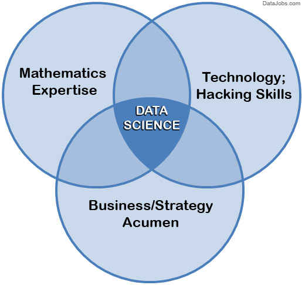
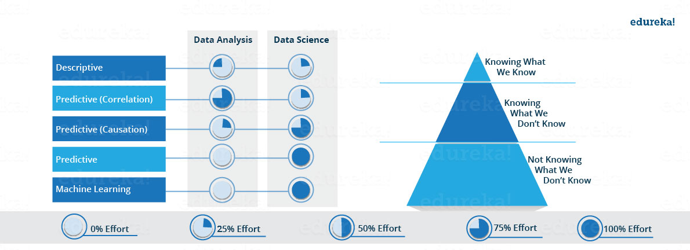

# (PART) Core theory {-}

#  What is data science?  

The definition of data science is a moving target. Thirty years ago (1990), 'data science' was an uncommon term that essentially just meant statistics. Twenty years ago (2000), the phrase mainly referred to querying SQL databases. Fifteen years ago (2005), it was "dashboards" and "predictive analytics". Ten years ago (2010), it was 'big data' and 'data mining'. Nowadays folks think of A.I. and machine learning. 

In 10 years? Who knows. 

**So what is it?** There are many definitions out there. Search the internet for the answer and you will find complex diagrams, such as this one, suggesting that a data scientist is someone who has the right blend of programming skills, statistical knowledge, communication ability, and business acumen:

&nbsp;  

... or here is a more popular, simpler version of the same diagram:  

&nbsp;  

Some argue that data science is simply [an extension of statistics](https://www.statisticsviews.com/article/nate-silver-what-i-need-from-statisticians/). You will also find attempts to distinguish between categories of data science, or to draw lines around what data science is and what it is not. A classic example is the bizarre delineation corporations draw between a data *scientist* and a data *analyst*:

&nbsp;
... or ...
&nbsp;

&nbsp;

**Our take?** Those definitions are useful, interesting, and to some degree accurate. _But_ data science is too new, and too fluid, to be fixed into some static definition. So, to keep our definition accurate, we'll keep it broad:  

**Data science is simply "doing science with data".**  And for our purposes, the only difference between our definition and the definition of science itself is not in the word "data" -- since nowadays all scientists are, to some degree, "data scientists" -- but rather in the word "doing". Data science is about _doing_ stuff with data -- about *making a difference with data.* And that's what this course is going to be about. _DOING_.  

But we'll go one step outward. Data science is not just the combination of academic disciplines like stats and business strategy. Good data science also needs to involve (1) **domain knowledge** (i.e., familiarity with the problem being solved), (2) **a bias to real-world effects** rather than theoretical frameworks, and (3) **a desire to work in the real world**. To do so, data scientists generally need to be effective communicators and have an iterative mentality: they try something, evaluate its effects, try something else, and repeat. 

Our definition is very broad, we know. We consider the "analyst" working in business intelligence to be a data scientist; and so too do we think that a data scientist could be an engineer who is processing large amounts of data to extract basic trends. Again, data scientists are those who _do science with data_. That's a lot of people.  

In our experience, the best data scientists aren't simply the best programmers or best statisticians; the best ones are the people who consider themselves to be *something else first.* They are the journalists, artists, epidemiologists, psychologists, historians, environmentalists, sports analysts, and political commentators who *also* know how to work with data. In other words, the best data scientists are the ones already out there, on the ground, already embedded in the system they want to improve, positioned perfectly to get the right data, to ask the right questions, and to actually *do* something with insights from the data. Again, data science is about *DOING*.  

To summarize, data science is about applying data to problems. It is impact-driven, transdisciplinary, and suited to well-rounded, multi-dimensional professionals.   

## What is the data life cycle?   {-}

There is a misperception about data science work that it is largely or even exclusively interpretative: that is, a data scientist looks at a big set of data and builds a fancy statistical model, then a light bulb goes off in her head, she has some insight, and then acts on that insight. 

The reality is data science is much more than that. And most of data science is a combination of *(a)* getting data ready for analysis, *(b)* hypothesis testing, and *(c)* figuring out what to do with the results of *a* and *b*. That is, data science in practice is generally not some artesenal genius staring at a table of numbers until "insight" magically occurs. Rather, it is a lot of work, a lot of structured theories which can be confirmed or falsified, and a lot of *imagination* applied to the task of implementation. 

In other words, data goes through a whole _lifecycle_ of which analysis is just a small part.  

What is the data lifecycle? Here's how we conceptualize it:

**0. Observation**  
**1. Problem identification & definition**  
**2. Question formation**  
**3. Hypothesis generation**  
**4. Data collection**  
**5. Data processing**  

This step is usually the most intensive. Half the battle is wrangling raw data and making it ready for a visualization or a hypothesis test. Note that this step has *nothing to do with statistical tests* -- data science is not the same as statistics!  

**6. Model building / hypothesis testing**  

Note that this step is usually where the scientific method stops. In science, once you analyze your test, you interpret your results and loop back to the beginning of the data cycle. But in *applied data science*, there are a few more steps:  

**7. Operationalization:**  This means determining how best to incorporate the data insights into operations.  

**8. Communication / dissemination**  

**9. Action:**  This means actually implementing the change.  

**10. Observation:**  back to the beginning of the cycle.

Again, the above should look a lot like the scientific method. The main differences are (a) "data processing", which in reality takes up most of any data scientist's time, (b) the bias towards action, and (c) the iterative / looped nature of the lifecycle.  

## Data science 'in the wild'   {-}

Enough theory. What do data scientists actually do? Again, you can search for an answer online and find complex diagrams like this one:  

&nbsp;

&nbsp;

But to capture every problem that data scientists are working on, this diagram would have to be even more convoluted and complex. 
Data scientists are working on a *ton* of problems. 

The most stereotypical data science problems tend to involve advertising, social media, and corporate profiteering:  

- Targeted advertising  
- Social media feed optimization (getting you to scroll just a little further)
- Facial recognition  (automated tagging at Facebook)
- Voice recognition ('Hey, Siri!', 'Alexa!')
- Making video games more fun / addictive  
- Dynamic airline pricing  
- Search autocomplete  
- Autocorrect  
- Virtual assistants  

These are the kinds of problems that the best-paid data scientists in the world are working to solve. Right now there are thousands of programmers in Mountain View, Cupertino, and elsewhere in the Bay Area (and New York, and London, and Beijing) trying to solve the problem of you not spending enough time on social media.  

Maybe you care about these problems, maybe you don't. Maybe they make you indignant or angry. Maybe you find it *problematic* that these things are even considered problems at all. As far as we're concerned, it is deeply unfortunate that our highest-paid data scientists are focusing on problems like these. 

But take heart -- there are plenty of other data scientists out there working on *actual* problems that are actually *important*:

- Identifying disease through imagery    
- Automating identification of credit card fraud    
- Filtering spam with malware or viruses.  
- Preventive maintenance at nuclear facilities   
- Improving chemotherapy dosage   
- Increasing voter turnout  
- Improve matchmaking systems (liver transplants, love, etc.)    
- Measuring deforestation with satellite imagery.  
- Efficient and equitable vaccine distribution  
- Identifying tax evaders    
- Predictive policing    
- Storm surge forecasting  
- Identifying and removing child pornography from the internet  
- Surveilling emergency rooms to predict disease outbreaks   
- Detecting fake news    
- Increasing accountability and legitimacy of carbon markets  
- Quantifying the likelihood of recidivism to prevent over-incarceration  

The list goes on. The number of worthwhile problems waiting for data scientists is limitless, there are data scientists working on problems like these right now, and the demand for civic-minded data scientists is immense.  

All of this matters for a lot of reasons. The first is that data science is not always a good thing; it can be weaponized by corporations and governments in spite of the public interest, and for that we need to be very careful about how we use it and how we teach it. 

But the second reason this matters is that data science can be an *equally powerful force for social good*. We can use data science to make progress on the most urgent and injurious social and environmental problems of our time.  

However -- and this is the third reason all this matters -- data science can only achieve social good *if* we recruit students to its ranks who are values-driven, civic-minded, and committed to using data science for good. 

Fourth, and finally, this matters because the Facebook data scientists are using the exact same principles and basic tools as the non-profit data scientists. At their core, the foundational skillsets are the same. 

And that's what this book is all about.

