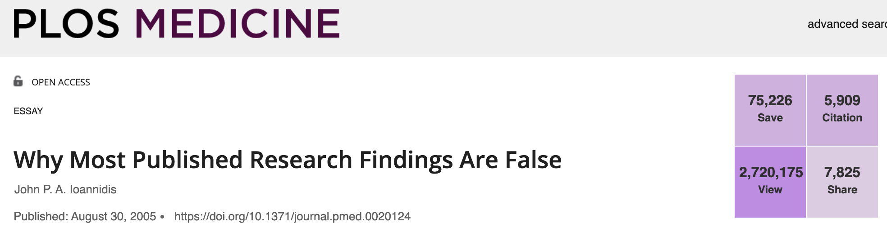

# The reproducibility crisis  

## The crisis  {-}  

There is a crisis in the sciences: the reproducibility crisis. It is also known as the replication crisis. This refers to the fact that many scientific studies have been impossible to reproduce, calling into question the validity of those studies' findings. 

This crisis began in the mid-2000's, when psychologists realized they could not reproduce most of their colleagues' results. They tried to repeat the experiments, following the methods step-by-step, but failed to get the same results. This was enormously unsettling for psychologists, and it cast major doubts upon the validity of psychological theory.  

The realization that much of published research is not actually reproducible soon spread to medical research... 

&nbsp;  

&nbsp;  

...then it sprung up in marketing...

&nbsp;  

&nbsp;  

...and economics...  

&nbsp;  

&nbsp;  

...and the sports sciences...

&nbsp;  

&nbsp;  

...and the life sciences too:  

<iframe width="560" height="315" src="https://www.youtube.com/embed/FpCrY7x5nEE" title="YouTube video player" frameborder="0" allow="accelerometer; autoplay; clipboard-write; encrypted-media; gyroscope; picture-in-picture" allowfullscreen></iframe>

&nbsp;  

For a complete history of the crisis, check out this article from [Wikipedia](https://en.wikipedia.org/wiki/Replication_crisis). 

**Why is this happening?** There are many reasons. Many studies, particularly those in psychology and the social sciences, involve small cohorts of participants. When sample sizes are low, results may not be representative of underlying truths. 

On rare occasions it is intentional and fraudulent: scientists face pressure to publish interesting results, so much so that they might fabricate or filter their data to make their results significant. 

But the most common causes of reproducibility failure are, by far, (1) **poorly documented steps in data processing** -- if you don't know how exactly the authors of a paper formatted their raw data to prepare them for analysis, you simply can't reproduce the analysis -- and (2) simple, **honest mistakes**, such as typos in spreadsheets.  

Consider this summary of the reproducibility crisis from *The Economist*. A scary percentage of genomics studies have simple spreadhseet errors:  

&nbsp;  

&nbsp;  

**This is a big deal:** if a significant part of science is _wrong_, then what do we know? How can we be sure what we know is right? How can we build off of previous research? How can we distinguish valid science from the rest? If science can't be trusted, what value does it have for society? What kind of *damage* is it doing to society?  

**This crisis is ongoing**, and it is impacting our handling of the COVID-19 pandemic. On October 5, 2020, the world learned that 16,000 COVID-19 cases disappeared from the UK's public health database due to a simple glitch in *Microsoft Excel*.  

&nbsp;  

&nbsp;  

That event demonstrated that the reproducibility crisis is not just an academic concern. It can have serious and potentially deadly consequences for the public.  

But there are **silly examples** of the replication crisis, too. Perhaps our favorite is this: in August 2021, when we Google'd "reproducibility crisis", one of the top search results is this video from *Science*, the world's most prestigious scientific journal:  

&nbsp;  

But when we click on this link, here's what we see:  

&nbsp;  

## The 'reproducibility' movement  {-} 

Because of this crisis, there has emerged a much needed move to make all science "reproducible". This means making sure that someone else can copy what you did, and get the same results. This is important for identifying scientific fraud, of course, but also for helping us to overcome human bias, mistakes, wishful thinking, etc. Reproducibility is not just a "nice-to-have"; in modern science (and data science), it's a "must".

**Good data science must be reproducible.** The idea is that work done by scientist A is "reproducible" by scientist B. In other words, if the findings of the research are of any generalizable value, then the results of two scientists working on the same problem should be identical (or very high in agreement).  In practice, this means using data and code in a structured, well-documented, accessible, clear way, and ensuring that others can do the same.  

Reproducible research also means using tools that others can easily use, and methods that others can easily copy. Programming languages like `R` and `Python` are ideal for this. 

Reproducible research matters for lots of reasons:

1. Because making your work reproducible means that _you_ will have less problems returning to that work at a later time.  
2. Because making your work reproducible means that _others_ can collaborate with you, help you, error-check you, and build on your work.  
3. Because making your work reproducible means you are fighting the plague of irreproducible results which have characterized the replication crisis.  

Making your work reproducible is going to be a bit more work, but it's not optional. And there are tools and best practices in place to make it as painless as possible. Basically, reproducible research involves the following:

- Using code to format and manage your data instead of spreadsheet software such as *Excel* or *GoogleSheets*, since those products will not keep a step-by-step record of each thing that you do. When you code, each command line is both an action you take to process your data *and* a record of what that action is.  

- Coding with free, open-source tools, such as `R`.  

- For any specific niche task in your analysis, such as processing a batch of images, using other open source tools (e.g., `ImageJ`) that can be used free-of-charge by anyone with an internet connection anywhere.   

- Documenting *everything* you do with the data, by commenting your code thoroughly and by creating "Wiki" pages for your projects.  

- Making your code open source and freely available online.   

- Making your data open source (while protecting privacy and confidentiality of participants).   

- Providing tools, such as `Shiny` in `R`, that allow others to explore your data themselves, rather than trusting your own narratives about the data.

- Using tools for generating reports, such as `Rmarkdown`, that remove the 'middle-man' and avoid potential typo's and fabrications.  

- Collaborating openly with others.    

You will be learning how to do all of these things in this course. We are going to focus on _reproducible research_, _literate programming_, _documentation_, and other components of data science (and research in general) which ensure that (a) our methods and findings can be easily sanity-tested by others, and (b) we set ourselves and our projects' up for future collaborations, hand-offs, and expansion.

## Why `R`? {-}

This course is largely about learning to _do_, and will largely use `R`. `R` is not the only tool in the data scientists' toolbox (there are many), but it's a good one, is extremely popular, there is almost nothing you cannot do with it, it can be applied to many fields, and -- most importantly -- it is a free, open-source tool with an active open-source coding community. The millions of `R` users worldwide emulate the spirit of reproducible research we are trying to advocate for here.    

### A final thought {-}

A research article about *results* is advertising, not scholarship.  

Scholarship is an article with transparent, reproducible methods.   

