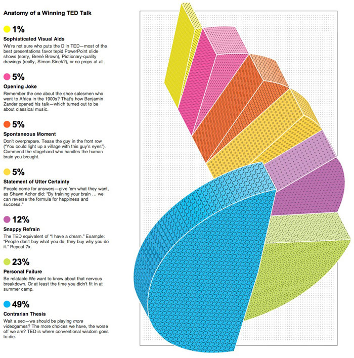
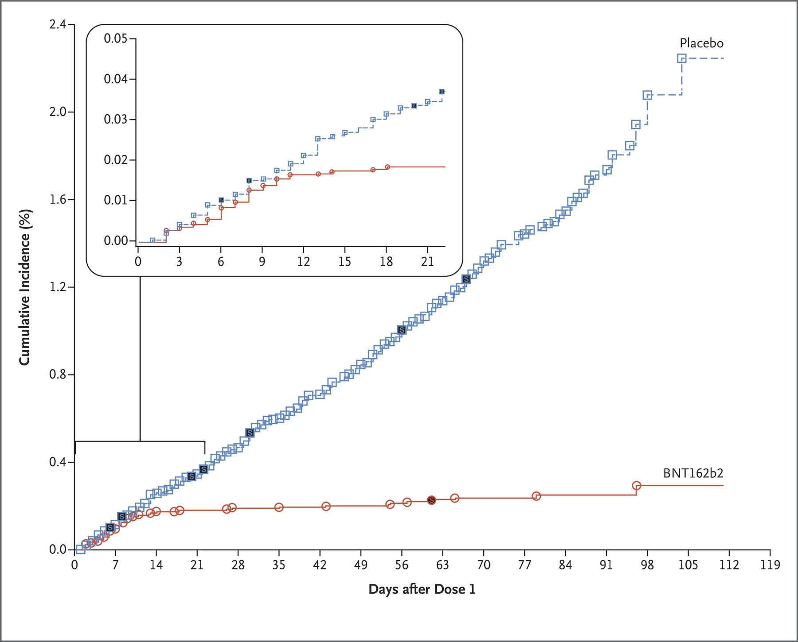
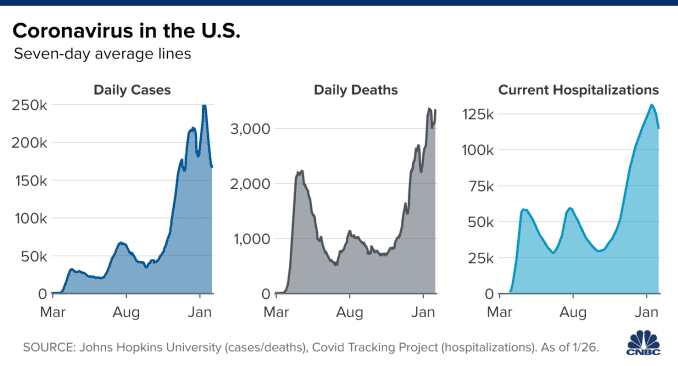
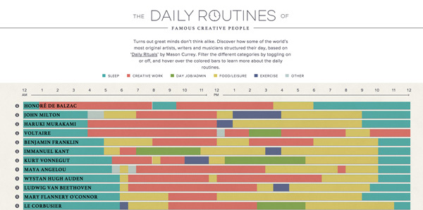

# Visualizing data {#dataviz}

## The importance of visualization

Much of the next few weeks is going to focus on visualization. The reason why is that data visualization is a powerful, quick, and clear tool for communicating data, exploring it, and understanding it. With that in mind, let's get started with some _data viz_.

## Bad examples

## Good exaples

## Quick video

Let's watch a quick video on data visualization [here](https://www.youtube.com/watch?v=AdSZJzb-aX8).

