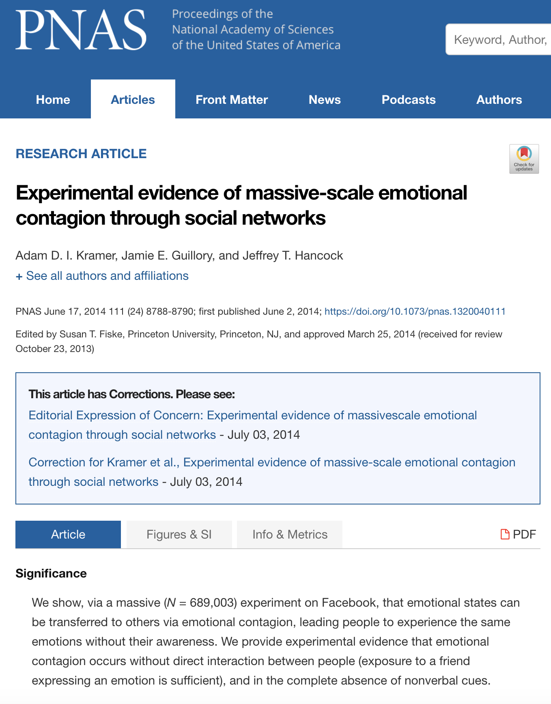
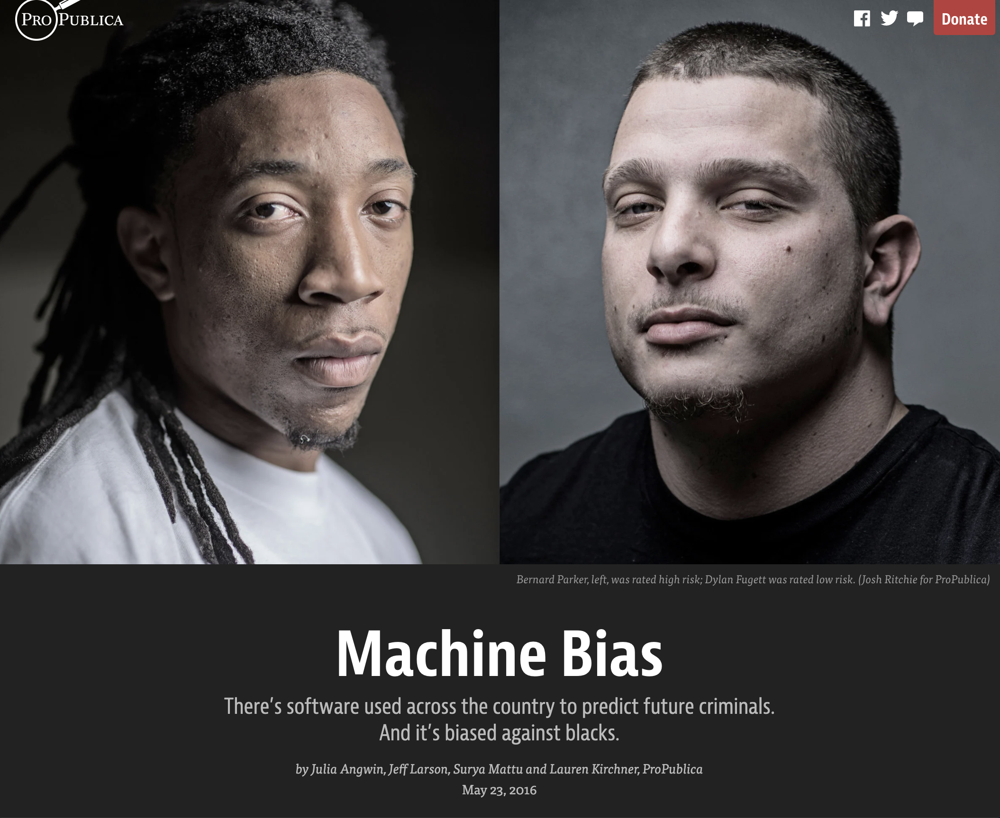

# Data ethics

## A few principles {-} 

This orientation to the principles of data ethics is not going to be adequate or sufficient. We just need to provide enough context for you (1) to appreciate the limitless complexity and uncertainty of many ethical issues in data science, and (2) to start exploring the complex ethical scenarios below on your own or in dialogue with others.  

In most frameworks for data ethics, three foundational principles are used to help us think about whether certain research actions are ethical. Those three principles are:  

**1. Respect** for persons and their autonomy: participation must be based upon informed consent, and privacy must be honored at all times.  Immature or incapacitated persons must be protected as they mature or heal. 

**2. Beneficence:** in our work with data, potential risks are minimized while potential benefits are maximized.  

**3. Justice:** Benefits and risks are distributed equally across groups of people. A classic way of asking whether something is 'just' is asking using John Rawls' concept of the **'veil of ignorance'**: pretend you have no information at all about your circumstances or your place in the social order: You don't know your place of birth, year of birth, sex, skin color, language, religion, immigration status, health conditions, or anything else. In other words, you have no information whatsoever that might introduce bias into the way you think about the world. Free of circumstantial bias, what arrangements would you choose to put in place to maximize fairness and fortune for all, and to minimize the chances that you would get screwed by the system?  

These principles can guide us as we navigate ethically ambiguous scenarios. When we ask whether something is ethical, we are asking whether all of these principles are upheld. We could also be asking whether the violation of one of these principles might be justified by upholding another in an impactful way. 

The question, 'Is something ethical?' is usually not easy to answer, particularly when it comes to the use of data in tackling social problems. It is important to note that reasonable people regularly disagree on these ideas; that is why we have committees and drawn-out processes for obtaining permission to use data in research and commerce.  

**So why do these principles matter?** Because without them, we would not be able to have conversations about the ethics of difficult situations. We need articulated principles that we can point to and debate together. Principles like these allow you to have an account for why you feel the way you do about a certain issue. Without that account, we can't learn from each other's perspectives.    

Note also that these principles were designed with **individual human subjects** in mind. It is an open question of active debate how exactly these principles can be applied to **communities of individuals** all at once -- what exactly does it mean for a group to consent to something? Does every single individual need to consent? The majority? -- or how they translate to our treatment of **non-human communities**: animals, plants, and places. 

Let's stop there and explore some concrete scenarios. For a better orientation to ethical precepts underlying issues of data ethics, [this chapter by Shannon Vallor](https://www.scu.edu/media/ethics-center/technology-ethics/IntroToDataEthics.pdf) is the best open-source resource that we have been able to find.  Many of the case studies and scenarios presented below are adapted from that chapter.  

## Warm up scenarios {-}  

Practice applying the above principles to these scenario questions. For each scenario, describe your **opinion vector** (the *direction* of your opinion -- yes or no -- and the *strength* of your opinion).  

**Location tracking**  
Is it ethical for Google to track and store your location information in order to monitor traffic and operating hours of local businesses? Such traffic information is known to help direct emergency service vehicles along the safest and fastest route.

**Targeted advertising**  
Is it ethical for internet search engines to tailor advertisements according to your search history?  

**Dynamic pricing**  
Is it ethical for airfare search engines to adjust ticket prices according to your recent search history?  

**Social media scrolling**  
Is it ethical for Instagram to count how many milliseconds you spend on each post, then use that info to develop a strategy for getting you to spend more time on its app?

**Controversial content**  
You are a data scientist at Facebook. Based on your analyses of user data, you have discovered that when you show readers sensational or hyperbolic content, such as someone ranting that a new vaccine is an attempt at government-subsidized mind control, the readers stay on Facebook longer and scroll through more contet. Since that translates to profits, is it OK for your team to increase the amount of sensational content in users' feeds?

## Case studies {-}

Use these case studies to reflect upon and discuss the ambiguity, complexity, and dangers of data ethics issues.  

### The Facebook 'Social Contagion' Study {-}

In 2014, data scientists from Facebook published an [article](https://www.pnas.org/content/111/24/8788) in a prestigious academic journal. In this article, they demonstrated that the emotions and moods of users could be manipulated by toggling the amount of positive or negative content in their feeds. They found that these emotional effects would then be passed to other users in the social network; in other words, emotions and moods could be seeded and were 'contagious'. To carry out this research, they manipulated the Facebook feeds of 689,000 users. 

&nbsp;  

{width=70%}

&nbsp;  

Facebook did not receive specific consent for this study from its users. Instead, the company argued that the purpose of the study was consistent with the user agreement already in place: to give Facebook knowledge it needs to provide users with a positive experience on the platform.  

**Discuss:**  

1. In what ways, specifically, did Facebook violate basic principles of data ethics with this study? Enumerate each violation individually.  

2. Can a convincing argument be made that justifies this study?  What are the strongest arguments in its favor?  

3. What are some things that Facebook could have done differently to handle this situation more ethically?  

4. Who exactly should be held morally accountable for any harms caused by this study? The data scientists employed to analyze and publish the data? Mark Zuckerberg? All Facebook employees? Facebook stock holders? Are Facebook users accountable at all?   

### Machine bias: Beauty contests & recidivism {-}

Machine learning (ML) algorithms are developed by 'training' models on known datasets. The models are then used to predict values in other datasets. For example, if you label cars in a batch of photos then use them to train a ML model on that labeled dataset, you can then use that model to identify cars in thousands of other photos.  

Sounds neat, but this means that ML models are only as good as the data they are trained upon, and often those training datasets are created by human labelers who carry unkown or unspoken biases. A classic example is the [Beauty.AI](https://www.theguardian.com/technology/2016/sep/08/artificial-intelligence-beauty-contest-doesnt-like-black-people) beauty contest that occurred in 2016. A ML algorithm was trained on a large set of human-labeled photos of women, then women around the world were invited to submit selfies in a global beauty contest. A key advertising hook for the contest was that the 'robot jury' -- the ML algorithm -- would be fully impartial and fair. But the results revealed that the ML model was racist: 75% of the 6,000 contestants were white, but 98% of the 44 winners were white. How did this happen? The people who labeled the training set of photos carried implicit bias.    

&nbsp;  

{width=70%}

&nbsp;  

Debacles like this can have much more serious consequences. [Court systems use ML models](https://www.propublica.org/article/machine-bias-risk-assessments-in-criminal-sentencing) to estimate the risks that a convicted criminal will commit more crimes once they are released from prison. But retrospective studies have shown that these models consistently and incorrectly label black prisoners as more dangerous and more likely to return to prison at a later date. Most of the risk assessments being used today have not received adequate validation, even though they are spitting out predictions that can destroy lives, families, and communities.   

&nbsp;  

{width=70%}

&nbsp;  

**Discuss:**  

1. How might bias have entered the training datasets for these ML models, if the people labeling the data did not deliberately intend to exhibit prejudice against African Americans? 

2. The ML models used to predict recidivism are imperfect and inherently prejudiced, but it is not clear whether it would be better to leave decisions of sentencing, bail amounts, and prisoner support services to individual humans in the court and penal systems. Would it be better to stop all use of ML evaluations, or should they be kept in place until better models are developed?  

3. Returning to the beauty contest debacle. The attraction of a 'robot jury' compelled people to seek out a single, simplistic definition of beauty, and to place all contestants on the same spectrum of beauty scores. Other than the racial bias baked into their model, what other problems is there with this endeavor? Articulate and enumerate as many as you can.  What do those problems tell you about other ethical and humanistic dangers inherent to data science?  

### Web-scraping OKCupid {-}

In 2016, Danish researchers used new web scraping and text mining software to inventory the user profiles of 60,000 users on the online dating site [OkCupid](https://fortune.com/2016/05/18/okcupid-data-research/). Their goal was to use this dataset to test for correlations between 'cognitive ability' and sexual orientation, religious affinity, and other personality traits. They chose these user profiles because they were publicly available online to anyone who wanted to sign up for a free account with OKCupid.  

When they published their paper, they included a spreadsheet of the 60,000 user profiles in the supplementary material for their article. They had removed the first and last names of the users, but kept everything else, including username, location, sexual orientation, religious orientation, sexual habits, relationship fidelity, drug use history, political views, and more. 

The backlash was immediate. When asked why they did not attempt to deidentify or anonymize the data any further, the researchers responded that the data were already public. In the paper itself, the authors wrote: "Some may object to the ethics of gathering and releasing this data ... However, all the data found in the dataset are or were already publicly available, so releasing this dataset merely represents it in a more useful form."  

&nbsp;  

{width=80%}

&nbsp; 

**Discuss:**  

1. What do you make of the authors' argument, that the data were already public, posted freely by the users themselves, so how can this be an issue of privacy or consent? 

2. If you disagree with the authors' argument, explain how the users might reasonably object to the authors' actions. 

3. What kind of risks did the authors impose upon the users of OKCupid? Are any of those risks new, or were they all present when the users decided to make a profile that could have been accessed by any other user?  

4. Does it make an ethical difference that the authors accessed publicly available data in a novel way (web-scraping software) and to a much greater extent (harvesting 60,000 profiles at once) than individual users are typically able to do?  

5. Does the software developer of the web-scraping tool bear any responsibility for this scandal? Does he have any ethical obligations regarding how his tool is used, and by whom?  

## More scenarios {-} 

**Airport screening**  
A data scientist has come up with a model that prioritizes security screening at airports according to various passenger characteristics. If using 'place of origin' as a predictor in this model improves the model's predictive performance at identifying passengers who are security threats, is it ethical to include that variable in the model and screen certain passengers disproportionately?

**Supporting struggling college students**  
Your college has developed a model that predicts dropouts. It identifies students at high-risk of dropping out and alerts offices that can direct additional support and resources to these students. Your college has found that this model performs better when it includes the student's place of origin, sex, and race as predictors. Is it ethical to implement this model and divert resources accordingly?  

**Robot cashiers**  
Self-checkout stations in grocery stores are convenient, but they take jobs away from workers who may not have many other employable skill-sets. When you are checking out, is it more ethical to use the checkout aisles with human cashiers, even if the line is longer and going more slowly?  

**Electric cars**  
Cars running on fossil fuels are bad for the environment, but at least they can be serviced by car mechanics who don't necessarily need a college degree.   

Electric cars reduce carbon emissions, but they are replacing car mechanics with computer scientists and softwar engineers, all of which require extensive undergradate and post-graduate education.  Are electric cars a net social good?  

**Smartphone app for monitoring cough**  
A tech start-up has developed an app that can track the prevalence of cough in a network of smartphones. Cough is an important indicator of disease, and cough also helps to spread certain diseases more quickly, such as TB and COVID-19. This app has great potential to help public health officers in the fight against some of the deadliest respiratory diseases. The app works thanks to sophisticated machine learning algorithm for detecting coughs within continuous recordings. That algorithm is currently private and propriety. Do you agree that this cough monitoring app is a good idea, and that public health officials should promote its use?  

**Automated suicide prevention system**  
A large internet search engine has developed a model that can predict whether someone is likely to inflict self-harm or attempt suicide based upon their recent search history. This model is 75% accurate. This company would like to set up an automatic emergency alert system, in which local social service providers are notified about at-risk users in their area. They want to automatically enroll users in this service. Is this an ethical feature to add to their product?  

**Malaria medicine distribution**  
Your company is trying to distribute a new malaria medicine in a remote region of Africa without primary care clinics, where tens of thousands people die from malaria each year. This medicine is highly effective, but it is also known to cause birth complications. You need to ensure that it is not administered to pregnant women. Your team's plan is to go door to door and distribute the medicine to women who say they aren't pregnant. 

But in this region, cultural attitudes to pregnancy, and the notion of sharing your pregnancy status with a stranger, are very sensitive. Daughters and wives may not feel safe to answer such questions truthfully. 

Your team has to choose between (1) taking women's responses at their word, (2) avoiding the pregnancy issue by only distributing it to men, (3) not distributing the medicine at all, (4) some as-yet-unknown solution. What do you do?

**User accountability**  
Let's say that you have disagreed with one or more of the claims about social media in the 'Warm-Up Scenarios' section above. Is it ethical for you to continue to use Google, Instagram, or Facebook? 

