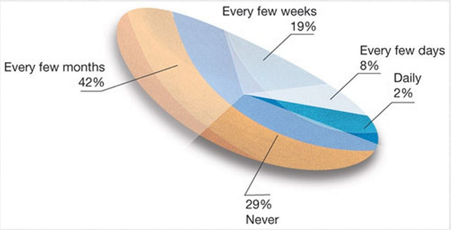
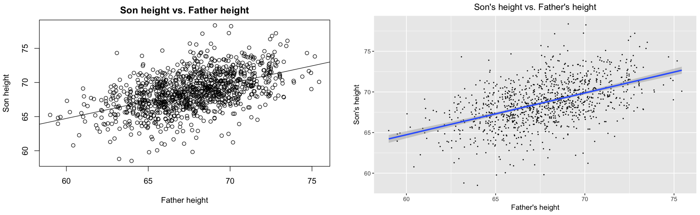
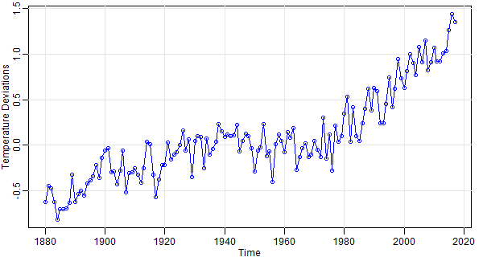

# Visualizing data {#dataviz}

## The importance of visualization  {-}

Much of the next few weeks is going to focus on visualization. The reason why is that data visualization is a powerful, quick, and clear tool for communicating data, exploring it, and understanding it. With that in mind, let's get started with some _data viz_.

## Bad examples  {-}

## Good examples  {-}

## Video examples  {-}

Let's watch a quick video on data visualization [here](https://www.youtube.com/watch?v=AdSZJzb-aX8).  

Let's start with a video: https://youtu.be/5Zg-C8AAIGg.  

And one by Hans Rosling too: https://www.youtube.com/watch?v=FACK2knC08E  

