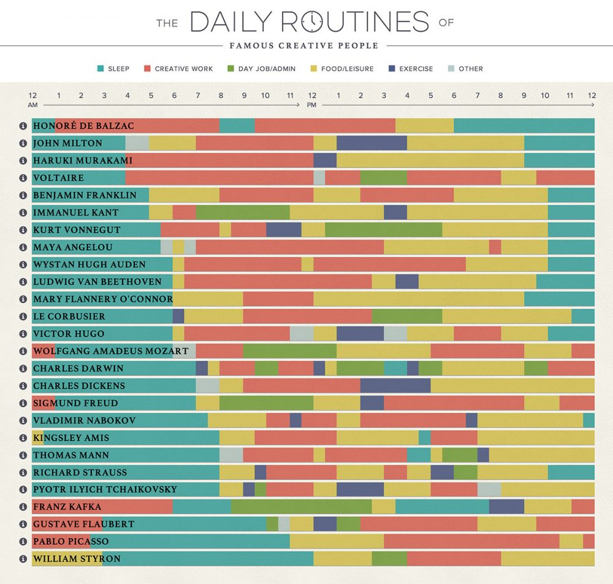

# Visualizing data {#dataviz}

This course will focus heavily upon visualizing data in plots, maps, and dashboards. If there is anything you take from this course, it will be this: you will be able to take data and make some pretty pictures. *And that's not trivial*.   

Why? Because **humans are wired to process information through *pictures*.** We can translate images into meaning with amazing speed.  

## The value of *data viz* {-}  

This screenshot, from David McCandless's [TED talk](https://www.youtube.com/watch?v=5Zg-C8AAIGg) about the beauty of data visualization, depicts how quickly each of our senses can process information.  

&nbsp;  
<center>
{width=70%}
</center>
&nbsp;  

**This plot's punchline:** When we process data with our eyes -- with *pictures* -- we can take in a lot of information all at once.  

**Let's try this out with an example.** Below this paragraph is another paragraph describing a painting. Try this: scroll down quickly, look at this paragraph for just *one second*, then keep scrolling until it is out of view.  

Go!  

**One-second paragraph:**  

*Fog rises from the evergreen forest of a distance mountain range. A whitewater creek cascades down a streambed with large, rounded boulders, arriving at a broad flatwater pool where ducks are milling. There is one group of four and another group of two. On the shore near the ducks, a wooden dinghy is tied up to a small dock with eight pilings. The dock lead to a path through more round peddles and tall grass, past a chair and a fire ring, and continues uphill to a small cabin. The evening sun and sparse fairweather clouds are reflected in the cabin's large, multi-paned windows under the small front porch. A cobblestone chimney on the side of the cabin has a whisp of smoke rising from it. The steep roof implies that this cabin is designed to withstand heavy snow. Tall evergreens tower over the diminutive cabin; the cabin seems to be placed up against a forested hillside. There are only a few deciduous trees in view, and their leaf colors -- combined with the lack of snow in the distant mountains -- imply that the time of year is early fall.*  

**End of paragraph**.  

OK. Now try to answer these simple questions:   

- What was this a painting of, in general? Can you describe the scene?     

- What details do you recall?  

OK. Try this next: the actual painting is at the very end of this chapter. Scroll down to it quickly, look at this painting for just *one second*, then scroll back up to this spot in the module.  

Ready? Go!  

&nbsp;  

*< Return to this line! >*  


Now try to answer those same questions above. What was this a painting of? Did you catch any more details? Was there anything in the water? Was there smoke coming out of the chimney? What time of day was it?  

Which type of visual information was easier for you to process quickly? Text, or a picture?  

Think about the profound *differences* in these two forms of visual communication:  

When we read text, we are working outward, from individual details to the big picture: we process each individual word, understand their individual meanings, understand their meanings in the context of each individual sentence, then use all of the information to step back and imagine the scene based on the details. 

In contrast, when we look at a picture, we are working inward, from the big picture down to the details. We understand the scene first, then we start exploring the finer points. And, since each finer point is interpreted from within the context of the bigger picture, we can make sense of the details much more efficiently. 

Pictures communicate data. **This is why data *science* and data *visualization* nearly always go hand in hand.**  

Data scientists use visualizations both to communicate their insights externally, e.g., to the public in a *Twitter* post, but also internally: when they are working with the data themselves. A data scientist's workflow is peppered with data visualization, because -- again -- visualizing your data is the most effective way of making sense of it: Download the data, then visualize it. Do something to the data, then visualize what you've done. Repeat, then visualize, then repeat again.  
  
The point here is that great data visualizations are not simply pretty. Much more importantly, they are *effective* too. They are the best means you have of conveying insights from your data to someone else.  

**A final thought:** Keep in mind that plots can be effective and misleading at the same time.  There is a politics to plots and maps; they can have agendas, and they can manipulate viewers into interpreting the data in certain ways. So, it is incomplete for us to say simply that a good plot is an effective plot. Here's a better definition: *a good plot is one that is both effective and fair.* 

So, when you are viewing other people's plots and making plots of your own, keep these five rules in mind:  

1. A bad plot is an ineffective one, even if it is beautiful.  

2. A good plot is an effective plot.  

3. A great plot is one that is both effective *and* beautiful.  

4. If you ever have to make a trade-off between effectiveness and beauty, sacrifice beauty.   

5. Any plot that misleads or manipulates the viewer is bad, no matter how effective or beautiful it is.  


Before you begin evaluating the plots in the gallery below, enjoy this excellent talk by the Egyptian data scientist, **David McCandless**, about the **beauty of data visualization** (link [here](https://www.youtube.com/watch?v=5Zg-C8AAIGg)).  
  
```{r, include=FALSE,eval=FALSE}
options(htmltools.dir.version = FALSE)
```

&nbsp;  

<iframe width="560" height="315" src="https://www.youtube.com/embed/5Zg-C8AAIGg" title="YouTube video player" frameborder="0" allow="accelerometer; autoplay; clipboard-write; encrypted-media; gyroscope; picture-in-picture" allowfullscreen></iframe>

## Plot gallery {-}  

What follows is a gallery of plots: some good, some bad, and some ugly too.  Let's use these to explore what works and what doesn't. For each plot, ask yourself three questions:

- What makes this plot good (as in, effective and not misleading)?   

- What makes this plot bad (ineffective and/or misleading)? How could the plot be improved?  

- What might make this plot prettier? 

The point of this is not to make fun of others for their plots. The point is to learn from their choices. Because plot technique matters. Data science is about communication, action, and impact. You will spend so much time working on an analysis, and you are gonna go through all the work of making a plot. What a shame if the end product undermines all of that hard work!  

&nbsp;  

```{r, results = 'asis', eval = ifelse(exists('is_teacher'),is_teacher,TRUE),echo=FALSE}
source('teacher_tip.R')

tip <- 'Let the students offer feedback on each plot before you fill in the gaps with your own opinions and the ideas offered below each plot.'

teacher_tip(tip)
```

&nbsp;  

<center>

</center>
&nbsp;  

- **Good:** Frankly, there is not much good about this plot. Yes, it has a lot of information, but this crosses the line into information overload. It is so convoluted and difficult to interpret that we quickly lose interest in spending time exploring its details.    
- **Bad:** The 3D perspective (1) makes it almost impossible to compare bar heights, (2) causes alot of the bars in the back to be hidden, and (3) adds needless complexity.  
- **Bad:** The 3D perspective makes it almost impossible to compare bar heights. 
- **Bad:** The colors representing each year do not follow a logical sequential flow; years are sequential, and colors can be too (think the ROYGBIV rainbow sequence).  
- **Ugly:** The bananas! Sure, this plot has to do with banana exports, but those banana pictures don't represent anything at all about the data and they make everything else convoluted. Plus, it's cheesy.  

&nbsp;  
<center>
{width=70%}
</center>
&nbsp;  

We don't think this plot is good or pretty. 

- **Bad:** This is an unfamiliar plot format; is it a pie chart? A blood platelet? A pickle? 
- **Bad / Ugly:** Why is it lopsided or rotated? That has nothing to do with the data. 
- **Bad:** What is this plot even about? There are no context clues whatsoever. Titles and labels, in moderation, can be really helpful. 
- **Bad / Ugly:** What are the colors representing? They seem to have no relation at all to the pie slices. Very confusing. 
- **Bad:** The slices do not seem to represent the percentages accurately. The 8% slice does not look four times larger than the 2% slice.  


&nbsp;  
<center>
{width=70%}
</center>
&nbsp;  

Here is another pie chart that isn't very effective.  

- **Bad:** Lots of significant digits in these number. Instead of forcing viewers to read numbers like 453,753,086, why not display 454 M?  
- **Bad:** The percentages next to the other numbers make it even harder to read. 
- **Bad:** Superimposing text on top of the pie sclices makes it impossible to use the slices for their intended purpose: visually comparing the size of subgroups in the data. 
- **Bad:** There are so many color-coded slices that it takes far too long to understand the details. 
- **Bad:** One reason it takes so long is that the text is redundant: don't put a lot of text on the pie *and* put a lot of text in your legend. Figure out a way to point to each pie slice with a line, then have all the info for that slice in the same spot.  
- **Bad / Ugly:** The dark text on top of dark colors is hard to read. 

Pie charts are *super* common in media, but they are actually an infamously bad form of data visualization. That's because the human eye is much worse at comparing *areas*, such as the size of a pie slice, than they are at comparing *heights*. To make matters worse, we are worse at comparing areas for non-rectangular shapes, like a pie slice, than for squares or rectangles.  So: avoid pie charts. 

&nbsp;  
<center>
{width=80%}
</center>
&nbsp;  

- **Bad:** Pie chart.
- **Bad:** There is no reason for this to be 3D. The third dimension has nothing to do with the data. 
- **Bad:** There is no reason for this to be semi-transparent. It just makes everything even more convoluted.
- **Bad:** The text is way too small to read.
- **Bad:** On a related note, there is way too much text.  
- **Bad / Ugly:** The yellow text boxes and dark lines around them add uninformative junk to this plot. If all lines unrelated to data or labels were removed, this chart would be more intelligible.  


&nbsp;  
<center>

</center>
&nbsp;  

- **Bad:** Information overload.
- **Bad:** It is not clear whether the repeat use of colors in each row conveys any meaning, or if it is just a random recycling of colors. 
- **Bad:** The text is too small to read.   
- **Bad:** Abbreviations are not explained. 

&nbsp;  
<center>
{width=60%}
</center>
&nbsp;  

- **Bad:** The text is very small.
- **Bad / Ugly:** The third dimension, with a weird perspective effect added, has nothing to do with the data and makes this plot difficult to understand. Should you pay attention to the edge in the distance or the line in the foreground? Are they the same?  
- **Bad:** The y axis is crazy!  (1) The scale break is confusing. (2) The attempt to plot these two subgroups as separate trends belies the fact that one is just the remainder of the other: the two curves sum to 100%. (3) By attempting to place the two trends on the same proportional scale, this plot gives the visual impression that the changes over time are really extreme. 
- **Bad:** The trend lines are unnecessarily curved. The plot's authors probably only have data for each semester, but smoothed lines give the impression that they have more data.  


&nbsp;  
<center>
{width=70%}
</center>
&nbsp;  

- **Bad:** These percentages sum to more than 100%. That needs to be explained, or avoided.  
- **Bad:** The use of a pizza pie, though creative, implies that the size of the pie slices will have something to do with the data. They don't. 
- **Bad:** Check out the fine print on the bottom. Several toppings were left off this chart, and some of them were quite popular; for example, onions had 62% popularity and chicken was 56% popular. Why are they not on this chart but spinach (26%) is? The arbitrary exclusion of categories should immediately make viewers suspicious: how are these decisions being made?  


&nbsp;  
<center>

</center>
&nbsp;  

This is another case of information overload, and another case of a creative visualization that doesn't really help us make sense of what's going on. If we wanted to understand the take-a-way message or punchline from this plot, we're not sure we'd be able to. We could stare at this for minutes and still not understand what we are looking at, and it is so complicated that we would rather ignore this plot than go through that effort. 

&nbsp;  
<center>

</center>
&nbsp;  

- **Bad:** The y axis range makes the difference in home prices sound a lot larger than it actually is. Based on the height of these two bars, you would expect the 1999 price to be 3x the the 1998 price when, in actuality, it is larger by 2.5%. 

- **Bad:** The use of qualifiers such as "Massive" is generally discouraged. It's a little too controlling. Let the viewers make up their own minds about which differences are substantial and which are trivial. 

These two notes are classic indicators of misleading or agenda-driven data visualization.  

&nbsp;  
<center>

</center>
&nbsp;  

This is another example of manipulating perception with a sneaky y-axis range. 

Also, like the examples above, this plot doesn't have to be 3D. The height has a meaning, but what does the depth mean? It is junk, in the sense that it does not add meaning. 


&nbsp;  
<center>
{width=75%}
</center>
&nbsp;  

- **Bad:** These percentages sum to more than 100%. That needs to be explained, or avoided.  

- **Bad:** The rationale for ordering of the categories is not clear. They are not ranked by percentage. Are they supposed to correspond to the body part being pointed to in the figure? Should crotch equal 'tech-savvy'?  

- **Bad:** The geometric shape itself (the person figure) does not help at all in visualizing the percentages. Can you compare the area of the feet and the area of the head?  The fact that they provide the actual numbers in large bold font suggests that they knew the figure would not be useful as a picture. 


&nbsp;  
<center>

</center>
&nbsp;  

- **Bad:** Some data are completely obscured. What is happening to lemons in February and March?  
- **Bad:** Like the infamous banana plot above, the 3D perspective here makes it almost impossible to compare bar heights and adds needless complexity.  


&nbsp;  
<center>
{width=80%}
</center>
&nbsp;  

- **Bad / Ugly:** The contortion of this pie chart into a spiraling 3D object is confusing and gratuitous. 
- **Bad / Ugly:** Some colors are very similar to each other.  
- **Bad:** Pie chart!  

&nbsp;  
<center>
{width=75%}
</center>
&nbsp; 

- **Bad:** The small y axis range exagerrates changes in the unemployment rate.
- **Bad:** The final data point on this plot is wrong! 8.6% should not be at the same height as 9.0%. 
- **Bad:** The title of this plot implies that the data will show unemployment trends throughout the Obama administration, which began in 2009, but this data is for 2011 only.  


&nbsp;  
<center>
{width=70%}
</center>
&nbsp; 

- **Good:** All in all, this is a very well made plot. Unnecessary lines and text are kept to a minimum; the title and subtitle are clear. The text size is appropriate. The source of the data is provided.  

- **Bad:** This plot is misleading, because it is plotting data with different units on the same y axis. The blue line is the average *four-year* cost of a college degree. The red line is average *annual* salary for someone with a Bachelor's degree.  

How should these data be plotted differently in order to correctly explore whether a four-year degree is still worthwhile in terms of its benefits to a 30-year career?  

&nbsp;  
<center>
{width=70%}
</center>
&nbsp; 

This is a classic example of a *spurious correlation*: two trends that are correlated but have absolutely nothing to do with each other.  

&nbsp;  
<center>
{width=70%}
</center>
&nbsp; 

This is another example of a beautiful plot, but it is also an example of how a plot's message can be coaxed by manipulating y axis scales. If the curve for Uninsured Americans were plotted on the same percentage scale as the Unemployment Rate, it would not seem to be accelerating so rapidly.  

&nbsp;  
<center>
{width=90%}
</center>
&nbsp;  

- **Good:** This is a clean and simple plot, more or less, without too much text. 
- **Good:** The color scale relates to only 4 categories: that is simple enough to make sense of quickly.  
- **Good:** The color palette follows an intuitively sequential trend: Blue = low/no bad; Red = high/severe. 
- **Bad:** The abbreviation system for states is inconsistent. Some use initials, some use abbreviations; some use a period, some don't.  
- **Bad:** The lowest color category is not used in this plot, and could be removed to increase simplicity.  
- **Bad:** Showing a map of the U.S. states with this particular color scale can be confusing: if you had to guess what this chart is about, you would probably assume it is an electoral map. 

&nbsp;  
<center>
{width=75%}
</center>
&nbsp;  

- **Good:** This is a nice plot. It is simple and junk-free. No unnecessary text or axes. 
- **Good:** Large font, strong color contrast.   
- **Good:** The axis starts at zero, and the bars widths are proportional to the data, e.g., the 30m bar is half the width of the 60m bar.  
- **Good:** Since this plot is so simple, the actual numbers for each bar can be included without cluttering the plot.  


&nbsp;  
**Effectiveness of COVID-19 vaccine BNT162b2:**
<center>
{width=80%}
</center>
&nbsp;  

- **Good:** This is a simple plot that tells a good story: a week or so after receiving a dose, vaccinated participants contracted COVID-19 at a much lower rate than those who received the placebo.  

- **Bad:** The labels are not clear to viewers who are not clinical virologists.  To every extent possible, data visualizations should be inclusive and inviting. Don't make someone feel stupid by forcing them to look at their plot.  

- **Bad:** The overlay that zooms in on the first three weeks makes this plot a bit cluttered. We might suggest plotting those first three weeks in a separate plot, adjacent to this one but not embedded within it.  

- **Ugly:** This is an effective plot, but it is not beautiful. What would you do to make this plot more beautiful without compromising its message?  

&nbsp;  
<center>

</center>
&nbsp;  

- **Good:** These are clear and simple plots with an obvious take away: daily COVID-19 case counts correspond to deaths and hospitalizations.  

- **Good:** No extraneous labels or lines. These plots are chart-junk free.  

What do you think about the choice to use three different scales for the y axis? That tends to lead to confusion, but do you think that, in this case, it was justified?  

&nbsp;  
<center>

</center>
&nbsp;  

Now this is a [data visualization!](https://podio.com/site/creative-routines). It is a tad complicated, but it is elegant and fun to explore.  

&nbsp;  
<center>

</center>
&nbsp;  

This plot is straightforward and simple. 

- What it is showing is fairly self-explanatory, though some viewers might benefit from a more informative y-axis label. 
- To help explain the y axis, it may be helpful to include a helper line at 0.0 degrees.  
- Are the points really necessary? Since it is fairly clear that this is an annual dataset, those points are just repeating the information contained in the line, aren't they?  

&nbsp;  
<center>
{width=50%}
</center>
&nbsp;  

Another straightforward and simple plot, whose meaning is pretty obvious even without a title.  

- Some more effort could have gone into the x axis label. Are the units kilograms, or pounds? 
- This plot conveys a lot of information really intuitively. You can intuit that the dotted lines are probably mean weights; that the distributions show the range of data.  
- The semi-transparent colors make it possible to see how the two distributions overlap. Very helpful! 
- It is interesting that the male/female color associations are opposite the convention. Do you think that was intentional?  
- Note the little tick marks along the x axis. That is a suble way of indicating sample size; it shows how much data are used to populate each distribution. 


&nbsp;  
<center>
**Some baby names throughout the last 140 years**
{width=70%}
</center>
&nbsp;  

- In this plot, chart junk is kept to a minimum, which is nice, but the names are a little too small to read. It is strange that the names are a smaller font size than the axes labels. 

- What do you think about the use of color? The colors are pretty, but it is a purely aesthetic choice; the colors don't correspond to anything about the data at all. 

- It was an interesting decision to only include x axis labels on the bottom row of plots. In a way this is nice because it (1) reinforces the fact that each plot is using the same x axis range, and (2) removes redundant content from the plot. However, it makes it a bit more laborious to explore the plots in the top row. 

- It was also an interesting decision to make the y axis ranges different for each plot. There are trade-offs to this decision. What would be lost if all of these facets were forced to use the same y axis range?  

## Chart junk {-}  

A few times already, we have referred to the concept of chart junk. This refers to the idea that the best plots are the ones that minimize the ink-to-data ratio. In other words, there should be no extraneous or unnecessary ink on your plot.  

The chart junk principle applies to both graphical and tabular representations of data. Which of these tables is easier to read?  

&nbsp;  
<center>

</center>
&nbsp; 

Which of these diagrams is easier to read?  

&nbsp;  
<center>

</center>
&nbsp;

And what about these basic scatterplots? Which is more effective and elegant?  

&nbsp;  
<center>

</center>


## Final thoughts  {-}  

To get a sense of what can be done with data visualization -- and just how enthusiastic data scientists can get about data viz -- enjoy this video by the Swedish epidemiologist **Hans Rosling,** the pioneer of **interactive data visualization**  (link [here](https://www.youtube.com/watch?v=jbkSRLYSojo&t=2s)).  

&nbsp;  

<iframe width="560" height="315" src="https://www.youtube.com/embed/jbkSRLYSojo" title="YouTube video player" frameborder="0" allow="accelerometer; autoplay; clipboard-write; encrypted-media; gyroscope; picture-in-picture" allowfullscreen></iframe>

&nbsp;  

As you go down the rabbit hole of data visualization, it will be important to become familiar with the work of **Edward Tufte**, the grandfather of thinking about data viz as an art form. This video showcases Tufte and other data scientists who have been inspired by his work (link [here](https://www.youtube.com/watch?v=AdSZJzb-aX8)).  

&nbsp;  

<iframe width="560" height="315" src="https://www.youtube.com/embed/AdSZJzb-aX8" title="YouTube video player" frameborder="0" allow="accelerometer; autoplay; clipboard-write; encrypted-media; gyroscope; picture-in-picture" allowfullscreen></iframe>

&nbsp;  


Finally, this video offers a nice and concise summary of Edward Tufte's principles of data visualization (link [here](https://www.youtube.com/watch?v=r7YdcZkS_1k)).

&nbsp;  

<iframe width="560" height="315" src="https://www.youtube.com/embed/r7YdcZkS_1k" title="YouTube video player" frameborder="0" allow="accelerometer; autoplay; clipboard-write; encrypted-media; gyroscope; picture-in-picture" allowfullscreen></iframe>

&nbsp;   
&nbsp;   

<center>

</center>

