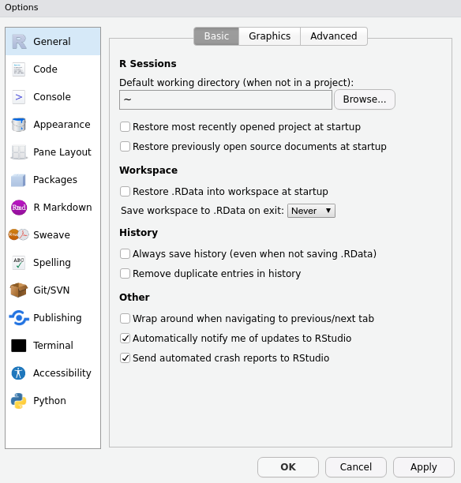
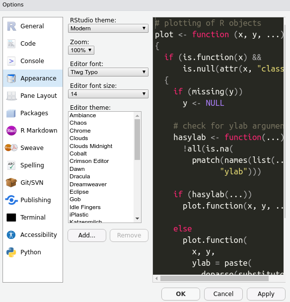

# (PART) Getting sta`r`ted {-}

# Setting up `RStudio`

**First, download and install `R`: **   

Go to the following website, click the *Download* button, and follow the website's instructions from there.
[https://mirrors.nics.utk.edu/cran/](https://mirrors.nics.utk.edu/cran/){target="blank"}

**Second, download and install `RStudio`:**    

Go to the following website and choose the free Desktop version:
[https://rstudio.com/products/rstudio/download/](https://rstudio.com/products/rstudio/download/){target="blank"}

**Third, make sure `RStudio` opens successfully:**    

Open the `RStudio` app. A window should appear that looks like this:

**Fourth, make sure `R` is running correctly in the background:**    

In `RStudio`, in the pane on the left (the "Console”), type 2+2 and hit Enter.  
If `R` is working properly, the number “4” will be printed in the next line down.

**Finally, some minor adjustments to make rstudio run smoother (and look cooler):**

Tools > Global Options:

Cooler themes!

**Boom!**  

