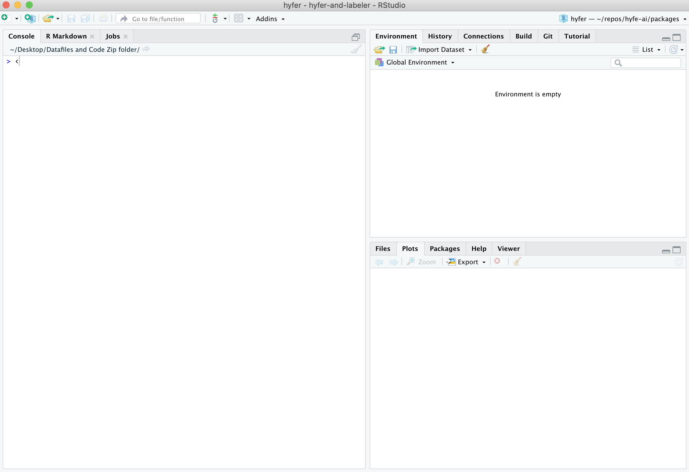

# Running R code

#### Learning goals {-}

* Learn how to run code in R
* Learn how to use R as a calculator
* Learn how to use mathematical and logical operators in R

&nbsp;  

When you open `RStudio`, you see several different panes within the program's window. You will get a tour of `RStudio` in the next module. For now, look at the left half of the screen. You should see a large pane entitled the *Console*.   



`RStudio`'s *Console* is your window into `R`, the engine under the hood. The *Console* is where you type commands for `R` to run, and where `R` prints back the results of what you have told it to do. Think of the *Console* as a chatroom, where you and `R` talk back and forth.


## Running code in the *Console*  {-}

Type your first command into the *Console*, then press `Enter`:

```{r,echo=TRUE, collapse=TRUE}
1 + 1
```

When you press `Enter`, you send your line of code to `R`; you post it for `R` to see. Then `R` takes it, does some processing, and posts a result (`2`) just below your command.

Note that spaces don't matter. Both of the following two commands are legible to `R` and return the same thing:

```{r,echo=TRUE,collapse=TRUE}
4+4
```

```{r,echo=TRUE,collapse=TRUE}
4        +        4
```

However, it is better to make your code as easy to read as possible, which usually means using a single space between numbers:

```{r,echo=TRUE,collapse=TRUE}
4 + 4
```

Try typing in other basic calculations:

## Use R like a calculator {-}

As you can tell from those commands you just ran, `R` is, at heart, a fancy calculator.

Some calculations are straightforward, like addition and subtraction:

```{r,echo=TRUE,collapse=TRUE}
490 + 1000
```

```{r,echo=TRUE,collapse=TRUE}
490 - 1000
```

Division is pretty straightfoward too:

```{r,echo=TRUE,collapse=TRUE}
24 / 2
```

For multiplication, use an asterisk (`*`):

```{r,echo=TRUE,collapse=TRUE}
24 * 2
```

You denote exponents like this: 

```{r,echo=TRUE,collapse=TRUE}
2 ^2
```

```{r,echo=TRUE,collapse=TRUE}
2 ^3
```

```{r,echo=TRUE,collapse=TRUE}
2 ^4
```

Finally, note that `R` is fine with negative numbers:

```{r,echo=TRUE,collapse=TRUE}
9 + -100
```

```{r, results = 'asis', eval = ifelse(exists('is_teacher'),is_teacher,TRUE),echo=FALSE}
source('teacher_tip.R')

tip <- 'For a change of pace, call out complicated calculations and ask students to race to call out the correct result first.'

teacher_tip(tip)
```

## Getting along with `R` {-}

### Re-running code in the *Console* {-}

If you want to re-run the code you just ran, or if you want to recall the code so that you can adjust it slightly, click anywhere in the *Console* then press your keyboard's `Up` arrow.

If you keep pressing your `Up` arrow, `R` will present you with sequentially older commands. `R` keeps a history of everything you have said to it since you opened this window.

If you accidentally recalled an old command without meaning to, you can reset the *Console*'s command line by pressing `Escape`.


### Incomplete commands {-}

`R` gets confused when you enter an incomplete command, and will wait for you to write the remainder of your command on the next line in the *Console* before doing anything.

For example, try running this code in your *Console*:

```{r,eval=FALSE,echo=TRUE,collapse=TRUE}
45 +
```

You will find that `R` gives you a little `+` sign on the line under your command, which means it is waiting for you to complete your command.  

If you want to complete your command, add a number (e.g., `3)` and hit `Enter`. You should now be given an answer (e.g., `48`).  

Or, if instead you want `R` to stop waiting and stop running, just press the `Escape` key.


### Semicolons {-}

Semicolons can be used to put two separate commands on the same line of code. For example, these two lines of commands ...

```{r,echo=TRUE,eval=TRUE,collapse=TRUE}
4 + 5
6 + 10
```

.. will return the same results as this single line of commands:

```{r,echo=TRUE,eval=TRUE,collapse=TRUE}
4 + 5 ; 6 + 10
```

This will become a useful trick in a few modules downstream. 

### Getting errors {-}

`R` only understands your commands if they follow the rules of the `R` language (often referred to as its *syntax*). If `R` does not understand your code, it will throw an error and give up on trying to execute that line of code. 

For example, try running this code in your *Console*:

```{r,echo=TRUE,eval=FALSE,collapse=TRUE}
4 + y
```

You probably received a message in red font stating: `Error: object 'y' not found`. That is because `R` did know how to interpret the symbol `y` in this case, so it just gave up.

**Get used to errors!** They happen all the time, even (especially?) to professionals, and it is essential that you get used to reading your own code to find and fix its errors. 

Here's another piece of code that will produce an error:

```{r,echo=TRUE,eval=FALSE,collapse=TRUE}
dfjkltr9fitwt985ut9e3
```

### Using parentheses {-}

`R` is usually great about following classic rules for Order of Operations, and you can use parentheses to exert control over that order. For example, these two commands produce different results:  

```{r,echo=TRUE,collapse=TRUE}
2*7 - 2*5 / 2
```

```{r,echo=TRUE,collapse=TRUE}
(2*7 - 2*5) / 2
```

Note that parentheses need to come in pairs: whenever you type an open parenthesis, `(`, eventually you need to provide a corresponding closed parenthesis, `)`. 

The following line of code will return a plus sign, `+`, since `R` is waiting for you to close the parenthetical before it processes your command:

```{r,echo=TRUE,eval=FALSE,collapse=TRUE}
4 + (5
```

Remember: **parentheses come in pairs!** The same goes for other types of brackets: `{...}` and `[...]`.


### Using operators in R {-}

You can ask `R` basic questions using *operators*. 

For example, you can ask whether two values are equal to each other.

```{r,echo=TRUE,collapse=TRUE}
96 == 95
```

```{r,echo=TRUE,collapse=TRUE}
95 + 2 == 95 + 2
```

`R` is telling you that the first statement is `FALSE` (`96` is not, in fact, equal to `95`) and that the second statement is `TRUE` (`95 + 2` is, in fact, equal to itself).

**Note the use of *double* equal signs here.** You must use two of them in order for `R` to understand that you are asking for this logical test. 

You can also ask if two values are *NOT* equal to each other:

```{r,echo=TRUE,collapse=TRUE}
96 != 95
```

```{r,echo=TRUE,collapse=TRUE}
95 + 2 != 95 + 2
```

This test is a bit more difficult to understand: In the first statement, `R` is telling you that it is `TRUE` that `96` is different from `95`. In the second statement, `R` is saying that it is `FALSE` that `95 + 2` is not the same as itself.

Note that `R` lets you write these tests another, even more confusing way:

```{r,echo=TRUE,collapse=TRUE}
! 96 == 95
```

```{r,echo=TRUE,collapse=TRUE}
! 95 + 2 == 95 + 2
```

The first line of code is asking `R` whether it is not true that `96` and `95` are equal to each other, which is `TRUE`. The second line of code is asking `R` whether it is not true that `95 + 2` is the same as itself, which is of course `FALSE`.

Other commonly used operators in `R` include greater than / less than symbols (`>` and `<`, also known as the *left-facing alligator* and *right-facing alligator*), and greater/less than or equal to (`>=` and `<=`).

```{r,echo=TRUE,collapse=TRUE}
100 > 100
```

```{r,echo=TRUE,collapse=TRUE}
100 >= 100
```

```{r,echo=TRUE,collapse=TRUE}
(100 != 100) == FALSE
```


### Use built-in `R` functions {-}

`R` has some built-in "functions" for common calculations, such as finding square roots and logarithms. Functions are packages of code that take a given value, transform it according to some internal code instructions, and provide an output. You will learn more about functions in a few modules. 

To find the square-root of a number, use the 'squirt' command, `sqrt()`: 

```{r,echo=TRUE,collapse=TRUE}
sqrt(16)
```

Note the use of parentheses here. When you are calling a function, when you see parentheses, think of the word 'of'. You are taking the `sqrt` **of** the number inside the parenthetical.  

To get the log of a value:

```{r,echo=TRUE,collapse=TRUE}
log(4)
```

Note that the function `log()` is the *natural log* function (i.e., the value that *e* must be raised to in order to equal 4). To calculate a base-10 logarithm, use `log10( )`.

```{r,echo=TRUE,collapse=TRUE}
log(10)
```

```{r,echo=TRUE,collapse=TRUE}
log10(10)
```

Another handy function is `round()`, for rounding numbers to a specific number of decimal places.

```{r,echo=TRUE,collapse=TRUE}
100/3
```

```{r,echo=TRUE,collapse=TRUE}
round(100/3)
```

```{r,echo=TRUE,collapse=TRUE}
round(100/3,digits=1)
```

```{r,echo=TRUE,collapse=TRUE}
round(100/3,digits=2)
```

```{r,echo=TRUE,collapse=TRUE}
round(100/3,digits=3)
```

Finally, `R` also comes with some built-in *values*, such as `pi`:

```{r,echo=TRUE,collapse=TRUE}
pi
```


#### Exercises {-}

**Use `R` like a calculator**  

**1.** Type a command in the *Console* to determine the sum of 596 and 198.  

**2.** Re-run the sum of 596 and 198 without re-typing it.  

**3.** Recall the command again, but this time adjust the code to find the sum of 596 and 298.  

**4.** Practice escaping an accidentally called command: recall your most recent command, then press the right key to clear the *Console*'s command line.  

&nbsp;  
**Recalling commands**  

**5.** Find the sum of the ages of everyone in your immediate family.  

**6.** Now recall that command and adjust it to determine the *average* age of the members of your family.  

**7.** Find the square root of *pi* and round the answer to the 2 decimal places.

&nbsp;    

**Finding errors**  

**8.** This line of code won't run; instead, `R` will wait for more with a `+` symbol. Find the problem and re-write the code so that it works.  

```{r,echo=TRUE,eval=FALSE,collapse=TRUE}
5 * 6 +
```

**9.** The same goes for this line of code. Fix it, too.  

```{r,echo=TRUE,eval=FALSE,collapse=TRUE}
sqrt(16
```

**10.** This line of code will trigger an error. Find the problem and re-write the code so that it works.

```{r,echo=TRUE,eval=FALSE,collapse=TRUE}
round(100/3,digits+3)
```

**11.** Type a command of your own into R that throws an error, then recall the command and revise so that `R` can understand it.

&nbsp;  


**Show that the following statements are TRUE:**

**12.** `pi` is greater than the square root of 9  

**13.** It is FALSE that the square root of 9 is greater than `pi`  

**14.** `pi` rounded to the nearest whole number equals the square root of 9  

&nbsp;  

**Asking `TRUE` / `FALSE` questions**

**15.** Write and run a line of code that asks whether these two calculations return the same result:

```{r,eval=FALSE,echo=TRUE,collapse=TRUE}
2*7 - 2*5 / 2
```

```{r,echo=TRUE,collapse=TRUE}
(2*7 - 2*5) / 2
```

**16.** Now write and run a line of code that asks whether the first calculation is larger than the second:


&nbsp;

#### Other Resources {-}

Hobbes Primer, Table 1 (Math Operators, pg. 18) and Table 2 (Logical operators, pg. 22)
