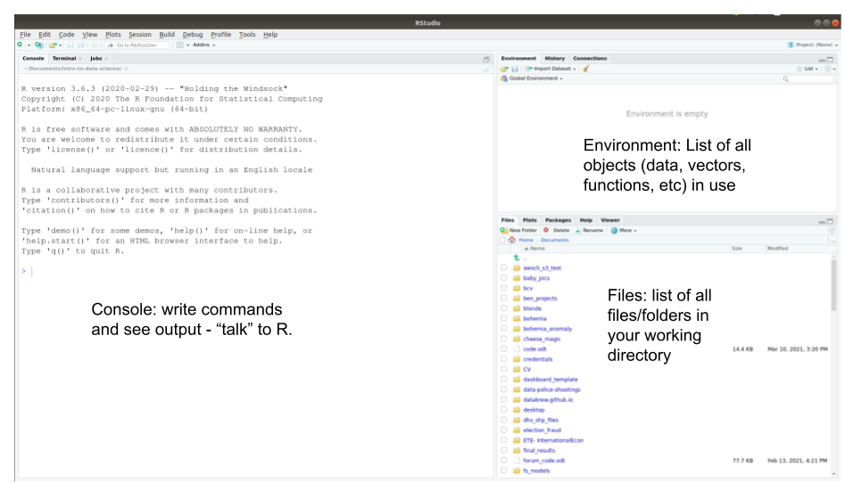
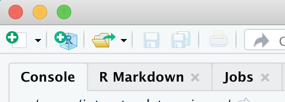
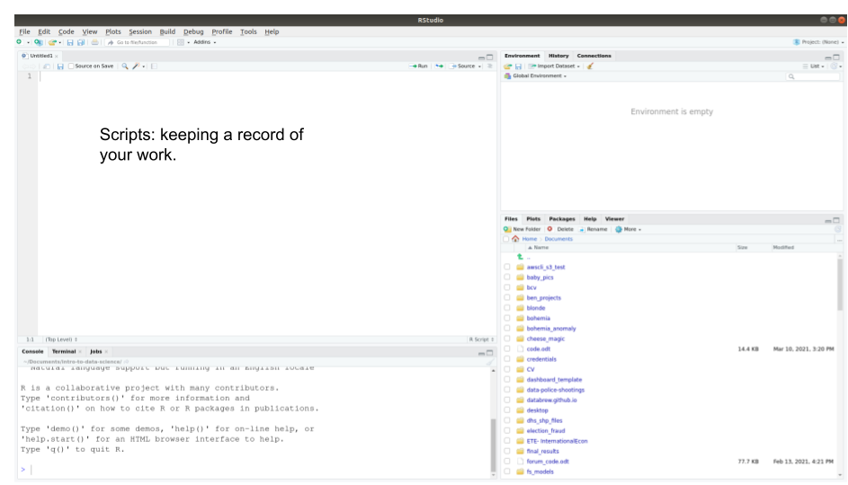
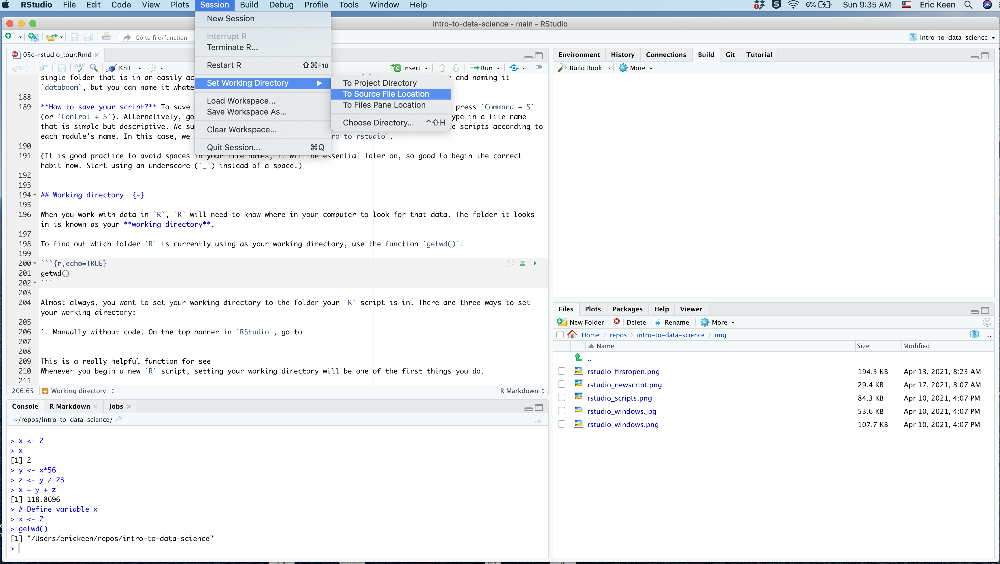

# Using `RStudio` & `R` scripts

#### Learning goals {-}

* Understand the difference between `R` and `RStudio`
* Understand the `RStudio` working environment and window panes  
* Understand what `R` scripts are, and how to create and save them
* Understand how to add comments to your code, and why doing so is important
* Understand what a *working directory* is, and how to use it
* Learn basic project work flow


## `R` and `RStudio`: what's the difference? {-}

These two entities are similar, but it is important to understand how they are different.  

In short, `R` is a open-source (i.e., free) coding language: a powerful programming engine that can be used to do really cool things with data.  

`R Studio`, in contrast, is a free *user interface* that helps you interact with `R`. If you think of `R` as an engine, then it helps to think of `RStudio` as the car that contains it. Like a car,`RStudio` makes it easier and more comfortable to use the engine to get where you want to go.   

`R Studio` needs `R` in order to function, but `R` can technically be used on its own outside of `RStudio` if you want. However, just as a good car mechanic can get an engine to run without being installed within a car, using `R` on its own is a bit clunky and requires some expertise. For beginners (and everyone else, really), `R` is just so much more pleasant to use when you are operating it from within `RStudio`.  

```{r, results = 'asis', eval = ifelse(exists('is_teacher'),is_teacher,TRUE),echo=FALSE}
source('teacher_tip.R')

tip <- 'At this point it may be useful to show the students what opening `R` looks like on its own (not through `RStudio`). This helps them see why `RStudio` is valuable, and it will also help them understand what they did wrong when they accidentally open an `.R` file in `R` instead of `RStudio` -- which will happen a lot at first.'

teacher_tip(tip)
```

`RStudio` also has increasingly powerful *extensions* that make `R` even more useful and versatile in data science. These extensions allow you to use `R` to make interactive data dashboards, beautiful and reproducible data reports, presentations, websites, and even books. And new features like these are regularly being added to `RStudio` by its all-star team of data scientists.

That is why this book *always* uses `RStudio` when working with `R`.   


## Two-minute tour of `RStudio` {-}

When you open `RStudio` for the first time, you will see a window that looks like the screenshot below. 



### Console  {-}
You are already acquainted with `RStudio`'s *Console*, the window pane on the left that you use to "talk" to `R`. (See the previous module.)

### Environment  {-}
In the top right pane, the *Environment*, `RStudio` will maintain a list of all the datasets, variables, and functions that you are using as you work. The next modules will explain what variables and functions are.

### Files, Plots, Packages, & Help  {-}
You will use the bottom right pane very often. 

* The **Files** tab lets you see all the files within your **working directory**, which will be explained in the section below.  
* The **Plots** tab lets you see the plots you are producing with your code.  
* The **Packages** tab lets you see the *packages* you currently have installed on your computer. Packages are bundles of `R` functions downloaded from the internet; they will be explained in detail a few modules down the road.  
* The **Help** tab is very important! It lets you see *documentation* (i.e., user's guides) for the functions you use in your code. Functions will also be explained in detail a few modules down the road.

These three panes are useful, but the most useful window pane of all is actually *missing* when you first open `RStudio`. This important pane is where you work with **scripts**.

```{r, results = 'asis', eval = ifelse(exists('is_teacher'),is_teacher,TRUE),echo=FALSE}
source('teacher_tip.R')

tip <- 'We recommend speeding through this section; students will get to know these features as they become necessary. For now, you should move along to creating scripts as soon as you can.'

teacher_tip(tip)
```

## Scripts  {-}

Before explaining what scripts are and why they are awesome, let's start a new script.

**To start a new script,** go to the top left icon in the `RStudio` window, and click on the green plus sign with a blank page behind it:



A dropdown window will appear. Select "R Script".

A new window pane will then appear in the top left quadrant of your `RStudio` window:


You now have a blank script to work in!

Now type some simple commands into your script:

```{r,echo=TRUE,eval=FALSE,collapse=TRUE}
2  + 10
16 * 32
```

Notice that when you press `Enter` after each line of code, nothing happens in the *Console*. In order to send this code to the Console, press `Enter + Command` at the same time (or `Enter + Control`, if you are on Windows) for each line of code. 

To send both lines of code to the *Console* at once, select both lines of code and hit `Enter + Command`. 

(To select multiple lines of code, you can (1) click and drag with your mouse or (2) hold down your `Shift` key while clicking your down arrow key. To select *all* lines of code, press `Command + A`.)

```{r, results = 'asis', eval = ifelse(exists('is_teacher'),is_teacher,TRUE),echo=FALSE}
source('teacher_tip.R')

tip <- 'Get all students to practice running code at this point. The act of typing the commands themselves helps them learn and overcome their hesitation about messing up.'

teacher_tip(tip)
```

So let's build up this script. Add a few more lines to your script, such that your script now looks like this.

```{r,echo=TRUE,eval=FALSE,collapse=TRUE}
2  + 10
16 * 32
1080 / 360
500 - 600
```

Run all of these lines of code at once.  

Now add `10` to the first number in each row, and re-run all of the code.  

Think about how much more efficient part (B) was thanks to your script! If you had typed all of that directly into your *Console*, you would have to recall or retype each line individually. That difference builds up when your number of commands grows into the hundreds. 


### What is an `R` script, and why are scripts so awesome? {-}

An `R` script is a file where you can keep a record of your code. Just as a script tells actors exactly what to say and when to say it, an `R` script tells `R` exactly what code to run, and in what order to run it.

When working with R, you will almost always type your code into a script first, *then* send it to the *Console*. You can run your code immediately using `Enter + Command`, but you also have a script of what you have done so that you can run the exact same code at a later time 

To understand why `R` scripts are so awesome, consider a typical workflow in *Excel* of *GoogleSheets*. You open a big complicated spreadsheet, spend hours making changes, and save your changes frequently throughout your work session. 

The main disadvantages of this workflow are that:  

1. There is no detailed record of the changes you have made. You cannot prove that you have made changes correctly. You cannot pass the original dataset to someone else and ask them to revise it in the same way you have. (Nor would you want to, since making all those changes was so time-consuming!) Nor could you take a different dataset and guarantee that you are able to apply the exact same changes that you applied to the first. In other words, your work is not reproducible. 

2. Making those changes is labor-intensive! Rather than spend time manually making changes to a single spreadsheet, it would be better to devote that energy to writing `R` code that makes those changes for you. That code could be run in this one case, but it could also be run at any later time, or easily modified to make similar changes to other spreadsheets.  

3. Unless you are an advanced *Excel* programmer, you are probably modifying your original dataset, which is always dangerous and a big No-No in data science. Each time you save your work in *Excel* or *GoogleSheets* (which automatically saves each change you make), the original spreadsheet file gets replaced by the updated version. But if you brought your dataset into `R` instead, and modified it using an `R` script, then you leave the raw data alone and keep it safe. (Sure, you can always save different versions of your Excel file, but then you run the risk of mixing up versions and getting confused.)

```{r, results = 'asis', eval = ifelse(exists('is_teacher'),is_teacher,TRUE),echo=FALSE}
source('teacher_tip.R')

tip <- 'Consider telling a story from your own work life before you discovered R scripts. For example: receiving versions of Excel files named DATA-final-final-final.xlsx, because tiny changes are inevitably discovered after you try to finalize a data file. Then you work all weekend on an analysis using that data, only to discover you were using the WRONG version of the data!'

teacher_tip(tip)
```

Working with `R` scripts allows you to avoid all of these pitfalls. When you write an `R` script, you are making your work ....

* **Efficient.** Once you get comfortable writing `R` code, you will be able to write scripts in a few minutes. Those scripts can modify datasets within seconds (or less) in ways that would take hours (or years) to carry out manually in *Excel* or *GoogleSheets*.

* **Reproducible.** Once you have written an`R` script, you can reproduce your own work whenever you want to. You can send your script to a colleague so that they can reproduct your work as well. Reproducible work is defensible work.

* **Low-risk.** Since your R script does not make any changes to the original data, you are keeping your data safe. It is *essential* to preserve the sanctity of raw data!


Note that there is nothing fancy or special about an `R` script. An `R` script is a simple text file; that is, it only accepts basic text; you can't add images or change font style or font size in an `R` script; just letters, numbers, and your other keyboard keys. The file's extension, `.R` tells your computer to interpret that text as `R` code.

### Commenting your code {-}

Another advantage of scripts is that you can include *comments* throughout your code to explain what you are doing and why. A *comment* is just a part of your script that is useful to you but that is ignored by `R`. 

To add comments to your code, use the hashtag symbol (`#`). Any text following a `#` will be ignored by `R`.

Here is the script above, now with comments added: 

```{r,echo=TRUE,eval=FALSE,collapse=TRUE}
# Define variable x
x <- 2 
x

# Make a new variable, y, based on x
y <- x*56

z <- y / 23 # Make a third variable, z, based on y
 
x + y + z # Now get the sum of all three variables
```

Adding comments can be more work, but in the end it saves you time and makes your code more effective. Comments might not seem necessary in the moment, but it is amazing how helpful they are when you come back to your code the next day. Frequent and helpful comments make the difference between good and great code. Comment early, comment often!

You can also use lines of hashtags to visually organize your code. For example:

```{r,echo=TRUE,eval=FALSE,collapse=TRUE}
##############################################
# Setup
##############################################

# Define variable x
x <- 2 
x

# Make a new variable, y, based on x
y <- x*56

z <- y / 23 # Make a third variable, z, based on y
 

##############################################
# Get result
##############################################

x + y + z # Now get the sum of all three variables
```

This might not seem necessary with a 5-line script, but adding visual breaks to your code becomes immensely helpful when your code grows to be hundreds of lines long.

### Saving your work {-}

**`R` scripts are only useful if you save them!** Unlike working with *GoogleDocs* or *GoogleSheets*, `R` will not automatically save your changes; you have to do that yourself. (This is inconvenient, but it is also safer; most of coding is trial and error, and sometimes you want to be careful about what is saved.)

```{r, results = 'asis', eval = ifelse(exists('is_teacher'),is_teacher,TRUE),echo=FALSE}
source('teacher_tip.R')

tip <- 'Having grown up in the age of GoogleDocs, many students may not be familiar with what computer files are, and may not even know that their computer operates using directories of folders. It would be useful to open up File Explorer on your demo screen and show them how these directories work.'

teacher_tip(tip)
```

**Step 1: Decide where to save your work.** The folder in which you save your `R` script will be referred to as your *working directory* (see the next section). For the sake of these tutorials, it will be most convenient to save all of your scripts in a single folder that is in an easily accessed location. 

**Step 2: In that location, make a new folder named `datalab`**: We suggest making a new folder on your Desktop and naming it `datalab`, but you can name it whatever you want and place it wherever you want.

**Step 3: Save your script in that folder** To save the script you have opened and typed a few lines of code into, press `Command + S` (or `Control + S`). Alternatively, go to File > Save. Navigate to the folder you just created and type in a file name that is simple but descriptive. We suggest making a new `R` script for each module, and naming those scripts according to each module's name. In this case, we recommend naming your script `intro_to_scripts`. 

(It is good practice to avoid spaces in your file names; it will be essential later on, so good to begin the correct habit now. Start using an underscore, `_`, instead of a space.)


## Your working directory  {- #wd}

When you work with data in `R`, `R` will need to know where in your computer to look for that data. The folder it looks in is known as your **working directory**. 

To find out which folder `R` is currently using as your working directory, use the function `getwd()`:

```{r,echo=TRUE,collapse=TRUE}
getwd()
```

Almost always, you want to set your working directory to the folder your `R` script is in. 

### How to set your working directory {-}

Whenever you begin a new `R` script, setting your working directory will be one of the first things you do.   

There are three ways to set your working directory:

1. **Manually without code.** On the top banner in `RStudio`, go to *Session > Set Working Directory > To Source File Location*:


This action sets your working directory to the same folder that your `R` script is in. When you do this, you will see that a command has been entered into your *Console*:

```{r,echo=TRUE,eval=FALSE,collapse=TRUE}
setwd("~/Desktop/datalab")
```

(Note that the filepath may be different on your machine.) This code is using the function `setwd()`, which is also used in the next option. Go ahead and copy this `setwd(...)` code and paste it into your script, so it will be easy to use next time.

2. **Manually with code, using `setwd()`**: You can manually provide the filepath you want to set as your working directory. This option allows you to set your `wd` to whatever folder you want. The character string within the `setwd()` command is the path to a folder. The formatting of this string must be exact, otherwise `R` will throw an error. Use option 1 at first to get a sense of how your computer formats its folder paths. Copy, paste, and modify the output from option 1 in order to type your path correctly.

3. **Automatically with code**: There is a command you can run that automatically sets your working directory to the folder that your `R` script is in. This is the most efficient and useful method, in our experience. 

To use this command, you must first install a new package. Run this code:

```{r,echo=TRUE,eval=FALSE,collapse=TRUE}
install.packages("rstudioapi")
library(rstudioapi)
```

For now, you do not need to understand what this code is doing. We will explain packages and the `library()` function in a later module. 

You can now copy, paste, and run this code to set your working directory automatically:

```{r,echo=TRUE,eval=FALSE,collapse=TRUE}
setwd(dirname(rstudioapi::getActiveDocumentContext()$path))
```

This is a complicated line of code that you need not understand. As long as it works, it works! Confirm that `R` is using the correct working directory with the command `getwd()`.


## Typical workflows    {-}

Now that you know how to create a script and set your working directory, you are prepared to work on data projects in `RStudio`. 

The workflow for beginning a new data project typically goes like this:  

*In your file explorer...*  

1. **Create a folder for your project** somewhere on your computer. This will become your working directory.  

2. **Create subfolders** within your working directory, if you want. We recommend creating a `data` subfolder, for keeping data, and a `z` subfolder, for keeping miscellaneous documents. The goal is to keep your working directory visually simple and organized; ideally, the only files not within subfolders are your `R` scripts.

3. **Add data** to your working directory, if you have any.

*In `RStudio` ...*

4. **Create a new `R` script.**

5. **Save it** inside your intended working directory. 

6. At the top of your script, use comments to **add a title, author info, and brief description.**

7. Add the code to **set your working directory.**

8. **Begin coding!**


### Template `R` script {-}

Here is a template you can use to copy and paste into each new script you create:

```{r, echo=TRUE,eval=FALSE,collapse=TRUE}
################################################################################
# < Add title here >
################################################################################
#
# < Add brief description here >
#
# < Author >
# Created on <add date here >
#
################################################################################
# Set working directory
setwd(dirname(rstudioapi::getActiveDocumentContext()$path))

################################################################################
################################################################################
# Code goes here


################################################################################
# (end of file)
```


#### Exercises {-}

**1** *(if not already complete)*. Create a working directory for this course. Call it whatever you like, but `datalab` could work great. Place it somewhere convenient on your computer, such as your Desktop.  

**2.** Within this working directory, create three new folders: (1) a `data` folder, which is where you will store the data files we will be using in subsequent modules; (2) a `modules` folder, which is where you will keep the code you use to work on the material in these modules, and (3) a `project` folder, which is where you will keep all your work associated with your summer project.  

**3.** Now follow the *Typical Workflow* instructions above to create a script. Save it within your `modules` folder. Name it `template.R`. Copy and paste the template `R` code provided above into this file, and save it. This is now a template that you can use to easily create new scripts for this course.

**4.** Now make a copy of `template.R` to stage a script that you can use in the next module. To do so, in `RStudio` go to the top banner and click `File > Save As`. Save this new script as `variables.R` (because the next module is called *Variables in `R`*). 

**5.** Modify the code in `variables.R` so that you are prepared to begin the next module. Change the title, and look ahead to the next module to fill in a brief description. Don't forget to add your name as the author and specify today's date.

Boom!


#### Other Resources  {-}

[A Gentle Introduction to `R` from the `RStudio` team](https://www.rstudio.com/resources/webinars/a-gentle-introduction-to-tidy-statistics-in-r/){target="blank"}

