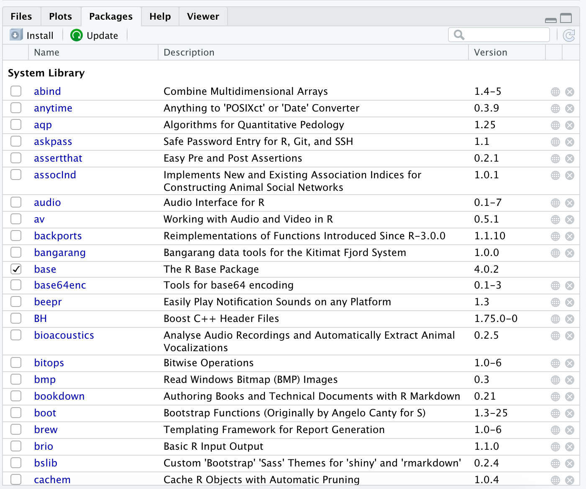

# Packages

```{r,echo=FALSE,eval=FALSE}
is_teacher <- FALSE
```


#### Learning goals {-}

* Learn what `R` packages are and why they are awesome
* Learn how to find and read about the packages installed on your machine
* Learn how to install `R` packages from `CRAN`
* Learn how to install `R` packages from `GitHub`


```{r, results = 'asis', eval = is_teacher}
teacher_content('Here is some teacher content.')
```

## Introducing `R` packages {-}

As established in the **Calling functions** module, `R` comes with hundreds of built-in base functions and datasets ready for use. You can also write your *own* functions, which we will cover in an upcoming module.  

You can also access thousands of other functions and datasets through bundles of external code known as **packages**. Packages are developed and shared by `R` users around the world -- a global community working together to increase `R`'s versatility and impact.  

Some packages are designed to be broadly useful for almost any application, such as the packages you will be learning in this course (`ggplot`, `dplyr`, `stringr`, etc.). Such packages make it easier and more efficient to do your work with `R`.   

Others are designed for niche problems that can be made much more doable with specialized functions or datasets. For example, the package `PBSmapping` contains shoreline, seafloor, and oceanographic datasets and custom mapping functions that make it easier for marine scientists at the Pacific Biological Station (PBS) in British Columbia, Canada, to carry out their work. 

## Finding the packages already on your computer  {-}

In `RStudio`, look to the pane in the bottom right and click on the *Packages* tab. You should see something like this: 


This is displaying all the packages already installed in your system.  

If you click on one of these packages (try the `base` package, for example), you will be taken to a list of all the functions and datasets contained within it. 


When you click on one of these functions, you will be taken to the help page for that function. This is the equivalent of typing `? <function_name>` into the *Console*. 

## Installing a new package  {-}

There are a couple ways to download and install a new `R` packae on your computer. Most packages are available from an open-source repository known as `CRAN` (which stands for Comprehensive `R` Archive Network). However, an increasingly common practice is to release packages on a public repository such as `GitHub`. 

### Installing from `CRAN`  {-}

You can install `CRAN` packages one of two ways:

#### Through clicks: {-}

In `RStudio`, in the bottom-right pane, return to the *Packages* tab. Click on the "Install" button.


You can then search for the package you wish to install then click **Install**. 

#### Through code: {-}

You can download packages from the *Console* using the `install.packages()` function.

```{r,eval=FALSE,echo=TRUE}
install.packages('fun')
```

Note that the package name must be in quotation marks.


### Installing from `GitHub`  {-}

To install packages from `GitHub`, you must first download a `CRAN` package that makes it easy to do so:

```{r,echo=TRUE,eval=FALSE}
install.packages("devtools")
```

Most packages on `GitHub` include instructions for downloading it on its `GitHub` page. 

For example, visit [this `GitHub` page](https://github.com/karthik/wesanderson){target="blank"} to see the documentation for the package **wesanderson**, which provides color palette themes based upon Wes Anderson's films. On this site, scroll down and you will find instructions for downloading the package. These instructions show you how to install this package from your `R` *Console*:

```{r,echo=TRUE,eval=FALSE}
devtools::install_github("karthik/wesanderson")
```

Now go to your *Packages* tab in the bottom-right pane of `RStudio`, scroll down to find the **wesanderson** package, and click on it to check out its functions.  

## Loading an installed package {-}

There is a difference between *installed* and *loaded* packages. Go back to your *Packages* tab. Notice that some of the packages have a checked box next to their names, while others don't.  

These checked boxes indicate which packages are currently *loaded*. All packages in the list are *installed* on your computer, but only the checked packages are *loaded*, i.e., ready for use.  

To load a package, use the `library()` function.

```{r,echo=TRUE,eval=TRUE}
library(fun)
library(wesanderson)
```

Now that your new packages are loaded, you can actually use their functions.


## Calling functions from a package  {-}

Most functions from external packages can be used by simply typing the name of the function. For example, the package `fun` contains a function for generating a random password:

```{r,echo=TRUE,collapse=TRUE}
random_password(length=24)
```

Sometimes, however, `R` can get confused if a new package contains a function that has the same name of some function from a different package. If `R` seems confused about a function you are calling, it can help to specify which package the function can be found in. This is done using the syntax `<package_name>::<function_name>`. For example, the following command is a fine alternative to the command above:

```{r,echo=TRUE,collapse=TRUE}
fun::random_password(length=24)
```

Note that this was done in the example above using the `devtools` package.  


## Review: the workflow for using a package {-}

To review how to use functions from a non-base package in `R`, follow these steps (examples provided:)

1. Install the package

```{r,echo=TRUE,eval=FALSE}
# Example from CRAN
install.packages("wesanderson")

# Example from GitHub
devtools::install_github("karthik/wesanderson")
```

2. Load the package

```{r,echo=TRUE,eval=FALSE}
# Example
library(wesanderson)
```

3. Call the function.

```{r,echo=TRUE,eval=TRUE,collapse=TRUE}
wes_palette("Royal1")
wesanderson::wes_palette("Zissou1")
```

*(This function creates a plot displaying the different colors contained within the specified palette.)*

## A note on package dependencies {-}

Most packages contain functions that are built using functions built from other packages. Those new functions depend on the functions from those other packages, and that's why those other packages are known as *dependencies*. When you install one function, you will notice that `R` typically has to install several other packages at the same time; these are the dependencies that allow the package of interest to function.

## A note on package versions  {-}

Packages are updated regularly, and sometimes new versions can break the functions that use it as a dependency. Sometimes you may have to install a new version (*or sometimes an older version!*) of a dependency in order to get your package of interest to work as desired. 


#### Review assignment {-}

*NOTE: Under construction!*

#### Other Resources  {-}

*NOTE: Under construction!*


