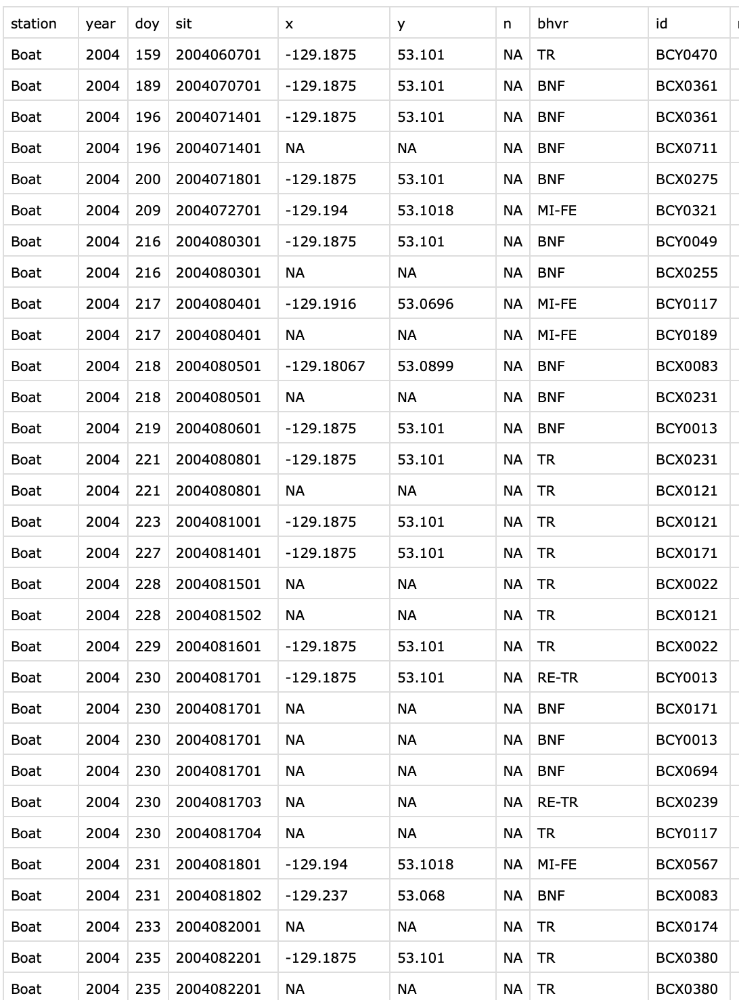
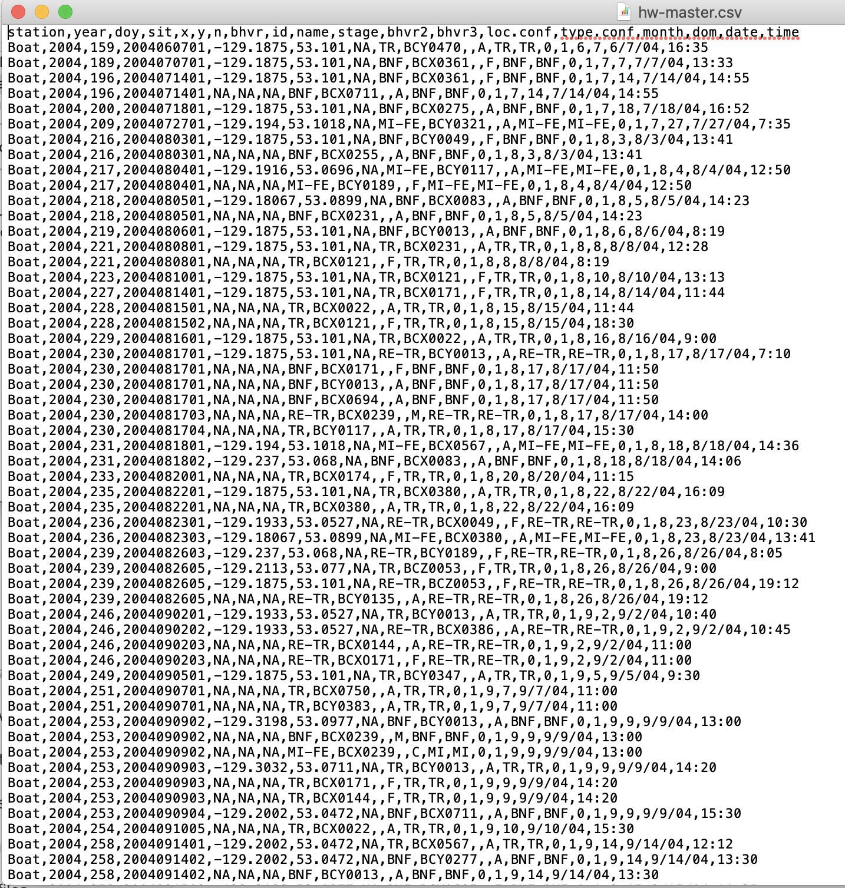
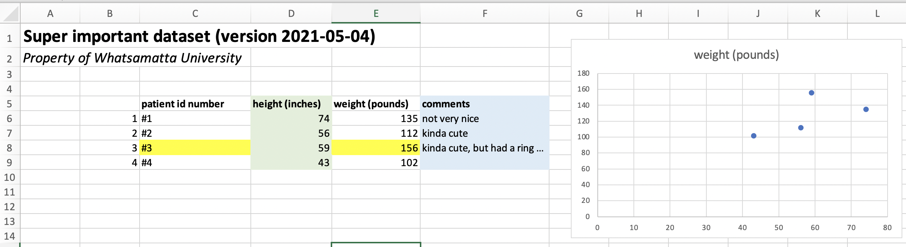
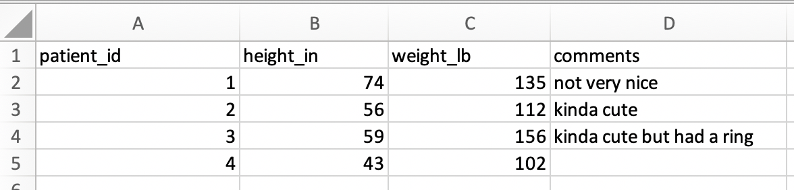
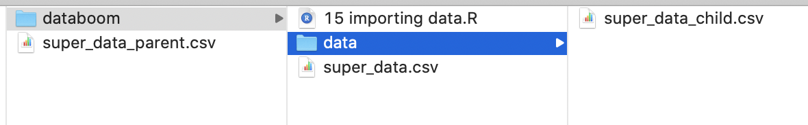
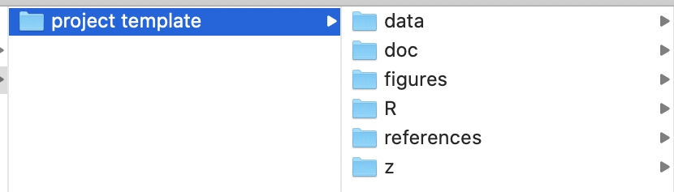

# (PART) Basic `R` workflow {-}

# Importing data

#### Learning goals {-}
* How to load, or "read", your data into `R`
* How to format your data for easily importing data in `R`
* Understand what a `.csv` file is, and why they are important in data science
* How to set up your project directory and read data from other folders

&nbsp;

To work with your own data in `R`, you need to load your data in `R`'s memory. This is called **reading in** your data. 


## Reading in data {-}

The general workflow for reading in data is as follows:

1. In `RStudio`, set your working directory.
2. Place your data file in your working directory. (See the section below if you want to keep your data somewhere else.)
3. In your `R` script, read in your data file with one of the core functions below.

```{r,echo=FALSE, message=FALSE, warning=FALSE}
library(xfun)
```

You can use this simple data file, `r xfun::embed_file('super_data.csv',text="super_data.csv")`, to practice.


### Core functions for reading data {-} 

To become agile in reading various types of data into `R`, here are five key functions you should know:  

#### `readr::read_csv()` {-}

Reading in data is simple and easy if your data are saved as a **`.csv`**, a comma-separated file. You can find functions for reading all sorts of file types into `R`, but the quickest way to begin working with your own data in `R` is to maintain that data in `.csv`'s.   

The function `read_csv()`, from a package named `readr`, becomes useful when you begin working with (1) data from the internet, (2) data within the `tidyverse`, which you will be introduced to in the next module, and/or (2) very large dataset, since it reads data much more quickly and provides progress updates along the way. 

Here's an example of reading a file directly from the internet ...  

```{r,echo=TRUE,collapse=TRUE,message=FALSE,warning=FALSE}
library(readr)
df <- read_csv('https://raw.githubusercontent.com/databrew/intro-to-data-science/main/data/deaths.csv')
df
```

Note that when you use `read_csv()` instead of `read.csv()`, your data are read in as a `tibble` instead of a dataframe. You will be introduced to `tibbles` in the next modules on dataframes; for the time being, think of a `tibble` as a fancy version of a dataframe that can be treated exactly as a regular dataframe.

####  `read.csv()` {-}

This function, `read.csv()`, is the base function for reading in a `.csv`. It is strictly used for reading in local files (not from the internet).  

This function reads in your data file as a dataframe. Save your dataset into `R`'s memory using a variable (in this case, `df`).  


```{r,echo=TRUE}
df <- read.csv("super_data.csv")
df
```

The `read.csv()` function has plenty of other inputs in the event that your data file is unable to follow the formatting rules outlined above (see `?read.csv()`). The three most common inputs you may want to use are `header`, `skip`, and `stringsAsFactors`.

- Use the **`header`** input when your data does not contain column names. *For example*, `header=FALSE` indicates that your datafile does not have any column names.  

- Use the **`skip`** input when you want to skip some lines of metadata at the top of your file. This is handy if you really don't want to get rid of your metadata in your header. *For example,* `skip=2` skips the first two rows of the datafile before `R` begins reading data.  

- Use the **`stringsAsFactors`** input when you want to make absolutely sure that `R` interprets any non-numeric fields as characters rather than factors. We have not focused on factors yet, but it can be frustrating when `R` mistakes a column of character strings as a column factors. To avoid any possible confusion, use `stringsAsFactors=TRUE` as an input.  

For example, here is how to read in this data without column names:  

```{r,echo=TRUE,collapse=TRUE}
df <- read.csv("super_data.csv",skip=1,header=FALSE)
df
```

If you do this without setting header to FALSE, your first row of data gets used as column names and it becomes a big ole mess:  

```{r,echo=TRUE,collapse=TRUE}
df <- read.csv("super_data.csv",skip=1)
df
```

#### `readxl()` {-}

To read in an *Excel* spreadsheet, use the `read_xlsx()` function from the package `readxl`.   

If `super_data` were an `.xlsx` file, the command would look like this:  

```{r,echo=TRUE,collapse=TRUE,eval=FALSE}
library(readxl)
df <- read_xlsx("super_data.xlsx",sheet=1)
```

#### `gsheet()` {-}

To read in an *GoogleSheets* spreadsheet, use the `gsheet2tbl()` function from the package `gsheet`.  

Make sure link sharing is turned on for the *GoogleSheet* you are trying to access:  

```{r,echo=TRUE,collapse=TRUE}
library(gsheet)
df <- gsheet2tbl("https://docs.google.com/spreadsheets/d/1uQ5PfGITnjHngK41FWHeedioca30wpyEsBOpC_B6T3E/edit?usp=sharing")
df
```

#### `readRDS()` {-}

Another niche function for reading data is `readRDS()`.  This function allows you to read in *R data objects*, which have the file extension *.rds*. These data objects need not be in the same format as a `.csv` or even a dataframe, and that is what makes them so handy. A colleague could send you an `.rds` object of a vector, a list, a plotting function, or any other kind of `R` object, and you can read it in with `readRDS()`. 

For example, `r xfun::embed_file('super_data.rds',text="super_data.rds")`contains a `tibble` version of the dataframe above. When you read in that `.rds` file, it is already formatted as a `tibble`: 

```{r,echo=TRUE,collapse=TRUE}
df <- readRDS("super_data.rds")
df
```


## `.csv` files {-}

The `.csv` is such an important file type when you work with data that it is worth introducing it with more detail.  

When you preview a `.csv`, it looks something like this:


A neat spreadsheet of rows and columns.  

When you open up this same dataset in a simple text editor, it looks like this:


This looks scary, but it is actually really simple. A `.csv` is a simple text file in which each row is on a new line and columns of data are separated by commas. As a simple text file, there is no fancy formatting. There are no "Sheets" or "Tabs", as you would find in GoogleSheets or Excel; it is a simple 'flat' file.

One of the major advantages of working with `.csv`'s is that the format is cross-platform and non-proprietary. That is, they work on Windows, Mac, Linux, and any other common type of computer, and they do not require special software to open.  


## Prepping your data for `R` {-}

For those of us used to working in *Excel*, *GoogleSheets*, or *Numbers*, it will take some adjustment to get into the habit of formatting your data for `R`. We are used to seeing spreadsheets that look something like this:



To read a `.csv` into `R` without issues or fancy code, this spreadsheet will need to be simplified to look like this: 



### Workflow for formatting your data {-}

Below is the general worfklow for preparing your data for `R` is the following:

**1. Get your data into `.csv` format.** In *Excel* and *Numbers*, you can use 'Save As' to change the file format. In *GoogleSheets*, you can 'Download As' a `.csv`. This will remove any colors, thick lines, special fonts, bold or italicized font styles, and any other special formatting. All that will be left is your data, and that's the way `R` likes it.  

**2. Remove blank columns** before and in the middle of your data.  

**3. Remove fancy elements such as graphs.**

**4. Simplify your 'header'.** The space above your data is your spreadsheet's header. It includes column names and metadata like title, author, measurement units, etc. It is possible to read data with complex headers into `R`, but again we are going for simplicity here, so we suggest (1) simplifying your header to contain column names only, and (2) moving metadata to a `README.txt` file that lives in the same folder as your data. 

**5. Simplify column names.** Remove spaces, or replace them with `.`, `-` or `_`. Make your column names as simple and brief as possible while still being informative. Include units in the column names, as in the screenshot above. Be sure that each column has a name. 

**6. Remove all commas and hashtags from your dataset.** You can do this with the 'Find & Replace' feature built-into in most spreadsheet editors.


## Managing files & folders {-}  

### Reading data from other folders {-}

The data-reading functions above require only a single input: the *path* to your data file. This *path* is relative to the location of your working directory. When your data file is *inside* your working directory, the path simplifies to be the same as the filename of your data:

```{r,echo=TRUE,eval=FALSE,collapse=TRUE}
df <- read.csv("super_data.csv")
```

Sometimes, though, you will want to keep your data somewhere nearby but not necessarily *within* your working directory. Consider the following scenario, in which three versions of the "super_data.csv" dataset occur near a working directory being used for this module:



We have a version within the same directory as our `R` file (i.e., our working directory), another version within a *child* folder within the directory (i.e., a subfolder), and another version in the *parent* folder of the working directory. 

**To read a file from a *child* folder,** add the prefix, `./<child name>/`, to your  command: 

```{r,echo=TRUE,eval=FALSE,collapse=TRUE}
df <- read.csv("./data/super_data.csv")
```

**To read a file from a *parent* folder,** add the prefix, `../`, to your  command: 

```{r,echo=TRUE,eval=FALSE,collapse=TRUE}
df <- read.csv("./data/super_data.csv")
```

### Managing files {-}

Now consider the following scenario, in which your project folder structure looks like this: 



This structure can be a effective and simple way of organizing your files for a project, and we recommend using it.   

Here's what these child folders should contain. 

- `./data/` contains data, of course. 
- `./doc/` contains documents, such as manuscript drafts.
- `./figures/` contains files for graphs and figures.
- `./R/` contains `R` scripts, of course. 
- `./references/` contains journal articles and other resources you are using in your research.  

Since your `R` code is going into the `R` child folder, that is what you should set your working directory for those `R` scripts to. In that case, *how to read data from the `data` folder*, which is a separate child folder of your parent folder?

Here's how:

```{r,echo=TRUE,eval=FALSE,collapse=TRUE}
df <- read.csv("../data/super_data.csv")
```

