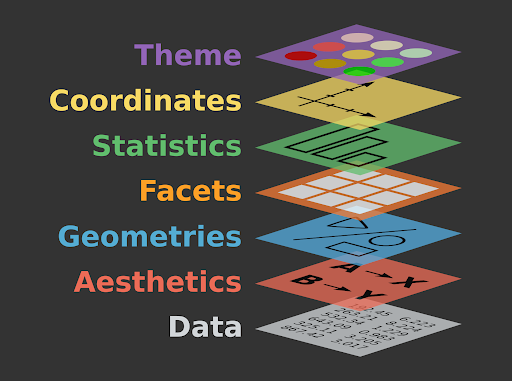

# `ggplot`


#### Learning goals {-}

- Understand what `ggplot2` is and why it's used
- Be able to think conceptually in the framework of the "grammar of graphics"
- Learn the basic syntax for creating different plots using using `ggplot2`


## What is `ggplot2`?  {-}

`ggplot2` is an `R` package. It's one of the most downloaded packages in the `R` universe, and has become the gold standard for data visualization. It's extremely powerful and flexible, and allows for creating lots of visualizations of different types, ranging from maps to bare-bones academic publications, to complex, paneled charts with labeling, etc.  

Because the syntax is so different from "base" `R`, it can give the impression of having a somewhat steep learning curve. But in reality, because the principles are so conceptually simple, learning is fairly fast. Generally those who choose to learn it stick with it; that is, once you go `gg`, you don't go back.

**Note:** we will refer heavily to this [**online guide about `ggplot`**](https://ggplot2-book.org/introduction.html)


### The name & concept  {-}

```{r, results = 'asis', eval = ifelse(exists('is_teacher'),is_teacher,TRUE),echo=FALSE}
source('teacher_tip.R')

tip <- 'To demonstrate the ideas in this section, draw a rough plot on a whiteboard as you step through each layer.'

teacher_tip(tip)
```

The "`gg`" in `ggplot` stands for "grammar of graphics", with "grammar" meaning "the fundamental principles or rules of an art or science" [@layered-grammar]. Just as all languages share common principles of grammar and syntax, so too do the many forms of data visualization. The basic idea is that all graphs can be described using a _layered_ grammar: all graphs represent a dataset using the same layers of visual order. 

**Plots are made of layers.** Think of how you draw a plot from scratch:

First, you get a piece of paper -- a **canvas**.

Second, you draw the x axis and y axis: each direction on your canvas represents the range of a set of data. This establishes a **landscape of coordinates**. 

Third, the data need to be placed somewhere in that landscape. You **map the data** to the coordinates. 

Fourth, when you actually draw the data at their prescribed locations on the plot, you have to decide how to do so. You use **geometric objects** -- like points, lines, and bars -- and other **aesthetic attributes** -- like colors, line thicknesses, and dot size. 

Fifth, you add **labels** -- such as axis titles, an overhead title, or a legend -- to help the viewer understand the plot.

You now have a basic plot. But sometimes you will add additional layers:

Sixth, you may add **statistical summaries** -- such as regression lines or standard error bars.

Seventh, you may decide to do an overhaul and split your plot into several **facets**, in which subgroups of the data are plotted separately to produce a multi-panel plot. 

Finally, in the final layer, you may decide to stylize the entire plot to fit a **visual theme**, such as the trademark styles of vendors like the *The Economist* or *The New York Times*.  

When you produce a plot with `ggplot`, you will mirror this same process step-by-step. This is why you will often see the process underlying `ggplot` described using a graphic like this:

<center>

</center>

&nbsp;  

*Note:*  If you want to learn more about the theory, the most well-known "grammar of graphics" was written in 2005 and laid out some abstract principles for describing statistical graphics [@10.5555/1088896].  


### Setting up `ggplot` {-}

Let's learn by doing. First, install and load  `ggplot2` and associated packages. 

```{r,echo=TRUE,collapse=TRUE, message=FALSE}
library(ggplot2)
library(readr)
library(ggthemes)
library(dplyr)
```

Download the `titanic` dataset, the manifest of *Titanic* passengers with details such as as age, passenger class, fare paid, and whether or not they survived.  

```{r,echo=TRUE,collapse=TRUE, message=FALSE}
titanic<- read_csv("https://raw.githubusercontent.com/databrew/intro-to-data-science/main/data/deaths.csv")
```

```{r, results = 'asis', eval = ifelse(exists('is_teacher'),is_teacher,TRUE),echo=FALSE}
source('teacher_tip.R')

tip <- 'At this point it may be useful to emphasize that the name of the package is **`ggplot2`**, but the name of the function is just **`ggplot()`**.'

teacher_tip(tip)
```


## Scatter plot {-}

Say you want to explore the relationship between passengers' age and the fare they paid to travel aboard the *Titanic*.  

(1) **Set up our canvas.** If we just type `ggplot()` without anything in the parentheses, the function will just return a blank piece of paper.  

```{r,echo=TRUE,collapse=TRUE,warning=FALSE}
ggplot()
```

(2) **Draw the axes** and, 3., setup our **landscape of coordinates**. To do so, we need to feed `ggplot()` some data and tell it which columns should be mapped onto the axes. 

```{r,echo=TRUE,collapse=TRUE,warning=FALSE}
ggplot(data = titanic, 
       aes(x = Age, y = Fare))
```

That code looks a bit clunky, we know. The `aes()` input, which is short for `aesthetics`, is actually a function. Everything included in its parentheses will be used to *map your data to the plot's aesthetic attributes*. So far we have simply said that `Age` should be mapped to the *x* axis and that `Fare` should be mapped to *y*. 

But let's say we also want to color-code the points on our plot according to male/female. To do so, we will add specifications to this `aes()` function. 

```{r,echo=TRUE,collapse=TRUE,warning=FALSE}
ggplot(data = titanic, 
       aes(x = Age, y = Fare, color=Sex))
```

Your plot is still blank, but in the background `ggplot()` is all setup to make your plot. Since this `ggplot()` call is the basis of everything that will happen next -- it contains the data and the way you want to map it to attributes of your plot -- let's save it to a variable for easy recall. We'll use `p` for "plot".  
  
```{r,echo=TRUE,collapse=TRUE,warning=FALSE}
p <- ggplot(data = titanic, 
       aes(x = Age, y = Fare, color=Sex))
```

Note that you don't need to write out `titanic$Age` or `titanic$Fare`. You've told `ggplot` that your `data` is `titanic`, so it knows to look inside that dataframe for those columns.

(4) **Map our data to geometric shapes**. In this case, a scatter plot of points:

```{r,echo=TRUE,collapse=TRUE,message=FALSE,warning=FALSE}
p <- p + geom_point()
p
```

Note the use of a plus sign, `+`. You are *adding* layers to your plot.  

(5) **Add some more labels**. You see that `ggplot()` has automatically added axis titles and a legend, but we can add some more using the `labs()` function. Let's add an overhead title, a sub-title, and a caption.

```{r,echo=TRUE,collapse=TRUE,message=FALSE,warning=FALSE}
p <- p + labs(title = 'Relationship between Age, Fare, and Sex',
              subtitle = 'Passengers on the RMS Titanic',
              caption = 'Property of Eric Keen & Hadley Whickham (2021)')
p
```

(6) **Add a statistical summary**, like a smoothed regression line. 

```{r,echo=TRUE,collapse=TRUE,message=FALSE,warning=FALSE}
p <- p + geom_smooth(method = 'lm')
p
```

Note that `ggplot()` automatically produced a different regression line for each sex. That's nice, but now our plot is getting pretty cluttered. 

(7) Clean up the look by using **facets**: a separate plot for each sex. 

```{r,echo=TRUE,collapse=TRUE,message=FALSE,warning=FALSE}
p <- p + facet_wrap(~Sex)
p
```

Beautiful!  

(8) Finally, let's **stylize** the entire plot with a different **theme**. You can find theme options in the ``ggthemes` package. 

```{r,echo=TRUE,collapse=TRUE,message=FALSE,warning=FALSE}
p <- p + theme_economist_white()
p
```


## Bar plot {-}

In a bar plot, your data are mapped to bars instead of points. And, instead of showing every data point, you are summarizing the data in some way -- i.e., displaying a *statistic*. That statistic is usually just a count of the number of data points in each subgroup.

Let's make a bar plot that compares the number of men and women on the *Titanic*:

```{r,echo=TRUE,collapse=TRUE}
ggplot(data = titanic, 
       aes(x = Sex)) + 
  geom_bar(stat='count')
```

Note that, for the `aes()` call, we only provided the *x* axis attribute: `Sex`.  

Then, in the `geom_bar()` call, we told `R` what `stat`istic should be represented by that bars: `'count'`.

But you are allowed to explicitly set the bars' heights (i.e., the `y` dimension) to represent a different statistic. Let's say we wanted each bar to represent the mean age of men and women:

```{r,echo=TRUE,collapse=TRUE}
# First, determine the mean age of each sex
mean_age_males <- mean(titanic$Age[titanic$Sex == 'male'], na.rm = TRUE)
mean_age_females <- mean(titanic$Age[titanic$Sex == 'female'], na.rm = TRUE)

# Make a new dataframe with this summary data
titanic_age <- data.frame(Sex = c('male','female'),
                          mean_age = c(mean_age_males, mean_age_females))
# Plot it
ggplot(data = titanic_age, 
       aes(x = Sex,y= mean_age)) + 
  geom_bar(stat = 'identity')
```

In this case, we are explicitly defining the `y` axis in the `aes()` call, and telling `geom_bar()` to just use the values we specified in `aes()` (that's what `'identity'` means; you are telling `ggplot()` to just use what you already gave it.)  

You can specify other aesthetic attributes, *unrelated to the data*, within the `geom_bar()` call:

```{r,echo=TRUE,collapse=TRUE}
ggplot(data = titanic_age, 
       aes(x = Sex,y= mean_age)) + 
  geom_bar(stat = 'identity', fill = 'blue', alpha = 0.5) 
```

Now add better labels:

```{r,echo=TRUE,collapse=TRUE}
ggplot(data = titanic_age, 
       aes(x = Sex,y= mean_age)) + 
  geom_bar(stat = 'identity', fill = 'blue', alpha = 0.5) + 
  labs(y = 'Mean age', 
       x = 'Gender',
       title = 'Titanic passengers: Average age by sex',
       caption = 'Do not steal, please')
```

You can add another variable to your bar plot as follows. Let's say you want to see the average age in each sex, grouped by who survived and who didn't:  

```{r,echo=TRUE,collapse=TRUE}
# First, produce your summary dataframe using some dplyr magic:
titanic_em <- titanic %>% 
  group_by(Sex, Survived) %>% 
  summarise(mean_age= mean(Age, na.rm = TRUE))

titanic_em <- titanic_em %>% 
  mutate(Survived = ifelse(Survived == 1, 'Survived','Dead' ))

# Check it out
titanic_em

# Now plot it
ggplot(data = titanic_em, 
       aes(x=Sex, y=mean_age, fill = Survived)) +
  geom_bar(stat='identity')

```

Rather than stack the bars, you can place them side by side:  

```{r,echo=TRUE,collapse=TRUE}
ggplot(data = titanic_em, 
       aes(x=Sex, y=mean_age, fill = Survived)) +
  geom_bar(stat='identity', position = 'dodge') 
```

If you don't love these default colors (even if they are colorblind-friendly), you can manually define the colors for each group of bars:  

```{r,echo=TRUE,collapse=TRUE}
ggplot(data = titanic_em, 
       aes(x=Sex, y=mean_age, fill = Survived)) +
  geom_bar(stat='identity', 
           position = 'dodge', 
           alpha = 0.7, 
           color='grey40') + # bar edge
  scale_fill_manual(values = c('blue', 'grey')) # bar fill
```


#### Exercises {-}

**More *Titanic* plots**

**1.** Make a scatterplot similar to what you did above, but this time color-code by class instead of sex.  

**2.** Notice that `ggplot()` automatically uses a continuous color scale for `Pclass`, since it has numeric values. To force `ggplot()` to consider `Pclass` as categories (1st class, 2nd class, 3rd class), replace `Pclass` with `factor(Pclass)`. Did the style of your color scale change?  

**3.** Modify the title, subtitle, and caption to be more descriptive.  

**4.** Produce a bar plot that compares the number of passengers in each class.  

**5.** Make your bar plot as *ugly* as possible!  

**6.** Now make it as *beautiful* as possible, including a concise but informative title, subtitle, and caption.  

&nbsp;  

**Baby names**  

Download the dataset on baby names given to newborns in the USA:

```{r,echo=TRUE,eval=TRUE,collapse=TRUE}
library(babynames)
bn <- babynames
```

**7.** Create a line chart showing the number of girls named Mary over time.  

**8.** Change the color of the line to blue.  

**9.** Add a fitting title to the plot. 

**10.** Create a bar chart showing the number of girls named Emma, Olivia, Ava, Sophia, and Emily in 2010.  

**11.** Change the X label to "Names" and the y label to "Total". (*Hint:* check out the `labs()` help page.)  

**12.** Change the color of the bar to grey and make it more transclucent.    

**13.** Create a bar chart showing the number of people named Emma, Olivia, Ava, Sophia, and Emily in 2010, colored by sex.  

**14.** Create a beautiful chart showing your name over time.  

```{r,echo=FALSE,eval=FALSE,collapse=TRUE}
library(babynames)
library(dplyr)
library(ggplot2)
bn <- babynames

# subset by the name Francis
francis <- bn %>% filter(name == 'Francis', sex == 'M')

# line plot
ggplot(data=francis, 
       aes(x = year, y =n )) + 
  geom_line() + 
  labs(x = 'Year', y = 'Number of boys named Francis')
# layer with points
ggplot(data=francis, 
       aes(x = year, y =n )) + 
  geom_line() + 
  geom_point() + 
  labs(x = 'Year', y = 'Number of boys named Francis')
```
