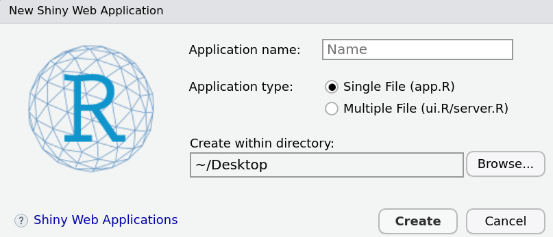

# Interactive dashboards {-}

# Intro to Shiny apps


## Overview

Shiny is a library that makes it super easy to build interactive web applications and dashboards in R. 

First we need to install the library

```{r,echo=TRUE,collapse=TRUE, eval = FALSE}
install.packages('shiny')
```

Shiny apps consists of two main parts: 

1) The **UI** - this controls what is being displayed on the application page and how the components are laid out. This may include text and other markdown elements, graphics, widgets that take in user input, or plots. You will also use the UI to define a navigation bar with multiple tabs in this tutorial.

2) The **Server** - this controls the data that will be displayed through the UI. The server will be where you load in and wrangle data, then define your outputs (i.e. plots) using input from the UI.

Lets get started! Navigate to the left hand corner of the Rstudio screen and select: File > New File > Shiny Web App.. Create a name for your application and save to your directory.



This will open a script with deployment ready pre-populated code. To run the app, simply click the "Run App" button in the top right. Let's break down each function to get a better understanding of the app internals. 

**The UI:** 
`fluidPage`: Gives us a flexible page to work with by making it easy to position elements of the app (inputs, text, plots, etc) beside each other (rows) and on top of each other (columns)
`titlePanel`: An optional title.
`sidebarLayout`: Creates a layout in UI that splits the screen into a sidebar (sidebarPanel) & and main section (mainPanel)
`sidebarPanel`: Typically reserved for app inputs. 
`sliderInput`: One of many shiny widget inputs to manipulate data.
`mainPanel`: Typically reserved for app outputs (plots, tables, etc)
`plotOutput`: A shiny function that creates a plot, to be created in the server.

**The Server:** 
`output$distPlot`: The output of the app. In this case a plot, named  "distPlot" called in the `plotOutput` function in the UI
`renderPlot`: A shiny function to create the plot.

The key difference between the UI and Server is that the UI takes inputs (sliderInput), whereas the server creates outputs (a plot). In our default example the input is simply a number from 1 to 50 to determine the number of bins in the output (a histogram). 

## An easy example

```{r,echo=TRUE,collapse=TRUE, eval = FALSE}

library(shiny)
library(dplyr)
library(gapminder)
library(ggplot2)

gm <- gapminder

# Define UI for application that draws a histogram
ui <- fluidPage(

    # Application title
    titlePanel("Shiny example"),

    # Sidebar with a slider input for number of bins 
    sidebarLayout(
        sidebarPanel(
            
        ),

        # Show a plot of the generated distribution
        mainPanel(
          
        )
    )
)

# Define server logic required to draw a histogram
server <- function(input, output) {

}

# Run the application 
shinyApp(ui = ui, server = server)

```


We Add an input 

```{r,echo=TRUE,collapse=TRUE, eval = FALSE}

library(shiny)
library(dplyr)
library(gapminder)
library(ggplot2)

gm <- gapminder

# Define UI for application that draws a histogram
ui <- fluidPage(

    # Application title
    titlePanel("Shiny example"),

    # Sidebar with a slider input for number of bins 
    sidebarLayout(
        sidebarPanel(
            selectInput(inputId = "country_name",
                        label = "Choose a country",
                        choices = unique(gm$country),
                        selected = 'Mexico')
        ),

        # Show a plot of the generated distribution
        mainPanel(
            
        )
    )
)

# Define server logic required to draw a histogram
server <- function(input, output) {

    output$country_pop_plot <- renderPlot({
        cn <- input$country_name
        pd <- gm %>% dplyr::filter(country == cn)
        ggplot(pd, aes(year, pop)) + 
            geom_point() +
            geom_line()
    })
}

# Run the application 
shinyApp(ui = ui, server = server)

```

Add a plot

```{r,echo=TRUE,collapse=TRUE, eval = FALSE}

library(shiny)
library(dplyr)
library(gapminder)
library(ggplot2)

gm <- gapminder

# Define UI for application that draws a histogram
ui <- fluidPage(

    # Application title
    titlePanel("Shiny example"),

    # Sidebar with a slider input for number of bins 
    sidebarLayout(
        sidebarPanel(
            selectInput(inputId = "country_name",
                        label = "Choose a country",
                        choices = unique(gm$country),
                        selected = 'Mexico')
        ),

        # Show a plot of the generated distribution
        mainPanel(
            plotOutput("country_plot")
        )
    )
)

# Define server logic required to draw a histogram
server <- function(input, output) {

    output$country_plot <- renderPlot({
        cn <- input$country_name
        
        pd <- gm %>% dplyr::filter(country == cn)
        ggplot(pd, aes(year, pop)) +
            geom_point() +
            geom_line() +
            labs()
    })
}

# Run the application 
shinyApp(ui = ui, server = server)

```

Adding more inputs to adjust the chart
```{r,echo=TRUE,collapse=TRUE, eval = FALSE}


library(shiny)
library(dplyr)
library(gapminder)
library(ggplot2)

gm <- gapminder

# Define UI for application that draws a histogram
ui <- fluidPage(

    # Application title
    titlePanel("Shiny example"),

    # Sidebar with a slider input for number of bins
    sidebarLayout(
        sidebarPanel(
            selectInput(inputId = "country_name",
                        label = "Choose a country",
                        choices = unique(gm$country),
                        selected = 'Mexico'),

            selectInput(inputId = "line_color",
                        label = "Choose a color for the line",
                        choices = c('green', 'blue','red', 'orange'),
                        selected = 'green'),
            selectInput(inputId = "point_color",
                        label = "Choose a color for the points",
                        choices = c('green', 'blue','red', 'orange'),
                        selected = 'green'),
            sliderInput(inputId = "line_size",
                        label = "Change the thickness of the line",
                        min = 1,
                        max = 10,
                        value =2),
            sliderInput(inputId = "point_size",
                        label = "Change the point size",
                        min = 1,
                        max = 10,
                        value =5),
            sliderInput(inputId = 'alpha_value',
                        label = 'Change transparency of line and points',
                        min= 0,
                        max=1,
                        value =0.5)

        ),

        # Show a plot of the generated distribution
        mainPanel(
           plotOutput("country_plot")
        )
    )
)

# Define server logic required to draw a histogram
server <- function(input, output) {

    output$country_plot <- renderPlot({
        cn <- input$country_name
        lc <- input$line_color
        ps <- input$point_size
        ls <- input$line_size
        pc <- input$point_color
        av <- input$alpha_value
        pd <- gm %>% dplyr::filter(country == cn)
        ggplot(pd, aes(year, pop)) +
            geom_point(color = pc, size = ps, alpha=av) +
            geom_line(color = lc, size = ls, alpha=av) +
            labs(title = cn)
    })
}

# Run the application
shinyApp(ui = ui, server = server)

```


## Exercise {-}

1) Go to github.com and create a new repository called shiny_example.

2) Clone that repository to your Documents folder. 

3) Create a new shiny app inside in shiny_example called covid_data

4) Remove the default inputs and outputs from the UI and Server functions in the app.R file 

5) In the side panel (UI) create an input that allows the user to choose a continent. 

6) In the main panel, create a plot output


