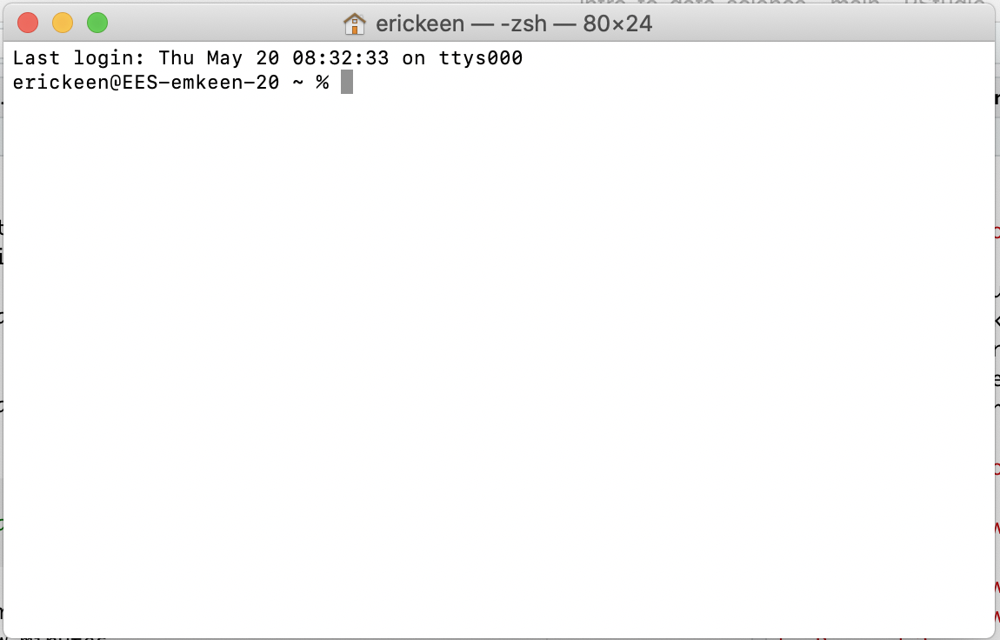

# (PART) Reproducible research {-}

# `Git` + `GitHub`

### Learning goals {-}  

- What Version Control Systems do and why they are awesome  
- How to install `Git`
- How to work on your Terminal (command line / bash / shell / console).  
- How to install `GitHub`  
- How to use pull and push code to and from `GitHub` repositories  

&nbsp;  

## Why? {-}  

Perhaps the below is familiar to you...  

&nbsp;  
<center>
{width=30%}
</center>
&nbsp;  

... or this ...  


&nbsp;  
<center>
{width=50%}
</center>
&nbsp;  


### Because there is a better way  {-}

**Version control systems** (VCS) are software tools meant to help programmers collaborate, maintain source code, document changes, and generally keep track of their files. Instead of reading, sit back and watch [this video](https://youtu.be/9GKpbI1siow).

Having a working knowledge of a version control system will allow you to better organize and track your own files, as well as collaborate on teams. Though there are lots of different systems out there, the most popular version control system is **`git`**. 


### The better way: `Git`  {-}

`Git` is a software for version control: i.,e., tracking changes to sets of files. It is a very commonly used tool in programming, computer science, data science, and software development in general. For anyone working in data science, knowing `git` is a *must*.

But _what is it_, exactly? `Git` is a system for tracking, organizing, sharing, and reviewing changes to software. It's very flexible, and very powerful. And learning it can sometimes feel a bit overwhelming, because it has so many features and capabilities. But the [Pareto principle](https://en.wikipedia.org/wiki/Pareto_principle) (ie, the 80/20 rule) applies here: most of what you need to know to competently handle `git`, you can do in very little time.


### Why is `git` better?  {-}

Why use `git`? Why not just save files with meaningful names, make changes to them, overwrite the old changes, etc.? Why not just treat code the same way we treat a MS Word document, or write code collaboratively using interactive, auto-saving tools like Google Docs?

There are a number reasons:

- **First**, writing code is not like writing a paper. If you make a mistake in the introduction of a term paper, it doesn't "break" your conclusion. But with code, minor changes to one line of code can have a very large impact on how other parts of that code work. Therefore, tracking minor changes is essential to recovering from errors and managing complex, interdependent software components.  

- **Second**, collaborating on code is more complex than collaborating on a term paper. To combine (merge) one person's work with another often requires very careful review. `Git` optimizes for this.   

- **Third**, code is rarely "done". It's usually a work in progress. `Git` takes this into account, and is set up for very structured checkpoints (commits), change suggestions (pull requests), etc.  

- **Finally**, git is the *"lingua franca"* of version control. Employers often request to see a prospective employee's `Github` profile, and expect that programmers and developers of all types (including data scientists) be proficient in `git`.


## `Git` set up  {-}

It's time to `git` started. Rather than diving into too much theory, let's skip right to the practice. We'll do *first*, then we will try to understand *later*. This comic knows what we mean: 

&nbsp;  
<center>
{width=35%}
</center>
&nbsp;  


### Terminal {-}

To use `git`, we first need to get comfortable working with in our computer's Terminal. The Terminal goes by many names, depending on your operating system: shell, bash, `Git` bash, console, command line, command prompt, etc. For simplicity, we are going to use just one name: Terminal.  

The Terminal is a way for you to interact with your computer using lines of commands (i.e., command line) instead of pointing or clicking. Just as in the `R` Console, in your Temrinal you can type code and the computer will do things.  

This will feel a bit unfamiliar at first, but fear not -- there are just a few commands you will need to learn.  

#### Open Terminal {-}

**Window** 
To open Terminal, go to the search box in the Start Menu. Type `cmd` and hit enter.  A Terminal "shell" window will appear.


**Mac**  
To open Terminal, open the Mac Search (`Command` + `Spacebar`) and search "Terminal". Press `Enter`.  A Terminal "shell" window will appear: 

&nbsp;  
<center>
{width=60%}
</center>
&nbsp;  


#### pwd {-}

Let's start with `pwd`. This stands for "path to working directory". Type it, press enter, and see what happens.

If everything went to plan, you'll see a path (ie, a location within your computer's file structure). "Working directory" means the folder you are "in" right now -- just like in `R`.  

When you typed `pwd` you were asking your computer which directory (folder) you're in. It responded. Great! Now let's see what else is in the folder where you are.


#### ls {-}

Type `ls`. This stands for "list" as in "list all the files in this directory. `ls` is commonly used to quickly see contents of a folder.

You now know how to (a) see where you are and (b) see what else is there. 


#### cd {-}

But what about navigation? Let's say you want to "move around" (ie, go to other folders). You do this using the `cd` command, which stands for "change directory". 

**Navigating *into* folders:**  

After typing `cd`, you should type a space and then the name of the directory you want to navigate to. This directory can be either (a) relative or (b) full. "Relative" means relative to where you are. So, for example, if you are currently in the following folder:

```
/home/abc/folder_1
```

And within that folder you have the following sub-folders:

```
folder_a
folder_b
folder_c
```

You could navigate to one of them by typing the full path:

```
cd /home/abc/folder_1/folder_a
```

Or by typing the relative path:

```
cd folder_a
```

Both of the last two commands have the same result: changing your working directory to `/home/abc/folder_1/folder_a`. You can confirm that using `pwd`.  

**Navigating *out of* folders:**  

What about if you want to navigate "up" to the `/home/abc` folder. Again, you can do this using relative or full paths. To navigate there with the full path, simply type:  

```
cd /home/abc
```

To go "up" one level using a relative path, use `..`. So:

```
cd ..
```

So far so good. Now you can (a) see where you are with `pwd`, (b) list folder contents with `ls` and (c) navigate with `cd`. Those 3 command will cover 80% of what you'll need to do to use git from the command line.


### Install `Git`  {-}

Go [here](https://git-scm.com/book/en/v2/Getting-Started-Installing-Git) and follow the instructions for your operating system. We have also offered details for *Windows* and *Mac* below.  

#### Windows {-}

On windows, once you've downloaded, you'll want to select the below parameters:

<center>
{width=60%}
</center>
&nbsp;  


The program will prompt you to pick a text editor. Select notepad.

<center>
{width=60%}
</center>
&nbsp;  


For all other options, leave settings as default and click "next". The program will now install.

After installation, there is an option to "Launch Git Bash" (Terminal). Click it.

<center>
{width=60%}
</center>
&nbsp;  


This will open a Terminal window:

<center>
{width=60%}
</center>
&nbsp;  


#### Mac {-}

To get `Git` on your Mac, you will be typing commands into your computer's Terminal. 

1. Open your Terminal. 

2. Next we need to download and install a software management tool called [Homebrew](brew.sh). Copy and paste the following command into your Terminal, and press `Enter`:

```{r,eval=FALSE,echo=TRUE}
/bin/bash -c "$(curl -fsSL https://raw.githubusercontent.com/Homebrew/install/HEAD/install.sh)"
```

You will likely be asked for your computer password. Press `Enter` when instructed to do so.  Downloading Homebrew might take a few minutes.  

3. Now that Homebrew is installed, copy and paste the following command into your Terminal, and press `Enter`: 

```{r,eval=FALSE,echo=TRUE}
brew install git
```

After a minute or two, `git` should be downloaded, installed and ready to go.


### `Git` configuration  {-}

Once you've installed `git`, you'll likely want to configure some options and preferences. Go [here](https://git-scm.com/book/en/v2/Getting-Started-First-Time-Git-Setup) and walk through the steps.


### `Github` set up  {-}

Now you've got `git`. Great! Git is often used in conjunction with a third party, web-based platform. The most popular is `GitHub`.  

Go to [www.github.com](www.github.com) and create a user account. Make sure you use the same email address you used when configuring `git` above.  


## Create a new repository  {-}

Once you've created an account and logged in to `GitHub`, let's create a repository.  

**What is a repository?** Basically, it's a coding project in the form of a folder.  

1.  Having logged into git, click the "plus" icon in the upper right and then click "New repository" (or go directly [here](https://github.com/new)).

2.  You can fill in the "Repository name" field with whatever you'd like. For the following examples, we'll use the word "testrepo".  

3.  Fill in the "Description" field with the word "My first git repository".  

4.  Set the repo as "Public" (unless you plan on putting any secrets here!), and then click the "Add a README file" checkbox. Finally, click "Create repository".  

Cool! You've now created your first git repository. It's public url is `https://github.com/<YOUR USERNAME>/<repo-name>`. Others can see your code there, and you can too.


## Clone a repository  {-}

Your new repo exists on the internet, but does not yet exist on your local machine. In order to get "testrepo" on your computer, you'll need to do something that you'll only do once: "clone" the repo. "Cloning" in git-speak means creating a copy of the repository locally.

To clone, you'll first open your terminal window and `cd` into a directory where you'd like to clone your repo. For example, if you want to put your `testrepo` directory into `~/Documents`, you'll type the below into terminal:

```
cd ~/Documents
```

You can confirm that you are in `~/Documents` by typing: `pwd`. There? Good.

Now, we'll write the code to "clone" `testrepo`:

```
git clone https://github.com/<USERNAME>/<repo-name>
```

Now, you've got a folder on your machine named `testrepo`. You can confirm this by writing `ls` in the terminal.  

See `testrepo` there? Great!  


## Working in a repository {-}

### Change some code  {-}

In your local `testrepo` folder, you have a "cloned" copy of the repository at https://github.com/<YOUR USERNAME>/testrepo.  

As of now, it's a pretty uninteresting folder. The only thing in it is a file named `README.md`. A "README" file is generally an explanation of a repository's content, purpose, etc. Like all files, a README can be tracked in git.

Let's open the README file and make a change to it. We'll add the below line of "code":

```
This is my first git repository.
```

The save and close the README file. 


### Check the status of your repo {-}  

Now, let's ask `git` if it noticed if we had made any changes. Type the below into terminal:

```
git status
```

If everything has gone well until now, `git` will reply by telling us that we've made a change to the file. We can ask `git` _what_ change we made by typing:

```
git diff README.md
```

`diff` stands for "difference", as in "what is the difference between the code I had and the code I have. `Git` will spit back some color-coded lines showing the change you've made.

Satisfied with your change? Great, now it's time to confirm it by doing the following:

### Track the changes in a file {-}  

```
git add README.md
```

This tells `git` that we want it to notice and track the change we made to `README.md`. Then:

### Commit your changes as a stable version of your project {-}  

```
git commit -m 'my first change'
```

This tells `git` that we are "committing" our change, it marking a checkpoint (to which we can revert later). The `-m` flag is followed by a message in quotations which will help us to navigate this checkpoint in the future.

Almost there. Now that we've added and committed, we need to "push" our change to the remote repository (`GitHub`), by running:

### Push the changes in your local repo to GitHub {-}  

```
git push
```

You did it! Go to https://github.com/<YOUR USERNAME>/testrepo and open the `README.md` file. You'll notice that your most recent changes are there. Now, if someone else wants to get your code, they can "clone" your repository, and they'll have the code you've "pushed" there.

## `Git` workflow: overview {-}

We get it: `git` can be daunting and a bit confusing. This diagram tries to summarize the way `git` works:

<center>
{width=50%}
</center>  
 &nbsp;  
 
 
- There are **three workspaces** to keep in mind: the remote version of your repo, the local version of it, and your work area. Your interact with your remote repo on the `GitHub` website, your local repo through `Terminal`, and your work area through `RStudio`.  

- You **sync your remote and local repos** using the `git pull` and `git push` commands in `Terminal`.  When you `pull`, you are updating your local repo using the remote repo. When you `push`, you do the opposite: update the remote repo using your local repo.  

- You **sync your local repo and your work area** using the `git add` and `git commit` commands. You use these commands when you are ready to move files off of your work bench (`RStudio`) and back onto the shelf (local repo): you've reached a stopping point and want to stop working on your code for now.  

&nbsp;  

### Step-by-step workflow {-} 
 
**Setting up a new repo:**

**1.** Start a new remote repo (`GitHub`).   

**2.** Navigate to the local folder into which you want to clone your repo.  (`Terminal`, using a combination of `pwd`, `ls`, and `cd`.)

**3.** Clone the remote repo to your local machine (`Terminal`).  

```
git clone https://github.com/<your username>/<repo name>)  
```

&nbsp;  

**Working in a repo:**  

**4.** `cd` into your repo (`Terminal`).  

**5.** `pull` on your remote repo to make sure your local repo contains the latest version of your project (`Terminal`).  

```
git pull
```

**6.** Make changes to your code (revisions, new files, etc.) (`RStudio`)   

**7.** Stage those revised/new files for a commit (`Terminal`)
  
```
git add <filename>
```

**8.** Commit your changes (`Terminal`)

```
git commit -m"add specific message here"
```

**9.** Push your changes to the remote repo (`Terminal`)  

```
git push
```

**10.**  Check out your remote repo to verify that changes were pushed. (`GitHub`)  


### Exercises {-} 

**Create another repo:**  

Let's face it: `testrepo` is a pretty lame name for a repository. How about we make a repo that's actually real and useful? We'll make one for storing all the code we're writing in this course.

**1)** Go to https://github.com/<YOUR USERNAME>

**2)** Click the "plus" icon in the upper right and then click "New repository" (or go directly [here](https://github.com/new)).

**3)** Now, for "Repository name", write "datalab".

**4)** Fill in the "Description" field with the words "Code I wrote during my intro to data science course". 

**5)** Set the repo as "Public" (unless you plan on putting any secrets here!), and then click the "Add a README file" checkbox. Finally, click "Create repository".  

**6)** Clone the repo to your computer (Documents folder).  

**7)** Create a new R script in your `datalab` repository called `gapminder.R`.  

**8)** Create a histogram of life expectancy in 1982.  

**9)** Create a line plot for population in Asia, colored by country. Make the lines a bit thicker and more transparent.  

**10)** Add new x and y axis labels, as well as a chart title.  

**11)** Create a bar chart of all European countries gdp per capita in 2002.  

**12)** Make the bars transparent and filled with the color blue.  

**13)** Create a new data set called `the_nineties` that only contains years from the 1990s.   

**14)** Save this dataset to your repository (use `write.csv()`).   

**15)** Add, commit, and push your files to `GitHub`.  

&nbsp;  

**Add a `.gitignore` file**  

If you `cd` into your local `datalab` repo, and then type `git status`, you might note that it's a bit "busy". That is, there are a lot of documents there! You're going to want to (i) add, (ii) commit, and (iii) push these documents, but perhaps there are some kinds of documents you _don't_ want to push.

For example, maybe you want to push R code files (`.R`), but not data files (`.csv`). In this case, you can explicitly tell `git` that you don't want it to pay any attention to `.csv` files by creating a `.gitignore` file. A `.gitignore` file is simply a text file in a git repository that indicates to git that the contents of that file should be ignored.

Let's do it. 

**16)** First, create an empty `.gitignore` file. In `Terminal`, type:   

```
touch .gitignore
```

**17)** Then, open the `.gitignore` file in RStudio.  

**18)** Finally, add the following line to it:

```
*.csv
```

The star is a "wildcard", meaning that it stands in place of anything (such as `ducks.csv` or `data.csv` or `xyz.csv`). 

With this in your repo, `git` now knows to ignore anything that ends with the extension `.csv`.

Good? Great.  

**19)**  Push everything to your repo.  

Now you can share your code with others, and your future self.   


#### Further resources {-}  

[Hadley Wickham's introduction to `git` + `GitHub`](https://r-pkgs.org/git.html)  

[Using `git` from `RStudio`](https://nceas.github.io/oss-lessons/version-control/4-getting-started-with-git-in-RStudio.html)

