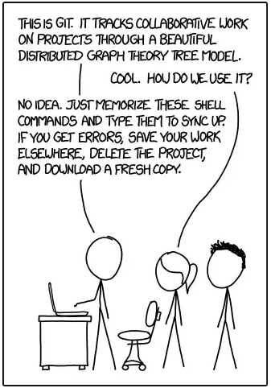
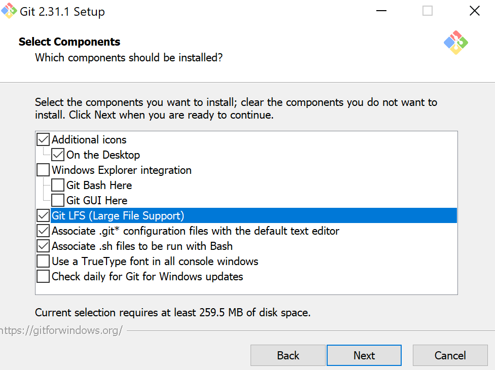
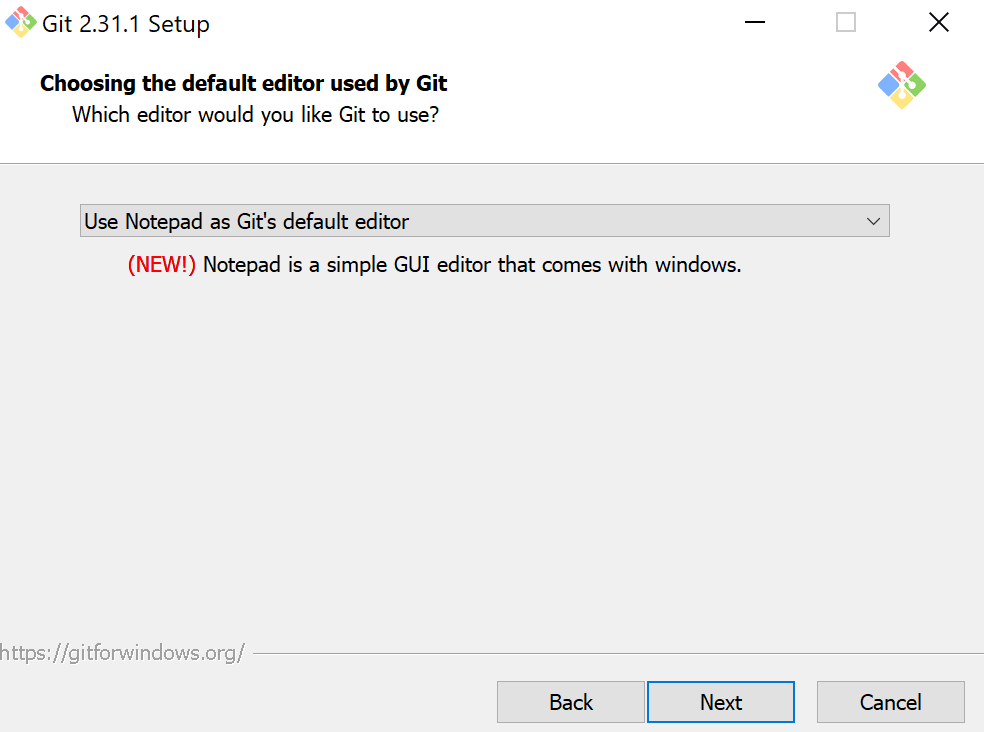
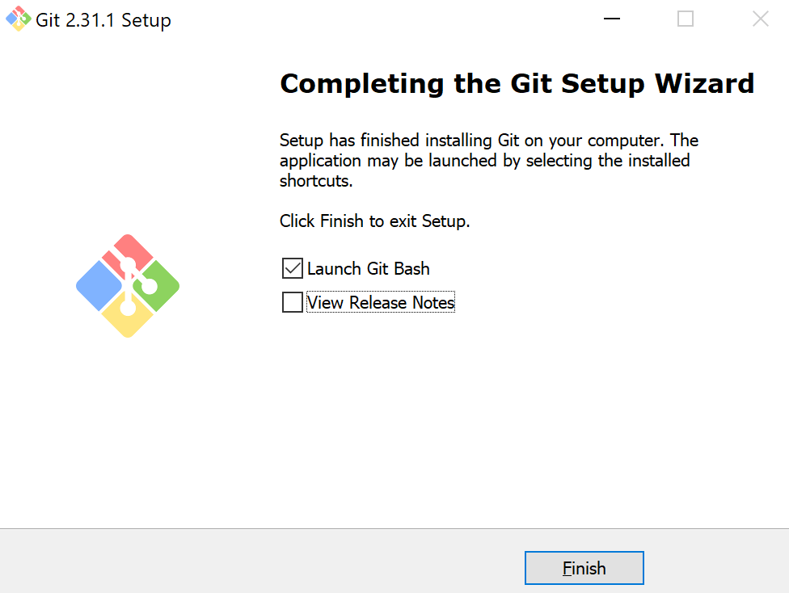
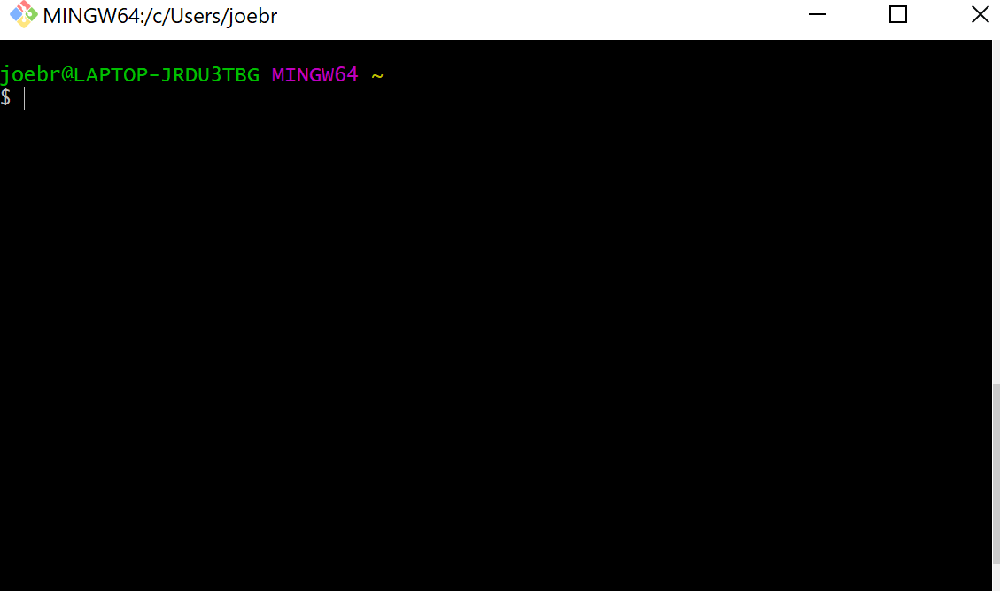

# Git 

Perhaps the below is familiar to you...


Or this...


## There is a better way  {-}

Version control systems (VCS) are software tools meant to help programmers collaborate, maintain source code, document changes, and generally keep track of their files. Instead of reading, sit back and watch [this video](https://youtu.be/9GKpbI1siow).


Having a working knowledge of a version control system will allow you to better organize and track your own files, as well as collaborate on teams. Though there are lots of different systems out there, the most popular version control system is "git". Let's dive in (next chapter).


## What is git?  {-}

Git is a software for "version control": ie, tracking changes to sets of files. It is a very commonly used tool in programming, computer science, data science, and software development in general. For anyone working in data science, knowing git is a must.

But _what is it_, exactly? Git is a system for tracking, organizing, sharing, and reviewing changes to software. It's very flexible, and very powerful. And learning it can sometimes feel a bit overwhelming, because it has so many features and capabilities. But the [Pareto principle](https://en.wikipedia.org/wiki/Pareto_principle) (ie, the 80/20 rule) applies here: most of what you need to know to competently handle git, you can do in very little time.

## Why?  {-}

Why use git? Why not just save files with meaningful names, make changes to them, overwrite the old changes, etc.? Why not just treat code the same way we treat a MS Word document, or write code collaboratively using interactive, auto-saving tools like Google Docs?

There are a number reasons:

- First, writing code is not like writing a paper. If you make a mistake in the introduction of a term paper, it doesn't "break" your conclusion. But with code, minor changes to one line of code can have a very large impact on how other parts of that code work. Therefore, tracking minor changes is essential to recovering from errors and managing complex, interdependent software components.  
- Second, collaborating on code is more complex than collaborating on a term paper. To combine (merge) one person's work with another often requires very careful review. Git optimizes for this.  
- Third, code is rarely "done". It's usually a work in progress. Git takes this into account, and is set up for very structured checkpoints (commits), change suggestions (pull requests), etc.
- Finally, git is the "lingua franca" of version control. Employers often request to see a prospective employee's github profile, and expect that programmers and developers of all types (including data scientists) be proficient in git.


## Get ready for git  {-}

It's time to "git" started. Rather than diving into too much theory, let's skip right to the practice. Like this:




## Installation  {-}

We'll start by installing git. Go [here](https://git-scm.com/book/en/v2/Getting-Started-Installing-Git) and follow the instructions for your operating system.

### Windows {-}

On windows, once you've downloaded, you'll want to select the below parameters:



The program will prompt you to pick a text editor. Select notepad.



For all other options, leave settings as default and click "next". The program will now install.

After installation, there is an option to "Launch Git Bash". Click it.



This will open a "terminal" window:



### Mac {-}

(Details on installing git on mac and opening terminal)


## Getting to know git bash {-}

The strange little black box you're looking at is called "Git Bash". Bash is a command line language/interface. In other words, it's a way to interact with your computer without pointing and clicking. You type code, and the computer does things. It'll feel a bit unfamiliar at first, but don't worry - there are just a few commands you need to know to work with git. We'll use the terms "bash", "command line", and "terminal" interchangeably (though in reality these are a bit [different](https://superuser.com/questions/880344/what-is-the-difference-between-terminal-and-bash)).

#### pwd {-}

Let's start with `pwd`. This stands for "path to working directory". Type it, press enter, and see what happens.

If everything went to plan, you'll see a path (ie, a location within your computer's file structure). "Working directory" means the folder you are "in" right now. Just like with a point-and-click program for exploring folders, you can navigate between folders using bash / terminal. 

When you typed `pwd` you were asking your computer which directory (folder) you're in. It responded. Great! Now let's see what else is in the folder where you are.

#### ls {-}

Type `ls`. This stands for "list" as in "list all the files in this directory. `ls` is commonly used to quickly see contents of a folder.

#### cd {-}

You now know how to (a) see where you are and (b) see what else is there. But what about navigation? Let's say you want to "move around" (ie, go to other folders). You do this using the `cd` command, which stands for "change directory". 

After typing `cd`, you should type a space and then the name of the directory you want to navigate to. This directory can be either (a) relative or (b) full. "Relative" means relative to where you are. So, for example, if you are currently in the following folder:

```
/home/abc/folder1
```

And within that folder you have the following sub-folders:

```
foldera
folderb
folderc
```

You could navigate to one of them by typing the full path:

```
cd /home/abc/folder1/foldera
```

Or by typing the relative path:

```
cd foldera
```

Both of the last two commands have the same result: changing your working directory to `/home/abc/folder1/foldera`.

What about if you want to navigate "up" to the `/home/abc` folder. Again, you can do this using relative or full paths. To navigate there with the full path, simply type:

```
cd /home/abc
```

To go "up" one level using a relative path, use `..`. So:

```
cd ..
```

So far so good. Now you can (a) see where you are with `pwd`, (b) list folder contents with `ls` and (c) navigate with `cd`. Those 3 command will cover 80% of what you'll need to do to use git from the command line.


## Configuration  {-}

Once you've installed git, you'll likely want to configure some options and preferences. Go [here](https://git-scm.com/book/en/v2/Getting-Started-First-Time-Git-Setup) and walk through the steps.


## Github  {-}

Now you've got git. Great! Git is often used in conjunction with a third party, web-based platform. The most popular is github. Go to www.github.com and create a user account.

### Creating a repository  {-}

Once you've created an account and logged in, let's create a repository. What is a repository? Basically, it's a project in the form of a folder. Having logged into git, click the "plus" icon in the upper right and then click "New repository" (or go directly [here](https://github.com/new)).

You can fill in the "Repository name" field with whatever you'd like. For the following examples, we'll use the word "testrepo". 

Fill in the "Description" field with the word "My first git repository". 

Set the repo as "Public" (unless you plan on putting any secrets here!), and then click the "Add a README file" checkbox. Finally, click "Create repository".


Cool! You've now created your first git repository. It's public url is https://github.com/<YOUR USERNAME>/testrepo. Others can see your code there, and you can too.

### Cloning a repository  {-}

"testrepo" exists on the internet, but does not yet exist on your local machine. In order to get "testrepo" on your computer, you'll need to do something that you'll only do once: "clone" the repo. "Cloning" in git-speak means creating a copy of the repository locally.

To clone, you'll first open your terminal window and `cd` into a directory where you'd like to clone your repo. For example, if you want to put your `testrepo` directory into `~/Documents`, you'll type the below into terminal:

```
cd ~/Documents
```

You can confirm that you are in `~/Documents` by typing: `pwd`. There? Good.

Now, we'll write the code to "clone" `testrepo`:

```
git clone https://github.com/<USERNAME>/testrepo
```

Now, you've got a folder on your machine named `testrepo`. You can confirm this by writing `ls` in the terminal. 
See `testrepo` there? Great!


### Writing some code  {-}

In your local `testrepo` folder, you have a "cloned" copy of the repository at https://github.com/<YOUR USERNAME>/testrepo. As of now, it's a pretty uninteresting folder. The only thing in it is a file named `README.md`. A "README" file is generally an explanation of a repository's content, purpose, etc. Like all files, a README can be tracked in git.

Let's open the README file and make a change to it. We'll add the below line of "code":

```
This is my first git repository.
```

The save and close the README file. 

Now, let's ask "git" if it noticed if we had made any changes. Type the below into terminal:

```
git status
```

If everything has gone well until now, git will reply by telling us that we've made a change to the file. We can ask git _what_ change we made by typing:

```
git diff README.md
```

`diff` stands for "difference", as in "what is the difference between the code I had and the code I have. Git will spit back some color-coded lines showing the change you've made.

Satisfied with your change? Great, now it's time to confirm it by doing the following:

```
git add README.md
```

This tells git that we want it to notice and track the change we made to `README.md`. Then:

```
git commit -m 'my first change'
```

This tells git that we are "committing" our change, it marking a checkpoint (to which we can revert later). The `-m` flag is followed by a message in quotations which will help us to navigate this checkpoint in the future.

Almost there. Now that we've added and committed, we need to "push" our change to the remote repository (github), by running:

```
git push
```

You did it! Go to https://github.com/<YOUR USERNAME>/testrepo and open the `README.md` file. You'll notice that your most recent changes are there. Now, if someone else wants to get your code, they can "clone" your repository, and they'll have the code you've "pushed" there.

## A bit more practice  {-}

### Creating another repo  {-}

Let's face it: `testrepo` is a pretty lame name for a repository. How about we make a repo that's actually real and useful? We'll make one for storing all the code we're writing in this course.

Go to https://github.com/<YOUR USERNAME>


Click the "plus" icon in the upper right and then click "New repository" (or go directly [here](https://github.com/new)).

Now, for "Repository name", write "datascience".

Fill in the "Description" field with the words "Code I wrote during my intro to data science course". 

Set the repo as "Public" (unless you plan on putting any secrets here!), and then click the "Add a README file" checkbox. Finally, click "Create repository".


Cool! You've now created your first git repository. It's public url is https://github.com/<YOUR USERNAME>/datascience. Let's clone it:


```
git clone https://github.com/<USERNAME>/datascience
```

Now, you've got a folder on your machine named `datascience`. You can confirm this by writing `ls` in the terminal. 
See `datascience` there? Great!

Now, let's move _everything_ you have written for this course so far into `datascience`. Do this in an organized fashion. Remember to not put anything secret there.

### The `.gitignore`  {-}

If you `cd` into `datascience`, and then type `git status`, you might note that it's a bit "busy". That is, there are a lot of documents there! You're going to want to (i) add, (ii) commit, and (iii) push these documents, but perhaps there are some kinds of documents you _don't_ want to push.

For example, maybe you want to push R code files (`.R`), but not data files (`.csv`). In this case, you can explicitly tell git that you don't want it to pay any attention to `.csv` files by creating a `.gitignore` file. A `.gitignore` file is simply a text file in a git repository that indicates to git that the contents of that file should be ignored.

Let's do it. First, create an empty `.gitignore` file:

```
touch .gitignore
```

Then, open the `.gitignore` file in RStudio.

Finally, add the following line to it:

```
*.csv
```

The star is a "wildcard", meaning that it stands in place of anything (such as `ducks.csv` or `data.csv` or `xyz.csv`). 

With this in your repo, git now knows to ignore anything that ends with the extension `.csv`.

Good? Great. Push everything to your repo. Now you can share your code with others, and your future self.


## Advanced git  {-}

Branching, pull requests, blaming, and more - in a break-out session.
