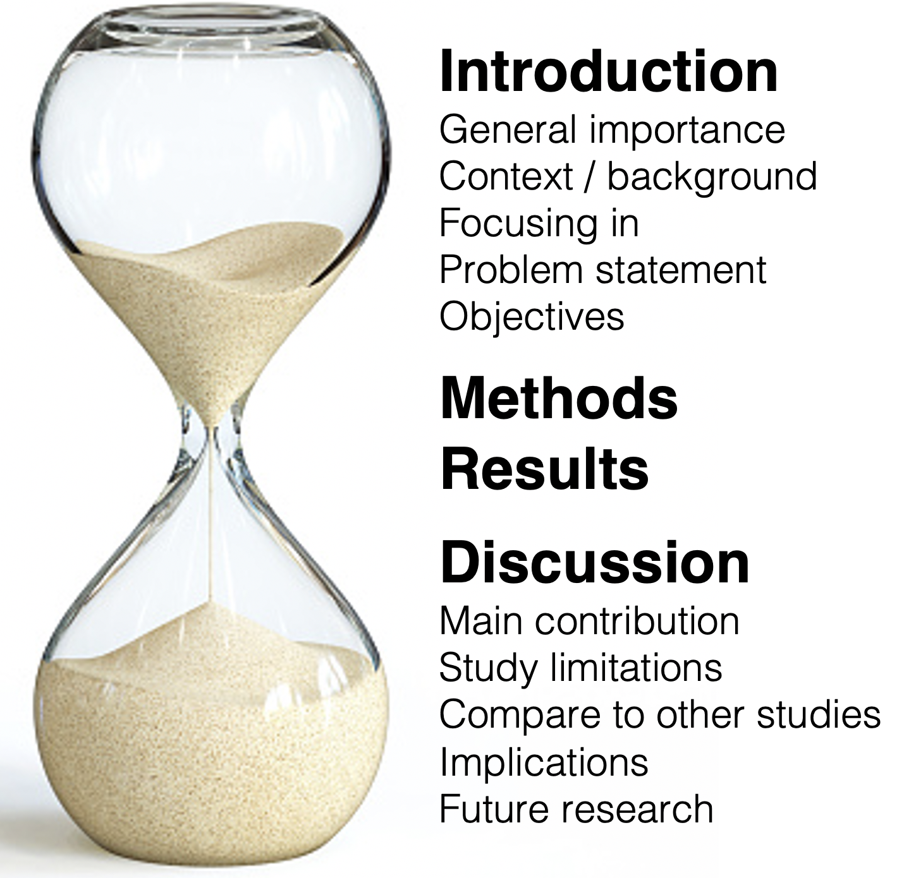
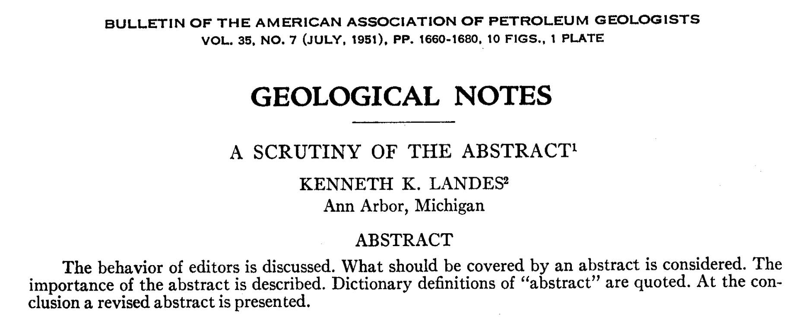
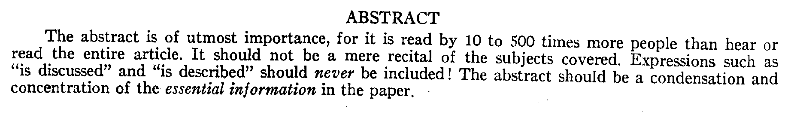
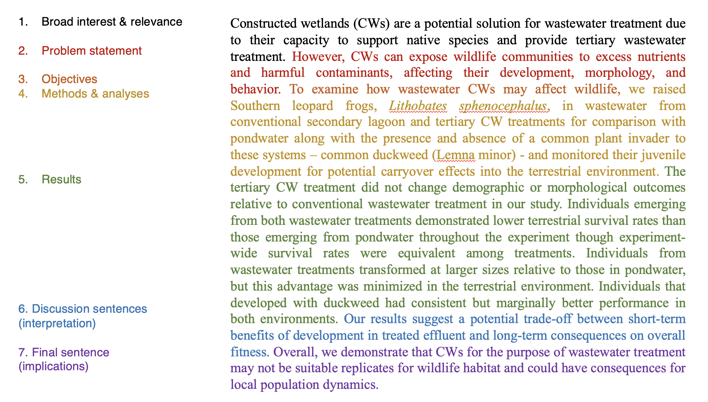

# Sections of a report

## Learning goals {-}

* Understand the over-arching structure and narrative flow of a research paper  
* How to write each section of a paper  

## Overall structure  {-}

Data reports, research papers, and scientific publications follow the same basic narrative flow:

* **Abstract**: Concise summary. This section can also be referred to as an *Overview* or *Executive Summary*. 
* **Introduction**: A background section that provides context and justifies the ways that the report is important and adds value.  
* **Methods**: Detailed description of what was done and how data were analyzed.  
* **Results**: A concise report of what was found, drawing upon narrative prose, data tables, and figures.
* **Discussion**: Considerations and interpretations of the results' significance, limitations, and consequences for the field of study.
* **Other stuff**: Acknowledgments, literature cited (i.e., references), tables, and figures.

These sections map onto a high-level conceptual flow: a **research paper is like an hourglass.** 

{width=50%}

Your *Intro* narrows from a point of common and general interest to an articulation of a *specific* knowledge gap and a *focused* purpose. Your focus remains narrow as you cover your study's *Methods* and *Results*. Only in the *Discussion* does your paper begin expanding out again to place your findings in the context of other studies and consider your findings' implications on broader issues. Your paper ends as broadly as it began: a point of common interest and importance, this time focused on future concerns and priorities.  

In this module, we will cover how to adhere to this narrative arc while meeting the standards and expectations of each individual section.  

## Abstract {-}

An *Abstract* is a concise and sharp distillation of your paper.   

#### Standards {-}

A strong *Abstract* section will answer *"Hell yes!"* to all of the following questions:

**1. Is your abstract actually a helpful overview?** That is, is your abstract a *specific summary of your paper's content*, rather than a vague overview of its organization? As a good example of what *NOT* to do, in 1951 a geologist published an opinion article, *"A Scrutiny of the Abstract"*, about how abstracts should and should not be written. He decided to make his article's abstract sarcastic:

Avoid this style! There is a way to summarize that avoids any helpful information, and there is a way to summarize the provides an *executive summary* of your work. Aim for the latter.  

At the end of the above paper, the author provided a *good* version of his abstract:  

**2. Does your abstract adhere to the Abstract Recipe** detailed below?  
**3. Does your abstract fit within the word limits** provided by the assignment or instructions? Most *Abstract* word limits range between 250 and 300 words. 

#### Strategies {-} 

There are hundreds of approaches to writing an *Abstract*. (For proof, just type "how to write an abstract" into *GoogleScholar*!) In your first few tries at writing your own abstract, we recommend the following approach.   

Every single sentence serves a specific purpose, outlined in the following **Abstract Recipe:**

- **Sentence 1:** establishes broad interest and the relevance of your topic.  
- **Sentence 2:** articulates your problem statement.  
- **Sentence 3:** articulates your research question and study objectives.  
- **Sentence 4:** summarizes your data collection methods.  
- **Sentence 5:** summarizes your statistical approach.  
- **Results sentences:** The next few sentences (2 - 4) summarize your most important results. This is the most important part of your *Abstract*, since it tells the reader what your study is contributing to the world, and as such it should be the longest portion of the paragraph.
- **Discussion sentences:** Use one to two sentences to explain the importance and implications of your findings.  
- **Final sentence:** summarizes recommendations for future research (“Future research on this topic should focus on…”) and/or emphasizes the implications and importance of the findings.

Like a professional chef, professional academics may adjust this recipe as they see fit, but nearly all good abstracts conform to this general formula.

#### Good example {-}

Below is the abstract from a publication whose first author is an undergraduate student ([Zeitler et al. 2021, *Journal of Environmental Management*](https://www.sciencedirect.com/science/article/pii/S0301479721006332?casa_token=BhsD4GiVQhIAAAAA:78wrLH-vN5gUPvNdX16fyaoHJq8QVQpQ-mqVA6UqxpxLMOFKweuX0YwJtBMLMnmVnfU4e1k){target="blank"}). This a strong abstract that maps almost perfectly to the recipe above. 

## Introduction {-}

An *Introduction* is an information-rich and persuasive *argument* for the importance of the contribution your paper will be making to the field of study.

#### Standards {-}

An *Introduction* has to do many things at once. Here are the necessary elements of a quality *Intro*:  

1. **Engage & Justify.** The entire Introduction is a carefully crafted, convincing argument for the importance of your topic and the urgent need for your research.  

2. **Establish context & convince readers to care.** Early into the Intro, place your topic in a broad context. Make it clear who should be interested in your topic.  

3. **Invite readers in.** A good Intro is an accessible one; it should not send the message that only experts will get something out of the paper.   

4. **Get everyone on the same page.** Mention and explain any concepts that will be crucial to understanding your methodology, interpreting your results, or intuiting the impact of your work.

5. **Demonstrate authoritative knowledge.** Demonstrate exhaustive knowledge of the topic, and sharp awareness of the ‘state of the science’.

6. **Demonstrate basis in previous research.** Aim for a 1:1 ratio of citations to sentences. Each sentence should end with a citation. Your Introduction is an *assemblage of previous findings* strategically arranged to identify a knowledge gap and set the stage for your own study. *(See Literature Review details below.)*

7. **Provide more than a history lesson or a list of facts.** Your Introduction is a tightly organized and persuasive argument, not a brain dump or an aimless encyclopedia entry. Your deep knowledge of the field ought to be sprinkled throughout, *interspersed within your narrowing arc*.

8. **Narrow in on a problem statement.** The entire Intro should narrow to a *problem statement* (a knowledge gap, an urgent need). Along the way, you are garnering reader buy-in (yes, this is important) which causes them to care about the gap you have identified.  

9. **Follow with a motivation/objectives statement.** Your study is a response to the problem statement. “To address this knowledge gap, I developed a study based upon the following objectives…”  

*Examples of problem statements & hypotheses / aims:*  
In the examples below, the problem statement is in boldface & the objectives/aims statement is italicized.

- "**Although there have been several modern investigations of cladogenesis and tree shape [2], [3], the manufactory hypothesis has not, to our knowledge, been tested since Darwin...** *This paper follows Darwin by examining autocorrelation among ancestral and descendent branches of the tree at the level of subspecies through genera and we also extend the comparison to the level of families.*" (from [Haskell & Adhikari 2009](https://journals.plos.org/plosone/article?id=10.1371/journal.pone.0005460){target="blank})  

- "**Few efforts explicitly quantify the consequences of including demand into conservation efforts to safeguard [Ecosystem Services] and biodiversity** (Wolff et al. 2015; Verhagen et al. 2016). *We aimed to quantify differences between supply and benefit within the context of conservation planning. We addressed 3 questions: How does incorporating demand shift the spatial distribution of benefits relative to supply? How much benefit is captured by conservation efforts that target supply? How do efforts targeting supply and benefit compare in terms of their biodiversity outcomes?*" (from [Watson et al. 2019](https://conbio.onlinelibrary.wiley.com/doi/full/10.1111/cobi.13276){target="blank"}) 

There are plenty of good and bad examples of *Introductions* in scientific publications. Here are a few recommendations of excellent introductions that follow the rules above. Note how each example demonstrates how to achieve the necessary conceptual arc while maintaining a large ratio of citations to sentences (nearly every sentence has at least one citation).

- See [Watson et al. 2019](https://conbio.onlinelibrary.wiley.com/doi/full/10.1111/cobi.13276){target="blank"} for a sharp and concise *Intro*.

- See [Pitman et al. 2019](https://onlinelibrary.wiley.com/doi/full/10.1111/mms.12661){target="blank"} for an extensive introduction with excellent writing.

#### Strategies {-} 

With so much to cover in an Introduction, it can be difficult to know where to begin. There are two main steps to preparing an *Introduction*: (1) revieweing literature, and (2) writing. Begin with the literature.  

##### 1. Conducting a literature review {-}

Carrying out a literature review can be daunting, especially if you are new to a field of study.  

But regardless of your level of experience, you can follow a **common basic workflow.**  The overall goal is to **dive into the literature,** follow rabbit holes, and take notes until you begin to feel familiar with the canon of knowledge on your topic. That feeling of familiarity will come once you stop finding new studies in the literature cited sections of the papers you are reading, and once you start to recognize the names of the most prolific and influential scientists in your topic of interest.  

**a. Find your first paper to review.** Begin your search on *GoogleScholar* [scholar.google.com](scholar.google.com). You may need to search other search engines eventually (e.g., JStor, PubMed, etc.), but this is a good place to start.  

The most productive starting point is looking for recent *review* articles on your topic. Reviews try to be definitive and exhaustive in their list of references. They also point to the studies that were foundationally important in the early days of your topic, as well as to the "cutting edge": the most recent and exciting developments in the literature.  

**b. Open up a scratchpad for taking notes** in *Word* or *GoogleDocs*. Type (or screenshot) the citation for your first article to the top of your scratchpad (e.g., Keen EM and Brew JR. 2021. Ping pong: the Sport of Kings? *Table Tennis Weekly* 56(1): 343-356.)

**c. Begin reading & taking notes.** Don't sit down to read it word for word. Read it *selectively* for the topics and details that are most relevant to your work. If your first paper is a research article (i.e., with sections on Methods and Results) instead of a review, focus on its Introduction and Discussion.  Your notes should be brief. If you are copying language from the paper word for word, place it in quotes so that you can remember what needs to be paraphrased at a later time. In each note that involves a reference to a separate article, include that reference in your note (e.g., 
Puckette et al. 2021) so you can track it later.  

**d. Copy down all references** that are included in your notes using the literature cited section. This can be tedious but it will pay off in the long run.  

**e. Clean up your notes for this first paper.** Make sure *every single* note has a parenthetical citation attached to it, so you don't lose track of where it came from. If the note is a direct contribution from the paper you have reviewed, add the reference for that paper to your note (e.g., Keen & Brew 2021).   

**f. Select one of these references as your *second* paper to review.**  

**g. Repeat.** Until you begin to feel familiar with the current literature and stop being suprised by new studies. 

*Once you reach a familiarity plateau (shoot for 80% expertise), pause your literature review!* Anything less than 20-30 reviewed papers is highly unlikely to provide a sufficient grasp of the state of your field of study.   

##### 2. Organizing and writing your Introduction {-}

You now know enough about the literature now to have a basic sense of what is currently known and not know about your topic. 

**a. Write your problem statement,** the *gap in knowledge* the justifies and motivates your study. 

**b. Articulate your hypotheses and/or objectives** Frame these as a way of *addressing* or *ameliorating* the problem statement.

**c. Determine your starting point.** Choose your audience, your hook, and the initial direction of your conceptual flow. This is arguably the most difficult part of the writing process. 

**d. Outline the narrative path from your starting point to your problem statement,** with the key step in your argumentative arc must be, and therefore what the purpose of each paragraph must be. 

**e. For each paragraph, articulate the main point or key idea.** This sentence can typically serve as the first sentence of the paragraph (or in some cases the last).

**f. Sort your notes into each paragraph.** Some notes may be useful in multiple paragraphs, in which case you can copy them rather than just moving them. This is why it is *critical* that you add a parenthetical citation for the source of each reference. Otherwise you will lose track of which content comes from which source!

**g. Sort your notes *within* each paragraph.** Each paragraph has its own narrative flow, taking the reader from concept A to concept B using a *sequence* or *chain* of evidence-based claims. How do your notes need to be organized in order to build that chain?

**h. Determine the *holes* in your literature review.** As you organize your notes into an argumentative sequence, you will find "holes" in your argument that require substantiation with an as-yet undiscovered reference. This will guide your *second stage* of literature review (see next steps).

**i. Now begins an iterative process** of writing, seeking new references, and reorganizing your writing. Iterate until satisfied. Once you are satisfied, ask a colleague to review your writing, not only for grammatical errors and typos, but also with an eye toward the overall arc. Where is your argument weakest? How can it be reorganized? Incorporate their feedback and repeat.  

## Methods {-}

Your *Methods* section provides all the detail necessary to (1) understand how you collected data, (2) understand how you analyzed the data, (3) how to interpret the results, and (4) reproduce your study (at least in principle).

#### Standards {-}

A strong *Methods* section will answer *"Hell yes!"* to all of the following questions:

**1. Do your methods make sense** based upon the research question and the objectives stated in your Introduction? For example, if your goal is to understand the risks of a new drug, it would not make sense if you were measuring seismic activity near a volcano. That's a dumb example, but you get the idea: what you *do* should actually answer your *research question*.

**2. Is your research and analysis fully reproducible**, based upon the level of detail and quality of explanation in your Methods section?

**3. Is your analytical approach appropriate** given your objectives and the limitations of your data? For example, if you are interested in the correlation between two variables, it would not make sense to use a *t-test*.

**4. Is your analytical approach properly thorough?** Are you doing everything you can with the data you have, within the confines of a your project's scope and objectives? Data are valuable and difficult to come by. Are you learning everything you can regarding your research question from the data you have collected?  (*Note that it is possible to go too far here, i.e., to include analyses that have nothing to do with your research question. The key is to be thorough but focused.*)

**5. Is your Methods section written clearly, concisely, and with precision?** See the [Module on Style](#style) for guidance. 

Use the papers you found during your literature review for examples of what is included in *Methods* sections within publications related to your topic, and the style in which that material is written.  

#### Strategies {-} 

- Your *Methods* section will likely be the thing you write second, immediately after you develop your research question, objectives, and hypotheses. Writing your Methods in full and with detail will help you uncover mistakes with your sampling design and/or analyses before it is too late. 

- Most *Methods* sections have a few distinct subsections: Study area, Data collection, Data analysis.  

- Most *Methods* sections are written in the past tense.  

- Do not hesitate to use tables or diagrams to present details of data collection.  

## Results {-}

The *Results* section is a concise narrative of your findings, *without* interpretation or commentary on the importance and consequences of your findings.  

#### Standards {-}

A strong *Results* section will answer *"Hell yes!"* to all of the following questions:

**1. Are your results complete** based on the analyses you described in your Methods section?  
**2. Is your Results section organized as a coherent narrative** that is directly related to your research question, and not just a list of seemingly random findings?  
**3. Are your findings and conclusion *appropriate*,** given the limitations of the data and the methods you employed?  
**4. Are tables and figures included where appropriate?**  
**5. Are tables and figures referenced correctly** within the text of your results? See the next [Module on Style](#style) for guidance.
**6. Does your Results section contain results *only*,** and not any methodological details that should have been in the *Methods*, nor interpretation commentary that would be more appropriate in the *Discussion*?  

**7. Is your Results section written clearly and with precision?** This is especially important with respect to the inclusion of statistical results. Again, for guidance see the next [Module on Style](#style). 

Again, use the papers you found during your literature review for examples of what is included in *Results* sections within publications related to your topic, and the style in which that material is written.  

#### Strategies {-} 

- It is usually best to produce your tables and figures *first*, then write your *Results* narrative around those assets. 

- You want your tables, figures, and narrative to be *strategically redundant*. Your tables and figures represent the detailed version of your *Results*; they are the raw numbers that answer your research question. Your *narrative* should refer constantly to the raw results presented in your tables and figures, but they should not repeat them.  Your narrative *summarizes* the tables and figures and frames your findings with respect to how they address your research question. Minimize the numbers you include in your results, but be sure to include the most important ones.

- Aim for a parallel structure in your *Methods* and *Results*. Present your results in the same order in which you explain your methodological process. This makes it easy for readers to go back and forth between the two sections as they make sense of what you found. 

- Most *Results* sections begin with a brief paragraph summarizing the data that were collected: dates of collection, sample size, and any other context that a reader might need to understand the analytical results that will come in the proceeding paragraphs. 

- Usually, the most difficult thing about writing a *Results* section, other than writing an intelligible story instead of a list of facts, is to *keep your Discussion out of your Results*.  The results section is a straightforward report of what you found, without commentary on the importance or implications of those findings.

- That said, you will still have to make some editorial decisions in your *Results* section. Which findings will you emphasize with narrative prose, and which will you simply refer to using a table or figure? Which findings are misleading if the reader fails to keep certain aspects of your methodology in mind, and how can you frame those findings to avoid misinterpretation?

## Discussion {-}

The *Discussion* is where you interpret your results, discuss the limitations of your study, place your findings within the context of the literature,  highlight the contributions and implications of your findings, and identify future directions of research.  

#### Standards {-}

The *Discussion* is probably the most variable and unstructured section of a report, and can therefore be the most difficult to write. For your first few attempts at writing a Discussion, we recommend adhering to the recipe we outline below. A strong *Discussion* section will have the following components or subsections:  

**The opening paragraph** is a brief summary of your most important results that highlights the findings that make your study important. Think of this paragraph as a ‘hook’ that convinces readers they should read the rest of your Discussion.

**Subsection on Study Limitations.** This subsection allows you to (1) place boundaries on how you are able to interpret your results given the limitations or unexpected issues that arose from your methods, and (2) identity areas in which your study could be improved if it were reproduced in the future.

**Subsection on Interpretation of Results.** Use this subsection as an area to highlight and explore your findings, what they mean, and what the important takeaways are.

**Subsection on Comparison to Previous Studies.** Use this subsection to place your findings within the context of other research. Are your results in line with previous findings? Are they surprising? If so, why might that be? If it is difficult to compare your study to others, explain why. This is a chance for you to control the conversation in the event that others try to compare your study to other literature. 

**Subsection on Study Implications.**  Use this subsection to articulate how your findings relate to your study objectives, address your research question, and are important in a broad sense. Why do your results matter? What implications do they have for the issues, places, and people you are focused on in this project? How might your findings influence future policies, technological innovations, or other changes?

**Subsection on Suggestions for Future Research** with a concluding statement that reinforces the importance and contribution of your project.  

Usually, strong *Discussions* refer regularly to the concepts introduced in the *Introduction*. This makes sense, since your *Discussion* is exploring the ways in which your new findings have contributed to the body of knowledge and gaps in knowledge articulated in your *Intro*. If your *Discussion* is not addressing the same issues raised in your *Intro*, you many need to restructure and reframe one or both of those sections.  

Most of the papers you collect for your literature review will have their own variation on this recipe. Some sections will be more relevant and extensive than others, depending on your topic and findings. Use your literature collection to get a sense of writing style for *Discussions*.  

## Other elements of a report {-}

#### Acknowledgments {-}

A brief statement of whom you thank for their contributions and support of your project. Be sure to include any sources of funding, equipment, analytical assistance, or other resources.  

#### Literature Cited {-}  

- Be sure that every reference mentioned in the body of your report has a full citation in this section.  

- Conversely, make sure that every full citation in this section has a corresponding reference within your report. Remove all un-referenced citations!  

- See the [Module on Style](#style) for details on how to format your references and citations.  

#### Tables {-}  

- Present and enumerate tables in the order they are referenced in your report. 

- Ensure that each table has its own caption placed *above the table*.   

- See the [Module on Style](#style) for details on how to create and format tables.  

#### Figures {-}  

- Present and enumerate figures in the order they are referenced in your report. 

- Ensure that each figure has its own caption placed *below the figure*.  

- See the [Module on Style](#style) for details on how to create and format tables. 

## Other resources {-}

[**"How to Write a First-class Paper"**, by the editors at *Nature*](https://www.nature.com/articles/d41586-018-02404-4){target="blank"}
