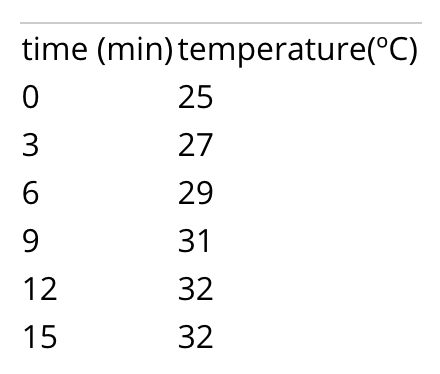
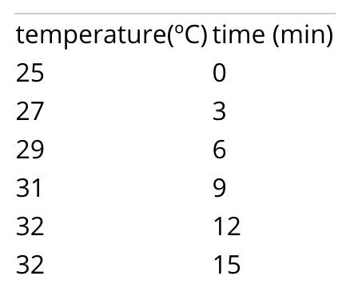

# Good research writing {#style}

#### Learning goals {-}

* Understand the principles of good research writing 
* Gain practical skills in formatting the elements of a research report

&nbsp;

There are thousands of resources available in print and online to support students who are trying to improve their scientific writing. The recommendations offered below are by no means exhaustive, and by no means are they the only way. Our aim here is to *get students started* on the right track. Our underlying premise is that good writing in research is the *same as good writing anywhere else.* The same basic standards apply.

The best single resource we know of is a 1990 article in the *American Scientist*, ["The Science of Science Writing"](https://www.americanscientist.org/blog/the-long-view/the-science-of-scientific-writing){target="blank}, by George Opan and Judith Swan. Most of the concepts and examples below are distillations from that article. 

## Core principles {-}

Opan and Swan (1990) offer many fundamental principles for strong scientific writing, but they all stem from the same core idea: **Write with the reader in mind.** It is not enough to have all the correct information on the page; that information must organized and presented in ways that helps the reader understand.  

To illustrate this point in a brief example, they show three different ways to present the same information:

**Option 1:**  

"Our results were t(time)=15', T(temperature)=32º, t=0', T=25º; t=6', T=29º; t=3', T=27º; t=12', T=32º; t=9'; T=31º"  

**Option 2:**  

{width=25%}  

**Option 3:**  

{width=25%}  

Which of these is easiest to interpret? Why?  

In short, **place information where readers expect to find it.** This applies broad organization, such as keep all methodological details within the *Methods* sections, or deciding which information to place in tables and which to write out in the narrative of your *Results* section, but it also applies to writing at the sentence-level. In every sentence readers take in, they have subconscious expectations about how coherent ideas will be structured. Shape your sentences to meet those expectations. 

&nbsp;

Opan and Swan (1990) provide a good example of really bad writing: 

> *"The smallest of the URF's (URFA6L), a 207-nucleotide (nt) reading frame overlapping out of phase the NH2-terminal portion of the adenosinetriphosphatase (ATPase) subunit 6 gene has been identified as the animal equivalent of the recently discovered yeast H+-ATPase subunit 8 gene. The functional significance of the other URF's has been, on the contrary, elusive. Recently, however, immunoprecipitation experiments with antibodies to purified, rotenone-sensitive NADH-ubiquinone oxido-reductase [hereafter referred to as respiratory chain NADH dehydrogenase or complex I] from bovine heart, as well as enzyme fractionation studies, have indicated that six human URF's (that is, URF1, URF2, URF3, URF4, URF4L, and URF5, hereafter referred to as ND1, ND2, ND3, ND4, ND4L, and ND5) encode subunits of complex I. This is a large complex that also contains many subunits synthesized in the cytoplasm."*  

&nbsp;  

If you are like most readers, this paragraph is difficult to make sense of. The authors' intended meaning is completely lost. 

To fix this paragraph and others like it, Opan and Swan recommend the following steps:  

&nbsp;

**Principle 1. Keep language as straightforward and clear as possible.** The more complex a sentence or paragraph becomes, the more likely that a reader will get confused or just give up. Note, however, that long sentences are not necessarily bad. If a sentence is shaped well and written clearly, there is no limit to its length.  

**Principle 2. Minimize jargon**, so that people other than the world expert can understand what you are saying.  

**Principle 3. Keep the subject and the verb as close together as possible.**

*Bad example:* The smallest of the URF's is URFA6L, a 207-nucleotide (nt) reading frame overlapping out of phase the NH2-terminal portion of the adenosinetriphosphatase (ATPase) subunit 6 gene; it has been identified as the animal equivalent of the recently discovered yeast H+-ATPase subunit 8 gene.  

*Good example:* The smallest of the URF's (URFA6L) has been identified as the animal equivalent of the recently discovered yeast H+-ATPase subunit 8 gene.  

**Principle 4. In each 'unit of discourse', make only a single point.** A unit of discourse is any part of your writing with a beginning and an end: a report section, a paragraph, a sentence, or a clause. Do not jam multiple main ideas into a single unit.  

Building on this principle, each paragraph should have a sentence that clearly encapsulates the paragraph’s main point. This usually comes at either the beginning or end of the paragraph. As an example of this, checkout this [white paper](https://uploads-ssl.webflow.com/601331581ba868154325e525/604287b91aab4e5c89de8e0e_Hyfe%20Smart%20Cough%20Monitoring.pdf){target="black"} from a company that studies respiratory illnesses by tracking coughs. In this paper, the main point of each paragraph is in **boldface** to help readers more easily understand the purpose of each paragraph.   

**Principle 5. Make use of the 'Stress Position'.**  Readers naturally emphasize the material at the sentence's end. Arrange the emphatic information in your sentence to arrive last. In other words, save the best for last.  

*Bad example:* The end of a sentence is usually where readers naturally place emphasis on material. Place the emphatic information near the end of your sentence in order to re-arrange. The last is the place for which the best should be saved.

*Good example:* See Principle 5. 

**Principle 6. The 'Topic Position' keeps things clear.** The 'topic position', i.e., the material at the beginning of a sentence, establishes context and expectations for the remainder of the sentence. The first pieces of information help the reader understand what the sentence will be about. As Oppan & Swan (1990) put it:  

> *"'Bees disperse pollen' and 'Pollen is dispersed by bees' are two different but equally respectable sentences about the same facts. The first tells us something about bees; the second tells us something about pollen."*  

If you are writing a paragraph about pollen, then the second is superior. Even though it utilizes passive voice, it correctly reinforces who the main character is.  

**Principle 7. Use Topic Positions and Stress Positions to link ideas in a paragraph.** In a clear-flowing paragraph, the Topic Position of each sentence is linked to the Stress Position of the previous. In other words, the topic position provides both context (looking ahead) and linkage (looking back). Try to get into the pattern of placing 'old information', i.e., material you have already introduced, in the Topic Position and 'new information' in the Stress Position. Maintaining this pattern consistently is an enormous aid to reader comprehension.  

This stress-topic linkage is particularly important in persuasive writing, such as a report's *Introduction*. Those sections are really evidence-based arguments that build on top of one another, connecting ideas in a chain. They are not lists of facts. 
In a strong argument, sentences are connected in a chain. 

*Bad example:* "A is something interesting. B is something interesting. C is ..."  

*Good:* "A is related to B. B is related to C. C is related D..."  

Oppan and Swan (1990) provide the following examples:  

Bad example:   

> *Large earthquakes along a given fault segment do not occur at random intervals because it takes time to accumulate the strain energy for the rupture. The rates at which tectonic plates move and accumulate strain at their boundaries are approximately uniform. Therefore, in first approximation, one may expect that large ruptures of the same fault segment will occur at approximately constant time intervals. If subsequent main shocks have different amounts of slip across the fault, then the recurrence time may vary, and the basic idea of periodic mainshocks must be modified. For great plate boundary ruptures the length and slip often vary by a factor of 2. Along the southern segment of the San Andreas fault the recurrence interval is 145 years with variations of several decades. The smaller the standard deviation of the average recurrence interval, the more specific could be the long term prediction of a future mainshock.*  

Good example:   

> *Large earthquakes along a given fault segment do not occur at random intervals because it takes time to accumulate the strain energy for the rupture. The rates at which tectonic plates move and accumulate strain at their boundaries are roughly uniform. Therefore, nearly constant time intervals (at first approximation) would be expected between large ruptures of the same fault segment. However, the recurrence time may vary; the basic idea of periodic mainshocks may need to be modified if subsequent mainshocks have different amounts of slip across the fault. Indeed, the length and slip of great plate boundary ruptures often vary by a factor of 2. For example, the recurrence intervals along the southern segment of the San Andreas fault is 145 years with variations of several decades. The smaller the standard deviation of the average recurrence interval, the more specific could be the long term prediction of a future mainshock.*

Oppan and Swan (1990) conclude this recommendation by stating that, *"In our experience, the misplacement of old and new information turns out to be the No. 1 problem in American professional writing today."*  

**Principle 8. Anticipate and avoid logical gaps.** When a new sentence contains no reference whatsoever to 'old information' in previous sentences, the readers will make their own logical leaps, and those leaps will almost always be wrong.  

&nbsp;

Opan & Swan (199) conclude that writers who do not take the trouble to adhere to these principles *"are attending more to their own need for unburdening themselves of their information than to the reader's need for receiving the material."* 

So, in short, be kind to your reader, and do your share of the work.   

## Further considerations {-}

### Sharp & precise writing {-}

In good writing, the goal is to present information as succinctly and clearly as possible. In other words, you want to say *precisely what you mean* with *as few words as possible*.  

Put another way: Cut your word count without losing any content.   

Sharp writing with fewer words is a good end in itself, but it also forces you to be thoughtful about your organization, since a well-organized paragraphs helps you say what you want with fewer words. 

Below are three strategies we've found useful for improving precision and concision:

**(1) The ‘Director’s Cut’:** It can help to first write a “director’s cut” of your writing that is *exactly* how you like it. Then make a copy of your writing. Now use that copy to reduce and re-write it to fit within the confines of the assignment. This two-stage process makes it easier to delete and re-work paragraphs that you are attached to; it allows for more objective and dispassionate decisions, and it allows you to focus on the reader’s experience rather than your own.  

**(2) Iterative line reduction:** In each paragraph, try to figure out a way to reduce it by one line of text without cutting any content. Ask yourself: *How can I convey the same point with fewer words?* After you achieve this, do it again: cut another line without losing content. Then, for relatively long paragraphs (more than 8 lines), cut it by *another* line.

**(3) Iterative reading aloud:** As a general rule, never write something that would be strange to say aloud. So read your essay out loud and see if it flows naturally. Then have a friend you trust listen to you do it, and see if they can identify any areas that seem repetitive or unrelated to your conceptual flow. Next, ask a different friend (whom you also trust) to read it aloud *for you*, and see where they trip up and accidentally apply an incorrect tone or emphasis. This will show you where you need to streamline and re-work your language to make your conceptual flow more obvious to someone who is not inside your own headspace.  

### Use of passive voice and first-person {-}

Most beginners are told that the use of first-person language within a research report is inappropriate, but that is simply not true. It certainly *is* true that it is possible to *misuse* first-person structure, but it is also true that first person structure can occasionally improve the flow of a paragraph and, counterintuitively, it can help keep the reader's focus on your objectives and methods.  

Examples of appropriate use of first-person:  

- *"We aimed to quantify differences between supply and benefit within the context of conservation planning. We addressed 3 questions..."* (from [Watson et al. 2019](https://conbio.onlinelibrary.wiley.com/doi/full/10.1111/cobi.13276){target="blank"})  

- *"Because wetland invasion by common duckweed often accompanies eutrophication, we also assessed whether the presence of Lemna minor could impact anuran development. We tracked population- and individual-level responses to development in the three water treatments with and without duckweed..."* (from [Zeitler et al. 2021](https://www.sciencedirect.com/science/article/pii/S0301479721006332?casa_token=BhsD4GiVQhIAAAAA:78wrLH-vN5gUPvNdX16fyaoHJq8QVQpQ-mqVA6UqxpxLMOFKweuX0YwJtBMLMnmVnfU4e1k){target="blank"})  

Examples of inappropriate use:  

- *"In this part of the Introduction, I will ..."*  
- *"No Discussion would be complete without ..."*  
- *"In this complicated analysis, I was able to ..."*
- *"I really did not enjoy that day of fieldwork."*  

In general, avoid self-aware commentary about what is happening in your report, and avoid self-centered commentary about how difficult or impressive something was. *Always* avoid "I was able to..." statements.  

## Logistics of scientific writing {-}  

### Writing about results {-}

In general, a results statement needs to address the following elements of content and design:  

1. Describe the pattern in your data  
2. Include units with all numbers / metrics you provide  
3. Round numbers to an appropriate number of significant digits (usually two decimal places is best)  
4. Refer to the figure number that portrays the data, typically using a parenthetical at the end of a sentence (e.g., “(Fig. 1).”)  
5. Name the statistical test you used    
6. Report all necessary statistical metrics in parentheses: sample size, p-value, and any other details (e.g., regressions also need to have their regression coefficients reported.)  
7. State whether or not the pattern you see supported by your significance test?
8. State whether or not the results support your hypothesis, if applicable.  

Results needs to be written as concisely as possible in order to be intelligible to a reader. Treat this like a puzzle: how can you report all the necessary information in as few words as possible while maximizing the logical flow of your sentences? 

**Bad example:**  

*“The sample size was 25 clams for both non-predated and predated clams. We did a t-test comparing the lengths of these two clams. With a p-value of 0.023, this t-test indicated that the results were statistically significant, since the p-value was below 0.05. This therefore proves our hypothesis that predated clams are different than non-predated clams. These findings are also presented in Figure 1.”*

**Good example:**  

*“The length of predated clams (mean= 27.1 cm; n=25) was significantly different from that of non-predated clams (mean= 36.3 cm; n=25) (t-test, p = 0.02), supporting our hypothesis that predation state determines clam length (Fig. 1).”*

Note that the *Bad example* above is bad due to more than just its writing. You should never say that a statistical test *proves* a hypothesis correct or incorrect. A test can only fail to reject the null hypothesis.  

### Captions for tables and figures {-}  

In general, a caption must provide all the information necessary to interpret the table or graph with which it is associated.  

The following details must be included:   

1. Brief statement of what is shown or what was measured. Summarize the content.
2. Explain any metrics that are provided. Do the bars on your graph represent Standard Error or 95% confidence intervals? 
3. Include sample sizes if not included in the asset, e.g., “(n=15)".
4. Units for all measurements, if not displayed.  
5. Sampling location, date, and time.  
6. Any other details required to interpret the data.  

**Bad examples:**  

- *"Figure 1: Clam length."* [missing tons of information!]  
- *"Figure 1. This figure is comparing two categories of data: predated clams and non-predated clams..."* [way too wordy!]
- *"Figure 1. Showing mean lengths of predated and non-predated clams..."* [too wordy! Never say “showing...” or “this figure...“]

**Good examples:**  

- *"Figure 1: Mean and standard error of the heights of white oak and chestnut oak (n=8 trees per species) measured at Green’s View, Sewanee, 23rd July 2006)."*

- *"Figure 2: Height (cm) and width (kg) of students (n=15, with linear trendline) in Biology 130 class. Data collected 27 August, 2017."*  

### Referencing tables & figures {-}

Tables and figures (collectively known as report *assets*) should be referenced throughout the *Results* and *Discussion* using parenthetical references, e.g., "(Table 1, Fig 4)". These asset references typically come at the end of a sentence, but can sometimes be used in the middle of a complex sentence.  

Try to avoid sentences that explain what tables or figures contain (e.g., *"Measurements can be found in Table 1."*). Instead, summarize a pattern then reference the asset (e.g., *"The mean measurement was 32 (standard deviation = 4.3; Table 1)"*).  

### Citing references {-}

Literature should be cited within the body of your report using parenthetical citaitons, e.g., "(Keen & Brew 2021)".  

Like in-line references to tables and figures, these parentheticals typically come at the end of a sentence, but can sometimes be used in the middle of a complex sentence to make it clear which concept is connected to the reference.  

The exact formatting of that parenthetical depends on the citation style you use. See the next section.  

### Formatting *Literature Cited* {-}  

All in-line references and full citations within your *Literature Cited* section need to have consistent formatting. The precise formatting of your references depends on the style system you are using. Many styles are in widespread use.  

If you have your choice of the kind of style you are allowed to use, we recommend the [*Scientific Style*](https://www.scientificstyleandformat.org/Tools/SSF-Citation-Quick-Guide.html){target="blank"} maintained by the Council of Science Editors. 

Common use cases are provided below:  

#### In-line citations {-}  

*For a single author:*  
"We don't know ANYTHING about what's down there! (Ezell 2021) "

*Two authors:* (Hofman and Rick 2018).  

*Three or more authors:* (Smart et al. 2003).  

#### Bibliographic entry {-}    

This is how full references are to be written in the Literature Cited section.

*Basic layout*: Author(s). Date. Article title. Journal title. Volume(issue):location.

*For a single author:*  
Laskowski DA. 2002. Physical and chemical properties of pyrethroids. Rev Environ Contam Toxicol. 174(1):49–170.

*Two authors:* 
Mazan MR, Hoffman AM. 2001. Effects of aerosolized albuterol on physiologic responses to exercise in standardbreds. Am J Vet Res. 62(11):1812–1817.

*Three or more authors:* 
Smart N, Fang ZY, Marwick TH. 2003. A practical guide to exercise training for heart failure patients. J Card Fail. 9(1):49–58.  

*Ten or more authors:*  
Pizzi C, Caraglia M, Cianciulli M, Fabbrocini A, Libroia A, Matano E, Contegiacomo A, Del Prete S, Abbruzzese A, Martignetti A, et al. 2002. Low-dose recombinant IL-2 induces psychological changes: monitoring by Minnesota Multiphasic Personality Inventory (MMPI). Anticancer Res. 22(2A):727–732. 

## Formatting tables {-}

Tables need to be tightly organized, with as few horizontal lines as possible, and with no vertical lines whatsoever. Make strategic use of lines of different thickness and boldface type to visually organize the table's content.  

Microsoft *Word* and Google *Docs* will automatically generate tables that are poorly formatted:  

{width=60%}

Adjust the table formatting to turn the default into something digestible:  

{width=60%}

For more tips on table styles, refer to the [Module on Summarizing Datasets](#tables)

## Formatting figures {-}  

### Plots {-}

Refer to the [Module on Visualizing Data](#dataviz) for the theory of effective data visualizations.  

In addition to the principles outlined there, make sure that each plot meets the following standards:

1. The figure has a good caption (see above), including a figure number.  
2. All text on the figure is clear and legible. 
3. Each axis has a label, and the label is helpful to the reader. 
4. The axis labels include units of measure, if applicable. 
5. Red and green colors are avoided, since some people are color-blind to them.  

### Maps {-}

Maps should also adhere to the fundamental principles of [good data visualization.](#datavis).   

In addition to those principles, be sure that your map meets the following standards:  

1. The map has a scale  
2. The map has some reference to a coordinate system.  
3. The map has a north arrow.  
4. The map has includes some form of context (e.g., an inset map showing where the main map is located in the world.)  
5. The map's caption includes information on the source of the spatial data used to build up the map.  

### Diagrams {-}  

Diagrams, such as schematics that demonstrate a sampling design, should also adhere to the fundamental principles of [good data visualization.](#datavis).  

