--- 
title: www.datascience.pizza
site: bookdown::bookdown_site
output: bookdown::gitbook
documentclass: book
bibliography: [book.bib, packages.bib]
biblio-style: apalike
link-citations: yes
github-repo: databrew/intro-to-data-science
description: "A resource & workbook for the Sewanee DataLab"
favicon: img/favicon.ico
always_allow_html: true
params:
  is_teacher: TRUE
---


```{r setup, include=FALSE, echo = FALSE}
# Basic knitr options
library(knitr)
opts_chunk$set(comment = NA, 
               echo=FALSE,
               warning = FALSE, 
               message = FALSE, 
               error = TRUE, 
               cache = FALSE,
               fig.width = 9.64,
               fig.height = 5.9,
               fig.path = 'figures/')
options(scipen=999)
is_teacher <- params$is_teacher

```

```{r,echo=FALSE,eval=FALSE}
codejs <- readr::read_lines("./js/codefolding.js")
collapsejs <- readr::read_lines("./js/collapse.js")
transitionjs <- readr::read_lines("./js/transition.js")
dropdownjs <- readr::read_lines("./js/dropdown.js")

htmlhead <- c(
  paste('
<script>',
paste(transitionjs, collapse = "\n"),
'</script>
<script>',
paste(collapsejs, collapse = "\n"),
'</script>
<script>',
paste(codejs, collapse = "\n"),
'</script>
<script>',
paste(dropdownjs, collapse = "\n"),
'</script>
<style type="text/css">
.code-folding-btn { margin-bottom: 4px; }
.row { display: flex; }
.collapse { display: none; }
.in { display:block }
.pull-right > .dropdown-menu {
    right: 0;
    left: auto;
}
.open > .dropdown-menu {
    display: block;
}
.dropdown-menu {
    position: absolute;
    top: 100%;
    left: 0;
    z-index: 1000;
    display: none;
    float: left;
    min-width: 160px;
    padding: 5px 0;
    margin: 2px 0 0;
    font-size: 14px;
    text-align: left;
    list-style: none;
    background-color: #fff;
    -webkit-background-clip: padding-box;
    background-clip: padding-box;
    border: 1px solid #ccc;
    border: 1px solid rgba(0,0,0,.15);
    border-radius: 4px;
    -webkit-box-shadow: 0 6px 12px rgba(0,0,0,.175);
    box-shadow: 0 6px 12px rgba(0,0,0,.175);
}
</style>
<script>
$(document).ready(function () {
  window.initializeCodeFolding("show" === "show");
});
</script>
', sep = "\n"),
  paste0('
<script>
document.write(\'<div class="btn-group pull-right" style="position: absolute; top: 20%; right: 2%; z-index: 200"><button type="button" class="btn btn-default btn-xs dropdown-toggle" data-toggle="dropdown" aria-haspopup="true" aria-expanded="true" data-_extension-text-contrast=""><span>Code</span> <span class="caret"></span></button><ul class="dropdown-menu" style="min-width: 50px;"><li><a id="rmd-show-all-code" href="#">Show All Code</a></li><li><a id="rmd-hide-all-code" href="#">Hide All Code</a></li></ul></div>\')
</script>
')
)

readr::write_lines(htmlhead, path = "header.html")
```

```{r,eval=TRUE,echo=FALSE}
# Define function for showing teacher content
teacher_content <- function(content = ''){
  cat(paste0('<p style="color:#3f0000; background-color:#f5f5dc"> <b>Instructor tip!</b><br>', content, '</p>'))
}
```

# Welcome!


## What this is, and what it isn't {-}

This is not a textbook or an encyclopedia. This is not a reference manual. It is not exhaustive or comprehensive. We barely mention statistical tests at all. There is almost no theory. In fact, this curriculum is biased, non-representative, and incomplete -- *by design.* 

**So what is this?** This guide is an *accelerator,* an *incubator* designed to guide you along the most direct path from your first line of code to becoming a capable data scientist. Our goal is to help you through the most dangerous period in your data science education: your very first steps. The first three weeks. That is when 99% percent of people give up on learning to code.  

But it doesn't need to be this way. We made this book to reach more than just the 1%.  

We have based our approach on three core premises:

**Premise 1: We learn best by doing.** Our goal is to get you *doing* data science. We will keep theory and detail to a minimum. We will give you the absolute basics, then offer you exercises and puzzles that motivate you to learn the rest. Then, once you've been *doing* data science for a bit, you soon begin *thinking* like a data scientist. By that, we mean tackling ambiguous problems with persistence, independence, and creative problem solving.   

**Premise 2: We learn best with purpose.** Once you gain comfort with the basic skills, you will be able to start working on real data, for real projects, with real impact. You will start to *care about what you are coding*. And that is when the learning curve *skyrockets* -- because you are motivated, and because you are learning *reactively*, instead of preemptively. Our goal is to get you to the point of take-off as quickly as possible.  

**Premise 3: A simple toolbox is all you need to build a house.** Once you become comfortable with a few basic coding tools, you can build pretty much anything. The toolbox doesn't need to be that big; if you know how to use your tools well, and if you have enough building supplies (i.e., data), the possibilities are limitless.  


**One more thing that this is not:** This is not a fancy interactive tutorial with bells or whistles. We purposefully designed this to be simple and "analog". You will not be typing your code into this website and getting feedback from a robot, or setting up an account to track your progress, or getting pretty merit badges or points when you complete each module.  

Instead, you will be doing your work on your *own machine*, working with *real folders and files*, downloading data and moving it around, etc. -- all the things you will be doing as a real data scientist in the real world.


## Who this is for {-}

This curriculum covers everything from the absolute basics of writing code in `R` to machine learning. As such, it is designed to be useful to everyone in some way. But the target audience for these tutorials is the *rookie*: the student who *wants* to work with data but has *zero* formal training in programming, computer science, or statistics.  

This curriculum was originally developed for the [**DataLab**](https://new.sewanee.edu/sewanee-datalab/) at Sewanee: The University of the South, TN, USA.


## What you will learn {-}

- The **Core theory** unit establishes the conceptual foundations and motivations for this work: what data science is, why it matters, and ethical issues surrounding it: the good, the bad, and the ugly. Don't slog through this all at once. Sprinkle it in here and there. The most important thing, at first, is to start writing code.


The next several units comprise a *core* curriculum for tackling data science problems:  

- The **Getting started** unit teaches you how to use `R` (in `RStudio`). Here you will add the first and most important tools to your toolbox: working with variables, vectors, dataframes, scripts, and file directories.  

- The **Basic `R` workflow** unit teaches you how to bring in your own data and work with it in `R`. You will learn how to produce beautiful plots and how to reorganize, filter, and summarize your datasets. You will also learn how to conduct basic statistics, from exploratory data analyses (e.g., producing and comparing distributions) to significance testing. 

For these first two units, we encourage you to take on these modules one at a time, in the exact order they are presented: we put a lot of thought into what we included in these modules (and what we did not).

- The **Review exercises** unit provides various puzzles that allow you to apply the basic `R` skills from the previous unit to fun questions and scenarios. In each of these exercises, questions are arranged in increasing order of difficulty, so that beginners will not feel stuck right out of the gate, nor will experienced coders become bored. This is where you really begin to cut your teeth on real-world data puzzles: figuring out how to use the `R` tools in your toolbag to tackle an ambiguous problem and deliver an excellent data product.  

- The **Reproducible research** unit equips you with basic tools needed for truly reproducible data science: documenting your research and code with `Markdown`; weaving together your code and your reporting with `RMarkdown`; 
allowing users to explore the data themselves with an interactive `Shiny` dashboard or web app; and sharing your code and tracking versions of your code using `Git`.  

- The **Presenting research** unit teaches you how to produce well-organized and well-written research reports, and how to deliver compelling presentations about your work.  

- The final unit, **Deep `R`**, introduces you to a variety of more involved `R` tools and advanced data science techniques, from writing custom functions and `for` loops to producing interactive maps, iterative simulations, and machine learning algorithms. These modules are designed to be used *as needed*, in whatever order is most helpful for you in your own work. 


## Contributors {-}

**Eric Keen** is a data scientist, marine ecologist, and educator. He is the Science Co-director at [BCwhales](www.bcwhales.org), a research biologist at [Marecotel](www.marecotel.org), a data scientist at [Hyfe](www.hyfe.ai), and a professor of Environmental Studies at Sewanee: the University of the South. He earned his BA at Sewanee (2008) and his PhD at Scripps Institution of Oceanography (2017). His [research](https://scholar.google.com/citations?hl=en&user=SrLDYrEAAAAJ&view_op=list_works&sortby=pubdate) focuses on the ecology and conservation of whales in developing coastal habitats. He is passionate about whales, conservation, teaching, small-scale farming, running, and bicycles. And pizza.  

**Joe Brew** is a data scientist, epidemiologist, and economist. He has worked with the Florida Department of Health (USA), the Chicago Department of Public Health (USA), the Barcelona Public Health Agency (Spain), the Tigray Regional Health Bureau (Ethiopia) and the Manhiça Health Research Center (Mozambique). He is a co-founder of [Hyfe](www.hyfe.ai) and [DataBrew](www.databrew.cc). His research focuses on the economics of malaria and its elimination. He earned his BA at Sewanee: The University of the South (2008), an MA at the Institut Catholique de Paris (2009) and an MPH at the Kobenhavns Universitet (2013). He is passionate about international development, infectious disease surveillance, teaching, running, and pizza.  

**Ben Brew** is a data scientist, economist, and health sciences researcher. In addition to co-founding [DataBrew](www.databrew.cc), he has spent most of the last few years working with SickKids Hospital in Ontario on machine learning applications for cancer genomics. He earned his BA at Sewanee: The University of the South (2012), and a Master's in Mathetical Models for Economics from the Paris School of Economics (Paris I) (2015). He is passionate about econometrics, applied machine learning, and cycling.

**Matthew Rudd** is a mathematician fascinated by statistical modeling, data analysis, and the tensions between theory, practice, and interpretability in data science. He has been using `R` and `RStudio` for years in his teaching and research as a professor at Sewanee, has experience with software development and web applications, and enjoys learning new tools and technologies. He welcomes opportunities to apply his skills and experience to practical problems.


&nbsp;  

```{r, results = 'asis', eval = ifelse(exists('is_teacher'),is_teacher,TRUE),echo=FALSE}
source('teacher_tip.R')

tip <- 'Here are a few general strategies that should work with nearly every module in this curriculum:  <br><br>  **(1)** Use the module as your **lecture notes**. Read them on your own screen, or from the printed version of this book, as you manually type each command into a blank `Rstudio` window on the screen you are sharing with the students. The R script you make as you teach becomes a record of your lecture notes. <br><br> **(2)** Ask that the **students follow along** with you, writing the code into `Rstudio` themselves on their own computers. <br><br> **(3)** Once you introduce the concept of `R` scripts in a few modules, begin each class by **opening up a new script** and saving it with a simple name that reflects the module. Alternatively, ask students to do this before class begins, so that you can rock and roll immediately. <br><br> **(4)** We recommend setting up a **Slack** channel for your class. Have Slack open during instruction, so that students can copy and paste errors into a public channel. This will make it easy to address questions, and it will open up the possibility that students will help those who are stuck on their own. <br><br> **(5)** Plan for *(i)* **very little time** spent on *teaching* a module, and *(ii)* a **large amount of time** reserved for working through the exercises at the end of each module. When you transition from teaching to introducing the exercises, share the link to the module so that students can reference the module as they work.  <br><br> **(6)** If there is time, once students have the chance to tackle the exercises on their own, **work through the puzzles together** as a group. '

teacher_tip(tip)
```


```{r,include=TRUE,eval=FALSE}
library(dplyr)
library(Hmisc)
library(knitr)
files <- dir()
files <- files[grepl('.Rmd', files)]
files <- files[files != 'index.Rmd']
files <- gsub('.Rmd', '', files)
files <- Hmisc::capitalize(files)
files <- gsub('_', ' ', files)
files_split <- strsplit(files, split = '-')
chapter_numbers <- unlist(lapply(files_split, function(x){x[1]}))
chapter_names <- unlist(lapply(files_split, function(x){x[2]}))
toc <-
  dplyr::tibble(
    Number = chapter_numbers,
    Name = chapter_names
  )
toc <- toc[which(toc$Number != "Intro"),]
knitr::kable(toc)
```

```{r include=FALSE}
# automatically create a bib database for R packages
knitr::write_bib(c(
  .packages(), 'bookdown', 'knitr', 'rmarkdown'
), 'packages.bib')
```

<!--chapter:end:index.Rmd-->

# (PART) Core theory {-}

#  What is data science?  

The definition of data science is a moving target. Thirty years ago (1990), 'data science' was an uncommon term that essentially just meant statistics. Twenty years ago (2000), the phrase mainly referred to querying SQL databases. Fifteen years ago (2005), it was "dashboards" and "predictive analytics". Ten years ago (2010), it was 'big data' and 'data mining'. Nowadays folks think of A.I. and machine learning. 

In 10 years? Who knows. 

**So what is it?** There are many definitions out there. Search the internet for the answer and you will find complex diagrams, such as this one, suggesting that a data scientist is someone who has the right blend of programming skills, statistical knowledge, communication ability, and business acumen:

<center>

</center>

&nbsp;  

... or here is a more popular, simpler version of the same diagram:  

&nbsp;  

<center>

</center>

Some argue that data science is simply [an extension of statistics](https://www.statisticsviews.com/article/nate-silver-what-i-need-from-statisticians/). You will also find attempts to distinguish between categories of data science, or to draw lines around what data science is and what it is not. A classic example is the bizarre delineation corporations draw between a data *scientist* and a data *analyst*:

<center>

</center>

&nbsp;
... or ...
&nbsp;

<center>
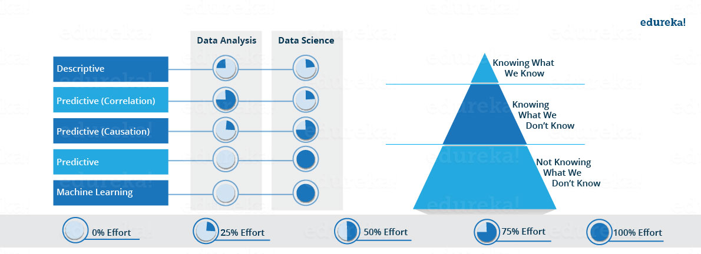
</center>

&nbsp;

**Our take?** Those definitions are useful, interesting, and to some degree accurate. _But_ data science is too new, and too fluid, to be fixed into some static definition. So, to keep our definition accurate, we'll keep it broad:  

**Data science is simply "doing science with data".**  And for our purposes, the only difference between our definition and the definition of science itself is not in the word "data" -- since nowadays all scientists are, to some degree, "data scientists" -- but rather in the word "doing". Data science is about _doing_ stuff with data -- about *making a difference with data.* And that's what this course is going to be about. _DOING_.  

But we'll go one step outward. Data science is not just the combination of academic disciplines like stats and business strategy. Good data science also needs to involve (1) **domain knowledge** (i.e., familiarity with the problem being solved), (2) **a bias to real-world effects** rather than theoretical frameworks, and (3) **a desire to work in the real world**. To do so, data scientists generally need to be effective communicators and have an iterative mentality: they try something, evaluate its effects, try something else, and repeat. 

Our definition is very broad, we know. We consider the "analyst" working in business intelligence to be a data scientist; and so too do we think that a data scientist could be an engineer who is processing large amounts of data to extract basic trends. Again, data scientists are those who _do science with data_. That's a lot of people.  

In our experience, the best data scientists aren't simply the best programmers or best statisticians; the best ones are the people who consider themselves to be *something else first.* They are the journalists, artists, epidemiologists, psychologists, historians, environmentalists, sports analysts, and political commentators who *also* know how to work with data. In other words, the best data scientists are the ones already out there, on the ground, already embedded in the system they want to improve, positioned perfectly to get the right data, to ask the right questions, and to actually *do* something with insights from the data. Again, data science is about *DOING*.  

To summarize, data science is about applying data to problems. It is impact-driven, transdisciplinary, and suited to well-rounded, multi-dimensional professionals.   


## What is the data life cycle?   {-}

There is a misperception about data science work that it is largely or even exclusively interpretative: that is, a data scientist looks at a big set of data and builds a fancy statistical model, then a light bulb goes off in her head, she has some insight, and then acts on that insight. 

The reality is data science is much more than that. And most of data science is a combination of *(a)* getting data ready for analysis, *(b)* hypothesis testing, and *(c)* figuring out what to do with the results of *a* and *b*. That is, data science in practice is generally not some artesenal genius staring at a table of numbers until "insight" magically occurs. Rather, it is a lot of work, a lot of structured theories which can be confirmed or falsified, and a lot of *imagination* applied to the task of implementation. 

In other words, data goes through a whole _lifecycle_ of which analysis is just a small part.  

What is the data lifecycle? Here's how we conceptualize it:

**0. Observation**  
**1. Problem identification & definition**  
**2. Question formation**  
**3. Hypothesis generation**  
**4. Data collection**  
**5. Data processing**  

This step is usually the most intensive. Half the battle is wrangling raw data and making it ready for a visualization or a hypothesis test. Note that this step has *nothing to do with statistical tests* -- data science is not the same as statistics!  

**6. Model building / hypothesis testing**  

Note that this step is usually where the scientific method stops. In science, once you analyze your test, you interpret your results and loop back to the beginning of the data cycle. But in *applied data science*, there are a few more steps:  

**7. Operationalization:**  This means determining how best to incorporate the data insights into operations.  

**8. Communication / dissemination**  

**9. Action:**  This means actually implementing the change.  

**10. Observation:**  back to the beginning of the cycle.

Again, the above should look a lot like the scientific method. The main differences are (a) "data processing", which in reality takes up most of any data scientist's time, (b) the bias towards action, and (c) the iterative / looped nature of the lifecycle.  


## Data science 'in the wild'   {-}

Enough theory. What do data scientists actually do? Again, you can search for an answer online and find complex diagrams like this one:  

&nbsp;

<center>

</center>

&nbsp;

But to capture every problem that data scientists are working on, this diagram would have to be even more convoluted and complex. 
Data scientists are working on a *ton* of problems. 

The most stereotypical data science problems tend to involve advertising, social media, and corporate profiteering:  

- Targeted advertising  
- Social media feed optimization (getting you to scroll just a little further)
- Facial recognition  (automated tagging at Facebook)
- Voice recognition ('Hey, Siri!', 'Alexa!')
- Making video games more fun / addictive  
- Dynamic airline pricing  
- Search autocomplete  
- Autocorrect  
- Virtual assistants  

These are the kinds of problems that the best-paid data scientists in the world are working to solve. Right now there are thousands of programmers in Mountain View, Cupertino, and elsewhere in the Bay Area (and New York, and London, and Beijing) trying to solve the problem of you not spending enough time on social media.  

Maybe you care about these problems, maybe you don't. Maybe they make you indignant or angry. Maybe you find it *problematic* that these things are even considered problems at all. As far as we're concerned, it is deeply unfortunate that our highest-paid data scientists are focusing on problems like these. 

But take heart -- there are plenty of other data scientists out there working on *actual* problems that are actually *important*:

- Identifying disease through imagery    
- Automating identification of credit card fraud    
- Filtering spam with malware or viruses.  
- Preventive maintenance at nuclear facilities   
- Improving chemotherapy dosage   
- Increasing voter turnout  
- Improve matchmaking systems (liver transplants, love, etc.)    
- Measuring deforestation with satellite imagery.  
- Efficient and equitable vaccine distribution  
- Identifying tax evaders    
- Predictive policing    
- Storm surge forecasting  
- Identifying and removing child pornography from the internet  
- Surveilling emergency rooms to predict disease outbreaks   
- Detecting fake news    
- Increasing accountability and legitimacy of carbon markets  
- Quantifying the likelihood of recidivism to prevent over-incarceration  

The list goes on. The number of worthwhile problems waiting for data scientists is limitless, there are data scientists working on problems like these right now, and the demand for civic-minded data scientists is immense.  

All of this matters for a lot of reasons. The first is that data science is not always a good thing; it can be weaponized by corporations and governments in spite of the public interest, and for that we need to be very careful about how we use it and how we teach it. 

But the second reason this matters is that data science can be an *equally powerful force for social good*. We can use data science to make progress on the most urgent and injurious social and environmental problems of our time.  

However -- and this is the third reason all this matters -- data science can only achieve social good *if* we recruit students to its ranks who are values-driven, civic-minded, and committed to using data science for good. 

Fourth, and finally, this matters because the Facebook data scientists are using the exact same principles and basic tools as the non-profit data scientists. At their core, the foundational skillsets are the same. 

And that's what this book is all about.


<!--chapter:end:02a-principles.Rmd-->

# The reproducibility crisis  

## The crisis  {-}  

There is a crisis in the sciences: the reproducibility crisis. It is also known as the replication crisis. This refers to the fact that many scientific studies have been impossible to reproduce, calling into question the validity of those studies' findings. 

This crisis began in the mid-2000's, when psychologists realized they could not reproduce most of their colleagues' results. They tried to repeat the experiments, following the methods step-by-step, but failed to get the same results. This was enormously unsettling for psychologists, and it cast major doubts upon the validity of psychological theory.  

The realization that much of published research is not actually reproducible soon spread to medical research... 

&nbsp;  


&nbsp;  

...then it sprung up in marketing...

&nbsp;  

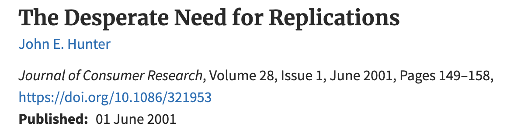
&nbsp;  

...and economics...  

&nbsp;  


&nbsp;  

...and the sports sciences...

&nbsp;  


&nbsp;  

...and the life sciences too:  

<iframe width="560" height="315" src="https://www.youtube.com/embed/FpCrY7x5nEE" title="YouTube video player" frameborder="0" allow="accelerometer; autoplay; clipboard-write; encrypted-media; gyroscope; picture-in-picture" allowfullscreen></iframe>

&nbsp;  

For a complete history of the crisis, check out this article from [Wikipedia](https://en.wikipedia.org/wiki/Replication_crisis). 

**Why is this happening?** There are many reasons. Many studies, particularly those in psychology and the social sciences, involve small cohorts of participants. When sample sizes are low, results may not be representative of underlying truths. 

On rare occasions it is intentional and fraudulent: scientists face pressure to publish interesting results, so much so that they might fabricate or filter their data to make their results significant. 

But the most common causes of reproducibility failure are, by far, (1) **poorly documented steps in data processing** -- if you don't know how exactly the authors of a paper formatted their raw data to prepare them for analysis, you simply can't reproduce the analysis -- and (2) simple, **honest mistakes**, such as typos in spreadsheets.  

Consider this summary of the reproducibility crisis from *The Economist*. A scary percentage of genomics studies have simple spreadhseet errors:  

&nbsp;  


&nbsp;  

**This is a big deal:** if a significant part of science is _wrong_, then what do we know? How can we be sure what we know is right? How can we build off of previous research? How can we distinguish valid science from the rest? If science can't be trusted, what value does it have for society? What kind of *damage* is it doing to society?  

**This crisis is ongoing**, and it is impacting our handling of the COVID-19 pandemic. On October 5, 2020, the world learned that 16,000 COVID-19 cases disappeared from the UK's public health database due to a simple glitch in *Microsoft Excel*.  

&nbsp;  


&nbsp;  


That event demonstrated that the reproducibility crisis is not just an academic concern. It can have serious and potentially deadly consequences for the public.  

But there are **silly examples** of the replication crisis, too. Perhaps our favorite is this: in August 2021, when we Google'd "reproducibility crisis", one of the top search results is this video from *Science*, the world's most prestigious scientific journal:  

<center>

</center>

&nbsp;  

But when we click on this link, here's what we see:  

&nbsp;  

<center>

</center>

## The 'reproducibility' movement  {-} 

Because of this crisis, there has emerged a much needed move to make all science "reproducible". This means making sure that someone else can copy what you did, and get the same results. This is important for identifying scientific fraud, of course, but also for helping us to overcome human bias, mistakes, wishful thinking, etc. Reproducibility is not just a "nice-to-have"; in modern science (and data science), it's a "must".

**Good data science must be reproducible.** The idea is that work done by scientist A is "reproducible" by scientist B. In other words, if the findings of the research are of any generalizable value, then the results of two scientists working on the same problem should be identical (or very high in agreement).  In practice, this means using data and code in a structured, well-documented, accessible, clear way, and ensuring that others can do the same.  

Reproducible research also means using tools that others can easily use, and methods that others can easily copy. Programming languages like `R` and `Python` are ideal for this. 

Reproducible research matters for lots of reasons:

1. Because making your work reproducible means that _you_ will have less problems returning to that work at a later time.  
2. Because making your work reproducible means that _others_ can collaborate with you, help you, error-check you, and build on your work.  
3. Because making your work reproducible means you are fighting the plague of irreproducible results which have characterized the replication crisis.  

Making your work reproducible is going to be a bit more work, but it's not optional. And there are tools and best practices in place to make it as painless as possible. Basically, reproducible research involves the following:

- Using code to format and manage your data instead of spreadsheet software such as *Excel* or *GoogleSheets*, since those products will not keep a step-by-step record of each thing that you do. When you code, each command line is both an action you take to process your data *and* a record of what that action is.  

- Coding with free, open-source tools, such as `R`.  

- For any specific niche task in your analysis, such as processing a batch of images, using other open source tools (e.g., `ImageJ`) that can be used free-of-charge by anyone with an internet connection anywhere.   

- Documenting *everything* you do with the data, by commenting your code thoroughly and by creating "Wiki" pages for your projects.  

- Making your code open source and freely available online.   

- Making your data open source (while protecting privacy and confidentiality of participants).   

- Providing tools, such as `Shiny` in `R`, that allow others to explore your data themselves, rather than trusting your own narratives about the data.

- Using tools for generating reports, such as `Rmarkdown`, that remove the 'middle-man' and avoid potential typo's and fabrications.  

- Collaborating openly with others.    

You will be learning how to do all of these things in this course. We are going to focus on _reproducible research_, _literate programming_, _documentation_, and other components of data science (and research in general) which ensure that (a) our methods and findings can be easily sanity-tested by others, and (b) we set ourselves and our projects' up for future collaborations, hand-offs, and expansion.


## Why `R`? {-}

This course is largely about learning to _do_, and will largely use `R`. `R` is not the only tool in the data scientists' toolbox (there are many), but it's a good one, is extremely popular, there is almost nothing you cannot do with it, it can be applied to many fields, and -- most importantly -- it is a free, open-source tool with an active open-source coding community. The millions of `R` users worldwide emulate the spirit of reproducible research we are trying to advocate for here.    


### A final thought {-}

A research article about *results* is advertising, not scholarship.  

Scholarship is an article with transparent, reproducible methods.   


<!--chapter:end:02b-reproducibiility.Rmd-->

# Data ethics


## A few principles {-} 

This orientation to the principles of data ethics is not going to be adequate or sufficient. We just need to provide enough context for you (1) to appreciate the limitless complexity and uncertainty of many ethical issues in data science, and (2) to start exploring the complex ethical scenarios below on your own or in dialogue with others.  

In most frameworks for data ethics, three foundational principles are used to help us think about whether certain research actions are ethical. Those three principles are:  

**1. Respect** for persons and their autonomy: participation must be based upon informed consent, and privacy must be honored at all times.  Immature or incapacitated persons must be protected as they mature or heal. 

**2. Beneficence:** in our work with data, potential risks are minimized while potential benefits are maximized.  

**3. Justice:** Benefits and risks are distributed equally across groups of people. A classic way of asking whether something is 'just' is asking using John Rawls' concept of the **'veil of ignorance'**: pretend you have no information at all about your circumstances or your place in the social order: You don't know your place of birth, year of birth, sex, skin color, language, religion, immigration status, health conditions, or anything else. In other words, you have no information whatsoever that might introduce bias into the way you think about the world. Free of circumstantial bias, what arrangements would you choose to put in place to maximize fairness and fortune for all, and to minimize the chances that you would get screwed by the system?  


These principles can guide us as we navigate ethically ambiguous scenarios. When we ask whether something is ethical, we are asking whether all of these principles are upheld. We could also be asking whether the violation of one of these principles might be justified by upholding another in an impactful way. 

The question, 'Is something ethical?' is usually not easy to answer, particularly when it comes to the use of data in tackling social problems. It is important to note that reasonable people regularly disagree on these ideas; that is why we have committees and drawn-out processes for obtaining permission to use data in research and commerce.  

**So why do these principles matter?** Because without them, we would not be able to have conversations about the ethics of difficult situations. We need articulated principles that we can point to and debate together. Principles like these allow you to have an account for why you feel the way you do about a certain issue. Without that account, we can't learn from each other's perspectives.    

Note also that these principles were designed with **individual human subjects** in mind. It is an open question of active debate how exactly these principles can be applied to **communities of individuals** all at once -- what exactly does it mean for a group to consent to something? Does every single individual need to consent? The majority? -- or how they translate to our treatment of **non-human communities**: animals, plants, and places. 


Let's stop there and explore some concrete scenarios. For a better orientation to ethical precepts underlying issues of data ethics, [this chapter by Shannon Vallor](https://www.scu.edu/media/ethics-center/technology-ethics/IntroToDataEthics.pdf) is the best open-source resource that we have been able to find.  Many of the case studies and scenarios presented below are adapted from that chapter.  

## Warm up scenarios {-}  

Practice applying the above principles to these scenario questions. For each scenario, describe your **opinion vector** (the *direction* of your opinion -- yes or no -- and the *strength* of your opinion).  

**Location tracking**  
Is it ethical for Google to track and store your location information in order to monitor traffic and operating hours of local businesses? Such traffic information is known to help direct emergency service vehicles along the safest and fastest route.

**Targeted advertising**  
Is it ethical for internet search engines to tailor advertisements according to your search history?  

**Dynamic pricing**  
Is it ethical for airfare search engines to adjust ticket prices according to your recent search history?  

**Social media scrolling**  
Is it ethical for Instagram to count how many milliseconds you spend on each post, then use that info to develop a strategy for getting you to spend more time on its app?

**Controversial content**  
You are a data scientist at Facebook. Based on your analyses of user data, you have discovered that when you show readers sensational or hyperbolic content, such as someone ranting that a new vaccine is an attempt at government-subsidized mind control, the readers stay on Facebook longer and scroll through more contet. Since that translates to profits, is it OK for your team to increase the amount of sensational content in users' feeds?


## Case studies {-}

Use these case studies to reflect upon and discuss the ambiguity, complexity, and dangers of data ethics issues.  

### The Facebook 'Social Contagion' Study {-}

In 2014, data scientists from Facebook published an [article](https://www.pnas.org/content/111/24/8788) in a prestigious academic journal. In this article, they demonstrated that the emotions and moods of users could be manipulated by toggling the amount of positive or negative content in their feeds. They found that these emotional effects would then be passed to other users in the social network; in other words, emotions and moods could be seeded and were 'contagious'. To carry out this research, they manipulated the Facebook feeds of 689,000 users. 

&nbsp;  
<center>
{width=70%}
</center>
&nbsp;  

Facebook did not receive specific consent for this study from its users. Instead, the company argued that the purpose of the study was consistent with the user agreement already in place: to give Facebook knowledge it needs to provide users with a positive experience on the platform.  

**Discuss:**  

1. In what ways, specifically, did Facebook violate basic principles of data ethics with this study? Enumerate each violation individually.  

2. Can a convincing argument be made that justifies this study?  What are the strongest arguments in its favor?  


3. What are some things that Facebook could have done differently to handle this situation more ethically?  


4. Who exactly should be held morally accountable for any harms caused by this study? The data scientists employed to analyze and publish the data? Mark Zuckerberg? All Facebook employees? Facebook stock holders? Are Facebook users accountable at all?   


### Machine bias: Beauty contests & recidivism {-}

Machine learning (ML) algorithms are developed by 'training' models on known datasets. The models are then used to predict values in other datasets. For example, if you label cars in a batch of photos then use them to train a ML model on that labeled dataset, you can then use that model to identify cars in thousands of other photos.  

Sounds neat, but this means that ML models are only as good as the data they are trained upon, and often those training datasets are created by human labelers who carry unkown or unspoken biases. A classic example is the [Beauty.AI](https://www.theguardian.com/technology/2016/sep/08/artificial-intelligence-beauty-contest-doesnt-like-black-people) beauty contest that occurred in 2016. A ML algorithm was trained on a large set of human-labeled photos of women, then women around the world were invited to submit selfies in a global beauty contest. A key advertising hook for the contest was that the 'robot jury' -- the ML algorithm -- would be fully impartial and fair. But the results revealed that the ML model was racist: 75% of the 6,000 contestants were white, but 98% of the 44 winners were white. How did this happen? The people who labeled the training set of photos carried implicit bias.    

&nbsp;  
<center>
{width=70%}
</center>
&nbsp;  

Debacles like this can have much more serious consequences. [Court systems use ML models](https://www.propublica.org/article/machine-bias-risk-assessments-in-criminal-sentencing) to estimate the risks that a convicted criminal will commit more crimes once they are released from prison. But retrospective studies have shown that these models consistently and incorrectly label black prisoners as more dangerous and more likely to return to prison at a later date. Most of the risk assessments being used today have not received adequate validation, even though they are spitting out predictions that can destroy lives, families, and communities.   

&nbsp;  
<center>
{width=70%}
</center>
&nbsp;  


**Discuss:**  

1. How might bias have entered the training datasets for these ML models, if the people labeling the data did not deliberately intend to exhibit prejudice against African Americans? 


2. The ML models used to predict recidivism are imperfect and inherently prejudiced, but it is not clear whether it would be better to leave decisions of sentencing, bail amounts, and prisoner support services to individual humans in the court and penal systems. Would it be better to stop all use of ML evaluations, or should they be kept in place until better models are developed?  

3. Returning to the beauty contest debacle. The attraction of a 'robot jury' compelled people to seek out a single, simplistic definition of beauty, and to place all contestants on the same spectrum of beauty scores. Other than the racial bias baked into their model, what other problems is there with this endeavor? Articulate and enumerate as many as you can.  What do those problems tell you about other ethical and humanistic dangers inherent to data science?  


### Web-scraping OKCupid {-}

In 2016, Danish researchers used new web scraping and text mining software to inventory the user profiles of 60,000 users on the online dating site [OkCupid](https://fortune.com/2016/05/18/okcupid-data-research/). Their goal was to use this dataset to test for correlations between 'cognitive ability' and sexual orientation, religious affinity, and other personality traits. They chose these user profiles because they were publicly available online to anyone who wanted to sign up for a free account with OKCupid.  

When they published their paper, they included a spreadsheet of the 60,000 user profiles in the supplementary material for their article. They had removed the first and last names of the users, but kept everything else, including username, location, sexual orientation, religious orientation, sexual habits, relationship fidelity, drug use history, political views, and more. 

The backlash was immediate. When asked why they did not attempt to deidentify or anonymize the data any further, the researchers responded that the data were already public. In the paper itself, the authors wrote: "Some may object to the ethics of gathering and releasing this data ... However, all the data found in the dataset are or were already publicly available, so releasing this dataset merely represents it in a more useful form."  


&nbsp;  
<center>
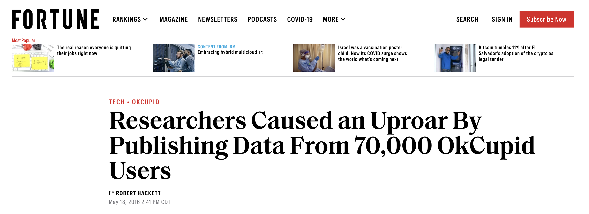{width=80%}
</center>
&nbsp; 

**Discuss:**  

1. What do you make of the authors' argument, that the data were already public, posted freely by the users themselves, so how can this be an issue of privacy or consent? 

2. If you disagree with the authors' argument, explain how the users might reasonably object to the authors' actions. 

3. What kind of risks did the authors impose upon the users of OKCupid? Are any of those risks new, or were they all present when the users decided to make a profile that could have been accessed by any other user?  

4. Does it make an ethical difference that the authors accessed publicly available data in a novel way (web-scraping software) and to a much greater extent (harvesting 60,000 profiles at once) than individual users are typically able to do?  

5. Does the software developer of the web-scraping tool bear any responsibility for this scandal? Does he have any ethical obligations regarding how his tool is used, and by whom?  


## More scenarios {-} 


**Airport screening**  
A data scientist has come up with a model that prioritizes security screening at airports according to various passenger characteristics. If using 'place of origin' as a predictor in this model improves the model's predictive performance at identifying passengers who are security threats, is it ethical to include that variable in the model and screen certain passengers disproportionately?


**Supporting struggling college students**  
Your college has developed a model that predicts dropouts. It identifies students at high-risk of dropping out and alerts offices that can direct additional support and resources to these students. Your college has found that this model performs better when it includes the student's place of origin, sex, and race as predictors. Is it ethical to implement this model and divert resources accordingly?  


**Robot cashiers**  
Self-checkout stations in grocery stores are convenient, but they take jobs away from workers who may not have many other employable skill-sets. When you are checking out, is it more ethical to use the checkout aisles with human cashiers, even if the line is longer and going more slowly?  


**Electric cars**  
Cars running on fossil fuels are bad for the environment, but at least they can be serviced by car mechanics who don't necessarily need a college degree.   

Electric cars reduce carbon emissions, but they are replacing car mechanics with computer scientists and softwar engineers, all of which require extensive undergradate and post-graduate education.  Are electric cars a net social good?  


**Smartphone app for monitoring cough**  
A tech start-up has developed an app that can track the prevalence of cough in a network of smartphones. Cough is an important indicator of disease, and cough also helps to spread certain diseases more quickly, such as TB and COVID-19. This app has great potential to help public health officers in the fight against some of the deadliest respiratory diseases. The app works thanks to sophisticated machine learning algorithm for detecting coughs within continuous recordings. That algorithm is currently private and propriety. Do you agree that this cough monitoring app is a good idea, and that public health officials should promote its use?  


**Automated suicide prevention system**  
A large internet search engine has developed a model that can predict whether someone is likely to inflict self-harm or attempt suicide based upon their recent search history. This model is 75% accurate. This company would like to set up an automatic emergency alert system, in which local social service providers are notified about at-risk users in their area. They want to automatically enroll users in this service. Is this an ethical feature to add to their product?  


**Malaria medicine distribution**  
Your company is trying to distribute a new malaria medicine in a remote region of Africa without primary care clinics, where tens of thousands people die from malaria each year. This medicine is highly effective, but it is also known to cause birth complications. You need to ensure that it is not administered to pregnant women. Your team's plan is to go door to door and distribute the medicine to women who say they aren't pregnant. 

But in this region, cultural attitudes to pregnancy, and the notion of sharing your pregnancy status with a stranger, are very sensitive. Daughters and wives may not feel safe to answer such questions truthfully. 

Your team has to choose between (1) taking women's responses at their word, (2) avoiding the pregnancy issue by only distributing it to men, (3) not distributing the medicine at all, (4) some as-yet-unknown solution. What do you do?


**User accountability**  
Let's say that you have disagreed with one or more of the claims about social media in the 'Warm-Up Scenarios' section above. Is it ethical for you to continue to use Google, Instagram, or Facebook? 


<!--chapter:end:02c-data-ethics.Rmd-->

# Visualizing data {#dataviz}

This course will focus heavily upon visualizing data in plots, maps, and dashboards. If there is anything you take from this course, it will be this: you will be able to take data and make some pretty pictures. *And that's not trivial*.   

Why? Because **humans are wired to process information through *pictures*.** We can translate images into meaning with amazing speed.  

## The value of *data viz* {-}  

This screenshot, from David McCandless's [TED talk](https://www.youtube.com/watch?v=5Zg-C8AAIGg) about the beauty of data visualization, depicts how quickly each of our senses can process information.  

&nbsp;  
<center>
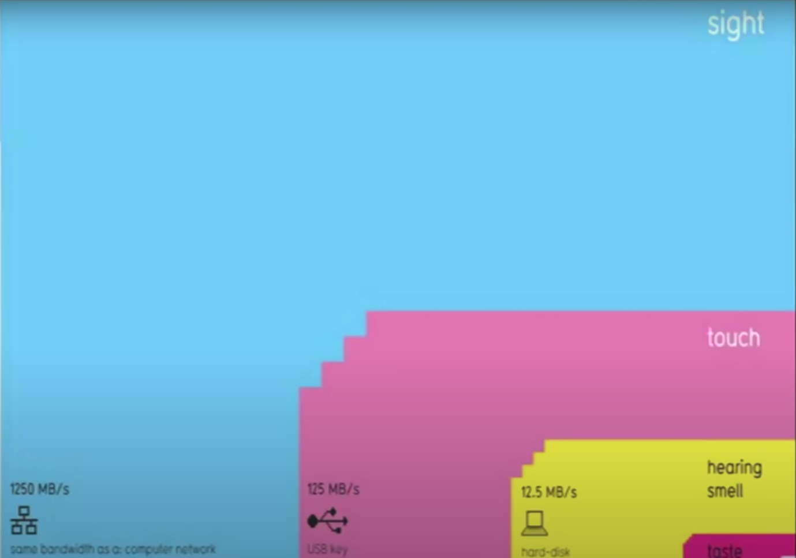{width=70%}
</center>
&nbsp;  

**This plot's punchline:** When we process data with our eyes -- with *pictures* -- we can take in a lot of information all at once.  

**Let's try this out with an example.** Below this paragraph is another paragraph describing a painting. Try this: scroll down quickly, look at this paragraph for just *one second*, then keep scrolling until it is out of view.  

Go!  

**One-second paragraph:**  

*Fog rises from the evergreen forest of a distance mountain range. A whitewater creek cascades down a streambed with large, rounded boulders, arriving at a broad flatwater pool where ducks are milling. There is one group of four and another group of two. On the shore near the ducks, a wooden dinghy is tied up to a small dock with eight pilings. The dock lead to a path through more round peddles and tall grass, past a chair and a fire ring, and continues uphill to a small cabin. The evening sun and sparse fairweather clouds are reflected in the cabin's large, multi-paned windows under the small front porch. A cobblestone chimney on the side of the cabin has a whisp of smoke rising from it. The steep roof implies that this cabin is designed to withstand heavy snow. Tall evergreens tower over the diminutive cabin; the cabin seems to be placed up against a forested hillside. There are only a few deciduous trees in view, and their leaf colors -- combined with the lack of snow in the distant mountains -- imply that the time of year is early fall.*  

**End of paragraph**.  

OK. Now try to answer these simple questions:   

- What was this a painting of, in general? Can you describe the scene?     

- What details do you recall?  

OK. Try this next: the actual painting is at the very end of this chapter. Scroll down to it quickly, look at this painting for just *one second*, then scroll back up to this spot in the module.  

Ready? Go!  

&nbsp;  

*< Return to this line! >*  


Now try to answer those same questions above. What was this a painting of? Did you catch any more details? Was there anything in the water? Was there smoke coming out of the chimney? What time of day was it?  

Which type of visual information was easier for you to process quickly? Text, or a picture?  

Think about the profound *differences* in these two forms of visual communication:  

When we read text, we are working outward, from individual details to the big picture: we process each individual word, understand their individual meanings, understand their meanings in the context of each individual sentence, then use all of the information to step back and imagine the scene based on the details. 

In contrast, when we look at a picture, we are working inward, from the big picture down to the details. We understand the scene first, then we start exploring the finer points. And, since each finer point is interpreted from within the context of the bigger picture, we can make sense of the details much more efficiently. 

Pictures communicate data. **This is why data *science* and data *visualization* nearly always go hand in hand.**  

Data scientists use visualizations both to communicate their insights externally, e.g., to the public in a *Twitter* post, but also internally: when they are working with the data themselves. A data scientist's workflow is peppered with data visualization, because -- again -- visualizing your data is the most effective way of making sense of it: Download the data, then visualize it. Do something to the data, then visualize what you've done. Repeat, then visualize, then repeat again.  
  
The point here is that great data visualizations are not simply pretty. Much more importantly, they are *effective* too. They are the best means you have of conveying insights from your data to someone else.  

**A final thought:** Keep in mind that plots can be effective and misleading at the same time.  There is a politics to plots and maps; they can have agendas, and they can manipulate viewers into interpreting the data in certain ways. So, it is incomplete for us to say simply that a good plot is an effective plot. Here's a better definition: *a good plot is one that is both effective and fair.* 

So, when you are viewing other people's plots and making plots of your own, keep these five rules in mind:  

1. A bad plot is an ineffective one, even if it is beautiful.  

2. A good plot is an effective plot.  

3. A great plot is one that is both effective *and* beautiful.  

4. If you ever have to make a trade-off between effectiveness and beauty, sacrifice beauty.   

5. Any plot that misleads or manipulates the viewer is bad, no matter how effective or beautiful it is.  


Before you begin evaluating the plots in the gallery below, enjoy this excellent talk by the Egyptian data scientist, **David McCandless**, about the **beauty of data visualization** (link [here](https://www.youtube.com/watch?v=5Zg-C8AAIGg)).  
  
```{r, include=FALSE,eval=FALSE}
options(htmltools.dir.version = FALSE)
```

&nbsp;  

<iframe width="560" height="315" src="https://www.youtube.com/embed/5Zg-C8AAIGg" title="YouTube video player" frameborder="0" allow="accelerometer; autoplay; clipboard-write; encrypted-media; gyroscope; picture-in-picture" allowfullscreen></iframe>

## Plot gallery {-}  

What follows is a gallery of plots: some good, some bad, and some ugly too.  Let's use these to explore what works and what doesn't. For each plot, ask yourself three questions:

- What makes this plot good (as in, effective and not misleading)?   

- What makes this plot bad (ineffective and/or misleading)? How could the plot be improved?  

- What might make this plot prettier? 

The point of this is not to make fun of others for their plots. The point is to learn from their choices. Because plot technique matters. Data science is about communication, action, and impact. You will spend so much time working on an analysis, and you are gonna go through all the work of making a plot. What a shame if the end product undermines all of that hard work!  

&nbsp;  

```{r, results = 'asis', eval = ifelse(exists('is_teacher'),is_teacher,TRUE),echo=FALSE}
source('teacher_tip.R')

tip <- 'Let the students offer feedback on each plot before you fill in the gaps with your own opinions and the ideas offered below each plot.'

teacher_tip(tip)
```

&nbsp;  

<center>

</center>
&nbsp;  

- **Good:** Frankly, there is not much good about this plot. Yes, it has a lot of information, but this crosses the line into information overload. It is so convoluted and difficult to interpret that we quickly lose interest in spending time exploring its details.    
- **Bad:** The 3D perspective (1) makes it almost impossible to compare bar heights, (2) causes alot of the bars in the back to be hidden, and (3) adds needless complexity.  
- **Bad:** The 3D perspective makes it almost impossible to compare bar heights. 
- **Bad:** The colors representing each year do not follow a logical sequential flow; years are sequential, and colors can be too (think the ROYGBIV rainbow sequence).  
- **Ugly:** The bananas! Sure, this plot has to do with banana exports, but those banana pictures don't represent anything at all about the data and they make everything else convoluted. Plus, it's cheesy.  

&nbsp;  
<center>
{width=70%}
</center>
&nbsp;  

We don't think this plot is good or pretty. 

- **Bad:** This is an unfamiliar plot format; is it a pie chart? A blood platelet? A pickle? 
- **Bad / Ugly:** Why is it lopsided or rotated? That has nothing to do with the data. 
- **Bad:** What is this plot even about? There are no context clues whatsoever. Titles and labels, in moderation, can be really helpful. 
- **Bad / Ugly:** What are the colors representing? They seem to have no relation at all to the pie slices. Very confusing. 
- **Bad:** The slices do not seem to represent the percentages accurately. The 8% slice does not look four times larger than the 2% slice.  


&nbsp;  
<center>
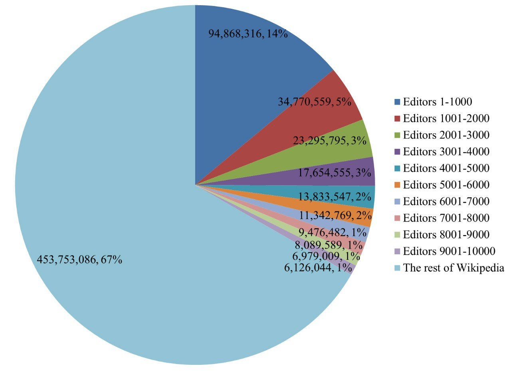{width=70%}
</center>
&nbsp;  

Here is another pie chart that isn't very effective.  

- **Bad:** Lots of significant digits in these number. Instead of forcing viewers to read numbers like 453,753,086, why not display 454 M?  
- **Bad:** The percentages next to the other numbers make it even harder to read. 
- **Bad:** Superimposing text on top of the pie sclices makes it impossible to use the slices for their intended purpose: visually comparing the size of subgroups in the data. 
- **Bad:** There are so many color-coded slices that it takes far too long to understand the details. 
- **Bad:** One reason it takes so long is that the text is redundant: don't put a lot of text on the pie *and* put a lot of text in your legend. Figure out a way to point to each pie slice with a line, then have all the info for that slice in the same spot.  
- **Bad / Ugly:** The dark text on top of dark colors is hard to read. 

Pie charts are *super* common in media, but they are actually an infamously bad form of data visualization. That's because the human eye is much worse at comparing *areas*, such as the size of a pie slice, than they are at comparing *heights*. To make matters worse, we are worse at comparing areas for non-rectangular shapes, like a pie slice, than for squares or rectangles.  So: avoid pie charts. 

&nbsp;  
<center>
{width=80%}
</center>
&nbsp;  

- **Bad:** Pie chart.
- **Bad:** There is no reason for this to be 3D. The third dimension has nothing to do with the data. 
- **Bad:** There is no reason for this to be semi-transparent. It just makes everything even more convoluted.
- **Bad:** The text is way too small to read.
- **Bad:** On a related note, there is way too much text.  
- **Bad / Ugly:** The yellow text boxes and dark lines around them add uninformative junk to this plot. If all lines unrelated to data or labels were removed, this chart would be more intelligible.  


&nbsp;  
<center>

</center>
&nbsp;  

- **Bad:** Information overload.
- **Bad:** It is not clear whether the repeat use of colors in each row conveys any meaning, or if it is just a random recycling of colors. 
- **Bad:** The text is too small to read.   
- **Bad:** Abbreviations are not explained. 

&nbsp;  
<center>
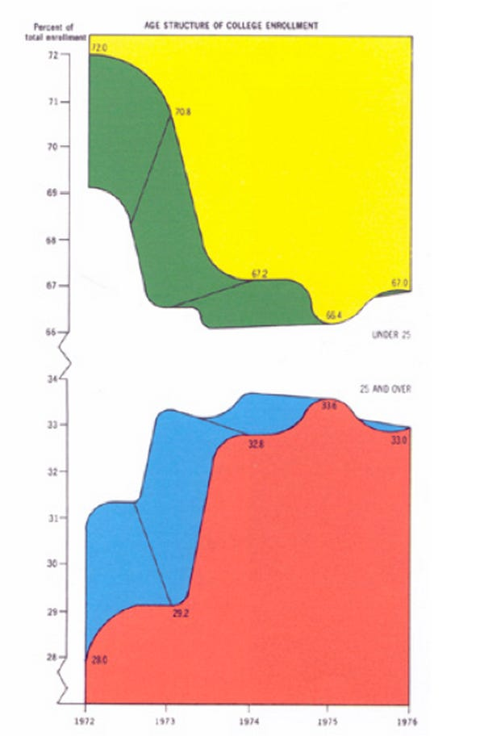{width=60%}
</center>
&nbsp;  

- **Bad:** The text is very small.
- **Bad / Ugly:** The third dimension, with a weird perspective effect added, has nothing to do with the data and makes this plot difficult to understand. Should you pay attention to the edge in the distance or the line in the foreground? Are they the same?  
- **Bad:** The y axis is crazy!  (1) The scale break is confusing. (2) The attempt to plot these two subgroups as separate trends belies the fact that one is just the remainder of the other: the two curves sum to 100%. (3) By attempting to place the two trends on the same proportional scale, this plot gives the visual impression that the changes over time are really extreme. 
- **Bad:** The trend lines are unnecessarily curved. The plot's authors probably only have data for each semester, but smoothed lines give the impression that they have more data.  


&nbsp;  
<center>
{width=70%}
</center>
&nbsp;  

- **Bad:** These percentages sum to more than 100%. That needs to be explained, or avoided.  
- **Bad:** The use of a pizza pie, though creative, implies that the size of the pie slices will have something to do with the data. They don't. 
- **Bad:** Check out the fine print on the bottom. Several toppings were left off this chart, and some of them were quite popular; for example, onions had 62% popularity and chicken was 56% popular. Why are they not on this chart but spinach (26%) is? The arbitrary exclusion of categories should immediately make viewers suspicious: how are these decisions being made?  


&nbsp;  
<center>

</center>
&nbsp;  

This is another case of information overload, and another case of a creative visualization that doesn't really help us make sense of what's going on. If we wanted to understand the take-a-way message or punchline from this plot, we're not sure we'd be able to. We could stare at this for minutes and still not understand what we are looking at, and it is so complicated that we would rather ignore this plot than go through that effort. 

&nbsp;  
<center>

</center>
&nbsp;  

- **Bad:** The y axis range makes the difference in home prices sound a lot larger than it actually is. Based on the height of these two bars, you would expect the 1999 price to be 3x the the 1998 price when, in actuality, it is larger by 2.5%. 

- **Bad:** The use of qualifiers such as "Massive" is generally discouraged. It's a little too controlling. Let the viewers make up their own minds about which differences are substantial and which are trivial. 

These two notes are classic indicators of misleading or agenda-driven data visualization.  

&nbsp;  
<center>

</center>
&nbsp;  

This is another example of manipulating perception with a sneaky y-axis range. 

Also, like the examples above, this plot doesn't have to be 3D. The height has a meaning, but what does the depth mean? It is junk, in the sense that it does not add meaning. 


&nbsp;  
<center>
{width=75%}
</center>
&nbsp;  

- **Bad:** These percentages sum to more than 100%. That needs to be explained, or avoided.  

- **Bad:** The rationale for ordering of the categories is not clear. They are not ranked by percentage. Are they supposed to correspond to the body part being pointed to in the figure? Should crotch equal 'tech-savvy'?  

- **Bad:** The geometric shape itself (the person figure) does not help at all in visualizing the percentages. Can you compare the area of the feet and the area of the head?  The fact that they provide the actual numbers in large bold font suggests that they knew the figure would not be useful as a picture. 


&nbsp;  
<center>

</center>
&nbsp;  

- **Bad:** Some data are completely obscured. What is happening to lemons in February and March?  
- **Bad:** Like the infamous banana plot above, the 3D perspective here makes it almost impossible to compare bar heights and adds needless complexity.  


&nbsp;  
<center>
{width=80%}
</center>
&nbsp;  

- **Bad / Ugly:** The contortion of this pie chart into a spiraling 3D object is confusing and gratuitous. 
- **Bad / Ugly:** Some colors are very similar to each other.  
- **Bad:** Pie chart!  

&nbsp;  
<center>
{width=75%}
</center>
&nbsp; 

- **Bad:** The small y axis range exagerrates changes in the unemployment rate.
- **Bad:** The final data point on this plot is wrong! 8.6% should not be at the same height as 9.0%. 
- **Bad:** The title of this plot implies that the data will show unemployment trends throughout the Obama administration, which began in 2009, but this data is for 2011 only.  


&nbsp;  
<center>
{width=70%}
</center>
&nbsp; 

- **Good:** All in all, this is a very well made plot. Unnecessary lines and text are kept to a minimum; the title and subtitle are clear. The text size is appropriate. The source of the data is provided.  

- **Bad:** This plot is misleading, because it is plotting data with different units on the same y axis. The blue line is the average *four-year* cost of a college degree. The red line is average *annual* salary for someone with a Bachelor's degree.  

How should these data be plotted differently in order to correctly explore whether a four-year degree is still worthwhile in terms of its benefits to a 30-year career?  

&nbsp;  
<center>
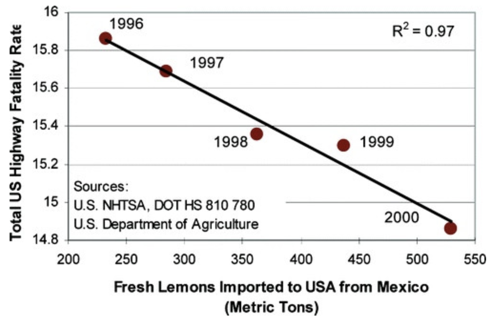{width=70%}
</center>
&nbsp; 

This is a classic example of a *spurious correlation*: two trends that are correlated but have absolutely nothing to do with each other.  

&nbsp;  
<center>
{width=70%}
</center>
&nbsp; 

This is another example of a beautiful plot, but it is also an example of how a plot's message can be coaxed by manipulating y axis scales. If the curve for Uninsured Americans were plotted on the same percentage scale as the Unemployment Rate, it would not seem to be accelerating so rapidly.  

&nbsp;  
<center>
{width=90%}
</center>
&nbsp;  

- **Good:** This is a clean and simple plot, more or less, without too much text. 
- **Good:** The color scale relates to only 4 categories: that is simple enough to make sense of quickly.  
- **Good:** The color palette follows an intuitively sequential trend: Blue = low/no bad; Red = high/severe. 
- **Bad:** The abbreviation system for states is inconsistent. Some use initials, some use abbreviations; some use a period, some don't.  
- **Bad:** The lowest color category is not used in this plot, and could be removed to increase simplicity.  
- **Bad:** Showing a map of the U.S. states with this particular color scale can be confusing: if you had to guess what this chart is about, you would probably assume it is an electoral map. 

&nbsp;  
<center>
{width=75%}
</center>
&nbsp;  

- **Good:** This is a nice plot. It is simple and junk-free. No unnecessary text or axes. 
- **Good:** Large font, strong color contrast.   
- **Good:** The axis starts at zero, and the bars widths are proportional to the data, e.g., the 30m bar is half the width of the 60m bar.  
- **Good:** Since this plot is so simple, the actual numbers for each bar can be included without cluttering the plot.  


&nbsp;  
**Effectiveness of COVID-19 vaccine BNT162b2:**
<center>
{width=80%}
</center>
&nbsp;  

- **Good:** This is a simple plot that tells a good story: a week or so after receiving a dose, vaccinated participants contracted COVID-19 at a much lower rate than those who received the placebo.  

- **Bad:** The labels are not clear to viewers who are not clinical virologists.  To every extent possible, data visualizations should be inclusive and inviting. Don't make someone feel stupid by forcing them to look at their plot.  

- **Bad:** The overlay that zooms in on the first three weeks makes this plot a bit cluttered. We might suggest plotting those first three weeks in a separate plot, adjacent to this one but not embedded within it.  

- **Ugly:** This is an effective plot, but it is not beautiful. What would you do to make this plot more beautiful without compromising its message?  

&nbsp;  
<center>

</center>
&nbsp;  

- **Good:** These are clear and simple plots with an obvious take away: daily COVID-19 case counts correspond to deaths and hospitalizations.  

- **Good:** No extraneous labels or lines. These plots are chart-junk free.  

What do you think about the choice to use three different scales for the y axis? That tends to lead to confusion, but do you think that, in this case, it was justified?  

&nbsp;  
<center>

</center>
&nbsp;  

Now this is a [data visualization!](https://podio.com/site/creative-routines). It is a tad complicated, but it is elegant and fun to explore.  

&nbsp;  
<center>

</center>
&nbsp;  

This plot is straightforward and simple. 

- What it is showing is fairly self-explanatory, though some viewers might benefit from a more informative y-axis label. 
- To help explain the y axis, it may be helpful to include a helper line at 0.0 degrees.  
- Are the points really necessary? Since it is fairly clear that this is an annual dataset, those points are just repeating the information contained in the line, aren't they?  

&nbsp;  
<center>
{width=50%}
</center>
&nbsp;  

Another straightforward and simple plot, whose meaning is pretty obvious even without a title.  

- Some more effort could have gone into the x axis label. Are the units kilograms, or pounds? 
- This plot conveys a lot of information really intuitively. You can intuit that the dotted lines are probably mean weights; that the distributions show the range of data.  
- The semi-transparent colors make it possible to see how the two distributions overlap. Very helpful! 
- It is interesting that the male/female color associations are opposite the convention. Do you think that was intentional?  
- Note the little tick marks along the x axis. That is a suble way of indicating sample size; it shows how much data are used to populate each distribution. 


&nbsp;  
<center>
**Some baby names throughout the last 140 years**
{width=70%}
</center>
&nbsp;  

- In this plot, chart junk is kept to a minimum, which is nice, but the names are a little too small to read. It is strange that the names are a smaller font size than the axes labels. 

- What do you think about the use of color? The colors are pretty, but it is a purely aesthetic choice; the colors don't correspond to anything about the data at all. 

- It was an interesting decision to only include x axis labels on the bottom row of plots. In a way this is nice because it (1) reinforces the fact that each plot is using the same x axis range, and (2) removes redundant content from the plot. However, it makes it a bit more laborious to explore the plots in the top row. 

- It was also an interesting decision to make the y axis ranges different for each plot. There are trade-offs to this decision. What would be lost if all of these facets were forced to use the same y axis range?  

## Chart junk {-}  

A few times already, we have referred to the concept of chart junk. This refers to the idea that the best plots are the ones that minimize the ink-to-data ratio. In other words, there should be no extraneous or unnecessary ink on your plot.  

The chart junk principle applies to both graphical and tabular representations of data. Which of these tables is easier to read?  

&nbsp;  
<center>
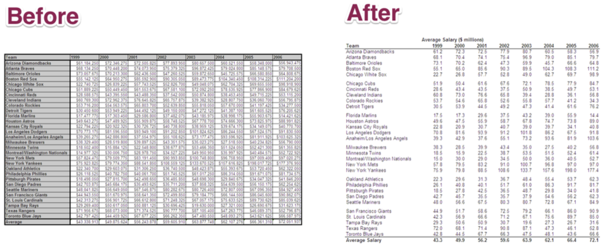
</center>
&nbsp; 

Which of these diagrams is easier to read?  

&nbsp;  
<center>

</center>
&nbsp;

And what about these basic scatterplots? Which is more effective and elegant?  

&nbsp;  
<center>

</center>


## Final thoughts  {-}  

To get a sense of what can be done with data visualization -- and just how enthusiastic data scientists can get about data viz -- enjoy this video by the Swedish epidemiologist **Hans Rosling,** the pioneer of **interactive data visualization**  (link [here](https://www.youtube.com/watch?v=jbkSRLYSojo&t=2s)).  

&nbsp;  

<iframe width="560" height="315" src="https://www.youtube.com/embed/jbkSRLYSojo" title="YouTube video player" frameborder="0" allow="accelerometer; autoplay; clipboard-write; encrypted-media; gyroscope; picture-in-picture" allowfullscreen></iframe>

&nbsp;  

As you go down the rabbit hole of data visualization, it will be important to become familiar with the work of **Edward Tufte**, the grandfather of thinking about data viz as an art form. This video showcases Tufte and other data scientists who have been inspired by his work (link [here](https://www.youtube.com/watch?v=AdSZJzb-aX8)).  

&nbsp;  

<iframe width="560" height="315" src="https://www.youtube.com/embed/AdSZJzb-aX8" title="YouTube video player" frameborder="0" allow="accelerometer; autoplay; clipboard-write; encrypted-media; gyroscope; picture-in-picture" allowfullscreen></iframe>

&nbsp;  


Finally, this video offers a nice and concise summary of Edward Tufte's principles of data visualization (link [here](https://www.youtube.com/watch?v=r7YdcZkS_1k)).

&nbsp;  

<iframe width="560" height="315" src="https://www.youtube.com/embed/r7YdcZkS_1k" title="YouTube video player" frameborder="0" allow="accelerometer; autoplay; clipboard-write; encrypted-media; gyroscope; picture-in-picture" allowfullscreen></iframe>

&nbsp;   
&nbsp;   

<center>

</center>


<!--chapter:end:02f-visualizing_data.Rmd-->

# (PART) Getting sta`r`ted {-}

# Setting up `RStudio`

First, let's get the right programs installed on your computer. Then we will explain what they are and why you need them.   


**First, download and install `R`: **   

Go to the following website, click the *Download* button, and follow the website's instructions from there.
[https://mirrors.nics.utk.edu/cran/](https://mirrors.nics.utk.edu/cran/){target="blank"}

&nbsp;

**Second, download and install `RStudio`:**    

Go to the following website and choose the free Desktop version:
[https://rstudio.com/products/rstudio/download/](https://rstudio.com/products/rstudio/download/){target="blank"}

&nbsp;

**Third, make sure `RStudio` opens successfully:**    

Open the `RStudio` app. A window should appear that looks like this:


&nbsp;

**Fourth, make sure `R` is running correctly in the background:**    

In `RStudio`, in the pane on the left (the "Console”), type 2+2 and hit Enter.  
If `R` is working properly, the number “4” will be printed in the next line down.

&nbsp;

**Finally, some minor adjustments to make `RStudio` run smoother (and look cooler):**

Go to `Tools > Global Options` and make sure your `General` settings match these exactly:


Specifically, **uncheck** the option under *Workspace* to 'Restore .RData into workspace at startup.'  

Now go to the `Appearance` settings and choose a cool theme!


**Boom!**  


&nbsp;  

```{r, results = 'asis', eval = ifelse(exists('is_teacher'),is_teacher,TRUE),echo=FALSE}
source('teacher_tip.R')

tip <- 'These installations can be clunky with a large class, and it is never fun to start out with a bunch of technical hang-ups. We recommend assigning this work **prior** to the start of the first class. Hold office hours the hour before class in order to troubleshoot one-on-one with students if they need help.'

teacher_tip(tip)
```

&nbsp;  


**Appendix, install supplementary software:**    

In order to install certain packages, you'll need to take one more step:

- On Windows, download http://cran.r-project.org/bin/windows/Rtools/ and run the installer
- On Mac, you need Xcode Command Line Tools. You might already have this. Check by running `devtools::has_devel()`. If You don't have it, open shell/terminal and run

```
xcode-select --install
```
- Alternatively, no Mac, you can download Xcode from the Mac App Store correctly: https://apps.apple.com/ca/app/xcode/id497799835?mt=12


<!--chapter:end:03a-getting_started.Rmd-->

# Running R code

#### Learning goals {-}

* Learn how to run code in R
* Learn how to use R as a calculator
* Learn how to use mathematical and logical operators in R

&nbsp;  

When you open `RStudio`, you see several different panes within the program's window. You will get a tour of `RStudio` in the next module. For now, look at the left half of the screen. You should see a large pane entitled the *Console*.   


`RStudio`'s *Console* is your window into `R`, the engine under the hood. The *Console* is where you type commands for `R` to run, and where `R` prints back the results of what you have told it to do. Think of the *Console* as a chatroom, where you and `R` talk back and forth.


## Running code in the *Console*  {-}

Type your first command into the *Console*, then press `Enter`:

```{r,echo=TRUE, collapse=TRUE}
1 + 1
```

When you press `Enter`, you send your line of code to `R`; you post it for `R` to see. Then `R` takes it, does some processing, and posts a result (`2`) just below your command.

Note that spaces don't matter. Both of the following two commands are legible to `R` and return the same thing:

```{r,echo=TRUE,collapse=TRUE}
4+4
```

```{r,echo=TRUE,collapse=TRUE}
4        +        4
```

However, it is better to make your code as easy to read as possible, which usually means using a single space between numbers:

```{r,echo=TRUE,collapse=TRUE}
4 + 4
```

Try typing in other basic calculations:

## Use R like a calculator {-}

As you can tell from those commands you just ran, `R` is, at heart, a fancy calculator.

Some calculations are straightforward, like addition and subtraction:

```{r,echo=TRUE,collapse=TRUE}
490 + 1000
```

```{r,echo=TRUE,collapse=TRUE}
490 - 1000
```

Division is pretty straightfoward too:

```{r,echo=TRUE,collapse=TRUE}
24 / 2
```

For multiplication, use an asterisk (`*`):

```{r,echo=TRUE,collapse=TRUE}
24 * 2
```

You denote exponents like this: 

```{r,echo=TRUE,collapse=TRUE}
2 ^2
```

```{r,echo=TRUE,collapse=TRUE}
2 ^3
```

```{r,echo=TRUE,collapse=TRUE}
2 ^4
```

Finally, note that `R` is fine with negative numbers:

```{r,echo=TRUE,collapse=TRUE}
9 + -100
```

```{r, results = 'asis', eval = ifelse(exists('is_teacher'),is_teacher,TRUE),echo=FALSE}
source('teacher_tip.R')

tip <- 'For a change of pace, call out complicated calculations and ask students to race to call out the correct result first.'

teacher_tip(tip)
```

## Getting along with `R` {-}

### Re-running code in the *Console* {-}

If you want to re-run the code you just ran, or if you want to recall the code so that you can adjust it slightly, click anywhere in the *Console* then press your keyboard's `Up` arrow.

If you keep pressing your `Up` arrow, `R` will present you with sequentially older commands. `R` keeps a history of everything you have said to it since you opened this window.

If you accidentally recalled an old command without meaning to, you can reset the *Console*'s command line by pressing `Escape`.


### Incomplete commands {-}

`R` gets confused when you enter an incomplete command, and will wait for you to write the remainder of your command on the next line in the *Console* before doing anything.

For example, try running this code in your *Console*:

```{r,eval=FALSE,echo=TRUE,collapse=TRUE}
45 +
```

You will find that `R` gives you a little `+` sign on the line under your command, which means it is waiting for you to complete your command.  

If you want to complete your command, add a number (e.g., `3)` and hit `Enter`. You should now be given an answer (e.g., `48`).  

Or, if instead you want `R` to stop waiting and stop running, just press the `Escape` key.


### Semicolons {-}

Semicolons can be used to put two separate commands on the same line of code. For example, these two lines of commands ...

```{r,echo=TRUE,eval=TRUE,collapse=TRUE}
4 + 5
6 + 10
```

.. will return the same results as this single line of commands:

```{r,echo=TRUE,eval=TRUE,collapse=TRUE}
4 + 5 ; 6 + 10
```

This will become a useful trick in a few modules downstream. 

### Getting errors {-}

`R` only understands your commands if they follow the rules of the `R` language (often referred to as its *syntax*). If `R` does not understand your code, it will throw an error and give up on trying to execute that line of code. 

For example, try running this code in your *Console*:

```{r,echo=TRUE,eval=FALSE,collapse=TRUE}
4 + y
```

You probably received a message in red font stating: `Error: object 'y' not found`. That is because `R` did know how to interpret the symbol `y` in this case, so it just gave up.

**Get used to errors!** They happen all the time, even (especially?) to professionals, and it is essential that you get used to reading your own code to find and fix its errors. 

Here's another piece of code that will produce an error:

```{r,echo=TRUE,eval=FALSE,collapse=TRUE}
dfjkltr9fitwt985ut9e3
```

### Using parentheses {-}

`R` is usually great about following classic rules for Order of Operations, and you can use parentheses to exert control over that order. For example, these two commands produce different results:  

```{r,echo=TRUE,collapse=TRUE}
2*7 - 2*5 / 2
```

```{r,echo=TRUE,collapse=TRUE}
(2*7 - 2*5) / 2
```

Note that parentheses need to come in pairs: whenever you type an open parenthesis, `(`, eventually you need to provide a corresponding closed parenthesis, `)`. 

The following line of code will return a plus sign, `+`, since `R` is waiting for you to close the parenthetical before it processes your command:

```{r,echo=TRUE,eval=FALSE,collapse=TRUE}
4 + (5
```

Remember: **parentheses come in pairs!** The same goes for other types of brackets: `{...}` and `[...]`.


### Using operators in R {-}

You can ask `R` basic questions using *operators*. 

For example, you can ask whether two values are equal to each other.

```{r,echo=TRUE,collapse=TRUE}
96 == 95
```

```{r,echo=TRUE,collapse=TRUE}
95 + 2 == 95 + 2
```

`R` is telling you that the first statement is `FALSE` (`96` is not, in fact, equal to `95`) and that the second statement is `TRUE` (`95 + 2` is, in fact, equal to itself).

**Note the use of *double* equal signs here.** You must use two of them in order for `R` to understand that you are asking for this logical test. 

You can also ask if two values are *NOT* equal to each other:

```{r,echo=TRUE,collapse=TRUE}
96 != 95
```

```{r,echo=TRUE,collapse=TRUE}
95 + 2 != 95 + 2
```

This test is a bit more difficult to understand: In the first statement, `R` is telling you that it is `TRUE` that `96` is different from `95`. In the second statement, `R` is saying that it is `FALSE` that `95 + 2` is not the same as itself.

Note that `R` lets you write these tests another, even more confusing way:

```{r,echo=TRUE,collapse=TRUE}
! 96 == 95
```

```{r,echo=TRUE,collapse=TRUE}
! 95 + 2 == 95 + 2
```

The first line of code is asking `R` whether it is not true that `96` and `95` are equal to each other, which is `TRUE`. The second line of code is asking `R` whether it is not true that `95 + 2` is the same as itself, which is of course `FALSE`.

Other commonly used operators in `R` include greater than / less than symbols (`>` and `<`, also known as the *left-facing alligator* and *right-facing alligator*), and greater/less than or equal to (`>=` and `<=`).

```{r,echo=TRUE,collapse=TRUE}
100 > 100
```

```{r,echo=TRUE,collapse=TRUE}
100 >= 100
```

```{r,echo=TRUE,collapse=TRUE}
(100 != 100) == FALSE
```


### Use built-in `R` functions {-}

`R` has some built-in "functions" for common calculations, such as finding square roots and logarithms. Functions are packages of code that take a given value, transform it according to some internal code instructions, and provide an output. You will learn more about functions in a few modules. 

To find the square-root of a number, use the 'squirt' command, `sqrt()`: 

```{r,echo=TRUE,collapse=TRUE}
sqrt(16)
```

Note the use of parentheses here. When you are calling a function, when you see parentheses, think of the word 'of'. You are taking the `sqrt` **of** the number inside the parenthetical.  

To get the log of a value:

```{r,echo=TRUE,collapse=TRUE}
log(4)
```

Note that the function `log()` is the *natural log* function (i.e., the value that *e* must be raised to in order to equal 4). To calculate a base-10 logarithm, use `log10( )`.

```{r,echo=TRUE,collapse=TRUE}
log(10)
```

```{r,echo=TRUE,collapse=TRUE}
log10(10)
```

Another handy function is `round()`, for rounding numbers to a specific number of decimal places.

```{r,echo=TRUE,collapse=TRUE}
100/3
```

```{r,echo=TRUE,collapse=TRUE}
round(100/3)
```

```{r,echo=TRUE,collapse=TRUE}
round(100/3,digits=1)
```

```{r,echo=TRUE,collapse=TRUE}
round(100/3,digits=2)
```

```{r,echo=TRUE,collapse=TRUE}
round(100/3,digits=3)
```

Finally, `R` also comes with some built-in *values*, such as `pi`:

```{r,echo=TRUE,collapse=TRUE}
pi
```


#### Exercises {-}

**Use `R` like a calculator**  

**1.** Type a command in the *Console* to determine the sum of 596 and 198.  

**2.** Re-run the sum of 596 and 198 without re-typing it.  

**3.** Recall the command again, but this time adjust the code to find the sum of 596 and 298.  

**4.** Practice escaping an accidentally called command: recall your most recent command, then press the right key to clear the *Console*'s command line.  

&nbsp;  
**Recalling commands**  

**5.** Find the sum of the ages of everyone in your immediate family.  

**6.** Now recall that command and adjust it to determine the *average* age of the members of your family.  

**7.** Find the square root of *pi* and round the answer to the 2 decimal places.

&nbsp;    

**Finding errors**  

**8.** This line of code won't run; instead, `R` will wait for more with a `+` symbol. Find the problem and re-write the code so that it works.  

```{r,echo=TRUE,eval=FALSE,collapse=TRUE}
5 * 6 +
```

**9.** The same goes for this line of code. Fix it, too.  

```{r,echo=TRUE,eval=FALSE,collapse=TRUE}
sqrt(16
```

**10.** This line of code will trigger an error. Find the problem and re-write the code so that it works.

```{r,echo=TRUE,eval=FALSE,collapse=TRUE}
round(100/3,digits+3)
```

**11.** Type a command of your own into R that throws an error, then recall the command and revise so that `R` can understand it.

&nbsp;  


**Show that the following statements are TRUE:**

**12.** `pi` is greater than the square root of 9  

**13.** It is FALSE that the square root of 9 is greater than `pi`  

**14.** `pi` rounded to the nearest whole number equals the square root of 9  

&nbsp;  

**Asking `TRUE` / `FALSE` questions**

**15.** Write and run a line of code that asks whether these two calculations return the same result:

```{r,eval=FALSE,echo=TRUE,collapse=TRUE}
2*7 - 2*5 / 2
```

```{r,echo=TRUE,collapse=TRUE}
(2*7 - 2*5) / 2
```

**16.** Now write and run a line of code that asks whether the first calculation is larger than the second:


&nbsp;

#### Other Resources {-}

Hobbes Primer, Table 1 (Math Operators, pg. 18) and Table 2 (Logical operators, pg. 22)

<!--chapter:end:03b-running_code.Rmd-->

# Using `RStudio` & `R` scripts

#### Learning goals {-}

* Understand the difference between `R` and `RStudio`
* Understand the `RStudio` working environment and window panes  
* Understand what `R` scripts are, and how to create and save them
* Understand how to add comments to your code, and why doing so is important
* Understand what a *working directory* is, and how to use it
* Learn basic project work flow


## `R` and `RStudio`: what's the difference? {-}

These two entities are similar, but it is important to understand how they are different.  

In short, `R` is a open-source (i.e., free) coding language: a powerful programming engine that can be used to do really cool things with data.  

`R Studio`, in contrast, is a free *user interface* that helps you interact with `R`. If you think of `R` as an engine, then it helps to think of `RStudio` as the car that contains it. Like a car,`RStudio` makes it easier and more comfortable to use the engine to get where you want to go.   

`R Studio` needs `R` in order to function, but `R` can technically be used on its own outside of `RStudio` if you want. However, just as a good car mechanic can get an engine to run without being installed within a car, using `R` on its own is a bit clunky and requires some expertise. For beginners (and everyone else, really), `R` is just so much more pleasant to use when you are operating it from within `RStudio`.  

```{r, results = 'asis', eval = ifelse(exists('is_teacher'),is_teacher,TRUE),echo=FALSE}
source('teacher_tip.R')

tip <- 'At this point it may be useful to show the students what opening `R` looks like on its own (not through `RStudio`). This helps them see why `RStudio` is valuable, and it will also help them understand what they did wrong when they accidentally open an `.R` file in `R` instead of `RStudio` -- which will happen a lot at first.'

teacher_tip(tip)
```

`RStudio` also has increasingly powerful *extensions* that make `R` even more useful and versatile in data science. These extensions allow you to use `R` to make interactive data dashboards, beautiful and reproducible data reports, presentations, websites, and even books. And new features like these are regularly being added to `RStudio` by its all-star team of data scientists.

That is why this book *always* uses `RStudio` when working with `R`.   


## Two-minute tour of `RStudio` {-}

When you open `RStudio` for the first time, you will see a window that looks like the screenshot below. 


### Console  {-}
You are already acquainted with `RStudio`'s *Console*, the window pane on the left that you use to "talk" to `R`. (See the previous module.)

### Environment  {-}
In the top right pane, the *Environment*, `RStudio` will maintain a list of all the datasets, variables, and functions that you are using as you work. The next modules will explain what variables and functions are.

### Files, Plots, Packages, & Help  {-}
You will use the bottom right pane very often. 

* The **Files** tab lets you see all the files within your **working directory**, which will be explained in the section below.  
* The **Plots** tab lets you see the plots you are producing with your code.  
* The **Packages** tab lets you see the *packages* you currently have installed on your computer. Packages are bundles of `R` functions downloaded from the internet; they will be explained in detail a few modules down the road.  
* The **Help** tab is very important! It lets you see *documentation* (i.e., user's guides) for the functions you use in your code. Functions will also be explained in detail a few modules down the road.

These three panes are useful, but the most useful window pane of all is actually *missing* when you first open `RStudio`. This important pane is where you work with **scripts**.

```{r, results = 'asis', eval = ifelse(exists('is_teacher'),is_teacher,TRUE),echo=FALSE}
source('teacher_tip.R')

tip <- 'We recommend speeding through this section; students will get to know these features as they become necessary. For now, you should move along to creating scripts as soon as you can.'

teacher_tip(tip)
```

## Scripts  {-}

Before explaining what scripts are and why they are awesome, let's start a new script.

**To start a new script,** go to the top left icon in the `RStudio` window, and click on the green plus sign with a blank page behind it:


A dropdown window will appear. Select "R Script".

A new window pane will then appear in the top left quadrant of your `RStudio` window:


You now have a blank script to work in!

Now type some simple commands into your script:

```{r,echo=TRUE,eval=FALSE,collapse=TRUE}
2  + 10
16 * 32
```

Notice that when you press `Enter` after each line of code, nothing happens in the *Console*. In order to send this code to the Console, press `Enter + Command` at the same time (or `Enter + Control`, if you are on Windows) for each line of code. 

To send both lines of code to the *Console* at once, select both lines of code and hit `Enter + Command`. 

(To select multiple lines of code, you can (1) click and drag with your mouse or (2) hold down your `Shift` key while clicking your down arrow key. To select *all* lines of code, press `Command + A`.)

```{r, results = 'asis', eval = ifelse(exists('is_teacher'),is_teacher,TRUE),echo=FALSE}
source('teacher_tip.R')

tip <- 'Get all students to practice running code at this point. The act of typing the commands themselves helps them learn and overcome their hesitation about messing up.'

teacher_tip(tip)
```

So let's build up this script. Add a few more lines to your script, such that your script now looks like this.

```{r,echo=TRUE,eval=FALSE,collapse=TRUE}
2  + 10
16 * 32
1080 / 360
500 - 600
```

Run all of these lines of code at once.  

Now add `10` to the first number in each row, and re-run all of the code.  

Think about how much more efficient part (B) was thanks to your script! If you had typed all of that directly into your *Console*, you would have to recall or retype each line individually. That difference builds up when your number of commands grows into the hundreds. 


### What is an `R` script, and why are scripts so awesome? {-}

An `R` script is a file where you can keep a record of your code. Just as a script tells actors exactly what to say and when to say it, an `R` script tells `R` exactly what code to run, and in what order to run it.

When working with R, you will almost always type your code into a script first, *then* send it to the *Console*. You can run your code immediately using `Enter + Command`, but you also have a script of what you have done so that you can run the exact same code at a later time 

To understand why `R` scripts are so awesome, consider a typical workflow in *Excel* of *GoogleSheets*. You open a big complicated spreadsheet, spend hours making changes, and save your changes frequently throughout your work session. 

The main disadvantages of this workflow are that:  

1. There is no detailed record of the changes you have made. You cannot prove that you have made changes correctly. You cannot pass the original dataset to someone else and ask them to revise it in the same way you have. (Nor would you want to, since making all those changes was so time-consuming!) Nor could you take a different dataset and guarantee that you are able to apply the exact same changes that you applied to the first. In other words, your work is not reproducible. 

2. Making those changes is labor-intensive! Rather than spend time manually making changes to a single spreadsheet, it would be better to devote that energy to writing `R` code that makes those changes for you. That code could be run in this one case, but it could also be run at any later time, or easily modified to make similar changes to other spreadsheets.  

3. Unless you are an advanced *Excel* programmer, you are probably modifying your original dataset, which is always dangerous and a big No-No in data science. Each time you save your work in *Excel* or *GoogleSheets* (which automatically saves each change you make), the original spreadsheet file gets replaced by the updated version. But if you brought your dataset into `R` instead, and modified it using an `R` script, then you leave the raw data alone and keep it safe. (Sure, you can always save different versions of your Excel file, but then you run the risk of mixing up versions and getting confused.)

```{r, results = 'asis', eval = ifelse(exists('is_teacher'),is_teacher,TRUE),echo=FALSE}
source('teacher_tip.R')

tip <- 'Consider telling a story from your own work life before you discovered R scripts. For example: receiving versions of Excel files named DATA-final-final-final.xlsx, because tiny changes are inevitably discovered after you try to finalize a data file. Then you work all weekend on an analysis using that data, only to discover you were using the WRONG version of the data!'

teacher_tip(tip)
```

Working with `R` scripts allows you to avoid all of these pitfalls. When you write an `R` script, you are making your work ....

* **Efficient.** Once you get comfortable writing `R` code, you will be able to write scripts in a few minutes. Those scripts can modify datasets within seconds (or less) in ways that would take hours (or years) to carry out manually in *Excel* or *GoogleSheets*.

* **Reproducible.** Once you have written an`R` script, you can reproduce your own work whenever you want to. You can send your script to a colleague so that they can reproduct your work as well. Reproducible work is defensible work.

* **Low-risk.** Since your R script does not make any changes to the original data, you are keeping your data safe. It is *essential* to preserve the sanctity of raw data!


Note that there is nothing fancy or special about an `R` script. An `R` script is a simple text file; that is, it only accepts basic text; you can't add images or change font style or font size in an `R` script; just letters, numbers, and your other keyboard keys. The file's extension, `.R` tells your computer to interpret that text as `R` code.

### Commenting your code {-}

Another advantage of scripts is that you can include *comments* throughout your code to explain what you are doing and why. A *comment* is just a part of your script that is useful to you but that is ignored by `R`. 

To add comments to your code, use the hashtag symbol (`#`). Any text following a `#` will be ignored by `R`.

Here is the script above, now with comments added: 

```{r,echo=TRUE,eval=FALSE,collapse=TRUE}
# Define variable x
x <- 2 
x

# Make a new variable, y, based on x
y <- x*56

z <- y / 23 # Make a third variable, z, based on y
 
x + y + z # Now get the sum of all three variables
```

Adding comments can be more work, but in the end it saves you time and makes your code more effective. Comments might not seem necessary in the moment, but it is amazing how helpful they are when you come back to your code the next day. Frequent and helpful comments make the difference between good and great code. Comment early, comment often!

You can also use lines of hashtags to visually organize your code. For example:

```{r,echo=TRUE,eval=FALSE,collapse=TRUE}
##############################################
# Setup
##############################################

# Define variable x
x <- 2 
x

# Make a new variable, y, based on x
y <- x*56

z <- y / 23 # Make a third variable, z, based on y
 

##############################################
# Get result
##############################################

x + y + z # Now get the sum of all three variables
```

This might not seem necessary with a 5-line script, but adding visual breaks to your code becomes immensely helpful when your code grows to be hundreds of lines long.

### Saving your work {-}

**`R` scripts are only useful if you save them!** Unlike working with *GoogleDocs* or *GoogleSheets*, `R` will not automatically save your changes; you have to do that yourself. (This is inconvenient, but it is also safer; most of coding is trial and error, and sometimes you want to be careful about what is saved.)

```{r, results = 'asis', eval = ifelse(exists('is_teacher'),is_teacher,TRUE),echo=FALSE}
source('teacher_tip.R')

tip <- 'Having grown up in the age of GoogleDocs, many students may not be familiar with what computer files are, and may not even know that their computer operates using directories of folders. It would be useful to open up File Explorer on your demo screen and show them how these directories work.'

teacher_tip(tip)
```

**Step 1: Decide where to save your work.** The folder in which you save your `R` script will be referred to as your *working directory* (see the next section). For the sake of these tutorials, it will be most convenient to save all of your scripts in a single folder that is in an easily accessed location. 

**Step 2: In that location, make a new folder named `datalab`**: We suggest making a new folder on your Desktop and naming it `datalab`, but you can name it whatever you want and place it wherever you want.

**Step 3: Save your script in that folder** To save the script you have opened and typed a few lines of code into, press `Command + S` (or `Control + S`). Alternatively, go to File > Save. Navigate to the folder you just created and type in a file name that is simple but descriptive. We suggest making a new `R` script for each module, and naming those scripts according to each module's name. In this case, we recommend naming your script `intro_to_scripts`. 

(It is good practice to avoid spaces in your file names; it will be essential later on, so good to begin the correct habit now. Start using an underscore, `_`, instead of a space.)


## Your working directory  {- #wd}

When you work with data in `R`, `R` will need to know where in your computer to look for that data. The folder it looks in is known as your **working directory**. 

To find out which folder `R` is currently using as your working directory, use the function `getwd()`:

```{r,echo=TRUE,collapse=TRUE}
getwd()
```

Almost always, you want to set your working directory to the folder your `R` script is in. 

### How to set your working directory {-}

Whenever you begin a new `R` script, setting your working directory will be one of the first things you do.   

There are three ways to set your working directory:

1. **Manually without code.** On the top banner in `RStudio`, go to *Session > Set Working Directory > To Source File Location*:


This action sets your working directory to the same folder that your `R` script is in. When you do this, you will see that a command has been entered into your *Console*:

```{r,echo=TRUE,eval=FALSE,collapse=TRUE}
setwd("~/Desktop/datalab")
```

(Note that the filepath may be different on your machine.) This code is using the function `setwd()`, which is also used in the next option. Go ahead and copy this `setwd(...)` code and paste it into your script, so it will be easy to use next time.

2. **Manually with code, using `setwd()`**: You can manually provide the filepath you want to set as your working directory. This option allows you to set your `wd` to whatever folder you want. The character string within the `setwd()` command is the path to a folder. The formatting of this string must be exact, otherwise `R` will throw an error. Use option 1 at first to get a sense of how your computer formats its folder paths. Copy, paste, and modify the output from option 1 in order to type your path correctly.

3. **Automatically with code**: There is a command you can run that automatically sets your working directory to the folder that your `R` script is in. This is the most efficient and useful method, in our experience. 

To use this command, you must first install a new package. Run this code:

```{r,echo=TRUE,eval=FALSE,collapse=TRUE}
install.packages("rstudioapi")
library(rstudioapi)
```

For now, you do not need to understand what this code is doing. We will explain packages and the `library()` function in a later module. 

You can now copy, paste, and run this code to set your working directory automatically:

```{r,echo=TRUE,eval=FALSE,collapse=TRUE}
setwd(dirname(rstudioapi::getActiveDocumentContext()$path))
```

This is a complicated line of code that you need not understand. As long as it works, it works! Confirm that `R` is using the correct working directory with the command `getwd()`.


## Typical workflows    {-}

Now that you know how to create a script and set your working directory, you are prepared to work on data projects in `RStudio`. 

The workflow for beginning a new data project typically goes like this:  

*In your file explorer...*  

1. **Create a folder for your project** somewhere on your computer. This will become your working directory.  

2. **Create subfolders** within your working directory, if you want. We recommend creating a `data` subfolder, for keeping data, and a `z` subfolder, for keeping miscellaneous documents. The goal is to keep your working directory visually simple and organized; ideally, the only files not within subfolders are your `R` scripts.

3. **Add data** to your working directory, if you have any.

*In `RStudio` ...*

4. **Create a new `R` script.**

5. **Save it** inside your intended working directory. 

6. At the top of your script, use comments to **add a title, author info, and brief description.**

7. Add the code to **set your working directory.**

8. **Begin coding!**


### Template `R` script {-}

Here is a template you can use to copy and paste into each new script you create:

```{r, echo=TRUE,eval=FALSE,collapse=TRUE}
################################################################################
# < Add title here >
################################################################################
#
# < Add brief description here >
#
# < Author >
# Created on <add date here >
#
################################################################################
# Set working directory
setwd(dirname(rstudioapi::getActiveDocumentContext()$path))

################################################################################
################################################################################
# Code goes here


################################################################################
# (end of file)
```


#### Exercises {-}

**1** *(if not already complete)*. Create a working directory for this course. Call it whatever you like, but `datalab` could work great. Place it somewhere convenient on your computer, such as your Desktop.  

**2.** Within this working directory, create three new folders: (1) a `data` folder, which is where you will store the data files we will be using in subsequent modules; (2) a `modules` folder, which is where you will keep the code you use to work on the material in these modules, and (3) a `project` folder, which is where you will keep all your work associated with your summer project.  

**3.** Now follow the *Typical Workflow* instructions above to create a script. Save it within your `modules` folder. Name it `template.R`. Copy and paste the template `R` code provided above into this file, and save it. This is now a template that you can use to easily create new scripts for this course.

**4.** Now make a copy of `template.R` to stage a script that you can use in the next module. To do so, in `RStudio` go to the top banner and click `File > Save As`. Save this new script as `variables.R` (because the next module is called *Variables in `R`*). 

**5.** Modify the code in `variables.R` so that you are prepared to begin the next module. Change the title, and look ahead to the next module to fill in a brief description. Don't forget to add your name as the author and specify today's date.

Boom!


#### Other Resources  {-}

[A Gentle Introduction to `R` from the `RStudio` team](https://www.rstudio.com/resources/webinars/a-gentle-introduction-to-tidy-statistics-in-r/){target="blank"}


<!--chapter:end:03c-rstudio_tour.Rmd-->

# Variables

#### Learning goals {-}

* How to define variables and work with them in `R`  
* Learn the various possible classes of data in `R`  

## Introducing variables {-}

So far we have strictly been using `R` as a calculator, with commands such as: 

```{r,echo=TRUE,collapse=TRUE}
3 + 5
```

Of course, `R` can do much, much more than these basic computations. Your first step in uncovering the potential of `R` is learning how to use **variables**.

In `R`, a variable is a convenient way of referring to an underlying value. That value can be as simple as a single number (e.g., `6`), or as complex as a spreadsheet that is many Gigabytes in size. It may be useful to think of a variable as a cup; just as cups make it easy to hold your coffee and carry it from the kitchen to the couch, variables make it easy to contain and work with data.

### Declaring variables {-}

To assign numbers or other types of data to a variable, you use the `<` and `-` characters to make the arrow symbol `<-`.

```{r,echo=TRUE,collapse=TRUE}
x <- 3+5
```

As the direction of the `<-` arrow suggests, this command stores the result of `3 + 5` into the variable `x`.

Unlike before, you did not see `8` printed to the *Console*. That is because the result was stored into `x`.


### Calling variables {-}

If you wanted R to tell you what `x` is, just type the variable name into the *Console* and run that command:

```{r,echo=TRUE,collapse=TRUE}
x
```

Want to create a variable but also see its value at the same time? Here's a handy trick: put your command in parentheses:

```{r,echo=TRUE,collapse=TRUE}
(x <- 3*12)
```

When you do that, `x` gets assigned a value, then that value is printed to the console.

You can also update variables.

```{r,echo=TRUE,collapse=TRUE}
(x <- x * 3)
```

```{r,echo=TRUE,collapse=TRUE}
(x <- x * 3)
```

You can also add variables together.

```{r,echo=TRUE,collapse=TRUE}
x <- 8
y <- 4.5
x + y
```

### Naming variables  {-}

Here are a few rules:  

**1.** A variable name has to have at least one letter in it. These examples work:

**2.** A variable name has to be connected. No spaces! It is usually best to represent a space using a period (`.`) or an underscore (`_`). Note that periods and underscores can be used in variable names:

```{r,echo=TRUE,collapse=TRUE}
my.variable <- 5 # periods can be used
my_variable <- 5 # underscores can be used
```

However, hyphens *cannot* be used, since that symbol is used for subtraction.

**3.** Variables are case-sensitive. If you misspell a variable name, you will confuse `R` and get an error.  For example, ask `R` to tell you the value of capital `X`. The error message will be `Error: object 'X' not found`, which means `R` looked in its memory for an object (i.e., a variable) named `X` and could not find one.

**4.** Variable names can be as complicated or as simple as you want. 

**5.** Some names need to be avoided, since `R` uses them for special purposes. For example, `data` should be avoided, as should `mean`, since both are functions built-in to `R` and `R` is liable to interpret them as such instead of as a variable containing your data.

```{r,echo=TRUE,collapse=TRUE}
supercalifragilistic.expialidocious <- 5
supercalifragilistic.expialidocious  # still works
```

So those are the basic rules, but naming variables well is a bit of an art. The trick is using names that are clear but are not so complicated that typing them is tedious or prone to errors.

Note that `R` uses a feature called 'Tab complete' to help you type variable names. Begin typing a variable name, such as `supercalifragilistic.expialidocious` from the example above, but after the first few letters press the `Tab` key. `R` will then give you options for auto-completing your word. Press `Tab` again, or `Enter`, to accept the auto-complete. This is a handy way to avoid typos.


## Types of data in `R` {-}

So far we have been working exclusively with numeric data. But  there are many different data types in R. We call these “types” of data **classes**:

* Decimal values like 4.5 are called **numeric** data.
* Natural numbers like 4 are called **integers**. Integers are also numerics.
* Boolean values (TRUE or FALSE) are called **logical** data.
* Text (or string) values are called **character** data.

In order to be combined, data have to be the same class. 

R is able to compute the following commands ...

```{r,echo=TRUE,collapse=TRUE}
x <- 6
y <- 4
x + y
```

... but not these:

```{r eval=FALSE,echo=TRUE,collapse=TRUE}
x <- 6
y <- "4"
x + y
```

That's because the quotation marks used in naming `y` causes `R` to interpret `y` as a `character` class.

To see how `R` is interpreting variables, you can use the `class()` function:

```{r,echo=TRUE,collapse=TRUE}
x <- 100
class(x)
```

```{r,echo=TRUE,collapse=TRUE}
x <- "100"
class(x)
```

```{r,echo=TRUE,collapse=TRUE}
x <- 100 == 101
class(x)
```

Another data type to be aware of is **factors**, but we will deal with them later.

#### Exercises {-}

**Finding the errors**  

**1.** This code will produce an error. Can you find the problem and fix it so that this code will work?

```{r,echo=TRUE,eval=FALSE,collapse=TRUE}
# Assign 5 to a variable
my_var < 5
```

**2.** Same for this one:

```{r,echo=TRUE,eval=FALSE,collapse=TRUE}
# Assign 5 to a variable
my_var == 5
```

**3.** Same for this one:
```{r,echo=TRUE,eval=FALSE,collapse=TRUE}
x <- 5
y <- 1
X + y
```

&nbsp;  

**Your Bananas-to-ICS ratio**

**4.** Estimate how many bananas you've eaten in your lifetime and store that value in a variable (choose whatever name you wish). (By the way, what is a good method for estimating this as accurately as you can?)

**5.** Now estimate how many ice cream sandwiches you've eaten in your lifetime and store that in a different variable.  
**6.** Now use these variables to calculate your Banana-to-ICS ratio. Store your result in a third variable, then call that variable in the Console to see your ratio.  

**7.** Who in the class has the highest ratio? Who has the lowest?  

&nbsp;  


**Creating boolean variables**

**8.** Assign a `FALSE` statement of your choosing to a variable of whatever name you wish.  

**9.** Confirm that the class of this variable is “logical.”  

**10.** Confirm that the variable equals `FALSE`.  

&nbsp;  


**Converting Farenheit to Celsius:**  

**11.** Assign a variable `farenheit` the numerical value of 32.  

**12.** Assign a variable `celsius` to equal the conversion from Fahrenheit to Celsius. Unless your a meteorology nerd, you may need to Google the equation for this conversion. 

**13.** Print the value of `celsius` to the *Console*.  

**14.** Now use this code to determine the *Celsius* equivalent of 212 degrees *Farenheit*.

&nbsp;  

**Wrapping up**

**15.** Now ensure that your entire script is properly commented, and make sure your script is saved in your `datalab` working directory before closing.

<!--chapter:end:03d-objects.Rmd-->

# Vectors

#### Learning goals {-}

* Learn the various structures of data in `R`  
* How to work with vectors in `R`  

&nbsp;

Data belong to different *classes*, as explained in the previous module, and they can be arranged into various **structures**. 

So far we have been dealing only with variables that contain a single value, but the real value of `R` comes from assigning *entire sets* of data to a variable. 

The simplest data structure in `R` is a **vector**. A vector is simply a set of values. A vector can contain only a single value, as we have been working with thus far, or it can contain many millions of values. 


## Declaring and using vectors {-}

To build up a vector in `R`, use the function `c()`, which is short for "concatenate".

```{r,echo=TRUE,collapse=TRUE,collapse=TRUE}
x <- c(5,6,7,8)
x
```

Whenever you use the `c()` function, you are telling `R`: 'Hey, get ready. I'm about to give you more than one value at once.'.  

You can use the `c()` function to concatenate two vectors together:

```{r,echo=TRUE,collapse=TRUE,collapse=TRUE}
x <- c(5,6,7,8)
y <- c(9,10,11,12)
z <- c(x,y)
z
```

You can also use `c()` to add values to a vector:

```{r,echo=TRUE,collapse=TRUE,collapse=TRUE}
x <- c(5,6,7,8)
x <- c(x,9)
x
```

You can also put vectors through logical tests:

```{r,echo=TRUE,collapse=TRUE,collapse=TRUE}
x <- c(1,2,3,4,5)
4 == x
```

This command is asking `R` to tell you whether each element in `x` is equal to `4`. 

```{r, results = 'asis', eval = ifelse(exists('is_teacher'),is_teacher,TRUE),echo=FALSE}
source('teacher_tip.R')

tip <- 'One way to demonstrate this concept: Ask a single student whether they are 22 years old (ask them to answer `TRUE` or `FALSE`). Then ask the room the same question. Each student will respond `TRUE` or `FALSE`. This is the same as comparing a single value to a long vector.'

teacher_tip(tip)
```

You can create vectors of any data class (i.e., data type).

```{r,echo=TRUE,collapse=TRUE,collapse=TRUE}
x <- c("Ben","Joe","Eric") 
x
```

```{r,echo=TRUE,collapse=TRUE}
y <- c(TRUE,TRUE,FALSE)
y
```

Note that all values within a vector *must* be of the same class. You can't combine numerics and characters into the same vector. If you did, `R` would try to convert the numbers to characters.  For example:

```{r,echo=TRUE,collapse=TRUE,collapse=TRUE}
x <- 4
y <- "6"
z <- c(x,y)
z
```

## Math with two vectors {-}

When two vectors are of the same length, you can do arithmetic with them:

```{r,echo=TRUE,collapse=TRUE,collapse=TRUE}
x <- c(5,6,7,8)
y <- c(9,10,11,12)
x + y
```

```{r,echo=TRUE,collapse=TRUE}
x - y
```

```{r,echo=TRUE,collapse=TRUE}
x * y
```

```{r,echo=TRUE,collapse=TRUE}
x / y
```

**What happens when two vectors are *not* the same length?**

Well, it depends. If one vector is length 1 (i.e., a single number), then things usually work out well. 

```{r,echo=TRUE,collapse=TRUE}
x <- 5
y <- c(1,2,3,4,5,6,7,8,10)
x + y
```

In this command, the single element of `x` gets added to each element of `y`. 

Another example, which you already saw above:

```{r,echo=TRUE,collapse=TRUE}
a <- c(1,2,3,4,5)
b <- 4
a == b
```

In this command, the single element of `b` gets compared to each element of `a`.

However, when both vectors contain multiple values but are not the same length, **be warned**: wonky things can happen. This is because `R` will start recycling the shorter vector:

```{r,echo=TRUE,collapse=TRUE}
a <- c(1,2,3,4,5)
b <- c(3,4)
a + b
```

As this warning implies, this doesn't make much sense. The command will still run, but do not trust the result. 


## Functions for handling vectors  {-}

We are about to list a bunch of core functions for working with vectors. Think of this like a toolbag. Each tool has a specific purpose and limited value: you can't quite build a house with just a hammer. But when you learn how to use all of the tools in your tool bag *together*, you can build almost anything. But you have to know how to use each tool individually first.


**`length()`** tells you the number of elements in a vector:

```{r,echo=TRUE,collapse=TRUE}
x <- c(5,6)
length(x)
```

```{r,echo=TRUE,collapse=TRUE}
y <- c(9,10,11,12)
length(y)
```

The **colon symbol `:`** creates a vector with every integer occurring between a min and max:

```{r,echo=TRUE,collapse=TRUE,collapse=TRUE}
x <- 1:10
x
```

**`seq()`** allows you to build a vector using evenly spaced *sequence* of values between a min and max:

```{r,echo=TRUE,collapse=TRUE,collapse=TRUE}
seq(0,100,length=11)
```

In this command, you are telling `R` to give you a sequence of values from `0` to `100`, and you want the length of that vector to be `11`. `R` then figures out the spacing required between each value in order to make that happen. 

Alternatively, you can prescribe the interval between values instead of the length:

```{r,echo=TRUE,collapse=TRUE,collapse=TRUE}
seq(0,100,by=7)
```

**`rep()`** allows you to repeat a single value a specified number of times:

```{r,echo=TRUE,collapse=TRUE,collapse=TRUE}
rep("Hey!",times=5)
```

You can also use `rep()` to repeat each element of a vector a set number of times:

```{r,echo=TRUE,collapse=TRUE,collapse=TRUE}
rep(c("Hey!","Wohoo!"),each=3)
```

**`head()`** and **`tail()`** can be used to retrieve the first 6 or last 6 elements in a vector, respectively.

```{r,echo=TRUE,collapse=TRUE,collapse=TRUE}
x <- 1:1000
head(x)
tail(x)
```

You can also adjust how many elements to return:

```{r,echo=TRUE,collapse=TRUE}
head(x,2)
tail(x,10)
```

**`sort()`** allows you to order a vector from its smallest value to its largest:

```{r,echo=TRUE,collapse=TRUE}
x <- c(4,8,1,6,9,2,7,5,3)
sort(x)
```

**`rev()`** lets you reverse the order of elements within a vector:

```{r,echo=TRUE,collapse=TRUE}
x <- c(4,8,1,6,9,2,7,5,3)
rev(x)
```

```{r,echo=TRUE,collapse=TRUE}
rev(sort(x))
```

**`min()`** and **`max()`** lets you find the smallest and largest value in a vector.

```{r,echo=TRUE,collapse=TRUE}
min(x)
```

```{r,echo=TRUE,collapse=TRUE}
max(x)
```

**`which()`** allows you to ask, "For which elements of a vector is the following statement true?"

```{r,echo=TRUE,collapse=TRUE}
x <- 1:10
which(x==4)
```

If no values within the vector meet the condition, a vector of length zero will be returned:

```{r,echo=TRUE,collapse=TRUE}
x <- 1:10
which(x == 11)
```

**`which.min()`** and **`which.max()`** tells you which element is the smallest and largest in the vector, respectively:

```{r,echo=TRUE,collapse=TRUE}
which.min(x)
```

```{r,echo=TRUE,collapse=TRUE}
which.max(x)
```

**`%in%`** is a handy operator that allows you to ask whether a value occurs *within* a vector:

```{r,echo=TRUE,collapse=TRUE}
x <- 1:10
4 %in% x
```

```{r,echo=TRUE,collapse=TRUE}
11 %in% x
```

**`is.na()`** is a way of asking whether a vector contains missing, broken, or erroneous values. In `R`, such values are referred to using the phrase `NA`. When you see `NA`, think of `R` telling you, *'Nah ah! Nope! Not Available!'*

```{r,echo=TRUE,collapse=TRUE}
x <- c(3,5,7,NA,9,4)
is.na(x)
```

This function is stepping through each element in the vector `x` and telling you whether that element is `NA`. 


## Subsetting vectors {-}

Since you will eventually be working with vectors that contain thousands of data points, it will be useful to have some tools for *subsetting* them -- that is, looking at only a few select elements at a time.

You can subset a vector using square brackets `[ ]`. Whenever you use you use brackets, you are telling `R`: 'Hey, I want some numbers, but *not everything*: just certain ones.'

```{r,echo=TRUE,collapse=TRUE}
x <- 50:100
x[10]
```

This command is asking `R` to return the 10th element in the vector `x`.

```{r,echo=TRUE,collapse=TRUE}
x[10:20]
```

This command is asking `R` to return elements `10:20` in the vector `x`. 

```{r, results = 'asis', eval = ifelse(exists('is_teacher'),is_teacher,TRUE),echo=FALSE}
source('teacher_tip.R')

tip <- 'For a change of pace, call out complicated subsetting calculations and ask students to race to call out the correct result first. For example: <br> Make a vector of all integers, 51 to 151. <br> What is the 10th element divided by the 3rd element? <br> What is the seventieth element plus the thirty-first element? <br> What is the average of the fortieth through sixtieth elements? <br> Etc.  '

teacher_tip(tip)
```

#### Exercises {-}

**Creating sequences of numbers**  

1. Use the colon symbol to create a vector of length 5 between a minimum and a maximum value of your choosing.    

2. Create a second vector of length 5 using the `seq()` function. Use code to confirm that the length of this vector is 5.  

3. Create a third vector of length 5 using the `rep()` function. Use code to confirm that the length of this vector is 5.  

4. Finally, concatenate the three vectors and check that the length equals 15.  

&nbsp;  

**Basic vector math**

5.  Create a variable `x` that is a list of numbers of any size. Create a variable `y` of the same length.  

6. Check to see if each values of `x` is greater than each value of y.  
  
7. Check to see if the smallest value of `x` is greater than or equal to the average value of `y`.  

&nbsp;  

**Vectors and object classes**  

8. Create a vector with at least one number, then a second vector with at least one character string, then a third vector with at least one logical value. Identify the class of all three vectors.  

9. Now concatenate these three vectors into a fourth vector. Identify the class of this fourth vector.  


&nbsp;  

**Heads & tails**  

10. Create a vector with at least 15 values.  

11. Show the first six values of that vector using the `head()` function.   

12. Figure out how to show the same result without a function, but instead with your new vector subsetting skills. 
Now replicate the `tail()` function, using those same skills. You may need to call the `length()` function as well.  

&nbsp;  

**Shoe sizes**  

13. Create a vector called `shoes`, which contains the shoe sizes of five people sitting near you. Use comments to keep track of which size is whose.  

14. Arrange this set of shoe sizes in ascending order.  

15. Arrange this set of shoe sizes in descending order.  

16. Use code to find the the two largest shoe sizes in your vector. Don't use subsetting; instead, write a line of code that would work even if more shoes were added to your vector.  

17. What is the shoe size is closest to the mean of these shoe sizes?  

18. Use the `which()` function to figure out which of your five neighbors this shoe size belongs to.  

&nbsp;  

**Swimming timelines**  

19. Now create a new vector called `swim_days`, which contains the number of days since those same five people last went swimming (in any body of water; estimating the days since is fine).  

20. Use code to ask whether anyone went swimming less than five days ago.  

21. Which of your neighbors, if any, went swimming in the last month?  

22. Which of your neighbors, if any, have not been swimming the last month?  

23. On average, how long has it been since these people have gone swimming?  

&nbsp;  

**Dealing with `NA`s**  

24. Create a vector named `x` with these values: `c(4,7,1,NA,9,2,8)`.  

25. Use a function to decide whether or not each element of `x` is `NA`.  

26. Use another function to find out which element in `x` is `NA`.  

27. Write code that will subset `x` only to those values that are `NA`.  

28. Write code that will subset `x` only to those values that are *not* `NA`.  

&nbsp;  

**Sleep deficits**  

29. Now create a vector called `sleep_time` with the number of hours you slept for each day in the last week.  

30. Check if you slept more on day 3 than day 7. 

31. Get the total number of hours slept in the last week.    

32. Get the average number of hours slept in the last week.    

33. Check if the total number of hours in the first 3 days is less than the total number of hours in the last 4 days.  

34.  Now create an object named `over_under`. This should be the difference between how much you slept each night and 8 hours (ie, 1.5 means you slept 9.5 hours and -2 means you slept 8 hours).  

35. Write code to use `over_under` to calculate your sleep deficit / surplus this week (ie, the total hours over/under the amount of sleep you would have gotten had you slept 8 hours every night).  

36. Write code to get the minimum number of hours you slept this week.  

37. Write code to calculate how many hours of sleep you would have gotten had you sleep the minimum number of hours every night.  

38. Write code to calculate the average of the hours of sleep you got on the 3rd through 6th days of the week.  

39. Write code to calculate how many hours of sleep you would get in a year if you were to sleep the same amount every night as the average amount you slept from the 3rd to 6th days of the week.  

40. Write code to calculate how many hours of sleep per year someone who sleeps 8 hours a night gets.  

41. How many hours more/less than the 8 hours per night sleeper do you get in a year, assuming you sleep every night the average of the amount you slept on the first and last day of this week?  

42. What is your total sleep deficit for the last week?

43. How many more hours per night, on average, do you need to sleep for the rest of the month so that, by the end of the month, you have a sleep deficit of zero?  


<!--chapter:end:03e-vectors.Rmd-->

# Calling functions {#calling_functions}

#### Learning goals {-}

* Understand what functions are, and why they are awesome
* Understand how functions work
* Understand how to read function documentation

&nbsp;

You have already worked with many `R` functions; commands like `getwd()`, `length()`, and `unique()` are all functions. You know a command is a function because it has parentheses, `()`, attached at its end.

Just as **variables** are convenient names used for calling *objects* such as vectors or dataframes, **functions** are convenient names for calling *processes* or *actions*. An `R` function is just a batch of code that performs a certain action.  

Variables represent data, while functions represent code.  

Most functions have three key components: (1) one or more inputs, (2) a process that is applied to those inputs, and (3) an output of the result. When you call a function in `R`, you are saying, "Hey `R`, take this information, do something to it, and return the result to me." You supply the function with the inputs, and the function takes care of the rest.

Take the function `mean()`, for example. `mean()` finds the arithmetic mean (i.e., the average) of a set of values.

```{r,echo=TRUE,collapse=TRUE}
x <- c(4,6,3,2,6,8,5,3) # create a vector of numbers
mean(x) # find their mean
```

In this command, you are feeding the function `mean()` with the input `x`. 

Perhaps this analogy will help: When you think of functions, think of vending machines: you give a vending machine two inputs -- your money and your snack selection -- then it checks to see if your selection of choice is in stock, and if the money you provided is enough to pay for the snack you want. If so, the machine returns one output (the snack).   

### Base functions in `R` {-}

There are hundreds of functions already built-in to `R`. These functions are called *"base functions"*. Throughout these modules, we have been -- and will continue -- introducing you to the most commonly used base functions.

You can access other functions through bundles of external code known as *packages*, which we explain in an upcoming module. 

You can also write your *own* functions (and you will!). We provide an entire module on how to do this.

Note that not all functions require an input. The function `getwd()`, for example, does not need anything in its parentheses to find and return current your working directory.

### Saving function output  {-}

You will almost always want to save the result of a function in a new variable. Otherwise the function just prints its result to the *Console* and `R` forgets about it.  

You can store a function result the same way you store any value:  

```{r,echo=TRUE,collapse=TRUE}
x <- c(4,6,3,2,6,8,5,3) 
x_mean <- mean(x) 
x_mean
```

### Functions with multiple inputs {-}

Note that `mean()` accepts a second input that is called `na.rm`. This is short for `NA.remove`. When this is set to `TRUE`, `R` will remove broken or missing values from the vector before calculating the mean.

```{r,echo=TRUE,eval=TRUE,collapse=TRUE}
x <- c(4,6,3,2,NA,8,5,3)  # note the NA
mean(x,na.rm=TRUE)
```

If you tried to run these commands with `na.rm` set to `FALSE`, `R` would throw an error and give up.  

Note that you provided the function `mean()` with two inputs, `x` and `na.rm`, and that you separated each input with a comma. This is how you pass multiple inputs to a function.  

```{r, results = 'asis', eval = ifelse(exists('is_teacher'),is_teacher,TRUE),echo=FALSE}
source('teacher_tip.R')

tip <- 'A silly way to remember the `na.rm` input is to refer to it as "narm", as in, "Dont forget to narm, yall"'

teacher_tip(tip)
```

### Function defaults {-}

Note that many functions have default values for their inputs. If you do not specify the input's value yourself, `R` will assume you just want to use the default. In the case of `mean()`, the default value for `na.rm` is `FALSE`. This means that the following code would throw an error ...

```{r,echo=TRUE,eval=TRUE,collapse=TRUE}
x <- c(4,6,3,2,NA,8,5,3)  # note the NA
mean(x)
```

Because `R` will assume you are using the default value for `na.rm`, which is `FALSE`, which means you do not want to remove missing values before trying to calculate the mean.


### Function documentation (i.e., getting help) {-}

Functions are designed to accept only a certain number of inputs with only certain names. To figure out what a function expects in terms of inputs, and what you can expect in terms of output, you can call up the function's help page:

```{r,echo=FALSE,collapse=TRUE}
?mean
```

When you enter this command, the help documentation for `mean()` will appear in the bottom right pane of your `RStudio` window: 


Learning how to read this documentation is essential to becoming competent in using `R`.  

**Be warned:** not all documentation is easy to understand! You will come to really resent poorly written documentation and really appreciate well-written documentation; the few extra minutes taken by the function's author to write good documentation saves users around the world hours of frustration and confusion.

*  The `Title` and `Description` help you understand what this function does.  

* The `Usage` section shows you how type out the function.

* The `Arguments` section lists out each possible argument (which in `R` lingo is another word for *input* or *parameter*), explains what that input is asking for, and details any formatting requirements. 

* The `Value` section describes what the function returns as output. 

* At the bottom of the help page, example code is provided to show you how the function works. You can copy and paste this code into your own script of *Console* and check out the results.

Note that more complex functions may also include a `Details` section in their documentation, which gives more explanation about what the function does, what kinds of inputs it requires, and what it returns.  


### Function examples  {-}

`R` comes with a set of base functions for **descriptive statistics**, which provide good examples of how functions work and why they are valuable. 

We can use the same vector as the input for all of these functions:  

```{r,echo=TRUE,collapse=TRUE}
x <- c(4,6,3,2,NA,8,9,5,6,1,9,2,6,3,0,3,2,5,3,3)  # note the NA
```

**`mean()`** has been explained above.  

```{r,echo=TRUE,collapse=TRUE}
result <- mean(x,na.rm=TRUE)
result
```

**`median()`** returns the median value in the supplied vector:  

```{r,echo=TRUE,collapse=TRUE}
result <- median(x,na.rm=TRUE)
result
```

**`sd()`** returns the standard deviation of the supplied vector:  

```{r,echo=TRUE,collapse=TRUE}
result <- sd(x,na.rm=TRUE)
result
```

**`summary()`** returns a vector that describes several aspects of the vector's distribution:  

```{r,echo=TRUE,collapse=TRUE}
result <- summary(x,na.rm=TRUE)
result
```


#### Exercises {-}

**Sock survey**  
You conducted a survey of your peers in this class, asking each of them how many pairs of socks they own. Most of your peers responded, but one person refused to tell you. Instead of giving you a number, they told you, "Nah!". 

Your results look like this: 

```{r,echo=TRUE,collapse=TRUE}
# People you asked
peers <- c('Keri','Eric','Joe','Ben','Matthew','Jim')

# Their responses
socks <- c(6,8,14,1,NA,4)
```

**1.** Calculate the average pairs of socks owned by your peers.

**2.** Calculate the total pairs of socks owned by cooperative students in this class.

**3.** Use code to find the name of the person who refused to tell you about their socks.

**4.** Use code to find the names of the people who were willing to cooperate with your survey.

**5.** Use code to find the name of the person with the most socks.

**6.** Use code to find the name of the person with the fewest socks.

&nbsp;  

**Age survey**

**7.** Create a vector named `years` with the years of birth of everyone in the room.

**8.** What is the average year of birth?

**9.** What is the median year of birth?

**10.** Create a vector called `ages` which is the (approximate) age of each person. 

**11.** What is the minimum age?

**12.** What is the maximum age?

**13.** What is the median age?

**14.** What is the average age?

**15.** "Summarize" `ages`.

**16.** What is the range of ages?

**17.** What is the standard deviation of ages?

**18.** Look up help on the function `sort()`.

**19.** Created a vector called `sorted_ages`. It should be, well, sorted ages.

**20.** Look up the `length()` function.

**21.** How many people are the group?

**22.** Create an object called `old`. Assign to this object an age (such as 36) at which someone should be considered "old".

**23.** Create an object called `old_people`. This should be a boolean/logical vector indicating if each person is old or not.

**24.** Is the seventh person in `ages` old?

**25.** How many years from being old or young is person 12?

&nbsp;  

**Rolling the dice**  

**26.** Look up the help page for the function `sample()`.  

Here's an example of how this function works. This line of code will sample a single random number from the vector `1:10`.

```{r,echo=TRUE,collapse=TRUE}
sample(1:10,size=1)
```

This command will draw three random samples:

```{r,echo=TRUE,collapse=TRUE}
sample(1:10,size=3)
```

**27.** Use this function to simulate the rolling of a single die.

**28.** Now use this to simulate the rolling of a die 10 times. (*Note:* look at the `replace` input for `sample()`.)

**29.** Now use this to roll the die 10,000 times, and assign the result to a new variable. (*Note:* look at the `replace` input for `sample()`.)

**30.** Look up the help page for the function `table()`.  

**31.** Use the `table()` function to ask whether the diel you rolled in question 29 is fair, or if it is weighted or biased toward a certain side. Can you describe what the `table()` function is doing?   

**30.** Now use the `sample()` function to solve a different problem: your friends want to order take out from the Tavern, but no one in your group of 4 wants to be the one to go pick it up. Write code that will randomly select who has to go.


<!--chapter:end:03ef-call_functions.Rmd-->

# Subsetting & filtering 

#### Learning goals {-}

* Understand how to subset / filter data

&nbsp;  

You have been introduce to subsetting and filtering briefly in previous modules, but it is such an important concept that we want to devote an entire module to practicing it.  

## Subsetting with indices {-}

You have already learned that certain elements of a vector can be called by specifying an index:

```{r, echo = T,collapse=T}
x <- 55:65

# Call x without subsetting
x
```

```{r, echo = T,collapse=T}
# Now call only the third element of x
x[3]
```

Remember: brackets indicate that you don't want everything from a vector; you just want certain elements. 'I want `x`, *but not all of it.*'

You can also subset an object by calling multiple indices:

```{r, echo = T,collapse=T}
# Now call the third, fourth, and fifth element of x
x[c(3,4,5)]
```

```{r, echo = T,collapse=T}
# Another way of doing the same thing:
x[3:5]
```

## Subsetting with booleans {-}

You can also subset objects with 'booleans'. This will eventually be your most common way of filtering data, by far.   

Recall that boolean / logical data have two possible values: `TRUE` or `FALSE`. For example:

```{r, echo = T,collapse=T}
# Store Joe's age
joes_age <- 35

# Set the cutoff for old age
old_age <- 36

# Ask whether Joe is old
joes_age >= old_age
```

Recall also that you can calculate whether a condition is `TRUE` or `FALSE` on multiple elements of a vector. For example:

```{r, echo = T,collapse=T}
# Build a vector of multiple ages
ages <- c(10, 20, 30, 40, 50, 60)

# Set the cutoff for old age
old_age <- 36

# Ask which ages are considered old
ages >= old_age
```

Boolean vectors are super useful for subsetting. Think of 'subsetting' as keeping only those elements of a vector for which a condition is `TRUE`. 

```{r, echo = T,collapse=T}
x <- 55:59

# Call x without subsetting
x
```

```{r, echo = T,collapse=T}
# Now subset to the second, third, and fourth element
x[c(FALSE, TRUE, TRUE, TRUE, FALSE)]
```

That command returned elements for which the subetting vector was `TRUE`. 

This is equivalent to...

```{r, echo = T,collapse=T}
x[2:4]
```

You can also get the same result using a logical test, since logical tests return boolean values:

```{r, echo = T,collapse=T}
# Develop your logical test: ask which values of x are in the vector 56:58
x %in% c(56,57,58)

# Now plug taht test it into the subsetting brackets
x[ x %in% c(56,57,58) ]
```

This methods gets really useful when you are working with bigger datasets, such as this one:

```{r, echo = T,collapse=T}
# Make a large dataset of random numbers
y <- sample(1:1000,size=100)
length(y)
```

```{r, echo = T,collapse=T}
range(y)
```

With a dataset like this, you can use a boolean filter to figure out how many values are greater than, say, 90.

First, develop your logical test, which will tell you whether each value in the vector is greater than 90:

```{r, echo = T,collapse=T}
# Develop your logical test,
y > 90
```

Now, to get the values corresponding to each `TRUE` in this list, plug your logical test into your subsetting brackets.

```{r, echo = T,collapse=T}
y[y > 90]
```

Here's another way you can do the same thing:

```{r, echo = T,collapse=T}
# Save the result of your logical test in a new vector
verdicts <- y > 90

# Use that vector to subset y
y[verdicts]
```

You can use double logical tests too. For example, what if you want all elements between the values 70 and 90?

```{r, echo = T,collapse=T}
verdicts <- y > 70 & y < 90
y[verdicts]
```

### Review assignment {-}

**1.** Create a vector named `nummies` of all numbers from 1 to 100

**2.** Create another vector named `little_nummies` which consists of all those numbers which are less than or equal to 30

**3.** Create a boolean vector named `these_are_big` which indicates whether each element of `nummies` is greater than or equal to 70

**4.** Use `these_are_big` to subset `nummies` into a vector named `big_nummies`

**5.** Create a new vector named `these_are_not_that_big` which indicates whether each element of `nummies` is greater than 30 and less than 70. You'll need to use the `&` symbol.

**6.** Create a new vector named `meh_nummies` which consists of all `nummies` which are greater than 30 and less than 70.

**7.** How many numbers are greater than 30 and less than 70?

**8.** What is the sum of all those numbers in `meh_nummies`

<!--chapter:end:03eg-subsetting.Rmd-->

# Dataframes

#### Learning goal {-}

* Practice exploring, summarizing, and filtering dataframes

&nbsp;  

A vector is the most basic data structure in `R`, and the other structures are built out of vectors. But, as a data scientist, the most common data structure you will be working with -- by far -- is a **dataframe**.  

A dataframe, essentially, is a spreadsheet: a dataset with rows and columns, in which each column represents is a vector of the same class of data. 

Here is what a dataframe looks like:

```{r,echo=TRUE,collapse=TRUE}
# Using one of R's built-in datasets
head(iris)
```

In this dataframe, each row pertains to a unique iris plant. The columns contain related information about each individual plant. 

Here's another data.frame, built from scratch, which shows that dataframes are just a group of vectors:

```{r,echo=TRUE,collapse=TRUE}
x <- 25:29
y <- 55:59
df <- data.frame(x,y)
df
```

In this command, we used the `data.frame()` function to combine two vectors into a dataframe with two columns named `x` and `y`. `R` then saved this result in a new variable named `df`. When we call `df`, `R` shows us the dataframe.

The great thing about dataframes is that they allow you to relate different data types to each other.

```{r,echo=TRUE,collapse=TRUE}
df <- data.frame(name=c("Ben","Joe","Eric"),
                 height=c(75,73,80))
df
```

This dataframe has one column of class `character` and another of class `numeric`.

## Subsetting & exploring dataframes {-} 

To explore dataframes, let's use a dataset on fuel mileage for all cars sold from 1985 to 2014. 

```{r,echo=TRUE,collapse=TRUE}
# need to install first install.packages('fueleconomy')
library(fueleconomy)
data(vehicles)
head(vehicles)
```

To look at this dataframe in full, you call display it in a separate tab within `RStudio` using the `View()` function:

```{r,echo=TRUE,collapse=TRUE,eval=FALSE}
View(vehicles)
```

A dataframe has rows of data organized into columns. In this dataframe, each row pertains to a single vehicle make/model -- i.e., a single *observation*. Each column pertains to a single *type* of data. Columns are named in the *header* of the dataframe. 

All the same useful exploration and subsetting functions that applied to vectors now apply to dataframes. In addition to those functions you already know, let's add some new functions to your inventory of useful functions.

### Exploration {-}

**`head()`** and **`tail()`** summarize the beginning and end of the object:  

```{r,echo=TRUE,collapse=TRUE}
head(vehicles) 

tail(vehicles) 
```

**`names()`** tells you the column names:  

```{r,echo=TRUE,collapse=TRUE}
names(vehicles) 
```

**`nrow()`**, **`ncol()`**, and **`dim()`** tell you about the dimensions of your dataframe:  

```{r,echo=TRUE,collapse=TRUE}
nrow(vehicles) 
```

```{r,echo=TRUE,collapse=TRUE}
ncol(vehicles) 
```

```{r,echo=TRUE,collapse=TRUE}
dim(vehicles) 
```

Note that **`length()`** does not work the same on dataframes as it does with vectors. In dataframes, `length()` is the equivalent of `ncol()`; it will *not* give you the number of rows in a dataset.

Importantly, you can use **`is.na()`** to ask whether columns or rows contain `NA`s:  

```{r,echo=TRUE,collapse=TRUE, eval=TRUE}
# Check for NAs

# Which rows in the `hwy` column have NA's?
which(is.na(vehicles$hwy))

# (No NAs in that column!)

# What about rows in the `cyl` column?
which(is.na(vehicles$cyl))

# (lots of NAs in that column!)
```

### Subsetting {-}

Recall that dataframes are filtered by row and/or column using this format: **`dataframe[rows,columns]`**. To get the third element of the second column, for example, you type `dataframe[3,2]`.

```{r,echo=TRUE,collapse=TRUE}
vehicles[3,2]
```

Note that the comma is necessary even if you do not want to specify columns. If you try to type this ...

```{r,echo=TRUE,eval=FALSE,collapse=TRUE}
vehicles[3]
```

...`R` will assume you are asking for the third column, not the third row.  

To filter a dataframe to multiple values, you can specify vectors for the `row` and `column`

```{r,echo=TRUE,collapse=TRUE}
vehicles[1:3,11:12] # can use colons
vehicles[1:3,c(1,11:12)]  # can use c()
```

Columns can also be called according to their names. Use the **`$`** sign to specify a column.

```{r,echo=TRUE,collapse=TRUE}
vehicles$hwy[1:5]
```

Note that when you use a `$`, you will not need to use a comma within your brackets. If you try to run this ...

```{r,echo=TRUE,eval=FALSE,collapse=TRUE}
vehicles$hwy[1:5,]
```

...`R` will throw a fit.  

Also recall that you can use logical tests, which return boolean values `TRUE` or `FALSE`, to filter dataframes to rows that meet certain conditions. For example, to filter to only the rows for cars with better than 100 mpg, you can use this syntax:

```{r,echo=TRUE,collapse=TRUE}
# Build your logical test
verdicts <- vehicles$hwy > 100

# Subset with booleans
vehicles[verdicts,2:3]
```

Or you can write all this in a single line, to be more efficient:  

```{r,echo=TRUE,collapse=TRUE}
vehicles[ vehicles$hwy > 100  , 2:3]
```

Recall that the logical test is returning a bunch of `TRUE`'s and `FALSE`'s, one for each row of `vehicles`. Only the `TRUE` rows will be returned.  


### Summarizing {-}

The same summary functions that you have used for vectors work for the columns in dataframes, since each column is also a vector. Check it out: 

```{r,echo=TRUE,collapse=TRUE}
min(vehicles$hwy)
```

```{r,echo=TRUE,collapse=TRUE}
max(vehicles$hwy)
```

```{r,echo=TRUE,collapse=TRUE}
mean(vehicles$cty)
```

```{r,echo=TRUE,collapse=TRUE}
sd(vehicles$cty)
```

```{r,echo=TRUE,collapse=TRUE}
str(vehicles$make)
```

```{r,echo=TRUE,collapse=TRUE}
class(vehicles$hwy)
```

You can also use the **`summary()`** function, which provides summary statistics for each column in your dataframe:

```{r,echo=TRUE,collapse=TRUE}
summary(vehicles)
```

The function **`unique()`** returns unique values within a column:

```{r,echo=TRUE,collapse=TRUE}
unique(vehicles$fuel)
```

Finally, the **`order()`** function helps you sort a dataframe according to the values in one of its columns.

```{r,echo=TRUE,collapse=TRUE}
# Sort dataframe by highway mileage
# Only keep certain columns
vehicles_sorted <- vehicles[order(vehicles$hwy), 
                            c(2,3,4,10:12)] 
head(vehicles_sorted)
```

Reverse the order by wrapping **`rev()`** around the `order()` call:

```{r,echo=TRUE,collapse=TRUE}
vehicles_sorted <- vehicles[rev(order(vehicles$hwy)),
                            c(2,3,4,10:12)]
head(vehicles_sorted)
```

## Creating dataframes {-}

As shown above, to create a new dataframe, use the `data.frame()` function.

```{r,collapse=TRUE}
my_vehicles <- data.frame(car=paste(vehicles$make,vehicles$model),
                          mgp_hwy=vehicles$hwy,
                          mpg_city=vehicles$cty)
my_vehicles[100:106,]
```

Note how the columns were named in the `data.frame()` call, and that each column is separated by a comma.

You can also stage an empty dataframe, which sounds useless but will become very useful as you start working with `for` loops and other higher-order `R` tools.  

```{r,echo=TRUE,collapse=TRUE}
df <- data.frame()
df
```

To coerce an object into a format that `R` interprets as a dataframe, use **`as.dataframe()`**: 

```{r,echo=TRUE,collapse=TRUE}
df <- as.data.frame(vehicles)
df[1:4,1:4]
```

## Modifying dataframes {-}  

### Combining dataframes {-}  

To bind multiple dataframes together by row, use **`rbind()`**: 

```{r,echo=TRUE,collapse=TRUE}
# Build up a dataframe
df1 <- data.frame(name=c("Ben","Joe","Eric","Isabelle"),
                  instrument=c("Nose harp","Concertina","Ukelele","Drums"))
df1
```

```{r,echo=TRUE,collapse=TRUE}
# Build up a second dataframe
df2 <- data.frame(name=c("Matthew"),
                  instrument=c("Washboard"))
```

```{r,echo=TRUE,collapse=TRUE}
# Combine those dataframes together
rbind(df1,df2)
```

Note that to be combined, two dataframes have to have the exact same number of columns and the exact same column names.

The only exception to this is adding a dataframe with content an empty dataframe. That can work, and that will be helpful in the **Deep `R`** modules ahead.

```{r,echo=TRUE,collapse=TRUE}
df <- data.frame() # stage empty dataframe

df1 <- data.frame(name=c("Ben","Joe","Eric","Isabelle"),
                  instrument=c("Nose harp","Concertina","Ukelele","Drums"))

df <- rbind(df,df1)

df
```

You can also bind multiple dataframes together by column, using **`cbind()`**: 

```{r,echo=TRUE,collapse=TRUE}
df1 <- data.frame(name=c("Ben","Joe","Eric","Isabelle"),
                  instrument=c("Nose harp","Concertina","Ukelele","Drums"))

df <- data.frame(age=c(33,35,35,20), home=c("Canada","Spain","USA","USA"))

df <- cbind(df,df1)

df
```

Note that to be combined, two dataframes have to have the exact same number of rows and the exact same column names.

### Adding columns {-}  

To create a new column for a dataframe, use the `$` symbol and provide the name of the new column:

```{r,echo=TRUE,collapse=TRUE}
df$x_factor <- c(3,20,60,40)

df
```

### Altering values {-}  

To alter certain values in the dataframe, you can assign new values to a subset of your dataframe. 

Here are four ways to do the same thing: upating Isabelle's X-factor:

**Option 1: Subsetting a single column**  

```{r,echo=TRUE,collapse=TRUE}
df$x_factor[4] <- 70
```

**Option 2: Subsetting both rows and columns**  

```{r,echo=TRUE,collapse=TRUE}
df[4,5] <- 70
```

**Option 3: Subsetting a column based on a logical test**  

```{r,echo=TRUE,collapse=TRUE}
df$x_factor[df$name == 'Isabelle'] <- 70
```

**Option 3: Subsetting row and columns using logical tests**  

```{r,echo=TRUE,collapse=TRUE}
df[df$name == 'Isabelle', names(df) == 'x_factor'] <- 70
```

```{r,echo=TRUE,collapse=TRUE}
df
```

#### Exercises {-}

**Reading for errors**  

What is wrong with these commands? Why will each of them throw an error if you run them, and how can you fix them?

**1.** `vehicles[1,15,]`

**2.** `vecihles[1:5,]`

**3.** `vehicles$hwy[15,]`

**4.** `vehicles[1:5,1:13]`

&nbsp;  

**Subsetting and filtering**

**5. Subset one field according to a logical test:** With no more than two lines of code, get the number of Honda cars in the `vehicles` dataset.  

**6. Subset one field according to a logical test for a different field:** In a single line of code, show the mileages of all the Toyotas in the dataset.

**7. Subset a dataframe to a single subgroup:** In a single line of code, determine how many differet car makes/models were produced in 1995.

**8. Get the mean value for a subgroup of data:** What is the average city mileage for Subaru cars in the dataset?

**9. Subset a dataframe to only data from between two values:** According to this dataset, how many different car makes/models have been produced with highway mileages between 30 and 40 mpg?

**10. Subset by removing `NA`s:** Create a new version of the `vehicles` dataframe that does not have any `NA`s in the `trans` column. 

&nbsp;  

**Creating dataframes**  

**11.**  Create a vector called `people` of 5 peoples names from the class.

**12.**  Show with code how many people are in your vector

**13.**  Create another vector called `height` which is the number of centimeters tall each of those 5 people are.

**14.**  Combine these two vectors into a data frame.


Now let's create a new object named `animals`. This is going to be a dataframe with 4 different columns: `species`, `weight` (in kg), `color`, `veg` (whether or not the animal is a vegetarian / herbivore). 

**15.** Come up with five species to add to your dataframe and list them in a vector named `species`. 

**16.** Make the other vectors with details about those species in the correct order. 

**17.** Combine these vectors into a dataframe named `animals`.

&nbsp;  

**Altering dataframes**  

**18.** Add a column to your `animals` dataframe named `rank`, which ranks each animal from your least favorite (0) to your most favorite (5).  

**19.** Now write code to manually switch the ranking for your top two favorite animals.   

**20.** What is the mean weight of the herbivorous animals that you listed, if any?  

**21.** What is the mean weight of the omnivorous/carnivorous animals that you listed?  


<!--chapter:end:03f-dataframes.Rmd-->

# Packages

```{r,echo=FALSE,eval=FALSE}
is_teacher <- FALSE
```


#### Learning goals {-}

* Learn what `R` packages are and why they are awesome
* Learn how to find and read about the packages installed on your machine
* Learn how to install `R` packages from `CRAN`
* Learn how to install `R` packages from `GitHub`


&nbsp;

As established in the [**Calling functions**](#calling_functions) module, `R` comes with hundreds of built-in base functions and datasets ready for use. You can also write your *own* functions, which we will cover in an upcoming module.  

You can also access thousands of other functions and datasets through bundles of external code known as **packages**. Packages are developed and shared by `R` users around the world -- a global community working together to increase `R`'s versatility and impact.  

Some packages are designed to be broadly useful for almost any application, such as the packages you will be learning in this course (`ggplot`, `dplyr`, `stringr`, etc.). Such packages make it easier and more efficient to do your work with `R`.   

Others are designed for niche problems that can be made much more doable with specialized functions or datasets. For example, the package `PBSmapping` contains shoreline, seafloor, and oceanographic datasets and custom mapping functions that make it easier for marine scientists at the Pacific Biological Station (PBS) in British Columbia, Canada, to carry out their work. 

```{r, results = 'asis', eval = ifelse(exists('is_teacher'),is_teacher,TRUE),echo=FALSE}
source('teacher_tip.R')

tip <- 'Here it may be worth discussing what it means for `R` to be an open-source project, where millions of users all over the world are developing packages for it at once, and how that gives `R` an edge over more rigid programming languages such as `MATLAB` and `SASS`.'

teacher_tip(tip)
```

## Packages you already have  {-}

In `RStudio`, look to the pane in the bottom right and click on the *Packages* tab. You should see something like this: 


This is displaying all the packages already installed in your system.  

If you click on one of these packages (try the `base` package, for example), you will be taken to a list of all the functions and datasets contained within it. 


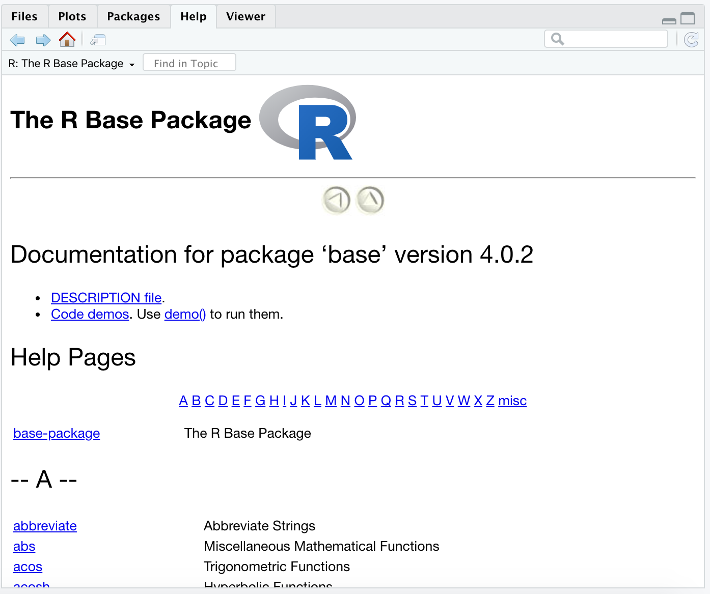

When you click on one of these functions, you will be taken to the help page for that function. This is the equivalent of typing `? <function_name>` into the *Console*. 

## Installing a new package  {-}

There are a couple ways to download and install a new `R` package on your computer. Most packages are available from an open-source repository known as `CRAN` (which stands for Comprehensive `R` Archive Network). However, an increasingly common practice is to release packages on a public repository such as `GitHub`. 

### Installing from `CRAN`  {-}

You can install `CRAN` packages one of two ways:

#### Through clicks: {-}

In `RStudio`, in the bottom-right pane, return to the *Packages* tab. Click on the "Install" button.


You can then search for the package you wish to install then click **Install**. 

#### Through code: {-}

You can download packages from the *Console* using the `install.packages()` function.

```{r,eval=FALSE,echo=TRUE}
install.packages('fun')
```

Note that the package name must be in quotation marks.


### Installing from `GitHub`  {-}

To install packages from `GitHub`, you must first download a `CRAN` package that makes it easy to do so:

```{r,echo=TRUE,eval=FALSE}
install.packages("devtools")
```

Most packages on `GitHub` include instructions for downloading it on its `GitHub` page. 

For example, visit [this `GitHub` page](https://github.com/karthik/wesanderson){target="blank"} to see the documentation for the package **wesanderson**, which provides color palette themes based upon Wes Anderson's films. On this site, scroll down and you will find instructions for downloading the package. These instructions show you how to install this package from your `R` *Console*:

```{r,echo=TRUE,eval=FALSE}
devtools::install_github("karthik/wesanderson")
```

Now go to your *Packages* tab in the bottom-right pane of `RStudio`, scroll down to find the **wesanderson** package, and click on it to check out its functions.  


## Loading an installed package {-}

There is a difference between *installed* and *loaded* packages. Go back to your *Packages* tab. Notice that some of the packages have a checked box next to their names, while others don't.  

These checked boxes indicate which packages are currently *loaded*. All packages in the list are *installed* on your computer, but only the checked packages are *loaded*, i.e., ready for use.  

To load a package, use the `library()` function.

```{r,echo=TRUE,eval=TRUE}
library(fun)
library(wesanderson)
```

Now that your new packages are loaded, you can actually use their functions.

**To emphasize:** a package is installed *only once*, but you `library()` the package in *each and every* script that uses it. Think of a package as camping gear. Like an `R` package, camping gear helps you do cool things that you can't really do with the regular stuff in your closet. And, like an `R` package, you only need to install (i.e., purchase) your gear once; but it is useless unless you pack it in your car (i.e., `library()` it) *every time* you go on a trip.  


## Calling functions from a package  {-}

Most functions from external packages can be used by simply typing the name of the function. For example, the package `fun` contains a function for generating a random password:

```{r,echo=TRUE,collapse=TRUE}
random_password(length=24)
```

Sometimes, however, `R` can get confused if a new package contains a function that has the same name of some function from a different package. If `R` seems confused about a function you are calling, it can help to specify which package the function can be found in. This is done using the syntax `<package_name>::<function_name>`. For example, the following command is a fine alternative to the command above:

```{r,echo=TRUE,collapse=TRUE}
fun::random_password(length=24)
```

Note that this was done in the example above using the `devtools` package.  


### Side notes {-}

#### Package dependencies {-}

Most packages contain functions that are built using functions built from other packages. Those new functions depend on the functions from those other packages, and that's why those other packages are known as *dependencies*. When you install one function, you will notice that `R` typically has to install several other packages at the same time; these are the dependencies that allow the package of interest to function.

#### Package versions  {-}

Packages are updated regularly, and sometimes new versions can break the functions that use it as a dependency. Sometimes you may have to install a new version (*or sometimes an older version!*) of a dependency in order to get your package of interest to work as desired. 


#### Review: the workflow for using a package {-}

To review how to use functions from a non-base package in `R`, follow these steps (examples provided:)

1. Install the package *once.*

```{r,echo=TRUE,eval=FALSE}
# Example from CRAN
install.packages("wesanderson")

# Example from GitHub
devtools::install_github("karthik/wesanderson")
```

2. Load the package *in each script.*

```{r,echo=TRUE,eval=FALSE}
# Example
library(wesanderson)
```

3. Call the function.

```{r,echo=TRUE,eval=TRUE,collapse=TRUE}
wes_palette("Royal1")
wesanderson::wes_palette("Zissou1")
```

*(This function creates a plot displaying the different colors contained within the specified palette.)*

4. Get help with the question mark: `?`

```{r,echo=TRUE,eval=TRUE,collapse=TRUE}
?wes_palette
```


### Exercises {-}  

Let's install some packages:

**1.** Install the `babynames` package.

**2.** Install `ggplot2`.

**3.** Install `dplyr`.

**4.** Install `RColorBrewer`.

**5.** Install `tidyr`.  

**6.** Install `gapminder`.

**7.** Install `readr`.

**8.** Install `gsheet`.

**9.** Install `readxl`.

**10.** Write 7 lines of code which *load* the above packages.


<!--chapter:end:03z-packages.Rmd-->

# (PART) Basic `R` workflow {-}

# Importing data

#### Learning goals {-}
* How to load, or "read", your data into `R`
* How to format your data for easily importing data in `R`
* Understand what a `.csv` file is, and why they are important in data science
* How to set up your project directory and read data from other folders

&nbsp;

To work with your own data in `R`, you need to load your data in `R`'s memory. This is called **reading in** your data. 


## Reading in data {-}

The general workflow for reading in data is as follows:

1. In `RStudio`, set your working directory.
2. Place your data file in your working directory. (See the section below if you want to keep your data somewhere else.)
3. In your `R` script, read in your data file with one of the core functions below.

```{r,echo=FALSE, message=FALSE, warning=FALSE}
library(xfun)
```

You can use this simple data file, `r xfun::embed_file('super_data.csv',text="super_data.csv")`, to practice.


### Core functions for reading data {-} 

To become agile in reading various types of data into `R`, here are five key functions you should know:  

#### `readr::read_csv()` {-}

Reading in data is simple and easy if your data are saved as a **`.csv`**, a comma-separated file. You can find functions for reading all sorts of file types into `R`, but the quickest way to begin working with your own data in `R` is to maintain that data in `.csv`'s.   

The function `read_csv()`, from a package named `readr`, becomes useful when you begin working with (1) data from the internet, (2) data within the `tidyverse`, which you will be introduced to in the next module, and/or (2) very large dataset, since it reads data much more quickly and provides progress updates along the way. 

Here's an example of reading a file directly from the internet ...  

```{r,echo=TRUE,collapse=TRUE,message=FALSE,warning=FALSE}
library(readr)
df <- read_csv('https://raw.githubusercontent.com/databrew/intro-to-data-science/main/data/deaths.csv')
df
```

Note that when you use `read_csv()` instead of `read.csv()`, your data are read in as a `tibble` instead of a dataframe. You will be introduced to `tibbles` in the next modules on dataframes; for the time being, think of a `tibble` as a fancy version of a dataframe that can be treated exactly as a regular dataframe.

####  `read.csv()` {-}

This function, `read.csv()`, is the base function for reading in a `.csv`. It is strictly used for reading in local files (not from the internet).  

This function reads in your data file as a dataframe. Save your dataset into `R`'s memory using a variable (in this case, `df`).  


```{r,echo=TRUE}
df <- read.csv("super_data.csv")
df
```

The `read.csv()` function has plenty of other inputs in the event that your data file is unable to follow the formatting rules outlined above (see `?read.csv()`). The three most common inputs you may want to use are `header`, `skip`, and `stringsAsFactors`.

- Use the **`header`** input when your data does not contain column names. *For example*, `header=FALSE` indicates that your datafile does not have any column names.  

- Use the **`skip`** input when you want to skip some lines of metadata at the top of your file. This is handy if you really don't want to get rid of your metadata in your header. *For example,* `skip=2` skips the first two rows of the datafile before `R` begins reading data.  

- Use the **`stringsAsFactors`** input when you want to make absolutely sure that `R` interprets any non-numeric fields as characters rather than factors. We have not focused on factors yet, but it can be frustrating when `R` mistakes a column of character strings as a column factors. To avoid any possible confusion, use `stringsAsFactors=TRUE` as an input.  

For example, here is how to read in this data without column names:  

```{r,echo=TRUE,collapse=TRUE}
df <- read.csv("super_data.csv",skip=1,header=FALSE)
df
```

If you do this without setting header to FALSE, your first row of data gets used as column names and it becomes a big ole mess:  

```{r,echo=TRUE,collapse=TRUE}
df <- read.csv("super_data.csv",skip=1)
df
```

#### `readxl()` {-}

To read in an *Excel* spreadsheet, use the `read_xlsx()` function from the package `readxl`.   

If `super_data` were an `.xlsx` file, the command would look like this:  

```{r,echo=TRUE,collapse=TRUE,eval=FALSE}
library(readxl)
df <- read_xlsx("super_data.xlsx",sheet=1)
```

#### `gsheet()` {-}

To read in an *GoogleSheets* spreadsheet, use the `gsheet2tbl()` function from the package `gsheet`.  

Make sure link sharing is turned on for the *GoogleSheet* you are trying to access:  

```{r,echo=TRUE,collapse=TRUE}
library(gsheet)
df <- gsheet2tbl("https://docs.google.com/spreadsheets/d/1uQ5PfGITnjHngK41FWHeedioca30wpyEsBOpC_B6T3E/edit?usp=sharing")
df
```

#### `readRDS()` {-}

Another niche function for reading data is `readRDS()`.  This function allows you to read in *R data objects*, which have the file extension *.rds*. These data objects need not be in the same format as a `.csv` or even a dataframe, and that is what makes them so handy. A colleague could send you an `.rds` object of a vector, a list, a plotting function, or any other kind of `R` object, and you can read it in with `readRDS()`. 

For example, `r xfun::embed_file('super_data.rds',text="super_data.rds")`contains a `tibble` version of the dataframe above. When you read in that `.rds` file, it is already formatted as a `tibble`: 

```{r,echo=TRUE,collapse=TRUE}
df <- readRDS("super_data.rds")
df
```


## `.csv` files {-}

The `.csv` is such an important file type when you work with data that it is worth introducing it with more detail.  

When you preview a `.csv`, it looks something like this:


A neat spreadsheet of rows and columns.  

When you open up this same dataset in a simple text editor, it looks like this:


This looks scary, but it is actually really simple. A `.csv` is a simple text file in which each row is on a new line and columns of data are separated by commas. As a simple text file, there is no fancy formatting. There are no "Sheets" or "Tabs", as you would find in GoogleSheets or Excel; it is a simple 'flat' file.

One of the major advantages of working with `.csv`'s is that the format is cross-platform and non-proprietary. That is, they work on Windows, Mac, Linux, and any other common type of computer, and they do not require special software to open.  


## Prepping your data for `R` {-}

For those of us used to working in *Excel*, *GoogleSheets*, or *Numbers*, it will take some adjustment to get into the habit of formatting your data for `R`. We are used to seeing spreadsheets that look something like this:


To read a `.csv` into `R` without issues or fancy code, this spreadsheet will need to be simplified to look like this: 


### Workflow for formatting your data {-}

Below is the general worfklow for preparing your data for `R` is the following:

**1. Get your data into `.csv` format.** In *Excel* and *Numbers*, you can use 'Save As' to change the file format. In *GoogleSheets*, you can 'Download As' a `.csv`. This will remove any colors, thick lines, special fonts, bold or italicized font styles, and any other special formatting. All that will be left is your data, and that's the way `R` likes it.  

**2. Remove blank columns** before and in the middle of your data.  

**3. Remove fancy elements such as graphs.**

**4. Simplify your 'header'.** The space above your data is your spreadsheet's header. It includes column names and metadata like title, author, measurement units, etc. It is possible to read data with complex headers into `R`, but again we are going for simplicity here, so we suggest (1) simplifying your header to contain column names only, and (2) moving metadata to a `README.txt` file that lives in the same folder as your data. 

**5. Simplify column names.** Remove spaces, or replace them with `.`, `-` or `_`. Make your column names as simple and brief as possible while still being informative. Include units in the column names, as in the screenshot above. Be sure that each column has a name. 

**6. Remove all commas and hashtags from your dataset.** You can do this with the 'Find & Replace' feature built-into in most spreadsheet editors.


## Managing files & folders {-}  

### Reading data from other folders {-}

The data-reading functions above require only a single input: the *path* to your data file. This *path* is relative to the location of your working directory. When your data file is *inside* your working directory, the path simplifies to be the same as the filename of your data:

```{r,echo=TRUE,eval=FALSE,collapse=TRUE}
df <- read.csv("super_data.csv")
```

Sometimes, though, you will want to keep your data somewhere nearby but not necessarily *within* your working directory. Consider the following scenario, in which three versions of the "super_data.csv" dataset occur near a working directory being used for this module:


We have a version within the same directory as our `R` file (i.e., our working directory), another version within a *child* folder within the directory (i.e., a subfolder), and another version in the *parent* folder of the working directory. 

**To read a file from a *child* folder,** add the prefix, `./<child name>/`, to your  command: 

```{r,echo=TRUE,eval=FALSE,collapse=TRUE}
df <- read.csv("./data/super_data.csv")
```

**To read a file from a *parent* folder,** add the prefix, `../`, to your  command: 

```{r,echo=TRUE,eval=FALSE,collapse=TRUE}
df <- read.csv("./data/super_data.csv")
```

### Managing files {-}

Now consider the following scenario, in which your project folder structure looks like this: 


This structure can be a effective and simple way of organizing your files for a project, and we recommend using it.   

Here's what these child folders should contain. 

- `./data/` contains data, of course. 
- `./doc/` contains documents, such as manuscript drafts.
- `./figures/` contains files for graphs and figures.
- `./R/` contains `R` scripts, of course. 
- `./references/` contains journal articles and other resources you are using in your research.  

Since your `R` code is going into the `R` child folder, that is what you should set your working directory for those `R` scripts to. In that case, *how to read data from the `data` folder*, which is a separate child folder of your parent folder?

Here's how:

```{r,echo=TRUE,eval=FALSE,collapse=TRUE}
df <- read.csv("../data/super_data.csv")
```


<!--chapter:end:04a-importing_data.Rmd-->

# Base plots

#### Learning goals {-}

* Make basic plots in `R`
* Basic adjustments to plot formatting

&nbsp;  

To learn how to plot, let's first create a dataset to work with:

```{r,echo=TRUE,collapse=TRUE}
country <- c("USA","Tanzania","Japan","Ctr. Africa Rep.","China","Norway","India")
lifespan <- c(79,65,84,53,77,82,69)
gdp <- c(55335,2875,38674,623,13102,84500,6807)
```

These data come from this [publicly available database](https://datasets.iisg.amsterdam/dataset.xhtml?persistentId=hdl:10622/LKYT53){target="blank"} that compares health and economic indices across countries in 2011.

The `lifespan` column presents the average life expectancy for each country.  

The `gdp` column presents the average GDP per capita within that country, which is a common index for the income and wealth of average citizens.  

Let's see if there is a relationship between life expectancy and income.  


## Create a basic plot {-}

The simplest way to make a basic plot in `R` is to use its built-in `plot()` function:  

```{r,echo=TRUE,collapse=TRUE}
plot(lifespan ~ gdp)
```

This syntax is saying this: plot column `lifespan` as a function of `gdp`. The symbol `~` denotes *"as a function of"*. This frames `lifespan` as a dependent variable (y axis) that is affected by the independent variable (x axis), which in this case is `gdp`.  

Note that `R` uses the variable names you provided as the x- and y-axes. You can adjust these labels however you wish (see formatting section below).  

You can also produce this exact same plot using the following syntax:

```{r,eval=FALSE,echo=TRUE,collapse=TRUE}
plot(y=lifespan, x=gdp)
```

Choose whichever one is most intuitive to you. 

## Most common types of plots {-}

The plot above is a **scatter plot**, and is one of the most common types of plots in data science.  

You can turn this into a **line plot** by adding a parameter to the `plot()` function:

```{r,echo=TRUE,collapse=TRUE}
plot(lifespan ~ gdp, type="l")
```

*What a mess!* Rather than connecting these values in the order you might expect, `R` connects them in the order that they are listed in their source vectors. This is why line plots tend to be more useful in scenarios such as time series, which are inherently ordered.  

Another common plot is the **bar plot**, which uses a different `R` function:

```{r,echo=TRUE,collapse=TRUE}
barplot(height=lifespan,names.arg=country)
```

In this command, the parameter `height` determines the height of the bars, and `names.arg` provides the labels to place beneath each bar.

```{r,echo=FALSE,eval=FALSE}
#Note that one of the bar labels did not plot, because `R` did not have enough space to print the labels in a pretty way. Rather than create overlapping text, `R` is programmed to leave some labels out. You will be able to adjust text size on your own (see next section).
```

There are many more plot types out there, but let's stop here for now.  


## Basic plot formatting {-}

You can adjust the default formatting of plots by adding other inputs to your `plot()` command. To understand all the parameters you can adjust, bring up the help page for this function:

```{r,eval=FALSE,echo=TRUE,collapse=TRUE}
?plot
```

If multiple help page options are returned, select the *Generiz X-Y Plotting* page from the `base` package. This is the plot function that comes built-in to `R`.

Here we demonstrate just a few of the most common formatting adjustments you are likely to use:

**Set plot range** using `xlim` (for the x axis) and `ylim` (for the y axis):
```{r,echo=TRUE,collapse=TRUE}
plot(lifespan ~ gdp,xlim=c(0,60000),ylim=c(40,100))
```

In this command, you are defining axis limits using a 2-element vector (i.e., `c(min,max)`).

Note that it can be easier to read your code if you put each input on a new line, like this:

```{r,echo=TRUE,eval=FALSE,collapse=TRUE}
plot(lifespan ~ gdp,
     xlim=c(0,60000),
     ylim=c(40,100))
```

Make sure each input line within the function ends with a comma, otherwise you `R` will get confused and throw an error.  


**Set dot type** using the input `pch`:
```{r,echo=TRUE,collapse=TRUE}
plot(lifespan ~ gdp,pch=16)
```

**Set dot color** using the input `col` (the default is `col="black"`)
```{r,echo=TRUE,collapse=TRUE}
plot(lifespan ~ gdp,col="red")
```

[Here is a great resource](http://www.stat.columbia.edu/~tzheng/files/Rcolor.pdf?utm_source=twitterfeed&utm_medium=twitter){target="blank"} for color names in `R`.

**Set dot size** using the input `cex` (the default is `cex=1`):
```{r,echo=TRUE,collapse=TRUE}
plot(lifespan ~ gdp,cex=3)
```

**Set axis labels** using the inputs `xlab` and `ylab`:
```{r,echo=TRUE,collapse=TRUE}
plot(lifespan ~ gdp, xlab="Gross Domestic Product (GDP)",ylab="Life Expectancy")
```

**Set axis number size** using the input `cex.axis` (the default is `cex.axis=1`):
```{r,echo=TRUE,collapse=TRUE}
plot(lifespan ~ gdp,cex.axis=.5)
```

**Set axis label size** using the input `cex.label` (the default is `cex.lab=1`):
```{r,echo=TRUE,collapse=TRUE}
plot(lifespan ~ gdp,cex.lab=.5)
```

**Set plot margins** using the function `par(mar=c())` before you call `plot()`:
```{r,echo=TRUE,collapse=TRUE}
par(mar=c(5,5,0.5,0.5))
plot(lifespan ~ gdp)
```

In this command, the four numbers in the vector used to define `mar` correspond to the margin for the bottom, left, top, and right sides of the plot, respectively.

**Create a multi-pane plot** using the function `par(mfrow=c())` before you call `plot()`:
```{r,echo=TRUE,collapse=TRUE}
par(mfrow=c(1,2))
plot(lifespan ~ gdp,col="red",pch=16)
plot(lifespan ~ gdp,col="blue",pch=16)
```

In this command, the two numbers in the vector used to define `mfrow` correspond to the number of rows and columns, respectively, on the entire plot. In this case, you have 1 row of plots with two columns.  

Note that you will need to reset the number of panes when you are done with your multi-pane plot!

```{r,echo=TRUE,collapse=TRUE}
par(mfrow=c(1,1))
```

**Plot dots and lines at once** using the input `type`:
```{r,echo=TRUE,collapse=TRUE}
par(mfrow=c(1,2))
plot(lifespan ~ gdp,type="b")
plot(lifespan ~ gdp,type="o")
par(mfrow=c(1,1))
```

Note the two slightly different formats here.

**Use a logarithmic scale** for one or of your axes using the input `log`

```{r,echo=TRUE,collapse=TRUE}
plot(lifespan ~ gdp,log="x")
```


## Plotting with data frames {-}

So far in this tutorial we have been using vectors to produce plots. This is nice for learning, but does not represent the real world very well. You will almost always be producing plots using dataframes.  

Let's turn these vectors into a dataframe:

```{r,echo=TRUE,collapse=TRUE}
df <- data.frame(country,lifespan,gdp)
df
```

To plot data within a dataframe, your `plot()` syntax changes slightly:

```{r,echo=TRUE,collapse=TRUE}
plot(lifespan ~ gdp, data=df)
```

This syntax is saying this: using the dataframe named `df` as a source, plot column `lifespan` as a function of column `gdp`. The symbol `~` denotes *"as a function of"*. This frames `lifespan` as a dependent variable (y axis) that is affected by the independent variable (x axis), which in this case is `gdp`.  

Another way to write this command is as follows:

```{r,eval=FALSE,echo=TRUE,collapse=TRUE}
plot(df$lifespan ~ df$gdp)
```

In this command, as you learned in the dataframes module, the `$` symbol is saying, "give me the column in `df` named `lifespan`". It is a handy way of referring to a column within a dataframe by name. 


#### Exercises {-}

**The economics of health**  

**1.** Using the data above, produce a bar plot that shows the GDP for each country.

**2.** Use the `df` dataframe you built above to produce a bar plot that shows life expectancy for each country.

**3.** Use the `df` dataframe to produce a jumbled line plot of life expectancy as a function of GDP. Reference the `plot()` documentation to figure out how to change the thickness of the line.

&nbsp;  

**Shoe ~ height correlation**  

**4.** Create a vector of the names of 5 people who are sitting near you. Call it `people`.

**5.** Create a vector of those same 5 people's shoe sizes (in the same order!). Call it `shoe_size`.

**6.** Create another vector of those same 5 people's height. Call it `height`.

**7.** Create another vector of those same 5 people's sex. Call it `sex`.

**8.** Make a scatterplot of height and shoe size. Is there a correlation?

**9.** Look up help for `boxplot`. Make a `boxplot`.

**10.** Make a dataframe named `df`. It should contain columns of all the vectors created so far.

**11.** Make a side by side `boxplot` with shoe sizes of males vs females.

**12.** Try to find documentation for making a "histogram" (hint: use text autocomplete).

**13.** Make a histogram of people's height.

&nbsp;  

**Make your plot beautiful**  

**14.** Produce a *beautifully* formatted plot that incorporates **all** of the customization inputs explained above into a multi-paned plot. Use any dataset from this module that you wish.  


#### Other Resources  {-}

- [R color palette](http://www.stat.columbia.edu/~tzheng/files/Rcolor.pdf)  
- [The R Graph Gallery](https://www.r-graph-gallery.com/)


<!--chapter:end:04b-base_plots.Rmd-->

# `ggplot`


#### Learning goals {-}

- Understand what `ggplot2` is and why it's used
- Be able to think conceptually in the framework of the "grammar of graphics"
- Learn the basic syntax for creating different plots using using `ggplot2`


## What is `ggplot2`?  {-}

`ggplot2` is an `R` package. It's one of the most downloaded packages in the `R` universe, and has become the gold standard for data visualization. It's extremely powerful and flexible, and allows for creating lots of visualizations of different types, ranging from maps to bare-bones academic publications, to complex, paneled charts with labeling, etc.  

Because the syntax is so different from "base" `R`, it can give the impression of having a somewhat steep learning curve. But in reality, because the principles are so conceptually simple, learning is fairly fast. Generally those who choose to learn it stick with it; that is, once you go `gg`, you don't go back.

**Note:** we will refer heavily to this [**online guide about `ggplot`**](https://ggplot2-book.org/introduction.html)


### The name & concept  {-}

```{r, results = 'asis', eval = ifelse(exists('is_teacher'),is_teacher,TRUE),echo=FALSE}
source('teacher_tip.R')

tip <- 'To demonstrate the ideas in this section, draw a rough plot on a whiteboard as you step through each layer.'

teacher_tip(tip)
```

The "`gg`" in `ggplot` stands for "grammar of graphics", with "grammar" meaning "the fundamental principles or rules of an art or science" [@layered-grammar]. Just as all languages share common principles of grammar and syntax, so too do the many forms of data visualization. The basic idea is that all graphs can be described using a _layered_ grammar: all graphs represent a dataset using the same layers of visual order. 

**Plots are made of layers.** Think of how you draw a plot from scratch:

First, you get a piece of paper -- a **canvas**.

Second, you draw the x axis and y axis: each direction on your canvas represents the range of a set of data. This establishes a **landscape of coordinates**. 

Third, the data need to be placed somewhere in that landscape. You **map the data** to the coordinates. 

Fourth, when you actually draw the data at their prescribed locations on the plot, you have to decide how to do so. You use **geometric objects** -- like points, lines, and bars -- and other **aesthetic attributes** -- like colors, line thicknesses, and dot size. 

Fifth, you add **labels** -- such as axis titles, an overhead title, or a legend -- to help the viewer understand the plot.

You now have a basic plot. But sometimes you will add additional layers:

Sixth, you may add **statistical summaries** -- such as regression lines or standard error bars.

Seventh, you may decide to do an overhaul and split your plot into several **facets**, in which subgroups of the data are plotted separately to produce a multi-panel plot. 

Finally, in the final layer, you may decide to stylize the entire plot to fit a **visual theme**, such as the trademark styles of vendors like the *The Economist* or *The New York Times*.  

When you produce a plot with `ggplot`, you will mirror this same process step-by-step. This is why you will often see the process underlying `ggplot` described using a graphic like this:

<center>
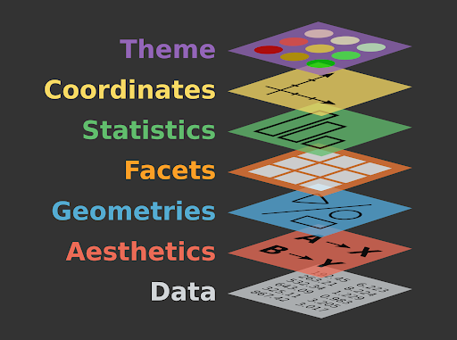
</center>

&nbsp;  

*Note:*  If you want to learn more about the theory, the most well-known "grammar of graphics" was written in 2005 and laid out some abstract principles for describing statistical graphics [@10.5555/1088896].  


### Setting up `ggplot` {-}

Let's learn by doing. First, install and load  `ggplot2` and associated packages. 

```{r,echo=TRUE,collapse=TRUE, message=FALSE}
library(ggplot2)
library(readr)
library(ggthemes)
library(dplyr)
```

Download the `titanic` dataset, the manifest of *Titanic* passengers with details such as as age, passenger class, fare paid, and whether or not they survived.  

```{r,echo=TRUE,collapse=TRUE, message=FALSE}
titanic<- read_csv("https://raw.githubusercontent.com/databrew/intro-to-data-science/main/data/deaths.csv")
```

```{r, results = 'asis', eval = ifelse(exists('is_teacher'),is_teacher,TRUE),echo=FALSE}
source('teacher_tip.R')

tip <- 'At this point it may be useful to emphasize that the name of the package is **`ggplot2`**, but the name of the function is just **`ggplot()`**.'

teacher_tip(tip)
```


## Scatter plot {-}

Say you want to explore the relationship between passengers' age and the fare they paid to travel aboard the *Titanic*.  

(1) **Set up our canvas.** If we just type `ggplot()` without anything in the parentheses, the function will just return a blank piece of paper.  

```{r,echo=TRUE,collapse=TRUE,warning=FALSE}
ggplot()
```

(2) **Draw the axes** and, 3., setup our **landscape of coordinates**. To do so, we need to feed `ggplot()` some data and tell it which columns should be mapped onto the axes. 

```{r,echo=TRUE,collapse=TRUE,warning=FALSE}
ggplot(data = titanic, 
       aes(x = Age, y = Fare))
```

That code looks a bit clunky, we know. The `aes()` input, which is short for `aesthetics`, is actually a function. Everything included in its parentheses will be used to *map your data to the plot's aesthetic attributes*. So far we have simply said that `Age` should be mapped to the *x* axis and that `Fare` should be mapped to *y*. 

But let's say we also want to color-code the points on our plot according to male/female. To do so, we will add specifications to this `aes()` function. 

```{r,echo=TRUE,collapse=TRUE,warning=FALSE}
ggplot(data = titanic, 
       aes(x = Age, y = Fare, color=Sex))
```

Your plot is still blank, but in the background `ggplot()` is all setup to make your plot. Since this `ggplot()` call is the basis of everything that will happen next -- it contains the data and the way you want to map it to attributes of your plot -- let's save it to a variable for easy recall. We'll use `p` for "plot".  
  
```{r,echo=TRUE,collapse=TRUE,warning=FALSE}
p <- ggplot(data = titanic, 
       aes(x = Age, y = Fare, color=Sex))
```

Note that you don't need to write out `titanic$Age` or `titanic$Fare`. You've told `ggplot` that your `data` is `titanic`, so it knows to look inside that dataframe for those columns.

(4) **Map our data to geometric shapes**. In this case, a scatter plot of points:

```{r,echo=TRUE,collapse=TRUE,message=FALSE,warning=FALSE}
p <- p + geom_point()
p
```

Note the use of a plus sign, `+`. You are *adding* layers to your plot.  

(5) **Add some more labels**. You see that `ggplot()` has automatically added axis titles and a legend, but we can add some more using the `labs()` function. Let's add an overhead title, a sub-title, and a caption.

```{r,echo=TRUE,collapse=TRUE,message=FALSE,warning=FALSE}
p <- p + labs(title = 'Relationship between Age, Fare, and Sex',
              subtitle = 'Passengers on the RMS Titanic',
              caption = 'Property of Eric Keen & Hadley Whickham (2021)')
p
```

(6) **Add a statistical summary**, like a smoothed regression line. 

```{r,echo=TRUE,collapse=TRUE,message=FALSE,warning=FALSE}
p <- p + geom_smooth(method = 'lm')
p
```

Note that `ggplot()` automatically produced a different regression line for each sex. That's nice, but now our plot is getting pretty cluttered. 

(7) Clean up the look by using **facets**: a separate plot for each sex. 

```{r,echo=TRUE,collapse=TRUE,message=FALSE,warning=FALSE}
p <- p + facet_wrap(~Sex)
p
```

Beautiful!  

(8) Finally, let's **stylize** the entire plot with a different **theme**. You can find theme options in the ``ggthemes` package. 

```{r,echo=TRUE,collapse=TRUE,message=FALSE,warning=FALSE}
p <- p + theme_economist_white()
p
```


## Bar plot {-}

In a bar plot, your data are mapped to bars instead of points. And, instead of showing every data point, you are summarizing the data in some way -- i.e., displaying a *statistic*. That statistic is usually just a count of the number of data points in each subgroup.

Let's make a bar plot that compares the number of men and women on the *Titanic*:

```{r,echo=TRUE,collapse=TRUE}
ggplot(data = titanic, 
       aes(x = Sex)) + 
  geom_bar(stat='count')
```

Note that, for the `aes()` call, we only provided the *x* axis attribute: `Sex`.  

Then, in the `geom_bar()` call, we told `R` what `stat`istic should be represented by that bars: `'count'`.

But you are allowed to explicitly set the bars' heights (i.e., the `y` dimension) to represent a different statistic. Let's say we wanted each bar to represent the mean age of men and women:

```{r,echo=TRUE,collapse=TRUE}
# First, determine the mean age of each sex
mean_age_males <- mean(titanic$Age[titanic$Sex == 'male'], na.rm = TRUE)
mean_age_females <- mean(titanic$Age[titanic$Sex == 'female'], na.rm = TRUE)

# Make a new dataframe with this summary data
titanic_age <- data.frame(Sex = c('male','female'),
                          mean_age = c(mean_age_males, mean_age_females))
# Plot it
ggplot(data = titanic_age, 
       aes(x = Sex,y= mean_age)) + 
  geom_bar(stat = 'identity')
```

In this case, we are explicitly defining the `y` axis in the `aes()` call, and telling `geom_bar()` to just use the values we specified in `aes()` (that's what `'identity'` means; you are telling `ggplot()` to just use what you already gave it.)  

You can specify other aesthetic attributes, *unrelated to the data*, within the `geom_bar()` call:

```{r,echo=TRUE,collapse=TRUE}
ggplot(data = titanic_age, 
       aes(x = Sex,y= mean_age)) + 
  geom_bar(stat = 'identity', fill = 'blue', alpha = 0.5) 
```

Now add better labels:

```{r,echo=TRUE,collapse=TRUE}
ggplot(data = titanic_age, 
       aes(x = Sex,y= mean_age)) + 
  geom_bar(stat = 'identity', fill = 'blue', alpha = 0.5) + 
  labs(y = 'Mean age', 
       x = 'Gender',
       title = 'Titanic passengers: Average age by sex',
       caption = 'Do not steal, please')
```

You can add another variable to your bar plot as follows. Let's say you want to see the average age in each sex, grouped by who survived and who didn't:  

```{r,echo=TRUE,collapse=TRUE}
# First, produce your summary dataframe using some dplyr magic:
titanic_em <- titanic %>% 
  group_by(Sex, Survived) %>% 
  summarise(mean_age= mean(Age, na.rm = TRUE))

titanic_em <- titanic_em %>% 
  mutate(Survived = ifelse(Survived == 1, 'Survived','Dead' ))

# Check it out
titanic_em

# Now plot it
ggplot(data = titanic_em, 
       aes(x=Sex, y=mean_age, fill = Survived)) +
  geom_bar(stat='identity')

```

Rather than stack the bars, you can place them side by side:  

```{r,echo=TRUE,collapse=TRUE}
ggplot(data = titanic_em, 
       aes(x=Sex, y=mean_age, fill = Survived)) +
  geom_bar(stat='identity', position = 'dodge') 
```

If you don't love these default colors (even if they are colorblind-friendly), you can manually define the colors for each group of bars:  

```{r,echo=TRUE,collapse=TRUE}
ggplot(data = titanic_em, 
       aes(x=Sex, y=mean_age, fill = Survived)) +
  geom_bar(stat='identity', 
           position = 'dodge', 
           alpha = 0.7, 
           color='grey40') + # bar edge
  scale_fill_manual(values = c('blue', 'grey')) # bar fill
```


#### Exercises {-}

**More *Titanic* plots**

**1.** Make a scatterplot similar to what you did above, but this time color-code by class instead of sex.  

**2.** Notice that `ggplot()` automatically uses a continuous color scale for `Pclass`, since it has numeric values. To force `ggplot()` to consider `Pclass` as categories (1st class, 2nd class, 3rd class), replace `Pclass` with `factor(Pclass)`. Did the style of your color scale change?  

**3.** Modify the title, subtitle, and caption to be more descriptive.  

**4.** Produce a bar plot that compares the number of passengers in each class.  

**5.** Make your bar plot as *ugly* as possible!  

**6.** Now make it as *beautiful* as possible, including a concise but informative title, subtitle, and caption.  

&nbsp;  

**Baby names**  

Download the dataset on baby names given to newborns in the USA:

```{r,echo=TRUE,eval=TRUE,collapse=TRUE}
library(babynames)
bn <- babynames
```

**7.** Create a line chart showing the number of girls named Mary over time.  

**8.** Change the color of the line to blue.  

**9.** Add a fitting title to the plot. 

**10.** Create a bar chart showing the number of girls named Emma, Olivia, Ava, Sophia, and Emily in 2010.  

**11.** Change the X label to "Names" and the y label to "Total". (*Hint:* check out the `labs()` help page.)  

**12.** Change the color of the bar to grey and make it more transclucent.    

**13.** Create a bar chart showing the number of people named Emma, Olivia, Ava, Sophia, and Emily in 2010, colored by sex.  

**14.** Create a beautiful chart showing your name over time.  

```{r,echo=FALSE,eval=FALSE,collapse=TRUE}
library(babynames)
library(dplyr)
library(ggplot2)
bn <- babynames

# subset by the name Francis
francis <- bn %>% filter(name == 'Francis', sex == 'M')

# line plot
ggplot(data=francis, 
       aes(x = year, y =n )) + 
  geom_line() + 
  labs(x = 'Year', y = 'Number of boys named Francis')
# layer with points
ggplot(data=francis, 
       aes(x = year, y =n )) + 
  geom_line() + 
  geom_point() + 
  labs(x = 'Year', y = 'Number of boys named Francis')
```

<!--chapter:end:04d-base_ggplot.Rmd-->

# Dataframe wrangling {#dplyr}

#### Learning goals {-}

* Understand the importance of *tidy* dataframes
* Understand what the `tidyverse` is and why it is awesome
* Feel comfortable working with dataframes using `dplyr` functions.


## The `dplyr` package {-}

Data scientists largely work in data frames and _do things_ to data. This is what the package `dplyr` is optimized for. It consists of a series of "verbs" which cover 95% of what you need to do for most basic data processing tasks. 

```{r,echo=TRUE,collapse=TRUE,eval=FALSE}
install.packages('dplyr') # if you haven't yet
```

```{r,echo=TRUE,message=FALSE}
library(dplyr)
```

The `dplyr` package contains a set of `verbs`: things you do to dataframes. Those verbs are:

- **`filter()`**  
- **`arrange()`**  
- **`select()`**   
- **`rename()`**  
- **`distinct()`**  
- **`mutate()`**   
- **`summarise()`**  

## The `%>%` pipe {-}

**`%>%`** is a "pipe". It is a way to write code without so many parentheses. For example, what if I want to find the square root of the sum of the first six elements of a sequence of 10 to 20 by 2?

Here's what that command would look like in base `R`:  

```{r,echo=TRUE,collapse=TRUE}
sqrt(sum(head(seq(10, 20, 2))))
```

Pretty overwhelming, and pretty easy to make errors in writing it out. 

But the above could also be written a simpler way:

```{r,echo=TRUE,collapse=TRUE}
seq(10, 20, 2) %>% head %>% sum %>% sqrt
```

When you see the **`%>%`** pipe symbol, think of the word **"then"**. 

The above code could be read aloud like so: "First, get a sequence of every second number between 10 and 20. **Then**, take the first six values. **Then**, sum those samples together. **Then**, take the square root of that sum." 

Using the `%>%` pipe framework, your code turns from a nonlinear series of parentheses and brackets to a linear progression of steps, which is a closer fit to how we tend to think about working with data. Instead of working from the inside of a command outward, we thinking linearly: take the data, **then** do things with it, **then** do more things with it, etc.

Here's another example:

```{r,echo=TRUE,collapse=TRUE}
mean(sd(1:100))
```

... could also be written as:

```{r,echo=TRUE,collapse=TRUE}
1:100 %>% sd %>% mean
```

## `dplyr` verbs {-}

To practice the `dplyr` verbs, let's make a small dataframe named `people`:

```{r,echo=TRUE,collapse=TRUE}
people <- data.frame(who = c('Joe', 'Ben', 'Xing', 'Coloma'),
                    sex = c('Male', 'Male', 'Female', 'Female'),
                    age = c(35, 33, 32, 34))
people
```

### `filter()` {-}

The `filter()` function is used to subset a dataframe, retaining all rows that satisfy your conditions. To be retained, the row must produce a value of `TRUE` for all conditions. 

```{r,echo=TRUE,collapse=TRUE}
people %>% filter(sex == 'Male')
```

```{r,echo=TRUE,collapse=TRUE}
people %>% filter(sex == 'Female')
```

You can also filter according to multiple conditions. Here are three ways to acheive the same thing:  

```{r,echo=TRUE,collapse=TRUE}
people %>% filter(sex == 'Female' & age < 33)
```

```{r,echo=TRUE,collapse=TRUE}
people %>% filter(sex == 'Female', age < 33)
```

```{r,echo=TRUE,collapse=TRUE}
people %>% filter(sex == 'Female') %>% filter(age < 33)
```

Note that when a condition evaluates to `NA`, its row will be dropped. This differ from the base subsetting works with `[ ... ]`.

### `arrange()` {-}

Arrange means putting things in order. That is, `arrange()` orders the rows of a data frame by the values of selected columns.

```{r,echo=TRUE,collapse=TRUE}
people %>% arrange(age)
```

```{r,echo=TRUE,collapse=TRUE}
people %>% arrange(sex)
```

```{r,echo=TRUE,collapse=TRUE}
people %>% arrange(who)
```

To reverse the order, use `desc()`: 

```{r,echo=TRUE,collapse=TRUE}
people %>% arrange(desc(age))
```

You can also arrange by multiple levels: 

```{r,echo=TRUE,collapse=TRUE}
people %>% arrange(sex, age)
```


### `select()` {-}

Select only certain variables in a data frame, making the dataframe skinnier (fewer columns). 

```{r,echo=TRUE,collapse=TRUE}
people %>% select(age)
```

```{r,echo=TRUE,collapse=TRUE}
people %>% select(sex, age)
```

As you select columns, you can rename them like so:  

```{r,echo=TRUE,collapse=TRUE}
people %>% select(sex, years = age)
```

You can also select a set of columns using the `:` notation:

```{r,echo=TRUE,collapse=TRUE}
people %>% select(who:sex)
```


### `rename()` {-}

The function `rename()` changes the names of individual variables.  

This verb takes the syntax `<new_name> = <old_name>` syntax.

```{r,echo=TRUE,collapse=TRUE}
people %>% rename(gender = sex, years = age, first_name = who)
```


### `mutate()` {-}

The function `mutate()` adds new variables and preserves existing ones. 

New variables overwrite existing variables of the same name. 

```{r,echo=TRUE,collapse=TRUE}
people %>% mutate(agein2020 = age - 1)
```

```{r,echo=TRUE,collapse=TRUE}
people %>% mutate(is_male = sex == 'Male')
```

```{r,echo=TRUE,collapse=TRUE}
people %>% mutate(average_age = mean(age))
```

You can call `mutate()` multiple times in the same pipe:  

```{r,echo=TRUE,collapse=TRUE}
people %>% mutate(average_age = mean(age)) %>%
  mutate(diff_from_avg = age - average_age)
```

You can also remove variables can be removed by setting their value to NULL.

```{r,echo=TRUE,collapse=TRUE}
people %>% mutate(age = NULL)
```

A similar function, `transmute()`, adds new variables and drops existing ones, kind of like a combination of `select()` and `mutate()`.

```{r,echo=TRUE,collapse=TRUE}
people %>% transmute(average_age = mean(age))
```


### `group_by()` {-}

Most data operations are done on groups defined by variables. The function `group_by()` takes an existing table and converts it into a grouped one where operations are performed "by group". 

```{r,echo=TRUE,collapse=TRUE}
people %>% 
  group_by(sex) %>%
  mutate(average_age_for_sex = mean(age)) 
```

```{r,echo=TRUE,collapse=TRUE}
people %>% 
  group_by(sex) %>%
  mutate(average_age_for_sex = mean(age)) %>%
  mutate(diff_from_avg_for_sex = age - average_age_for_sex)
```

Note that a similar verb, `ungroup()`, removes grouping.

### `summarize()` {-} 

`summarize()` or `summarize()` creates an entirely new data frame. It will have one (or more) rows for each combination of grouping variables; if there are no grouping variables, the output will have a single row summarizing all observations in the input. It will contain one column for each grouping variable and one column for each of the summary statistics that you have specified.

```{r,echo=TRUE,collapse=TRUE}
people %>% 
  summarize(average_age = mean(age))
```

```{r,echo=TRUE,collapse=TRUE}
people %>% 
  summarize(average_age = mean(age),
            standard_dev_of_age = sd(age),
            oldest_age = max(age),
            youngest_age = min(age))
```

```{r,echo=TRUE,collapse=TRUE}
people %>% 
  group_by(sex) %>%
  summarise(avg_age = mean(age),
            oldest_age = max(age),
            total_years = sum(age)) 
```

```{r,echo=TRUE,collapse=TRUE}
people %>%
  group_by(sex) %>%
  summarise(sample_size = n())
```

Note the use of the function, **`n()`**. This simple function counts up the number of records in each group.  

```{r, results = 'asis', eval = ifelse(exists('is_teacher'),is_teacher,TRUE),echo=FALSE}
source('teacher_tip.R')

tip <- 'To illustrate these `dplyr` verbs and re-energize the room, ask everyone to stand. Tell the students that they represent a dataframe called `people`. Now, write a `dplyr` command into your R Console and ask them to act out the command. After each command, give them time to move around to act it out. If they move around too slowly, egg them on: "Come on, you all are like the slowest computer ever!" <br><br> `people %>% arrange(shoe_size)` <br> `people %>% arrange(shoe_size) %>% filter(sex == "female")` <br> `people %>% arrange(hair_length)` <br> `people %>% arrange(desc(hair_length))` <br> `people %>% group_by(sex) %>% arrange(hair_length))` <br>`people %>% arrange(country_of_birth, shirt_color, desc(shoe_size))` <br><br> etc.'

teacher_tip(tip)
```

#### Exercises {-}

Answer these questions using the new `dplyr` verbs you just learned:  

**Baby names over time**  

**1.** Run the below code to load a dataset about baby names given in the USA since the 1800's.  

```{r,echo=TRUE,collapse=TRUE}
library(dplyr)
library(babynames)
bn <- babynames
```

**2.**  Check out the first and last six rows of `bn`.  

**3.**  What are the names of the variables in this dataset?  

**4.**  How many rows are in this dataset?  

**5.**  What is the earliest year in this dataset?  

**6.**  Create a dataframe named `turn_of_century`, which contain data only for the year 1900. 

**7.**  Create a dataframe named `boys`, containing only boys. 

**8.**  Create a dataframe named `moms_gen`. This should be females born in the year of birth of your mom.

**9.**  Order `moms_gen` by `n`, in ascending order (i.e., with the least popular name at top). Look at the result; what is the least popular name among women the year your mom was born?

**10.**  Reverse the order and save the result into an object named `moms_gen_ordered`.

**11.**  Create an object named `boys2k`. This should be all males born in the year 2000.

**12.**  Arrange `boys2k` from most to least popular. What was the most popular boys name in 2000?

**13.**  What percentage of boys were named `Joseph` in 2000?

**14.**  Were there more Jims or Matthews in 2020?

**15.** Create an object named `tot_names_by_year`, which contains the total counts for boy and girl names assigned in each year of the dataset. You should have four columns: `year`, `boys`, `girls`, and `tot`. 

**16.**  How many people were born with _your_ name in 2020?

**17.** Was your name more prevalent in 2020 than it was in the year you were born?

**18.** What if you account for the changing overall population size? In other words, is the *proportional prevalence* of your name greater in 2020 or your birth year?

**19.** In which year was your name the most prevalent?  

**20.** Create a basic plot of the proportional prevalence of your name since the earliest year of this dataset.  

**21.** Update this plot with lines for your parent's names and your siblings names, if you have any.

**22.** Format that plot so that it is gorgeous and well-labelled. 

**23.** Screenshot it and email it to your family.  


```{r, results = 'asis', eval = ifelse(exists('is_teacher'),is_teacher,TRUE),echo=FALSE}
source('teacher_tip.R')

tip <- 'After completing the exercises here, it is worthwhile devoting time to the Review modules entitled, **"A `dplyr` mystery"**, **"A `dplyr` survey"**, and **"Global health and `ggplot`"**. Once students become comfortable with working with `dplyr`, they will be ready to work independently on projects, using the modules in the **Deep `R`** section for references.'

teacher_tip(tip)
```


<!--chapter:end:04e-dataframes2.Rmd-->

# Distributions & histograms 

#### Learning goals {-}

* How to go about exploring a dataset and understanding the distribution of your data  
* How to produce beautiful histograms and violin plots  

&nbsp;

Once you get your dataset into `R`, the first thing you will probably want to do is explore. Until you understand what your data look like, it is difficult to know how to analyze it. **Exploratory data analysis** is the process of becoming familiar with your data - its sample size, its distribution, its central tendencies, and its variation. This module shows you how. 

To practice exploring datasets, we will use one of *AirBnB* listings in Amsterdam ([go here](http://insideairbnb.com/get-the-data.html) and download `listings.csv.gz` under the Amsterdam section). 

```{r,echo=FALSE}
df <- read.csv("./data/airbnb-amsterdam.csv")
```

```{r,echo=TRUE,collapse=TRUE}
# Checkout what the data look like
# use t() to make it easier to read (t = transpose)
t(head(df,1))

# How much data do we have?
nrow(df)

```


## Exploring distributions {-}

One of the first steps in your data exploration will be to visualize your dataset. There are two main plot types for doing so: **histograms** and **violin plots**. 

### Histograms {-}

A histogram sorts your data into bins and counts the number of data points in each bin.  

Make histograms in `R` using the `hist()` function:  

```{r,echo=TRUE}
hist(df$availability_365)
```

This is a histogram of the number of nights the listings are available for reservation. In a quick glance, you can see that most listings are available for only a few nights, while a small portion have a wide variety of availabilities.   

Think about how much more helpul this image is than a simple sample mean. To illustrate that value, let's plot the mean onto this histogram. 

```{r,echo=TRUE}
hist(df$availability_365)
abline(v= mean(df$availability_365),col="red")
```

The average value of this dataset is nowhere near the most common values (1 - 20 nights), nor does it capture the fact that there are some listings available for the entire year.  **Punchline:** a lot of rich insight is lost when taking an average, which is why a histogram is more useful for displaying distributions than bar graphs (which only show the mean).  

#### Prettifying histograms {-}

Let's take a look at another variable: the price of lodging per night. 

```{r,echo=TRUE}
hist(df$price)
```

Not a very pretty plot. Since the range in prices is so wide, the default parameters for the `hist()` will need some tweaking. 

To make this histogram prettier, first let's manually set the number of "breaks", i.e., the cutoff values for each bin along the x-axis. 

```{r,echo=TRUE}
# Calculate breaks -- make each bin one day
breaks <- seq(0,max(df$price),by=5)

hist(df$price,
     breaks=breaks)
```

That's better. Let's zoom in on the most common values using `xlim()`. 

```{r,echo=TRUE}
hist(df$price,
     breaks=breaks,
     xlim=c(0,500))
```

Finally, let's improve the labels and colors. 

```{r,echo=TRUE}
par(mar=c(4.2,4.2,.5,.5))
hist(df$price,
     breaks=breaks,
     xlim=c(0,500),
     xlab="Listing price ($)",
     main=NULL,
     col=adjustcolor("darkblue",alpha.f=.6),
     border=adjustcolor("white",alpha.f=.1),
     )
```

Interesting spikes in the histogram. Why do you think those are occurring? That is a really interesting feature of the dataset that you might never have discovered if you had not plotted your histogram. 

#### Histograms in `ggplot2` {-}

To produce a histogram of the same data in `ggplot2`, use the following code: 
```{r,echo=TRUE}
library(ggplot2)
ggplot(df, aes(x=price)) + 
  xlim(0,500) +
  geom_histogram(binwidth=5,
                 fill=adjustcolor("darkblue",alpha.f=.6),
                 color=adjustcolor("white",alpha.f=.1)) 
```

`ggplot2` allows you to add some other nice features to histograms, such as a smoothed "density" line:

```{r,echo=TRUE,warning=FALSE}
ggplot(df, aes(x=price)) + 
  xlim(0,500) +
  geom_histogram(binwidth=5,
                 fill=adjustcolor("darkblue",alpha.f=.6),
                 color=adjustcolor("white",alpha.f=.1),
                 aes(y=..density..)) +
  geom_density(alpha=.1,lwd=1.5,col=adjustcolor("firebrick",alpha.f=.5))
```


### Violin Plots {-}

The second most valuable plot for exploring distributions is the **violin plot**. 

```{r,echo=TRUE}
ggplot(df, aes(x=room_type,
               y=price)) + 
  geom_violin()
```

Violin plots are like *vertical histograms*. Their width indicates where most of your data are clustered, and the shapes also take the shape of a violin -- hence the name. Their height shows you your data's range. Think of a violin plot as the beautiful child of bar graphs and histograms: the best of both worlds.  

A major advantage of violin plots is that they allow you two compare multiple distributions with ease. Let's adjust our `ylim()` to zoom in:

```{r,echo=TRUE,warning=FALSE}
ggplot(df, 
       aes(x=room_type,
           y=price)) + 
  ylim(0,500) +
  geom_violin()
```

If your research question were, "Which type of listing tends to be most affordable?", think about how easy that is to answer using a plot like this! 


## Descriptive statistics {-} 

In the [Module on Calling Functions](#calling_function), you have already seen some functions for summarizing the trends and variation in your data: 

- `mean()`
- `median()`
- `sd()` (standard deviation)
- `summary()` provides descriptive statistics for each column in a dataframe. 

Here are a few more:  

**`var()`** provides the sample variance, which is related to standard deviation:  

```{r,echo=TRUE,collapse=TRUE}
var(df$price)
```

**`MeanCI()`**, from the package `DescTools`, provides 95% confidence intervals for the most common data distributions. 

```{r,eval=FALSE,echo=TRUE,collapse=TRUE}
install.packages("DescTools")
```

```{r,echo=TRUE,collapse=TRUE}
library(DescTools)
MeanCI(df$price)
```

And here are some other useful functions that need not be introduced in detail now. You will encounter them soon.

- **`table()`** Counts the number of instances of each unique value in a vector.
- **`quantile()`** Provides the quantiles of a dataset.
- **`ecdf()`** Plots the empirical cumulative distribution function for a dataset.


#### Review exercise {-}

For this exercise, use this dataset on the sale prices of homes in the United States. You can download that dataset directly into `R` using the following code:

```{r,echo=TRUE,eval=FALSE}
library(readr)
df <- readr::read_csv("https://raw.githubusercontent.com/rashida048/Datasets/master/home_data.csv")
```

##### Task 1 {-}

Create a beautiful histogram of home prices included in this dataset. Only show houses that sold for less than $2 million USD.   

##### Task 2 {-}

Create a violin plot that shows the distribution of sale prices for homes with different numbers of bedrooms. 

##### Task 3 {-}

This task is a bit of review, and a bit of a preview to the next module.  

First, create a scatter plot that depicts the relationship between the square footage of a home's living space and its sale price. Do the same for the square footage of the home's lot. Which square footage appears to be a better predictor of sale price? 


<!--chapter:end:04f-EDA.Rmd-->

# Significance statistics

#### Learning goals {-}

* How to interpret p-values  
* How to decide which statistical test to apply to your data
* How to conduct basic significant tests in `R`
* How to interpret the results of those tests


## p-values  {-}

We won't go into statistical theory here. But every statistical test, at the basic level, is asking whether the patterns we observe in our data are actually *meaningful.* Are those *perceived* patterns reflecting *real* patterns, or is it possible to perceive those patterns when the underlying process is purely random chance? 

That is what a **p-value** tells you: the probability that the pattern you see in your data is actually the product of random, meaningless chance. The lower the p-value, the less likely it is that the pattern is a product of chance, and the higher the chances that the pattern is real. 

Researchers tend to use a p-value of 0.05 as the threshold for a meaningful, or **"significant"** pattern. When a statistical test returns a p-value of 0.05 or less, we consider the pattern to be statistically significant. A p-value of 0.05 means that there is a 5% chance (one in twenty) that the pattern in your data is the product of chance alone. 

Please note that there is nothing magical about this number -- a p-value of 0.049 is practically the same as 0.051, but only the former would be considered significant. The 0.05 threshold is just a simple heuristic -- a way of simplifying your statistical results into a binary concept: significant or not. 

Finally, please also note that statistical significance is a tricky thing because it is influenced by *both* the patterns in your data as well as by the *amount* of data you are working with. A larger sample size is going to allow you to identify more nuanced patterns in your data, and those patterns will achieve a lower p-value thanks simply to the number of samples you have.  

Conversely, a pattern driven by meaningful real-world processes can be obscured by low sample sizes. If your sample size is too small, you may not be able to produce significant p-values even though the pattern is real. 


## Tests for different data types {-}

Most data come in two general forms: 

**1. Categorical data** represent categories. For example, we could have a variable named `pet` with a few discrete levels: "dog", "cat", etc. The types, or *levels*, of categorical data are also referred to as *treatments*. In `R`, categorical variables are usually referred to as *factors*.

**2. Continuous data** represent numerical values. For example, let `height` be a variable representing numerical values for people's height. Note that, for the time being, we will consider integers and count data to fall within this category.  

Whenever you plot data or ask a statistical question, you are combining data types in a specific way: a bar graph, for example, compares two *categories* (i.e., the individual bars) of *numerical* data (i.e., bar height). And, by grouping the data by category, you are implying that the category to which a data point belongs has some impact on its value. In other words, the value is **dependent** upon the category. Conversely, the value is assumed to have no impact on category. Category, therefore is the **independent** variable. 

Each combination of data types calls for a certain type of plot and a certain type of statistical test. 

Here is an overview of what we will cover below: 

```{r,asis=TRUE,echo=FALSE}
knitr::kable(data.frame(Question=c("Comparing 2 datasets","Comparing 3 or more datasets","","Association / Relationship"),
                        Independent=c("Categorical","Categorical","Categorical","Numerical"),
                        Dependent=c("Numerical","","Categorical","Numerical"),
                        Test=c("t-test","ANOVA + Tukey HSD","Chi-square","Regression"),
                        Plot=c("Bar graph or histograms","","","Scatterplot")
                        ))
```


## Comparison tests {-} 

To practice basic statistics, we will create our own fake data.  

**Scenario:** You are the lead author on a landmark study that investigates the portion sizes in fast food restaurants. You place 50 orders of large fries from one franchise and 50 orders from another, then weigh each order. 

We can create a fake dataset by drawing numbers from random distributions:  

```{r,echo=TRUE,collapse=TRUE}
# Set starting point for random number generator
set.seed(2)

# Franchise 1
sample1 <- rnorm(n=50, mean=1, sd=.15)

# Franchise 2
sample2 <- rnorm(n=50, mean=1.1, sd=.15)
```

You can see that we have made these two datasets using slightly different distributions: the mean for Franchise 1 is 1.0 and the mean for Franchise 2 is 1.1. So we know the truth: that these two distributions are, in fact, slightly different. The question is whether we can *conclude* that they are different given the relatively small sample sizes (n=50) we are working with.  

So for now, let's pretend we don't know what the *true* means of these two sample sets are. Let's pretend that all we have done is weighed and eaten a ton of french fries, and now we want to ask some research questions about our sample data. 

First, we want to know if there a difference in the amount of food you get from these two franchises? Do the two franchises give you the same amount of food (by weight)?  This is a **comparison question**. We are asking: based on our samples, can we conclude that two things (Franchise 1 and Franchise 2) are meaningfully different?

**First, Let's look at our data with some histograms.**  

```{r,echo=TRUE,fig.height=8}
par(mfrow=c(2,1))
hist(sample1,
     breaks=seq(0,10,by=.05),
     col=adjustcolor("dark orange",alpha.f=.3),
     border=NA,
     main=NULL,xlab="French fries (kg)",xlim=c(0,2))

hist(sample2,
     breaks=seq(0,10,by=.05),
     col=adjustcolor("darkblue",alpha.f=.3),
     border=NA,
     main=NULL,xlab="French fries (kg)",xlim=c(0,2))
```

Comparison tests ask whether two distributions are different. It is often easier to gauge that difference when you superimpose one distribution on top of another (we do this by adding `add=TRUE` as an input in the second histogram). 

```{r,echo=TRUE}
hist(sample1,
     breaks=seq(0,10,by=.05),
     col=adjustcolor("dark orange",alpha.f=.3),
     border=NA,
     main=NULL,xlab="French fries (kg)",xlim=c(0,2))

hist(sample2,
     breaks=seq(0,10,by=.05),
     col=adjustcolor("darkblue",alpha.f=.3),
     border=NA,
     main=NULL,xlab="Price",xlim=c(0,2),
     add=TRUE)
```

Okay, these two distributions certainly *look* a bit different, but there is also a high degree of overlap. If we lumped these data together and randomly picked a value from the pile, it would be hard to predict which franchise the data point belongs to.  

To add to our uncertainty, maybe the pattern we are seeing here is just a vestige of our relatively low sample size. What if we sampled another 200 restaurants? Are we confident that we would find this same pattern?

Better do a statistical test.  

Since these data are [normally distributed](https://www.mathsisfun.com/data/standard-normal-distribution.html), the test to use in this scenario is the **t-test**. 

```{r,eval=TRUE,echo=TRUE,collapse=TRUE}
t.test(sample1, 
       sample2)
```

This function provides you with a p-value. Based on this p-value, what is your answer to the research question?  

### Influence of sample size {-}

To highlight the influence of sample size on your statistical results, let's re-do the analysis above, this time with a larger sample size.  

```{r,echo=TRUE,collapse=TRUE}
# Use same starting point as above
set.seed(2)

# Franchise 1
sample1 <- rnorm(n=500, mean=1, sd=.15)

# Franchise 2
sample2 <- rnorm(n=500, mean=1.1, sd=.15)

hist(sample1,
     breaks=seq(0,10,by=.025),
     col=adjustcolor("dark orange",alpha.f=.3),
     border=NA,
     main=NULL,xlab="French fries (kg)",xlim=c(0,2))

hist(sample2,
     breaks=seq(0,10,by=.025),
     col=adjustcolor("darkblue",alpha.f=.3),
     border=NA,
     main=NULL,xlab="Price",xlim=c(0,2),
     add=TRUE)
```

```{r,echo=TRUE,collapse=TRUE}
t.test(sample1, 
       sample2)
```       

The p-value is now *much* lower! Note that we drew our samples from the *exact same* underlying distributions. But, since we drew many more samples in this second round, the *t-test* was better able to assess the significance of the differences we were seeing between the two sample sets. 


### Comparing more than two groups {-} 

When you are comparing numerical data in more than two categories, you need to use an **ANOVA**.

Let's say you go out and sample a *third* fast food franchise:

```{r,echo=TRUE,collapse=TRUE}
# Set starting point for random number generator
set.seed(2)

# Franchise 1
sample1 <- rnorm(n=50, mean=1, sd=.15)

# Franchise 2
sample2 <- rnorm(n=50, mean=1.1, sd=.15)

# Franchise 3
sample3 <- rnorm(n=50, mean=0.9, sd=.15)

hist(sample1,
     breaks=seq(0,10,by=.025),
     col=adjustcolor("dark orange",alpha.f=.3),
     border=NA,
     main=NULL,xlab="French fries (kg)",xlim=c(0,2))

hist(sample2,
     breaks=seq(0,10,by=.025),
     col=adjustcolor("darkblue",alpha.f=.3),
     border=NA,
     main=NULL,xlab="Price",xlim=c(0,2),
     add=TRUE)

hist(sample3,
     breaks=seq(0,10,by=.025),
     col=adjustcolor("forestgreen",alpha.f=.3),
     border=NA,
     main=NULL,xlab="Price",xlim=c(0,2),
     add=TRUE)
```

What a mess! This might be easier to read if we use a **bar graph** instead of layered histograms. (We will add 95% confidence intervals for each bar using the package `DescTools` -- be sure to install this package before running this code).

```{r,eval=FALSE,echo=TRUE}
install.packages("DescTools")
```

```{r,echo=TRUE}
# Get vector of bar heights
means <- c(mean(sample1),mean(sample2),mean(sample3))

# Get vector of 95% confidence intervals
library(DescTools)
lower_ci <- c(MeanCI(sample1)[2],
              MeanCI(sample2)[2],
              MeanCI(sample3)[2])

upper_ci <- c(MeanCI(sample1)[3],
              MeanCI(sample2)[3],
              MeanCI(sample3)[3])

# Create dataframe
df <- data.frame(name=paste("Franchise",1:3),
                   means,
                   lower_ci,
                   upper_ci)

# Most basic error bar
library(ggplot2)
ggplot(df) +
    geom_bar( aes(x=name, y=means), stat="identity", fill="grey50", alpha=0.7) +
    geom_errorbar( aes(x=name, ymin=lower_ci, ymax=upper_ci), 
                   width=0.4, colour="grey30", alpha=0.9, size=1.3) + 
    ylab("Mean French Fries weight (kg)") +
    xlab(NULL)
              
```

Bar graphs are easier to read, but they do throw about a lot of information. By reducing your samples to a single number (i.e., the sample mean), you are missing out on a lot of interesting detail. Which means that, even though these bars do seem to be of different heights, we better use a statistical test to be sure that these differences are significant. 

When we are comparing more than two groups, our question becomes, "Are *any* of these groups different from one another?" 

In `R`, the function for conducting an ANOVA test is `aov()`: 

```{r,eval=TRUE,collapse=TRUE}
# First combine samples into a single dataframe
df1 <- data.frame(franchise=1, fries=sample1)
df2 <- data.frame(franchise=2, fries=sample2)
df3 <- data.frame(franchise=3, fries=sample3)
df_all <- rbind(df1,df2,df3)

# Make sure `franchise` is treated as a categorical variable, i.e., a factor
my_ANOVA <- aov(fries ~ as.factor(franchise), data=df_all)
summary(my_ANOVA)
```

Our p-value is low, which means there are differences between groups. But the ANOVA doesn't actually tell us which of the pairwise (i.e., two-way) differences are significant. For that we need a follow up test: a *Tukey's HSD test*.

```{r,eval=TRUE,echo=TRUE,collapse=TRUE}
TukeyHSD(my_ANOVA)
```

According to this result, the only sample sets that are statistically different from each other are samples 2 and 3. This makes sense, given our low sample sizes and the innately small differences among the three underlying distributions.  


### Comparing categorical counts {-}

Your colleagues have taken an interest in your fast food analyses. One of them wishes to work on an extension study regarding rates of Ketchip packet hand-outs. Is one franchise more likely to give you free Ketchup with your fries than another?  

You go back to your notes and realize that you do indeed have data on ketchip handouts! 

```{r,echo=TRUE,collapse=TRUE}
# (Well, let's fake the data here)

# Setup sample 1
# Create a list of random values between 0 and 1, the same length as sample1
set.seed(2)
randoms <- runif(n=length(sample1),min=0,max=1)

# Stage a `ketchup` vector, the same length as sample1, of all No's
ketchup <- rep("No",times=length(sample1))

# For all indices whose random number is above 0.55, change Ketchup status to Yes.
ketchup[which(randoms > .55)] <- "Yes"

df1 <- data.frame(franchise=1,ketchup)
head(df1)

# Repeat for sample 2
set.seed(3)
randoms <- runif(n=length(sample1),min=0,max=1)
ketchup <- rep("No",times=length(sample2))
ketchup[which(randoms > .65)] <- "Yes"
df2 <- data.frame(franchise=2,ketchup)
head(df2)

# Combine into single dataframe
study <- rbind(df1,df2)
```

So you pass these data to your colleague and she uses them to produce this summary table: 

```{r,echo=TRUE,collapse=TRUE}
table(study)
```

This 2x2 table is known as a *contingency table*. It summarizes the interaction of two *categorical* variables (Franchise ID and Ketchip status).  To test for differences in ketchup handout rates with these data, we would use a different test called a *Chi-squared test*. 

```{r,eval=TRUE,echo=TRUE,collapse=TRUE}
# Use the contingency table as input
cst <- chisq.test(table(study))

# Check out results
cst$p.value 
cst$residuals 
```

How to interpret: 

* Sincee the p-value of our test is less the 0.05, we conclude that there is indeed a difference in the ketchup handout rates between these two franchies.  

* The *positive residuals* indicate positive association: Franchise 1 is less likely to give ketchup.  

* The *negative residuals* indicate negative association: Franchise 2 is more likely to give out ketchup.  


## Tests of association {-}

Another colleague of yours wants to conduct a separate follow-up study: she suspects there might be a relationship between *how many fries* are included in an order and the *perceived saltiness* of the order. Her hypothesis is that each order is given the same volume of salt. When that salt is distributed across *more* fries, the perceived saltiness of each individual fry declines. 

You go back to your notes and realize that you do indeed have data on perceived saltiness! 

```{r,echo=TRUE}
# (Well, let's fake the data here)
variability <- rnorm(n=length(sample1),mean=0,sd=.2)
saltiness <- -0.25*sample1 + .6 + variability # y = mx + b + e
```

You pass your colleague the `saltiness` data associated with each sample you collected from Franchise 1. Saltiness is scored from 0 to 1.  

Let's check out this data. Since we are now exploring the relationship between two numerical variables, we visualize them with a scatter plot. 

```{r,echo=TRUE}
plot(saltiness ~ sample1,
     ylab="French fries (kg) per order",
     xlab="Hourly sales",
     xlim=c(0.7,1.3),ylim=c(0,1))
```

This plot, with French fries on the x-axis, visually implies that saltiness is a function of French Fries weight. Therefore, saltiness is treated as the dependent variable.   

Is there a significant relationship between these two variables? We can test that using a **linear regression**, also known as a *linear model*. In `R`, the function for computing a linear model is `lm()`.

```{r,echo=TRUE,collapse=TRUE}
salt_lm <- lm(saltiness ~ sample1)
```

*Huzzah!*  First, let's add this trend line to our plot: 

```{r,echo=TRUE}
plot(saltiness ~ sample1,
     xlab="French fries (kg) per order",
     ylab="Perceived saltiness",
     xlim=c(0.7,1.3),ylim=c(0,1))
abline(salt_lm,col="blue",lwd=2)
```

Let's interpret the outcome of this linear regression:

```{r,echo=TRUE,collapse=TRUE}
summary(salt_lm)
```

* The `Coefficient` `Estimate` of `sample` is the slope of the trendline. If that estimate were 0.00, the linear model is indicating that there is no relationship between the dependent and independent variables.  

* `Adjusted R-squared` indicates the percent of the data's variation "explained" by the trendline. Essentially, this metric compares the average distance of each data point from the trend line to their average distance from a flat line, with a slope of 0.00. 

* `p-value` indicates the probability that there is no relationship (i.e., a slope of 0.00). 


## Reporting results {-}  

When you report the results of your statistical tests within your reports and figure captions, be sure to include the following information: 

**t-tests:**   

- Type of test used (i.e., t-test)  
- Sample sizes of each category  
- p-value  

**ANOVAs:**   

- Type of test used (i.e., ANOVA)   
- Sample sizes of each category   
- df (i.e., degrees of freedom)   
- p-value  

**Chi-square tests:**    

- Type of test used (i.e., Chi-square)  
- Sample sizes of each category  
- df (i.e., degrees of freedom)   
- p-value  

**Linear regressions:**   

- Type of test used (i.e., linear regression)  
- Sample size   
- p-value  
- R-squared coefficient  

For tips on writing these results statements, see the [Module on Writing Style for Reports](#style).


#### Exercises {-}

To review these concepts, we will use the same dataset from the previous module: *AirBNB* hosts in Amsterdam.  

```{r,echo=TRUE,collapse=TRUE}
df <- read.csv("./data/airbnb-amsterdam.csv")
```

#### Task 1 {-}  

Two neighborhoods in Amsterdam, "Bos en Lommer" and "Centrum-Oost", are among the most popular *AirBnB* destinations in the city. But are these two neighbourhoods equally affordable, or does one neighborhood tend to be more expensive?  

**(a)** First, produce a single histogram with the price distributions of listings from these two neighborhoods superimposed upon one another.  

```{r,echo=TRUE,collapse=TRUE}
library(dplyr)
hood1 <- df %>% filter(neighbourhood == "Bos en Lommer")
hood2 <- df %>% filter(neighbourhood == "Centrum-Oost")

hist(hood1$price,
     breaks=seq(0,3000,by=10),
     col=adjustcolor("dark orange",alpha.f=.3),
     border=NA,probability=TRUE,
     main=NULL,xlab="Price",xlim=c(0,1000))
hist(hood2$price,
     breaks=seq(0,3000,by=10),
     col=adjustcolor("darkblue",alpha.f=.3),
     border=NA,probability=TRUE,
     main=NULL,xlab="Price",xlim=c(0,1000),
     add=TRUE)
```

**(b)** Then conduct a statistical test to answer the task's question.  

```{r,echo=TRUE}
t.test(hood1$price,hood2$price)
```

**(c)** Now properly interpret the test, and write a complete results statement.  


#### Task 2 {-}  

Which neighborhood is more likely to offer a `Private room` instead of an `Entire home/apt`?


**(a)** First, produce a single bar graph with the number of room types offered in each neighborhood. 


**(b)** Then conduct a statistical test to answer the task's question.  

```{r,echo=TRUE,collapse=TRUE}
df1 <-data.frame(hood=hood1$neighbourhood,room=hood1$room_type)
df2 <-data.frame(hood=hood2$neighbourhood,room=hood2$room_type)
df_all <- rbind(df1,df2)
df_all <- df_all %>% filter(room %in% c("Private room","Entire home/apt"))
table(df_all)
cst <- chisq.test(table(df_all))
cst$p.value 
cst$residuals 
```

**(c)** Now properly interpret the test, and write a complete results statement.  


#### Task 3 {-} 

Do listings with more reviews tend to be more expensive? For this analysis, focus on listings priced less than $500 and less than 400 reviews.

**(a)** First, produce a single plot that properly visualizes the data. 

```{r,echo=TRUE,collapse=TRUE}
dfsub <- df[df$price <= 500,]
dfsub <- dfsub[dfsub$number_of_reviews <= 400,]
plot(price ~ number_of_reviews,
     data=dfsub,
     cex=.4,pch=16,
     col=adjustcolor("darkblue",alpha.f=.3),
     ylim=c(0,500))
```

**(b)** Then conduct a statistical test to answer the task's question.  

```{r,echo=TRUE,collapse=TRUE}
price_lm <- lm(dfsub$price ~ dfsub$number_of_reviews)
```

**(c)** Add this trendline to your plot.  

```{r,echo=TRUE,collapse=TRUE}
plot(price ~ number_of_reviews,
     data=dfsub,
     cex=.4,pch=16,
     col=adjustcolor("darkblue",alpha.f=.3),
     ylim=c(0,500))
abline(price_lm,col=adjustcolor("dark orange",alpha.f=.6),lwd=4)
```

**(d)** Now properly interpret the test, and write a complete results statement.  

```{r,echo=TRUE}
summary(price_lm)
```

#### Task 4 {-}

Let's change datasets. Read in a dataset of information about passengers aboard the *RMS Titanic* by using this code:  

```{r,echo=TRUE,collapse=TRUE}
library(readr)
library(dplyr)
df <- read_csv('https://raw.githubusercontent.com/databrew/intro-to-data-science/main/data/deaths.csv')
```


**(a)** Did women pay more than men? Conduct the appropriate test and write up a complete results statement.

```{r, echo = FALSE, eval = FALSE}
women_fares <- df$Fare[df$Sex == 'female']
men_fares <- df$Fare[df$Sex == 'male']
t.test(men_fares, women_fares)
```

**(b)** Make a variable called `rich`. It should indicate (boolean) whether someone was first class or not.

```{r, echo = FALSE, eval = FALSE}
df <- df %>%
  mutate(rich = Pclass == 1)
```

**(c)** How many rich people were there?

**(d)** Did rich people pay more than poor people? Again, conduct the appropriate test and write up a complete results statement.  

```{r, echo = FALSE, eval = FALSE}
rich_fares <- df$Fare[df$rich]
poor_fares <- df$Fare[!df$rich]
t.test(rich_fares, poor_fares)
```

**(d)** Does one sex tend to be richer than the other? Carry out the right test and write up the results.  

```{r, echo = FALSE, eval = FALSE}
class_sex_table <- table(df$rich, df$Sex)
prop.table(class_sex_table)
prop.table(class_sex_table, 1)
prop.table(class_sex_table, 2)
chi <- chisq.test(class_sex_table)
chi
chi$observed
chi$expected
chi$p.value
```

**(e)** 6. Adjusting for passenger class, did women pay more than men?

```{r, echo = FALSE, eval = FALSE}
fit <- lm(Fare ~ Sex + factor(Pclass), data = df)
summary(fit)
```

**(7)** Use `dplyr` verbs to get the number of survivors and total people among both men and women. With the result, choose the right test to ask whether more women survived than men.

```{r, echo = FALSE, eval = FALSE}
tt <- df %>%
  group_by(Sex) %>%
  summarise(survivors = sum(Survived),
            people = n())
chi <- chisq.test(tt[,2:3])
chi
chi$expected
chi$observed
```

**(8)** Make a basic linear model in which the outcome "Survived" is a function of "Sex".

```{r, echo = FALSE, eval = FALSE}
fit <- lm(Survived ~ Sex, data = df)
summary(fit)
```

**(9)** Adjusting for passenger class, did women die more than men?

```{r, echo = FALSE, eval = FALSE}
fit <- lm(Survived ~ Sex + factor(Pclass), data = df)
summary(fit)
```

<!--chapter:end:04y-statistics.Rmd-->

# (PART) Reproducible research {-}

# `Git` + `GitHub`

### Learning goals {-}  

- What Version Control Systems do and why they are awesome  
- How to install `Git`
- How to work on your Terminal (command line / bash / shell / console).  
- How to install `GitHub`  
- How to use pull and push code to and from `GitHub` repositories  

&nbsp;  

## Why? {-}  

Perhaps the below is familiar to you...  

&nbsp;  
<center>
{width=30%}
</center>
&nbsp;  

... or this ...  


&nbsp;  
<center>
{width=50%}
</center>
&nbsp;  


### Because there is a better way  {-}

**Version control systems** (VCS) are software tools meant to help programmers collaborate, maintain source code, document changes, and generally keep track of their files. Instead of reading, sit back and watch [this video](https://youtu.be/9GKpbI1siow).

Having a working knowledge of a version control system will allow you to better organize and track your own files, as well as collaborate on teams. Though there are lots of different systems out there, the most popular version control system is **`git`**. 


### The better way: `Git`  {-}

`Git` is a software for version control: i.,e., tracking changes to sets of files. It is a very commonly used tool in programming, computer science, data science, and software development in general. For anyone working in data science, knowing `git` is a *must*.

But _what is it_, exactly? `Git` is a system for tracking, organizing, sharing, and reviewing changes to software. It's very flexible, and very powerful. And learning it can sometimes feel a bit overwhelming, because it has so many features and capabilities. But the [Pareto principle](https://en.wikipedia.org/wiki/Pareto_principle) (ie, the 80/20 rule) applies here: most of what you need to know to competently handle `git`, you can do in very little time.


### Why is `git` better?  {-}

Why use `git`? Why not just save files with meaningful names, make changes to them, overwrite the old changes, etc.? Why not just treat code the same way we treat a MS Word document, or write code collaboratively using interactive, auto-saving tools like Google Docs?

There are a number reasons:

- **First**, writing code is not like writing a paper. If you make a mistake in the introduction of a term paper, it doesn't "break" your conclusion. But with code, minor changes to one line of code can have a very large impact on how other parts of that code work. Therefore, tracking minor changes is essential to recovering from errors and managing complex, interdependent software components.  

- **Second**, collaborating on code is more complex than collaborating on a term paper. To combine (merge) one person's work with another often requires very careful review. `Git` optimizes for this.   

- **Third**, code is rarely "done". It's usually a work in progress. `Git` takes this into account, and is set up for very structured checkpoints (commits), change suggestions (pull requests), etc.  

- **Finally**, git is the *"lingua franca"* of version control. Employers often request to see a prospective employee's `Github` profile, and expect that programmers and developers of all types (including data scientists) be proficient in `git`.


## `Git` set up  {-}

It's time to `git` started. Rather than diving into too much theory, let's skip right to the practice. We'll do *first*, then we will try to understand *later*. This comic knows what we mean: 

&nbsp;  
<center>
{width=35%}
</center>
&nbsp;  


### Terminal {-}

To use `git`, we first need to get comfortable working with in our computer's Terminal. The Terminal goes by many names, depending on your operating system: shell, bash, `Git` bash, console, command line, command prompt, etc. For simplicity, we are going to use just one name: Terminal.  

The Terminal is a way for you to interact with your computer using lines of commands (i.e., command line) instead of pointing or clicking. Just as in the `R` Console, in your Temrinal you can type code and the computer will do things.  

This will feel a bit unfamiliar at first, but fear not -- there are just a few commands you will need to learn.  

#### Open Terminal {-}

**Window** 
To open Terminal, go to the search box in the Start Menu. Type `cmd` and hit enter.  A Terminal "shell" window will appear.


**Mac**  
To open Terminal, open the Mac Search (`Command` + `Spacebar`) and search "Terminal". Press `Enter`.  A Terminal "shell" window will appear: 

&nbsp;  
<center>
{width=60%}
</center>
&nbsp;  


#### pwd {-}

Let's start with `pwd`. This stands for "path to working directory". Type it, press enter, and see what happens.

If everything went to plan, you'll see a path (ie, a location within your computer's file structure). "Working directory" means the folder you are "in" right now -- just like in `R`.  

When you typed `pwd` you were asking your computer which directory (folder) you're in. It responded. Great! Now let's see what else is in the folder where you are.


#### ls {-}

Type `ls`. This stands for "list" as in "list all the files in this directory. `ls` is commonly used to quickly see contents of a folder.

You now know how to (a) see where you are and (b) see what else is there. 


#### cd {-}

But what about navigation? Let's say you want to "move around" (ie, go to other folders). You do this using the `cd` command, which stands for "change directory". 

**Navigating *into* folders:**  

After typing `cd`, you should type a space and then the name of the directory you want to navigate to. This directory can be either (a) relative or (b) full. "Relative" means relative to where you are. So, for example, if you are currently in the following folder:

```
/home/abc/folder_1
```

And within that folder you have the following sub-folders:

```
folder_a
folder_b
folder_c
```

You could navigate to one of them by typing the full path:

```
cd /home/abc/folder_1/folder_a
```

Or by typing the relative path:

```
cd folder_a
```

Both of the last two commands have the same result: changing your working directory to `/home/abc/folder_1/folder_a`. You can confirm that using `pwd`.  

**Navigating *out of* folders:**  

What about if you want to navigate "up" to the `/home/abc` folder. Again, you can do this using relative or full paths. To navigate there with the full path, simply type:  

```
cd /home/abc
```

To go "up" one level using a relative path, use `..`. So:

```
cd ..
```

So far so good. Now you can (a) see where you are with `pwd`, (b) list folder contents with `ls` and (c) navigate with `cd`. Those 3 command will cover 80% of what you'll need to do to use git from the command line.


### Install `Git`  {-}

Go [here](https://git-scm.com/book/en/v2/Getting-Started-Installing-Git) and follow the instructions for your operating system. We have also offered details for *Windows* and *Mac* below.  

#### Windows {-}

On windows, once you've downloaded, you'll want to select the below parameters:

<center>
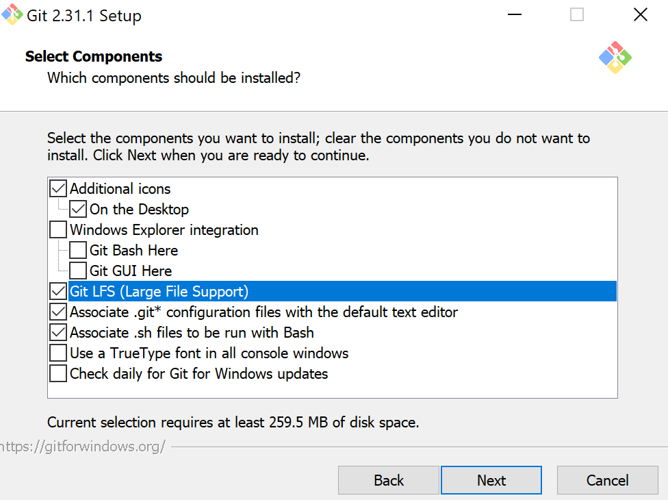{width=60%}
</center>
&nbsp;  


The program will prompt you to pick a text editor. Select notepad.

<center>
{width=60%}
</center>
&nbsp;  


For all other options, leave settings as default and click "next". The program will now install.

After installation, there is an option to "Launch Git Bash" (Terminal). Click it.

<center>
{width=60%}
</center>
&nbsp;  


This will open a Terminal window:

<center>
{width=60%}
</center>
&nbsp;  


#### Mac {-}

To get `Git` on your Mac, you will be typing commands into your computer's Terminal. 

1. Open your Terminal. 

2. Next we need to download and install a software management tool called [Homebrew](brew.sh). Copy and paste the following command into your Terminal, and press `Enter`:

```{r,eval=FALSE,echo=TRUE}
/bin/bash -c "$(curl -fsSL https://raw.githubusercontent.com/Homebrew/install/HEAD/install.sh)"
```

You will likely be asked for your computer password. Press `Enter` when instructed to do so.  Downloading Homebrew might take a few minutes.  

3. Now that Homebrew is installed, copy and paste the following command into your Terminal, and press `Enter`: 

```{r,eval=FALSE,echo=TRUE}
brew install git
```

After a minute or two, `git` should be downloaded, installed and ready to go.


### `Git` configuration  {-}

Once you've installed `git`, you'll likely want to configure some options and preferences. Go [here](https://git-scm.com/book/en/v2/Getting-Started-First-Time-Git-Setup) and walk through the steps.


### `Github` set up  {-}

Now you've got `git`. Great! Git is often used in conjunction with a third party, web-based platform. The most popular is `GitHub`.  

Go to [www.github.com](www.github.com) and create a user account. Make sure you use the same email address you used when configuring `git` above.  


## Create a new repository  {-}

Once you've created an account and logged in to `GitHub`, let's create a repository.  

**What is a repository?** Basically, it's a coding project in the form of a folder.  

1.  Having logged into git, click the "plus" icon in the upper right and then click "New repository" (or go directly [here](https://github.com/new)).

2.  You can fill in the "Repository name" field with whatever you'd like. For the following examples, we'll use the word "testrepo".  

3.  Fill in the "Description" field with the word "My first git repository".  

4.  Set the repo as "Public" (unless you plan on putting any secrets here!), and then click the "Add a README file" checkbox. Finally, click "Create repository".  

Cool! You've now created your first git repository. It's public url is `https://github.com/<YOUR USERNAME>/<repo-name>`. Others can see your code there, and you can too.


## Clone a repository  {-}

Your new repo exists on the internet, but does not yet exist on your local machine. In order to get "testrepo" on your computer, you'll need to do something that you'll only do once: "clone" the repo. "Cloning" in git-speak means creating a copy of the repository locally.

To clone, you'll first open your terminal window and `cd` into a directory where you'd like to clone your repo. For example, if you want to put your `testrepo` directory into `~/Documents`, you'll type the below into terminal:

```
cd ~/Documents
```

You can confirm that you are in `~/Documents` by typing: `pwd`. There? Good.

Now, we'll write the code to "clone" `testrepo`:

```
git clone https://github.com/<USERNAME>/<repo-name>
```

Now, you've got a folder on your machine named `testrepo`. You can confirm this by writing `ls` in the terminal.  

See `testrepo` there? Great!  


## Working in a repository {-}

### Change some code  {-}

In your local `testrepo` folder, you have a "cloned" copy of the repository at https://github.com/<YOUR USERNAME>/testrepo.  

As of now, it's a pretty uninteresting folder. The only thing in it is a file named `README.md`. A "README" file is generally an explanation of a repository's content, purpose, etc. Like all files, a README can be tracked in git.

Let's open the README file and make a change to it. We'll add the below line of "code":

```
This is my first git repository.
```

The save and close the README file. 


### Check the status of your repo {-}  

Now, let's ask `git` if it noticed if we had made any changes. Type the below into terminal:

```
git status
```

If everything has gone well until now, `git` will reply by telling us that we've made a change to the file. We can ask `git` _what_ change we made by typing:

```
git diff README.md
```

`diff` stands for "difference", as in "what is the difference between the code I had and the code I have. `Git` will spit back some color-coded lines showing the change you've made.

Satisfied with your change? Great, now it's time to confirm it by doing the following:

### Track the changes in a file {-}  

```
git add README.md
```

This tells `git` that we want it to notice and track the change we made to `README.md`. Then:

### Commit your changes as a stable version of your project {-}  

```
git commit -m 'my first change'
```

This tells `git` that we are "committing" our change, it marking a checkpoint (to which we can revert later). The `-m` flag is followed by a message in quotations which will help us to navigate this checkpoint in the future.

Almost there. Now that we've added and committed, we need to "push" our change to the remote repository (`GitHub`), by running:

### Push the changes in your local repo to GitHub {-}  

```
git push
```

You did it! Go to https://github.com/<YOUR USERNAME>/testrepo and open the `README.md` file. You'll notice that your most recent changes are there. Now, if someone else wants to get your code, they can "clone" your repository, and they'll have the code you've "pushed" there.

## `Git` workflow: overview {-}

We get it: `git` can be daunting and a bit confusing. This diagram tries to summarize the way `git` works:

<center>
{width=50%}
</center>  
 &nbsp;  
 
 
- There are **three workspaces** to keep in mind: the remote version of your repo, the local version of it, and your work area. Your interact with your remote repo on the `GitHub` website, your local repo through `Terminal`, and your work area through `RStudio`.  

- You **sync your remote and local repos** using the `git pull` and `git push` commands in `Terminal`.  When you `pull`, you are updating your local repo using the remote repo. When you `push`, you do the opposite: update the remote repo using your local repo.  

- You **sync your local repo and your work area** using the `git add` and `git commit` commands. You use these commands when you are ready to move files off of your work bench (`RStudio`) and back onto the shelf (local repo): you've reached a stopping point and want to stop working on your code for now.  

&nbsp;  

### Step-by-step workflow {-} 
 
**Setting up a new repo:**

**1.** Start a new remote repo (`GitHub`).   

**2.** Navigate to the local folder into which you want to clone your repo.  (`Terminal`, using a combination of `pwd`, `ls`, and `cd`.)

**3.** Clone the remote repo to your local machine (`Terminal`).  

```
git clone https://github.com/<your username>/<repo name>)  
```

&nbsp;  

**Working in a repo:**  

**4.** `cd` into your repo (`Terminal`).  

**5.** `pull` on your remote repo to make sure your local repo contains the latest version of your project (`Terminal`).  

```
git pull
```

**6.** Make changes to your code (revisions, new files, etc.) (`RStudio`)   

**7.** Stage those revised/new files for a commit (`Terminal`)
  
```
git add <filename>
```

**8.** Commit your changes (`Terminal`)

```
git commit -m"add specific message here"
```

**9.** Push your changes to the remote repo (`Terminal`)  

```
git push
```

**10.**  Check out your remote repo to verify that changes were pushed. (`GitHub`)  


### Exercises {-} 

**Create another repo:**  

Let's face it: `testrepo` is a pretty lame name for a repository. How about we make a repo that's actually real and useful? We'll make one for storing all the code we're writing in this course.

**1)** Go to https://github.com/<YOUR USERNAME>

**2)** Click the "plus" icon in the upper right and then click "New repository" (or go directly [here](https://github.com/new)).

**3)** Now, for "Repository name", write "datalab".

**4)** Fill in the "Description" field with the words "Code I wrote during my intro to data science course". 

**5)** Set the repo as "Public" (unless you plan on putting any secrets here!), and then click the "Add a README file" checkbox. Finally, click "Create repository".  

**6)** Clone the repo to your computer (Documents folder).  

**7)** Create a new R script in your `datalab` repository called `gapminder.R`.  

**8)** Create a histogram of life expectancy in 1982.  

**9)** Create a line plot for population in Asia, colored by country. Make the lines a bit thicker and more transparent.  

**10)** Add new x and y axis labels, as well as a chart title.  

**11)** Create a bar chart of all European countries gdp per capita in 2002.  

**12)** Make the bars transparent and filled with the color blue.  

**13)** Create a new data set called `the_nineties` that only contains years from the 1990s.   

**14)** Save this dataset to your repository (use `write.csv()`).   

**15)** Add, commit, and push your files to `GitHub`.  

&nbsp;  

**Add a `.gitignore` file**  

If you `cd` into your local `datalab` repo, and then type `git status`, you might note that it's a bit "busy". That is, there are a lot of documents there! You're going to want to (i) add, (ii) commit, and (iii) push these documents, but perhaps there are some kinds of documents you _don't_ want to push.

For example, maybe you want to push R code files (`.R`), but not data files (`.csv`). In this case, you can explicitly tell `git` that you don't want it to pay any attention to `.csv` files by creating a `.gitignore` file. A `.gitignore` file is simply a text file in a git repository that indicates to git that the contents of that file should be ignored.

Let's do it. 

**16)** First, create an empty `.gitignore` file. In `Terminal`, type:   

```
touch .gitignore
```

**17)** Then, open the `.gitignore` file in RStudio.  

**18)** Finally, add the following line to it:

```
*.csv
```

The star is a "wildcard", meaning that it stands in place of anything (such as `ducks.csv` or `data.csv` or `xyz.csv`). 

With this in your repo, `git` now knows to ignore anything that ends with the extension `.csv`.

Good? Great.  

**19)**  Push everything to your repo.  

Now you can share your code with others, and your future self.   


#### Further resources {-}  

[Hadley Wickham's introduction to `git` + `GitHub`](https://r-pkgs.org/git.html)  

[Using `git` from `RStudio`](https://nceas.github.io/oss-lessons/version-control/4-getting-started-with-git-in-RStudio.html)


<!--chapter:end:10a-git.Rmd-->

# `Markdown` documentation 

#### Learning goals {-}

- How to document your projects with `Markdown`, and why doing so is so important.

&nbsp;  

This is a **meta-tutorial** for using `Markdown`, a "syntax" for writing
*beautiful* reports with simple text files. This tutorial, which was written
in `Markdown`, has been provided twice: first, as its formatted 'book-ready' 
form, and second as the raw text file used to write it.  

## What is `Markdown`?  {-}  

`Markdown` lets you write documents formatted with fancy `HTML` (the main
language used to create websites) without having to know how to write `HTML`
code. Instead, you just need to know how to use a few common symbols. 

### Why? {-} 
`Markdown` was created because most data scientists used to document their
code and data projects with simple text files (`.txt`). Text files are designed
to be simple, so they have no special formatting: no nice fonts, no headings,
no bold, no italics, no bullet lists. And, as a result of their simplicity,
text files are (1) *boring* and (2) *difficult to organize*.  

`Markdown` is the perfect solution: it translates a simple text file into a
beautifully formatted report.  

Recall that, in order for your research to be truly reproducible, you have to
**document your work thoroughly**. Doing so requires two things: First, that
you provide a detailed description of your work in a simple text file, and
second, that your documentation be *well-organized* and *enjoyably legible*.
Think about it: if your documentation is incomplete, impossible to navigate,
and difficult to read, can you really say that your project is reproducible?

### What can you do with `Markdown`? {-}  

First of all, `Markdown` ...  

1. Lets you organize your report into sections and subsections.  
2. Lets you *italicize* and **emphasize** certain sections of your work. 
3. Lets you distinguish between normal text and `code` or `filenames`. 
4. Lets you write large chunks of code, like the one below. 

```
# This is a large chunk of code. 
x <- 1:10
y <- 15:20
z <- x + y
```

Also, `Markdown` ...  

- Lets you weave together your documentation with `R` code that
*actually runs* (this is called `RMarkdown`, which is covered
in the next module), opening up possibilities for automatic reporting
and truly reproducible research publications.  

- Lets you produce publication-ready articles and books, since there is a
world of open-source formatting templates available to you.  

- Lets you add [hyperlinks](https://www.markdownguide.org/getting-started/).  

- Lets you type `HTML` code directly into the same document, 
<font color='red'><b>if you want to</b></font>. 

- Lets you include images, like the one below.  

<center>
{width=50%}
</center>

&nbsp;  

#### Common `Markdown` mistakes {-}

- When you try to make a section heading (e.g., `## New section`),
you forget to put a space between the hashtags and the name of the section.  

- When you try to begin a new paragraph, you don't add *two spaces*
at the end of your sentence. (Without those two spaces, `Markdown`
will assume you are still working in the same paragraph.) 

- The same thing happens often when making a list. Without *two spaces*
at the end of each item, the items might not get placed on new lines.  

- When you try to begin a new paragraph, you don't add an empty line
between your paragraphs.  

## Raw `Markdown` example {-}  

Below we provide the raw textfile we used to write the section above.  

````
# `Markdown` documentation 

#### Learning goals {-}

- How to document your projects with `Markdown`, and why doing so is so important.

&nbsp;  

This is a **meta-tutorial** for using `Markdown`, a "syntax" for writing
*beautiful* reports with simple text files. This tutorial, which was written
in `Markdown`, has been provided twice: first, as its formatted 'book-ready' 
form, and second as the raw text file used to write it.  

## What is `Markdown`?  {-}  

`Markdown` lets you write documents formatted with fancy `HTML` (the main
language used to create websites) without having to know how to write `HTML`
code. Instead, you just need to know how to use a few common symbols. 

### Why? {-} 

`Markdown` was created because most data scientists used to document their
code and data projects with simple text files (`.txt`). Text files are designed
to be simple, so they have no special formatting: no nice fonts, no headings,
no bold, no italics, no bullet lists. And, as a result of their simplicity,
text files are (1) *boring* and (2) *difficult to organize*.  

`Markdown` is the perfect solution: it translates a simple text file into a
beautifully formatted report.  

Recall that, in order for your research to be truly reproducible, you have to
**document your work thoroughly**. Doing so requires two things: First, that
you provide a detailed description of your work in a simple text file, and
second, that your documentation be *well-organized* and *enjoyably legible*.
Think about it: if your documentation is incomplete, impossible to navigate,
and difficult to read, can you really say that your project is reproducible?

### What can you do with `Markdown`? {-}  

First of all, `Markdown` ...  

1. Lets you organize your report into sections and subsections.  
2. Lets you *italicize* and **emphasize** certain sections of your work. 
3. Lets you distinguish between normal text and `code` or `filenames`. 
4. Lets you write large chunks of code, like the one below. 

```
# This is a large chunk of code. 
x <- 1:10
y <- 15:20
z <- x + y
```

Also, `Markdown` ...  

- Lets you weave together your documentation with `R` code that
*actually runs* (this is called `RMarkdown`, which is covered
in the next module), opening up possibilities for automatic reporting
and truly reproducible research publications.  

- Lets you produce publication-ready articles and books, since there is a
world of open-source formatting templates available to you.  

- Lets you add [hyperlinks](https://www.markdownguide.org/getting-started/).  

- Lets you type `HTML` code directly into the same document, 
<font color='red'><b>if you want to</b></font>. 

- Lets you include images, like the one below.  

<center>
{width=50%}
</center>

&nbsp;  

#### Common `Markdown` mistakes {-}

- When you try to make a section heading (e.g., `## New section`),
you forget to put a space between the hashtags and the name of the section.  

- When you try to begin a new paragraph, you don't add *two spaces*
at the end of your sentence. (Without those two spaces, `Markdown`
will assume you are still working in the same paragraph.) 

- The same thing happens often when making a list. Without *two spaces*
at the end of each item, the items might not get placed on new lines.  

- When you try to begin a new paragraph, you don't add an empty line
between your paragraphs.  

````


## Exercises {-}  

**Open a new, blank `Markdown` document:**  

**1.** In `RStudio`, go to the top left dropbown menu for making a new file (look for the green plus sign.)  

**2.** Select "Text File"   

**3.** Save this text file as `test.md`.  

The prefix, `.md`, specifies that this text file should be interpreted as a `Markdown` file. Once you save the file, you should see some new options appear, one of which is preview.  

**4.** At the top of your `test.md` file, write: `# Title`  

**5.** Click the Preview button and see if a `Markdown` file is produced.  

&nbsp;  

**Make your own `Markdown`:**  
Use the `Markdown` example above, which you can compare to the formatted version at the top of this module, to figure out how to add the following elements to your document. 

Use the *Preview* button to test if your entries are doing what you want them to.  

**6.** Write a silly sentence.  

**7.** Make a word in that sentence *italicized*. 

**8.** Make a word in that sentence **boldface.**  

**9.** Add the first section to your document. Name it whatever you want.  

**10.** Add a sentence in this new section, formatting one of its words as a piece of `code`.  

**11.** Start a new paragraph and add another sentence. 

**12.** Start a third paragraph and add vertical space between it and the previous paragraph.  

**13.** Add a multi-line chunk of code.  

**14.** Download a silly meme from the internet and add it to your document. (*Hint:* you will have to place that image file in the same folder as your `Markdown` file.)  

**15.** Add another subsection to the subsection you are working in. Name it "Grocery List".

**16.** Type out an enumerated grocery list.  

**17.** Add another subsection, this time at the same hierarchichal level as the one you created in step 9. Name it "Bucket List".  

**18.** Create a bullet list of things you want to accomplish before you die.  

**19.** Make one of your list items act as a link to another website.  

&nbsp;  

**Update your `Git` repo `README` with `Markdown`**  

This will be a review of both `Markdown` and `Git`!  

**20.** Navigate to your `GitHub` repo online.

**21.** If you have not yet added a `README` file to your repo, click on the button that generates one for you.  

**22.** Click on the file to edit it.  

**23.** Add `Markdown` to your `README`, showcasing the tricks you haved learned in this exercise thus far.  *Preview* your changes as you go and make sure everything looks how you intended.  

**24.** Commit your changes and check out your `README` on the homepage of your repo.  

&nbsp;  

**Make a `Markdown` CV**  

It is increasingly common for data scientists to have a Markdown version of their *CV* posted as its own page connected to their `GitHub` profile.  Check out these examples:

- [Here](https://carolstran.github.io/cv/)  
- [Also here](https://github.com/ViliamV/easy-markdown-cv)    
- [And here!](http://wodenimoni.com/nimo-markdown-cv/)  

Maintaining your *CV* this way can be very efficient. It is easy to format and easy to update. And, most importantly, rather than have various versions of your *CV* on your computer or in GoogleDrive, you can just share a *link* to your live, published *CV*. What better way to demonstrate your skillset in reproducible, professional-quality research?  


**25.** Use the instructions provided [here](https://workwithcarolyn.com/blog/digital-cv-guide) to create a new repo for your *CV*, type up your *CV* in `Markdown`, and publish it for free on `GitHub Pages`. 

This will also be a review of both `Markdown` and `Git`!  


#### Resources {-}  

https://www.markdownguide.org/basic-syntax/


<!--chapter:end:10b_markdown.Rmd-->

# `R Markdown` 

#### Learning goals {-}

- How to create `RMarkdown` documents  
- Why they are awesome  
- Why they are essential to truly *reproducible* reporting.  

&nbsp;  

`R Markdown` is the combination of `R` and `Markdown`: you create a `Markdown` document that has `R` built-in to it: the two languages are woven, or "knitted", together.  

## Do first, explain later {-}

Let's not talk about it. Let's just do it.

#### Start an `RMarkdown` report {-}

**1.** Open Rstudio.  
**2.** Click `File` -> `New File` -> `R Markdown`  
**3.** Fill out "Title", "Author", and click "Set to HTML"  
**4.** Type  `Ctrl + S` to save your file in your working directory.   

#### Compile your report {-}

**5.** Have a look at the document. What does each section mean?  
**6.** Click the *"Knit"* button at the top.  
**7.** Cool, right? 

But also kind of boring. Let's make some changes to this report.  

#### Modify the template {-}

**8.** Let's replace the "setup chunk" with the below.  

```{r, include=FALSE, echo = TRUE, eval = TRUE}
# Basic knitr options
library(knitr)
opts_chunk$set(comment = NA, 
               echo = TRUE, 
               warning = FALSE, 
               message = FALSE, 
               error = TRUE)
```

**9.** Then, let's change the title to some interesting question.   

**10.** Now, let's delete all of the other stuff in the template so far (beginning at "R Markdown").   

**11.** Put in some section headers using `Markdown`. Make the following sections: 

```
# Introduction

# Methods

# Results

# Discussion

# Bibliography
```

**12.** Write a two-sentence introduction to your made-up research topic.  

**13.** `Knit` again, to make sure that we did not break anything.  (You should `knit` often!)  

Good? Great.  

## Add an `R` chunk {-} 

In your *Methods* section, let's create an `R` chunk in which we can generate some fake data.  

To make an `R` chunk, type this:

```` 
```{r}
# code goes here
```
````
Those three marks represent the start and end of a chunk of code.  

Now add this code into your chunk: 

```{r,echo=TRUE,eval=TRUE}
x <- 1:1000
y <- sqrt(x) + rnorm(1000,0,sd=3)
plot(y ~ x, cex=.7)
```

Know, re-`knit` your doc. Everything work? 

### Chunk options {-}  

#### Hide a chunk {-} 

To run the code within an `R` chunk but hide the code in your final output, change the bracketed code at the top of your chunk to read `{r, echo = FALSE}`.

#### Don't evaluate a chunk {-}

To skip over a chunk without evaluating it, change your brackets to look like this: `{r, eval = FALSE}`.  

What if you want to hide a chunk *and* skip over it? `{r, echo = FALSE, eval = FALSE}`. This is a nice way to store code scraps that you don't want to run but aren't ready to get rid of.  

#### Change figure size {-}  

To change the dimensions of a plot output, change your brackets to look like this:
`{r, fig.height = 3, fig.width = 7}`

Doing so produces a plot like this: 

```{r,fig.height=3, fig.width=7, echo=FALSE}
plot(y ~ x, cex=.7)
```

#### Add figure caption {-} 

To add a figure caption, change your brackets like so: `{r, fig.cap = "A squished plot."}`  
 
```{r,fig.height=3, fig.width=7, fig.cap="A squished plot.", echo=FALSE}
plot(y ~ x, cex=.7)
```

## In-line `R` code {-} 

In your *Results* section, add this line:

> Our analysis was based on  `` `r knitr::inline_expr("length(x)")` `` observations.  

Know, re-`knit` your doc. What was printed before the word "observations"? 

&nbsp;  

**This is why `RMarkdown` is reproducible.** Think of how a typical research report works: you get your results from
`R` or whatever program you are using, then you manually write those results numbers into a *Word* document. What is reproducible about that? 

With `RMarkdown`, you can let the data underlying your analysis *literally speak for themselves*.  


## Tables {-}  

To make a pretty table out of a dataframe, create a chunk that looks like this:  

```{r, results='as is'}
library(knitr)
df <- data.frame(x,y)
kable(head(df), caption = "A pretty sweet table.")
```


## Bibliographies  {-}

- In `RStudio`, create a new Text File and save it as `bibliography.bib` in the same location as your `RMarkdown` file.   

- Look up [this paper](https://www.researchgate.net/publication/260642613_Statistical_exponential_formulas_for_homogeneous_diffusion)  

- Copy the `DOI`.  

- Go to [https://doi2bib.org/](https://doi2bib.org/)  

- Copy the `bibtex` format   

- Paste into your `.bib` file.  

Note that the top line of this `bib` entry has the phrase `Rudd2014`. This is known as the citation's "key" -- you can use this phrase to reference this source within your `Markdown` doc.  

- Back in your `RMarkdown` doc, in your *Discussion* section, write some line about a paper.

- At the end of that sentence, add this text: `([@Rudd2014])`.  

- Add `bibliography: bibliography.bib` to your "`yaml`", the header information at the very top of your `RMarkdown` file. Change the `yaml` so that it looks like this:  

```
---
output: html_document
bibliography: bibliography.bib
---
```

- Re-`knit` your doc to see what happens. Was the citation automatically generated?  


#### Exercises {-}

Before getting started, think of a testable hypothesis which can be answered via a survey of your friends and classmates. For example: "woman have more dreams than men", or "people born abroad have shorter last names than people born in the USA", or "shoe size is associated with GPA".  

**1.** Create a repository on github called `report`.  

**2.**  Clone that repository to your local machine.  

**3.**  `cd` into that repository.  

**4.**  In that repo, create a new `Rmarkdown` document. Name it `paper.Rmd`. 

**5.** Replace the setup chunk with the one used in the in-class exercise (above).

**6.** Create a *GoogleForms* survey with at least 5 interesting questions on a topic which interests you (one topic, five questions).

**7.** Get at least 5 people to fill out your survey. 

&nbsp;  

**8.** In your *GoogleForms* settings, create a *GoogleSheet* of your results.  

**9.** In the sharing settings of your *GoogleSheet*, set to "public".  

**10.** Copy the URL of your *GoogleSheet*.  

**11.** Create an R chunk in your `paper.Rmd`.  

**12.** Use the `gsheet` package to read your survey results as a dataframe.

&nbsp;  

**13.** After reading in the data, create the following sections in your report: `Introduction`, `Methods`, `Results`, `Conclusion`. 

**14.** Spend 5-15 minutes on the internet reading about your topic / hypotheses. 

**15.**  Find 2-5 authors/articles of interest related to your topic. Cite them in the *Introduction*.

**16.**  Describe in plain English your approach to testing your hypothesis in the *Methods* section.  

**17.** In your *Methods* section, provide a URL link to your survey.   

&nbsp;  

**18.**  After the *Methods* section, write the `R` code (in an `echo`ed chunk) which tests your hypothesis.

**19.**  In the *Results* section, write a description of both (a) your sample and (b) your results. Include at least two charts. Include at least one table.

**20.** In the *Conclusion* section, write interesting reflection on your data.

&nbsp;  

**21.** Got here? Cool, you're fast. Now configure your computer to generate pdfs via Rmarkdown: [mac](https://medium.com/@sorenlind/create-pdf-reports-using-r-r-markdown-latex-and-knitr-on-macos-high-sierra-e7b5705c9fd) / [windows](https://medium.com/@sorenlind/create-pdf-reports-using-r-r-markdown-latex-and-knitr-on-windows-10-952b0c48bfa9)

**22.** Make your paper in pdf.  

**23.** Check out these [theme options for `Rmarkdown` docs.](https://www.datadreaming.org/post/r-markdown-theme-gallery/)

**24.** Push your code to git

**25.** Check out how to [make presentations in `Rmarkdown`.](https://rmarkdown.rstudio.com/lesson-11.html) Make one.  

**26.**  Check out how to [make dashboards in `Rmarkdown`.](https://rmarkdown.rstudio.com/lesson-12.html) Make one.

**27.** Change your citation style. To do so, [use a new csl from this site.](https://github.com/citation-style-language/styles)


<!--chapter:end:10c-R_Markdown.Rmd-->

# Interactive `shiny` dashboards {#shiny}

#### Learning goals {-}

- Learn how to create interactive web-based apps and dashboards with `shiny`.  

- Why `shiny` is so awesome and valuable in *reproducible* data science.  


## Overview {-}

`Shiny` is a package that makes it easy to build interactive web applications and dashboards in `R`.  

First we need to install and load the package: 

```{r,echo=TRUE,collapse=TRUE, eval = FALSE}
install.packages('shiny')
library(shiny)
```

`Shiny` apps consists of two main parts: 

1) The **UI**, which stands for User Interface. The UI controls what is being displayed on the application page and how the components are laid out. This may include text and other `markdown` elements, graphics, widgets that take in user input, or plots. You will also use the UI to define a navigation bar with multiple tabs in this tutorial.

2) The **Server**. The server controls the data that will be displayed through the UI. The server will be where you load in and wrangle data, then define your outputs (i.e. plots) using input from the UI.

Lets get started! Navigate to the left hand corner of the Rstudio screen and select: File > New File > Shiny Web App.. Create a name for your application and save to your directory.

<center>
{width=75%}
</center>

&nbsp;  

This will open a script with pre-populated code that is deployment-ready. To run the app, simply click the "Run App" button in the top right. You should see a window appear like this: 

<center>
{width=70%}  
</center>

&nbsp;  

Click on the slider and drag it to the left and the right. See how the plot "reacts"? That is why `shiny` is referred to as an `interactive app`.  

&nbps;  

Let's break down each function to get a better understanding of the app's guts.

### The `ui` {-} 

```{r,eval=FALSE}
ui <- fluidPage(
    titlePanel("Old Faithful Geyser Data"),
    sidebarLayout(
        sidebarPanel(
            sliderInput("bins",
                        "Number of bins:",
                        min = 1,
                        max = 50,
                        value = 30)
        ),
        mainPanel(
           plotOutput("distPlot")
        )
    )
)
```

- `fluidPage`: Gives us a flexible page to work with by making it easy to position elements of the app (inputs, text, plots, etc) beside each other (rows) and on top of each other (columns). Note that each nested function within the `fluidPage` function is separated by a comma.

- `titlePanel`: An optional title.  

- `sidebarLayout`: Creates a layout in `ui` that splits the screen into a sidebar (`sidebarPanel`) & and main section (`mainPanel`).  

- `sidebarPanel`: Typically reserved for app inputs.   

- `sliderInput`: One of many `shiny` widget inputs to manipulate data.  

- `mainPanel`: Typically reserved for app outputs (plots, tables, etc)  

- `plotOutput`: A `shiny` function that displays a plot that is created in the server.

### The `server` {-} 

```{r,eval=FALSE}
server <- function(input, output) {

    output$distPlot <- renderPlot({
        x    <- faithful[, 2]
        bins <- seq(min(x), max(x), length.out = input$bins + 1)
        hist(x, breaks = bins, col = 'darkgray', border = 'white')
    })
}
```

- `output$distPlot`: An output of the app. In this case, that output is a plot. The output has a named, `distPlot`, so that it can be referred to in the `UI`. 

- `renderPlot`: A `shiny` function to builds the plot.


### The `shinyApp( ... )` command {-}

The `ui` and `server` commands should build the pieces for an app. The app actually gets *built* when they are combined in the function `shinyApp(ui, server)`.  


### Overview of the overview {-}  

The key differences between the `ui` and `server` are that ...  

(1) The `ui` takes inputs (e.g., `sliderInput`) and displays outputs (e.g., `renderPlot`), whereas the server creates outputs (e.g., a plot). In our default example the input is simply a number from 1 to 50 to determine the number of bins in the output (a histogram).  

(2) The `ui` actually *outputs* the outputs that are rendered by `server`. In the server, you'll find functions like `renderPlot`, but in the `ui` you will find functions like `plotOutput`. (Confusing, we know.)  

Every `shiny` app you build will follow the same basic format: 

```{r,echo=TRUE,eval=FALSE}
####################################################################
# Shiny app template ###############################################

# Add libraries here

# Load data here

####################################################################
ui <- fluidPage(

)

####################################################################
server <- function(input,output){

}

####################################################################
shinyApp(ui = ui, server = server)
```

## Build your first `shiny` app {-}

First, delete the code currently in your `shiny` script and paste the template code above into the script. If you click 'Run App', a blank window should appear.  

Second, add some libraries to the top of your script:  

```{r,echo=TRUE,collapse=TRUE, eval = FALSE}
library(shiny)
library(dplyr)
library(gapminder)
library(ggplot2)
```

Next, load some data from the package `gapminder`, which provides country-level data on life expectancy, GDP per capita, and population for the last half century.  

```{r,echo=TRUE,collapse=TRUE, eval = FALSE}
gm <- gapminder
```

Now, setup a layout for your `ui`. Add the following code inside the `fluidRow` parentheses:  

```{r,eval=FALSE}
    titlePanel("The economics of global health"),
    sidebarLayout(
        sidebarPanel(
            
        ),
        mainPanel(
            
        )
    )
```

`Run App` and make sure everything still works. Repeat that action after each following step.  

(You will want to get in the habit of re-building the app everytime you make a change. It makes fixing errors much less of a headache.)  

Now add an input that allows the user to choose a country to plot. Add this code to the `sidebarPanel`:

```{r,echo=TRUE,collapse=TRUE, eval = FALSE}
selectInput(inputId = "country_name",
                        label = "Choose a country",
                        choices = unique(gm$country),
                        selected = 'Mexico')
```

Now add a plot to your app. Add this code to the `mainPanel` of your `ui`: 

```{r,echo=TRUE,collapse=TRUE, eval = FALSE}
plotOutput("country_plot")
```

And add this code to your `server`:  

```{r,echo=TRUE,collapse=TRUE, eval = FALSE}
output$country_plot <- renderPlot({
        cn <- input$country_name
        
        pd <- gm %>% dplyr::filter(country == cn)
        ggplot(pd, aes(year, pop)) +
            geom_point() +
            geom_line() +
            labs()
})
```

Now run your app and try changing the country selected in the drop-down menu; does the plot react?  

Let's add some more inputs to the `sidebarPanel`, to adjust the way the chart looks. First, make sure there is a comma after the `selectInput` that creates the country drop-down.  Then add this code:  

```{r,echo=TRUE,collapse=TRUE, eval = FALSE}
selectInput(inputId = "line_color",
            label = "Choose a color for the line",
            choices = c('green', 'blue','red', 'orange'),
            selected = 'green'),

selectInput(inputId = "point_color",
            label = "Choose a color for the points",
            choices = c('green', 'blue','red', 'orange'),
            selected = 'green'),

sliderInput(inputId = "line_size",
            label = "Change the thickness of the line",
            min = 1,
            max = 10,
            value =2),

sliderInput(inputId = "point_size",
            label = "Change the point size",
            min = 1,
            max = 10,
            value =5),

sliderInput(inputId = 'alpha_value',
            label = 'Change transparency of line and points',
            min= 0,
            max=1,
            value =0.5)
```

Then update the `server` code to react to these new inputs:  

```{r,echo=TRUE,collapse=TRUE, eval = FALSE}
output$country_plot <- renderPlot({
    cn <- input$country_name
    lc <- input$line_color
    ps <- input$point_size
    ls <- input$line_size
    pc <- input$point_color
    av <- input$alpha_value
    pd <- gm %>% dplyr::filter(country == cn)

    ggplot(pd, aes(year, pop)) +
           geom_point(color = pc, size = ps, alpha=av) +
           geom_line(color = lc, size = ls, alpha=av) +
           labs(title = cn)
    })
```

Now add an additional input to the sidebar that allows the user to choose which variable to plot:  

```{r,echo=TRUE,collapse=TRUE, eval = FALSE}
selectInput(inputId = 'plot_var',
            label = 'Choose a variable to plot',
            choices = c('lifeExp', 'pop', 'gdpPercap'),
            selected = 'pop')
```

And update the `server` output:  

```{r,echo=TRUE,collapse=TRUE, eval = FALSE}
output$country_plot <- renderPlot({
    cn <- input$country_name
    lc <- input$line_color
    ps <- input$point_size
    ls <- input$line_size
    pc <- input$point_color
    av <- input$alpha_value
    pv <- input$plot_var
    pd <- gm %>% dplyr::filter(country == cn)
    ggplot(pd, aes_string('year', pv)) +
        geom_point(color = pc, size = ps, alpha=av) +
        geom_line(color = lc, size = ls, alpha=av) +
        labs(title = cn)
})
```

Now let's modify our app so that you can display multiple countries at once.  First, modify the `selectInput` for the input `country_name`:  

```{r,echo=TRUE,collapse=TRUE, eval = FALSE}
selectInput(inputId = "country_name",
                        label = "Choose a country",
                        choices = unique(gm$country),
                        multiple=TRUE,
                        selected = 'Mexico')
```

Now let's modify these lines of code inside the `server`'s `renderPlot` call:  

```{r,echo=TRUE,collapse=TRUE, eval = FALSE}
pd <- gm %>% dplyr::filter(country %in% cn)
 ggplot(pd, aes_string('year', pv, group='country')) +
        geom_point(color = pc, size = ps, alpha=av) +
        geom_line(color = lc, size = ls, alpha=av) +
        labs(title = cn)
```

The final version of your app's code should look like this:  

```{r,eval=FALSE}
####################################################################
# Shiny app template ###############################################

# Add libraries here
library(shiny)
library(dplyr)
library(gapminder)
library(ggplot2)

# Load data here
gm <- gapminder

####################################################################
ui <- fluidPage(
    titlePanel("The economics of global health"),
    sidebarLayout(
        sidebarPanel(
            selectInput(inputId = 'plot_var',
                        label = 'Choose a variable to plot',
                        choices = c('lifeExp', 'pop', 'gdpPercap'),
                        selected = 'pop'),

            selectInput(inputId = "country_name",
                        label = "Choose a country",
                        choices = unique(gm$country),
                        multiple=TRUE,
                        selected = 'Mexico'),

            sliderInput(inputId = "line_size",
                        label = "Change the thickness of the line",
                        min = 1,
                        max = 10,
                        value =2),

            sliderInput(inputId = "point_size",
                        label = "Change the point size",
                        min = 1,
                        max = 10,
                        value =5),

            sliderInput(inputId = 'alpha_value',
                        label = 'Change transparency of line and points',
                        min= 0,
                        max=1,
                        value =0.5)

        ),
        mainPanel(
            plotOutput("country_plot")
        )
    )
)

####################################################################
server <- function(input,output){

    output$country_plot <- renderPlot({
        cn <- input$country_name
        ps <- input$point_size
        ls <- input$line_size
        av <- input$alpha_value
        pv <- input$plot_var
        pd <- gm %>% dplyr::filter(country == cn)
        ggplot(pd, aes_string('year', pv, color='country')) +
            geom_point(size = ps, alpha=av) +
            geom_line(size = ls, alpha=av) +
            labs(title = cn)
    })
}

####################################################################
shinyApp(ui = ui, server = server)

```

### Final thoughts {-}  

`Shiny` apps are nifty and cool, but they are also an important tool for reproducible research.  

Imagine that you are a data science consultant, and your client asks you to help them answer a mission-critical question with their company's datasets.

Think about the difference between these two scenarios:  

**(1)** You analyze the data, produce a plot, paste it into a Word document, and send the client a PDF.  

**(2)** You build a `shiny` app based on their datasets, and pass the URL for the app to the client. They explore the data for and find the answer *for themselves*. While they are exploring the data, they are discovering new insights, generating new questions, and finding answers to questions they did not know they had.  

One of these scenarios is reproducible and empowering. The other is not.  


### Exercises {-}


**A COVID-19 `shiny` app**

**1.** Go to `github.com`, sign-in, and create a new repository called `shiny_examples`.  

**2.** Clone that repository to your Documents folder using `git`.   

**3.** Create a new folder named `covid_data` inside your `shiny_examples` repo.  

**4.** Inside that folder, create a `shiny` file (`app.R`) and paste the app template from above.  

**5.** Add these libraries to your script:  

```{r,echo=TRUE,collapse=TRUE, eval = FALSE}
library(shiny)
library(readr)
library(dplyr)
library(ggplot2)
library(lubridate)
```

**6.** Add this code to read in the data on COVID-19.  

```{r,echo=TRUE,collapse=TRUE, eval = FALSE}
df <- read_csv('https://raw.githubusercontent.com/databrew/intro-to-data-science/main/data/covid_data.csv')
pop <- read_csv('https://raw.githubusercontent.com/databrew/intro-to-data-science/main/data/state_pop.csv')
```

**7.** Create a title for the app called "Covid-19 cases and deaths by state".  

**8.** In the side panel of your `ui`, create an input that allows the user to choose a state.   

**9.** Create a bar chart called `cases_month` that plots a state's Covid-19 cases by month.   

**10.** Add an input called `bar_color` that controls the color that fills the bar plot.  

**11.** Add an input called `alpha_value` that controls the transparency of the bars in the chart.  

**12.** Create another bar chart called `deaths_month` that plots a states Covid-19 deaths by month.  

**13.** Use the already created inputs `bar_color` and `alpha_value` to control the color and transparency of the new bar chart.  

**14.** Create a line plot called `cumulative_cases` that plots the cumulative cases over time (*hint:* use the function `cumsum`).  

**15.** Create a line plot called `cumulative_deaths` that plots the cumulative deaths over time (*hint:* use the function `cumsum`).  

**16.** At the top of your script, join the population data (pop) to the Covid-19 data. Create two new variables: `covid_deaths_per_100k` and `covid_cases_per_100k`.  

**17.** Create a line plot that plots the cases and deaths per 100k in one chart.   

**18.** Create an input that controls the line colors for the above chart.   

**19.** Add a title to all plots that combines the name of the state selected and a description of the chart.  

**20.** Add a theme to each plot using the `ggthemes` library.  

**21.** There should now be five charts. Use the `fluidRow()` and `column()` argument to put the bar charts side by side. Under the bar charts, put the line plots side by side. Under those, put the final line plot centered in the middle of the screen.  

**22.** Use the `shinythemes` package to customize your app (https://rstudio.github.io/shinythemes/). 

**23.** Deploy the app to `shinyapps.io`.    


<!--chapter:end:10d-shiny_apps.Rmd-->

# Interactive maps

```{r,echo=TRUE,collapse=TRUE, eval = TRUE}

```

#### Learning goals {-}

- Learn how to create interactive, *beautiful* maps with `leaflet`. 

- Understand why `leaflet` is so awesome and valuable in *reproducible* data science.  


## Mapping with `leaflet` {-}  

If you know about the right packages, making really nice maps in `R` is actually pretty easy. `R`'s spatial visualization tool set is one of the things that elevates it above the other open-source coding tools out there. 

Being able to make a map programmatically is a powerful skill. And we can do it quickly and easily in `R` thanks to the package `leaflet`.  

Let's load it up:   

```{r,echo=TRUE,collapse=TRUE, eval = FALSE}
install.packages('leaflet')
```

```{r,echo=TRUE,collapse=TRUE, eval = TRUE, message=FALSE}
library(leaflet)

# Some other packages too:
library(dplyr)
library(ggplot2)
```

To practice making a map, let's focus in on the location of Sewanee: The University of the South, in Tennessee, USA.  

```{r,echo=TRUE,collapse=TRUE, eval = TRUE}
sewanee <- data.frame(longitude=-85.9211, 
                      latitude=35.2031)
```

To begin a `leaflet` map, simply type `leaflet()`. This creates a blank canvas. 

```{r,echo=TRUE,collapse=TRUE, eval = TRUE}
leaflet()
```

&nbsp;  

Now, add the background map. To do so, `leaflet` uses "tiles". Tiles are basically images -- little pictures stitched together to give you a sense of a continuous map.

```{r,echo=TRUE,collapse=TRUE, eval = TRUE}
leaflet() %>% addTiles() 
```

&nbsp;  

Try zooming into this map to get a sense of how powerful these interactive `leaflet` maps can be.  

To get the map focused on a specific area of interest, bring in "markers" based on your data:  

```{r,echo=TRUE,collapse=TRUE, eval = TRUE}
leaflet() %>% 
    addTiles() %>% 
    addMarkers(data=sewanee)
```

&nbsp;  

Ta-dah! There's your map. Try zooming in & out again.  

### Stylizing your `leaflet` map {-}  

How about satellite imagery instead?  

```{r,echo=TRUE,collapse=TRUE, eval = TRUE}
leaflet() %>% 
    addProviderTiles(providers$Esri.WorldImagery) %>% 
    addMarkers(data=sewanee)
```

&nbsp;  

How about topography instead?  

```{r,echo=TRUE,collapse=TRUE, eval = TRUE}
leaflet() %>% 
    addProviderTiles(providers$Esri.WorldTopoMap) %>% 
    addMarkers(data=sewanee)
```

&nbsp;  

The `leaflet` package has plenty of other tile styles available through the `addProviderTiles()` function. To preview all the options, check out [this site.](https://leaflet-extras.github.io/leaflet-providers/preview/)   

### Working with markers in `leaflet` {-}  

To change the markers from a "dart" to a circle, use `addCircleMarkers()` instead: 

```{r,echo=TRUE,collapse=TRUE, eval = TRUE}
leaflet() %>% 
    addProviderTiles(providers$Esri.WorldTopoMap) %>% 
    addCircleMarkers(data=sewanee, 
                     color = "firebrick",
                     radius = 15)
```

&nbsp;  

To add 'pop up' information when you click on your marker, use the `popup` input:  

```{r,echo=TRUE,collapse=TRUE, eval = TRUE}
leaflet() %>% 
    addProviderTiles(providers$Esri.WorldTopoMap) %>% 
    addCircleMarkers(data=sewanee, 
                     color = "firebrick",
                     radius = 15,
                     popup = paste0('<b>YSR, yall.</b> <br>', 
                                    'Lat: ',sewanee$longitude,'<br>',
                                    'Lon: ',sewanee$latitude,'\n'))
```

&nbsp;  

Click on the marker and see how it looks! Note that we used a bit of `HTML` to make the text look prettier.  

### Mapping marine areas {-}  

Note that `leaflet` is also useful in mapping marine areas.  

For example, map the bathymetry of the northeast Pacific basin:  

```{r,echo=TRUE,collapse=TRUE, eval = TRUE}
leaflet() %>% 
    addProviderTiles(providers$Esri.OceanBasemap) %>%
    fitBounds(lng1 = -165,
              lng2 = -100,
              lat1 = 10,
              lat2 = 50)
```

&nbsp;  

Or get satellite imagery for an island off the coast of Georgia, USA:  

```{r,echo=TRUE,collapse=TRUE, eval = TRUE}
leaflet() %>% 
    addProviderTiles(providers$Esri.WorldImagery) %>% 
    fitBounds(lng1 = -81.2,
              lng2 = -81.1,
              lat1 = 31.54,
              lat2 = 31.7)
```


## Geocoding {-}  

To jumpstart your mapping skills in `R`, the second package you need to know about is `tidygeocoder`. This package helps you **"geocode"** a mailing address. Geocoding means providing the latitude and longitude for an address, which allows you to find it on a map.  

First, install & load the package:  

```{r,echo=TRUE,collapse=TRUE, eval = FALSE}
install.packages('tidygeocoder')
```

```{r,echo=TRUE,collapse=TRUE, eval = TRUE}
library(tidygeocoder)
```

Second, create a dataframe for the address(es) you wish to map:  

```{r,echo=TRUE,collapse=TRUE, eval = TRUE}
addresses <- data.frame(name= 'White House', 
                        addr = "1600 Pennsylvania Ave NW, Washington, DC")
```

Now, geocode:  

```{r,echo=TRUE,collapse=TRUE, eval = TRUE, message=FALSE}
lat_longs <- addresses %>%
    geocode(addr, method = 'osm', lat = latitude , long = longitude)
```

Check out the result:  

```{r,echo=TRUE,collapse=TRUE, eval = TRUE}
lat_longs
```

And check out your map:  

```{r,echo=TRUE,collapse=TRUE, eval = TRUE, message=FALSE}
leaflet(data=lat_longs) %>% 
    addProviderTiles(providers$Stamen.Watercolor) %>% 
    addMarkers()
```

&nbsp;  

You can also **reverse geocode**, i.e., get the mailing address for a lat-long coordinate.  

Say these are your coordinates of interest:  

```{r,echo=TRUE,collapse=TRUE, eval = TRUE}
lat_longs <- data.frame(latitude=48.8584, 
                        longitude=2.2945)
```

Now, reverse-geocode:  

```{r,echo=TRUE,collapse=TRUE, eval = TRUE}
reverse <- lat_longs %>%
    reverse_geocode(lat = latitude, 
                    long = longitude)
```

Check out the result:  

```{r,echo=TRUE,collapse=TRUE, eval = TRUE}
reverse
```

Now, add the mailing address as a `popup` in your marker:  

```{r,echo=TRUE,collapse=TRUE, eval = TRUE}
leaflet() %>% 
    addProviderTiles(providers$HikeBike.HikeBike) %>% 
    addCircleMarkers(data=lat_longs, 
                     color = "firebrick",
                     radius = 15,
                     popup = gsub(",",",<br>", reverse$address))
```


## Final thoughts {-}  

Maps, even simple ones, are amazingly effective data visualizations. The density and layers of information contained within a map are incredible!  

All of those virtues are compounded with an interactie map. At each zoom level, you gain a new perspective.  Like `shiny` apps, `leaflet` maps put the viewer in control of how they explore and understand the data.  


### Exercises {-}  

**1.** Create a new `Rmarkdown` document.

**2.** Create a code chunk. In this chunk, read in some data on "conflicts". To read in the data, run the below code.  

```{r,echo=TRUE,collapse=TRUE, eval = FALSE}
download.file('https://raw.githubusercontent.com/databrew/intro-to-data-science/main/data/conflicts.RData',
              destfile = 'conflicts.RData')

load('conflicts.RData')
```

This data comes from [https://ucdp.uu.se/encyclopedia](https://ucdp.uu.se/encyclopedia). Take a minute or two to look at the website. 


**3.** Have a look in the data. Which fields are likely to be geographic?

**4.** Make a simple x-y plot using geographic fields.

```{r,echo=FALSE,collapse=TRUE, eval = FALSE}
ggplot(data = conflicts,
       aes(x = longitude,
           y = latitude)) +
  geom_point()
```

**5.** Create an object named `conflicts_afg`. This should be a plot of conflicts in Afghanistan.

**6.** Color the points by year.

**7.** Instead of year, color the points by `deaths_civilians`.

**8.** Color the points by date, but make point size reflect `deaths_civilians`.

**9.** Create a leaflet map of conflicts in a country of your choice.

**10.** Use `addTiles`.

**11.** Use `addProviderTiles` to make your map a satellite map.

**12.** Explore other tiles

**13.** Add pop-ups to your maps by using the `popup` argument within `addMarkers`.

**14.** Add `clusterOptions = markerClusterOptions()` to make your points clustered.

**15.** Replace your markers with "circle markers".

**16.** Create a shiny app wherein the user selects a country and time frame, and the app shows both (a) an interactive map and (b) a plot of the number of conflicts by year for that country. 


<!--chapter:end:10e-leaflet.Rmd-->

# (PART) Review exercises {-}


#### Learning goals {-}

* This is a review exercise: apply the `dplyr` and `ggplot` skills introduced in the previous modules to explore the passenger manifest for the *RMS Titanic*.  

&nbsp;  

```{r, results = 'asis', eval = ifelse(exists('is_teacher'),is_teacher,TRUE),echo=FALSE}
source('teacher_tip.R')

tip <- 'This review exercise is best done immediately after the module on **Dataframe wrangling**.'

teacher_tip(tip)
```

# *RMS Titanic*

Use the `dplyr` verbs to answer these questions.  

First, download the following mystery dataset by running this code.  

```{r,echo=TRUE,collapse=TRUE, message = FALSE}
library(readr)
library(dplyr)
df <- read_csv('https://raw.githubusercontent.com/databrew/intro-to-data-science/main/data/deaths.csv')
```

**1.** Review the dataset and try to figure out which each row represents. "Each row is a ____."  

**2.** How many people are in the dataset?  

**3.** Use `summarize()` to count the number of men and women.  

**4.** Use `summarize()` to count the number of people in each class.   

**5.** Use `summarize()` to count the number of men and women in each class.   

**6.** What is the average age of men in the dataset?

**7.** What is the average age of women in the dataset? 

**8.** Use `mutate` to create a variable called `died`. This should be a boolean based on the `Survived` column (in which 1 means the person survived, and 0 means the person died).  

**9.** Use `mutate` to create a variable called `child`. This should be a boolean based on the `Age` column, indicating if someone was less than 18 years old.  

**10.** Create a different dataframe for men vs. women. Name them accordingly.  

**11.** Create a different dataframe for class 1, class 2, and class 3. Name them accordingly.  

**12.** For each of the 5 datasets you've just created, what is the death rate?  

**13.** For each of the 5 datasets, how many children died?  

**14.** Now, using the _full_ original dataset, calculate the child-specific death rate for each combination of class and sex (ie, "first class females", "third class males", etc.).  

**15.** What did you find? What might explain that?  

**16.** What is the average age of men and women, separately, in each class?


# A `dplyr` survey

#### Learning goals {-}

* This is a review exercise: apply the `dplyr` and `ggplot` skills introduced in the previous modules to analyze the results of a recent survey.  

&nbsp;   

Use the `dplyr` verbs to answer these questions.  

First, download the results of a recent survey by running this code.  

```{r,echo=TRUE,collapse=TRUE, eval = FALSE}
# Load library
library(gsheet)
library(dplyr)

# Read in data
survey  <- gsheet::gsheet2tbl('https://docs.google.com/spreadsheets/d/1iVt9FX9J2iv3QFKBM7Gzb9dgva70XrW1lxMV4hpekeo/edit?resourcekey#gid=204634767')

# remake the names
names(survey) <- c('time', 'sex', 'age','sib', 'dad_mus', 'person_mus', 'joe_mus_is', 'eyesight', 'height', 'shoe_size', 'bday', 'money_or_love', 'rps_skill', 'num_pan', 'cats_dogs', 'name')

```

**1.** Review the `survey` dataset and try to figure out which each row represents. "Each row is a ____."  

**2.** How many respondents are in the dataset?  

**3.** Create a dataframe called `old_people`. This should include only people older than 20. Write code to calculate the number rows in your new dataframe.

**4.** Create a dataframe called `captivated`. This should include all those people who find Joe's moustache to be "deeply captivating". Write code to calculate the number rows in your new dataframe.

**5.** Create a dataframe called `special_people`. This should be people who are taller than 175cm, prefer cats over dogs, and consider themselves to be average at rock, paper, scissors.

**6.** In the full dataset (survey), do more people like cats or dogs? What about among "special" people?

**7.** Create a new variable in `survey` called "std_shoes" that standardizes shoe sizes by converting men's shoe size to women's (There is an approximate 1.5 size difference between Men's and Women's sizing (e.g., a men's size 7 is roughly equivalent to a women's size 8.5)

**8.** Get the avg shoe size by sex (Male, Female, Prefer not to say) 

**9.** Get Average age, height, & number of siblings, by the sex

**10.** Do people that have ever had a mustache think there will be more pandemics on average than those who have never had a mustache?

**11.** Do people that prefer cats have smaller feet on average than those who prefer dogs?

**12.** Is eyesight associated with moustache perception?

**13.** What percentage of people think they are better than average at rock scissors paper?

**14.** What percentage of men and women think they are better than average at rock scissors paper?

**15.** How many people think money matters more than love?

**16.** Create a dataframe, grouped by whether or not people's dads had moustaches, with variables showing each of the following: the maximum age, maximum height,minimum number of pandemics, and average number of siblings

**17.** What percentage of men have terrible eyesight?

**18.** How many women have a shoe size of 9 or more?

**19.** Create a variable in the `survey` dataset named `days_old`. Use the `bday` variable and subtract it from `Sys.Date()`.

**20.** What is the standard deviation of age?

**21.** Create a one-column dataset which contains the name(s) of the person(s) with the most number of siblings (hint: use the following dplyr verbs in this order: `filter`, `select`).

**22.** Create a bar chart that compares the average age of those who prefer cats vs dogs

**23.** Create a scatter plot that shows the relationship between age and height (make it look nice!)

**24.** Create a scatter plot that shows the relationship between height and shoe size 

**25.** Create a bar chart that shows the average number of siblings for dad's mustache status.

**26.** Color the barchart above and add some degree of transparency in the color. Add a title.

**27.** Create a bar chart that shows the average shoe size by sex and cat/dog preference. 


<!--chapter:end:11-a-review-dplyr.Rmd-->

# Global health & `ggplot`  

This review exercise is useful immediately after you learn `ggplot2` and `dplyr`.  

&nbsp;  

First, let's read in some data on health from the World Bank:

```{r,echo=TRUE,collapse=TRUE,message=FALSE,warning=FALSE}
library(readr)
library(dplyr)
library(gapminder)
gm <- gapminder::gapminder
```

**1.** How many rows are in the dataset?

**2.** How many columns are in the dataset?

**3.** What are the names of the columns?

**4.** What is the oldest year in the dataset?

**5.** What is the country/year with the greatest population in the dataset?

**6.** Get the average GDP per capita for each continent  in 1952.

**7.** Get the average GDP per capita for each continent for the most recent year in the dataset.

**8.** Average GDP is a bit misleading, since it does not take into account the relative size (in population) of the different countries (ie, China is a lot bigger than Cambodia). Look up the function `weighted.mean`. Use it to get the average life expectancy by continent for the most recent year in the dataset, weighted by population.

&nbsp; 

**9.** Make a barplot of the above table (ie, average life expectancy by continent, weighted by population).

**10.** Make a point plot in which the x-axis is country, and the y-axis is GDP. Add the line `theme(axis.text.x = element_text(angle = 90))` in order to make the x-axis text vertically aligned. What's the problem with this plot? How many points are there per country?

**11.** Make a new version of the above, but filter down to just the earliest year in the dataset.

**12.** Make a scatterplot of life expectancy and GDP per capita, just for 1972.

**13.** Make the same plot as above, but for the most recent year in the data.

**14.** Make the same plot as the above, but have the size of the points reflect the population.

**15.** Make the same plot as the above, but have the color of the points reflect the continent.

&nbsp; 

**16.** Filter the data down to just the most recent year in the data, and make a histogram (`geom_histogram`) showing the distribution of GDP per capita.

**17.** Get the average GDP per capita for each continent/year, weighted by the population of each country. 

**18.** Using the data created above, make a plot in which the x-axis is year, the y-axis is (weighted) average GDP per capita, and the color of the lines reflects the content.

**19.** Make the same plot as the above, but facet the plot by continent.

**20.** Make the same plot as the above, but remove the coloring by continent.

&nbsp; 

**21.** Make a plot showing France's population over time.

**22.** Make a plot showing all European countries' population over time, with color reflecting the name of the country.

**23.** Create a variable called `status`. If GDP per capita is over 20,000, this should be "rich"; if between 5,000 and 20,000, this should be "middle"; if this is less than 5,000, this should be "poor".

**24.** Create an object with the number of rich countries per year.

**25.** Create an object with the percentage of countries that were rich each year.

&nbsp; 

**26.** Create a plot showing the percentage of countries which were rich each year.

**27.** Create an object with the number of people living in poor countries each year.

**28.** Create a chart showing the number of people living in rich, medium, and poor countries per year (line chart, coloring by `status`).

**29.** Create a chart showing the life expectancy in Somalia over time.

**30.** Create a chart showing GDP per capita in Somalia over time.

&nbsp; 

**31.** Create a histogram of life expectancy for the most recent year in the data. Facet this chart by continent.

**32.** Create a barchart showing average continent-level GDP over time, weighted for population, with one bar for each year, stacked bars with the color of the bars indicating continent (`geom_bar(position = 'stack')`).

**33.** Create the same chart as above, but with bars side-by-side (`geom_bar(position = 'dodge')`)

**34.** Generate 3-5 more charts / tables that show interesting things about the data.

**35.** Make the above charts as aesthetically pleasing as possible.


<!--chapter:end:11-ab-dplyr_ggplot.Rmd-->

# Sewanee's climate

#### Learning goals {-}

* This is a review exercise: apply the `dplyr` and `ggplot` skills introduced in the previous modules and the `Deep R` modules on *Working with Dates and Times* and *Working with Text* to analyze climate records for Sewanee, TN, USA.    

&nbsp;  

```{r,echo=TRUE,collapse=TRUE, eval = FALSE}
library(weatherr)
library(tidygeocoder)
sewanee_location <- geo(address = '735 University Avenue, Sewanee TN')
fc <- locationforecast(lon = sewanee_location$long,
                       lat = sewanee_location$lat)

```

**1.** Plot the forecasted temperature

**2.** Get average cloudiness by day.

**3.** Plot average cloudiness by day.

**4.** Plot humidity.

**5.** Get the maximum temperature by hour (without date). Plot it.

**6.** Make a variable called `date`. This should just be the date (without the time)

**7.** Plot wind direction over time, with the line color showing the date.

**8.** Create a variable called `perfect`. This should include conditions indicating whether the weather in that moment is perfect.

**9.** How much of the next few days is going to be perfect?

**10.** Create a variable called `hour`. What is the best time of day (across all days) to fly a kite in the next few days?

**11.** Use `date` to get the average windspeed per day. What is the best day to fly a kite this week?

**12.** Get the average temperature by `hour`. What is, on average, the coldest moment of the day? And the hottest?


<!--chapter:end:11-ac-Sewanee-weather.Rmd-->

# Cleaning messy data


#### Learning goals {-}

* This is a review exercise: learn the skills introduced in the previous modules by applying them to a universal data science scenario: cleaning up messy data.  

```{r, echo=FALSE, eval=FALSE,collapse=TRUE}

mr <- read.csv("./data/whale-dives-messy.csv")
head(mr)

yyyy <- substr(mr$id,1,4) ; yyyy
mm <- substr(mr$id,5,6) ; mm
dd <- substr(mr$id,7,8) ; dd
sit <- substr(mr$id,9,11) ; sit

yyyy
yyyy[grep(5,yyyy)] <- "15"
yyyy
mr$YEAR <- yyyy

mr$Month <- as.numeric(mm)
mr$Day <- as.numeric(dd)

head(mr)

mr$sit <- paste0("Sighting ",sit) 
mr$id <- NULL

head(mr)

mr <- mr[sample(1:nrow(mr),size=nrow(mr),replace=TRUE),]
head(mr)

write.csv(mr,file="./data/whales-dives-messy.csv",quote=FALSE,row.names=FALSE)

```

### Your mission {-}


In the module on joining datasets, we introduced a dataset of whale diving behaviour: 

`r xfun::embed_file("./data/whales-dives.csv",text="whales-dives.csv")`  


```{r, echo=TRUE}
dives <- read.csv("./data/whales-dives.csv")
```

```{r, echo=TRUE,collapse=TRUE}
head(dives)
```

This dataframe is nice and tidy. Here are a few of its many tidy features: 

- Each row is a single observation.   

- There is not a single missing value anywhere in the dataset.  

- The rows are organized from earliest to most recent, based on the data embedded in the `sit` column.   

- Categorical columns have standardized formatting. In the `species` column, there are two levels: `HW` (humpback whale) and `FW` (fin whale). In the `behavior` column, there are also two levels: `FEED` and `OTHER`.  

But this dataset was not always so pretty. Here is the link to the **original** data file: 

`r xfun::embed_file("./data/whales-dives-messy.csv",text="whales-dives-messy.csv")`  


```{r, echo=FALSE,eval=FALSE}
messy <- read.csv("./data/whales-dives-messy.csv")
```

**Your task in this review exercise is to write a script that carries out the necessary data cleaning steps to get this dataset from its original form to its tidy form.** 

Test your work along the way, then demonstrate its completion, using the `identical()` function. If your `my_dives` version of the dataset is identical to the `dives` data above, the following logical test will be `TRUE`: 

```{r, echo=TRUE,collapse=TRUE,eval=FALSE}
identical(dives,my_dives)
```

Enjoy!  


<!--chapter:end:11-b-cleaning_messy_data.Rmd-->

# Shakespeare text mining

#### Learning goals {-}

* This is a review exercise: apply the skills introduced in the previous modules and the `Deep R` modules on *Working with Text* by text mining the works of Shakespeare.  

&nbsp;  

```{r,echo=TRUE,collapse=TRUE, eval = FALSE}
library(dplyr)
library(readr)
shake <- read_csv('https://raw.githubusercontent.com/databrew/intro-to-data-science/main/data/Shakespeare_data.csv')
```

All good? Great. Let's go.

**1.** How may rows are in the data?

**2.** Create a dataframe named `spoken`. This should be those lines which are spoken by an actor/actress (figure it out).

**3.** How many lines are spoken?

**4.** Create a column called `first_word`. This should be the first word of each spoken line.

**5.** What is the most common first word spoken?

**6.** Create a boolean column named "King". This should indicate whether or not the word "King" was spoken in any given line.

**7.** Improve the above by making sure that it includes both lower and uppercase variations of "king".

**8.** Figure out which play has the word "king" mentioned most?

**9.** What percentage of lines in Hamlet mention the word "king?

**10.** How many times does the word "woman" appear in each play?

**11.** How many words are there in all Shakespeare plays?

**12.** How many letters are there in each Shakespeare play?

**13.** Which character says the most words?

**14.** Which character says the least words?

**15.** What is the lines(s) of the character who says the least words?

**16.** Make a table of plays with one row per play and variables being: (a) number of lines, (b) number of words, (c) number of characters, (d) number of letters, (e) number of mentions of "Brew".


<!--chapter:end:11-c-Shakespeare.Rmd-->

# Trump tweets {#trump}


#### Learning goals {-}

* This is a review exercise: apply the `dplyr` and `ggplot` skills introduced in the previous modules and the `Deep R` modules on *Working with Dates and Times* and *Working with Text* to doing some text mining of former-President Trump's tweets.  

&nbsp;

Let's run the below to get started.

```{r,echo=TRUE,collapse=TRUE, eval = FALSE}
library(dplyr)
library(readr)
library(tidytext)
trump <- read_csv('https://raw.githubusercontent.com/databrew/intro-to-data-science/main/data/trumptweets.csv')
stop_words <- read_csv('https://raw.githubusercontent.com/databrew/intro-to-data-science/main/data/stopwords.csv')
```

**1.** In the current format, one row of data is equal to one <what>?

**2.** Create a variable called `line`. This should be 1, 2, 3, 4, etc.

**3.** Create a variable called `text`. This should be an exact copy of `content`.

**4.** Use the `unnest_tokens` function to reshape the data for better text processing.

```{r,echo=TRUE,collapse=TRUE, eval = FALSE}
simple <- trump %>%
  select(-mentions, -hashtags, -geo, -content, -link, -id) %>%
  unnest_tokens(word, text)
```

**5.** What format is the data in now (ie, one row is equal to <what>)?

**6.** Take a minute to read about the `tidytext` package at https://www.tidytextmining.com/tidytext.html.

&nbsp;  

**7.** What is the most common word used by Trump?

**8.** Use `substr` to create a `year` variable.

**9.** What is the most common word used by Trump each year?

**10.** Create a variable named `month` using `substr`.

**11.** What is the most common word used by Trump each month?

&nbsp;  

**12.** Create a dataframe with one word per row, and a column called `freq` saying how many times that word was used.

**13.** Load up the `wordcloud` library.

**14.** Subset the dataframe created in number 12 to only include the top 100 words.

**15.** Create a wordcloud of Trump's top 100 words.

&nbsp;  

**16.** Are you ready to do some sentiment analysis? Great.

**17.** Create a dataframe named `sentiments` by running the following: `sentiments <- read_csv('https://raw.githubusercontent.com/databrew/intro-to-data-science/main/data/sentiments.csv')`

```{r, eval = FALSE, echo = FALSE}
sentiments <- get_sentiments("nrc")
uns <- sort(unique(sentiments$sentiment))
sentiments <- sentiments %>%
  group_by(word) %>%
  summarise(anger = length(which(sentiment == 'anger')),
            anticipation = length(which(sentiment == 'anticipation')),
            disgust = length(which(sentiment == 'disgust')),
            fear = length(which(sentiment == 'fear')),
            joy = length(which(sentiment == 'joy')),
            negative = length(which(sentiment == 'negative')),
            positive = length(which(sentiment == 'positive')),
            sadness = length(which(sentiment == 'sadness')),
            surprise = length(which(sentiment == 'surprise')),
            trust = length(which(sentiment == 'trust')))
write_csv(out, 'data/sentiments.csv')
```

**18.** What is the `sentiments` dataset?

**19.** Create another dataset named `polarity` by running the following: `polarity <- get_sentiments("afinn")`

**20.** Use `left_join` to combine polarity and sentiments into one dataset named `emotions`.

```{r,echo=TRUE,collapse=TRUE, eval = FALSE}
emotions <- left_join(sentiments, polarity) %>% filter(!duplicated(word))
```

**21.** Use `left_join` to combine the `trump` data and the `emotions` data.

```{r,echo=TRUE,collapse=TRUE, eval = FALSE}
simple <- left_join(simple, emotions)
```

**22.** Have a look at the `simple` (Trump) data. What do you see?

**23.** Get an overall polarity score (using the `value` variable) for the entire dataset. Is it positive or negative?

&nbsp;  

**24.** How many words were emotionally associated with "anger" in 2015?

**25.** What percentage of words were associated with "fear" by year?

**26.** What is the average sentiment polarity by year?

**27.** What is Trump's most positive tweet?

**28.** What month was Trump's most negative month?

**29.** What percentage of Trump tweets have more sadness than joy by year/month?

&nbsp;  

**30.** Read in data on full moons by running the following: `moon <- read_csv('https://raw.githubusercontent.com/databrew/intro-to-data-science/main/data/full-moon.csv')`

**31.** Create a `date` column with a correctly formatted date.

**32.** What day of the week has the most full moons?

**33.** Use `left_join` to bring the moon data into the Trump data.

**34.** Does Trump have more negative emotions on full moon days?

&nbsp;  

**35.** Read in "stop words" by running the following: `sw <- read_csv('https://raw.githubusercontent.com/databrew/intro-to-data-science/main/data/stopwords.csv')`

**36.** Join the `sw` data to the `simple` data, and remove the stop words.

**37.** Create a new word cloud.

**38.** Do a new analysis of sentimentality.

<!--chapter:end:11-d-Trump-tweets.Rmd-->

# Trump, `Shiny`, & `Git`

#### Learning goals {-}

* This is a review exercise: apply the `dplyr`, `ggplot`, `git`, and `shiny` skills introduced in the previous modules, as well as the skills from the `Deep R` modules on *Working with Dates and Times* and *Working with Text* to create an interactive dashboard for exploring Trump's tweets.    

&nbsp;  

**1.** Create a repository on github named `trumpapp`

**2.** Clone the `trumpapp` repository into a place on your computer where you'll easily be able to find it.

**3.** Open a blank R script. Save it in the recently cloned `trumpapp` folder as `app.R`.

**4.** Copy-paste the below code into `app.R`


```{r,echo=TRUE,collapse=TRUE, eval = FALSE}
library(shiny)
library(dplyr)
library(readr)
library(shinydashboard)
library(wordcloud2)
library(DT)
ui <- dashboardPage(
    dashboardHeader(title = "My app title"),
    dashboardSidebar(
        sidebarMenu(
            menuItem("Dashboard", tabName = "dashboard"),
            menuItem("Raw data", tabName = "rawdata")
        )
    ),
    dashboardBody(
        tabItems(
            tabItem("dashboard",
                    fluidPage(
                        fluidRow(
                            h3('Hi, you should replace me'))
                    )
            ),
            tabItem("rawdata",
                    fluidPage(
                        fluidRow(
                            fluidRow(
                                h3('Hi, you should replace me'))
                        )
                    )
            )
        )
    )
)
# Define server logic required to draw a histogram
server <- function(input, output) {
    
    # Read in data #####################
    if('trump.csv' %in% dir()){
        trump <- read_csv('trump.csv')
    } else {
        trump <- read_csv('https://raw.githubusercontent.com/databrew/intro-to-data-science/main/data/trumptweets.csv')
        write_csv(trump, 'trump.csv')
    }
    # end of data read-in  ##############
}

# Run the application 
shinyApp(ui = ui, server = server)

```

**5.** Run the app to make sure it works.

**6.** Replace the "My app title" with a title of your choosing.

**7.** Replace the `h3('Hi, you should replace me')` line with two "columns", the latter twice the width of the former. For example:

```{r,echo=TRUE,collapse=TRUE, eval = FALSE}
column(4),
column(8)
```

**8.** In the column of width 4, add a "text input". This is a place the user of the app can write anything they want.

**9.** In the server part of the app, after the data read-in section, create a "reactive" dataframe. A reactive dataframe is a dataframe that automatically adjusts based on user input. To do this, use the below code:

```{r,echo=TRUE,collapse=TRUE, eval = FALSE}
dfr <- reactive({
  user_text <- tolower(input$user_text) # change this to whatever ID you gave to the object you created in number 8
  out <- trump %>% filter(grepl(user_text, tolower(content)))
  out
})
```

**10.** Create a plot output in the server. This should be named something like `output$my_plot` and should use the `renderPlot({})` function. Make this plot be the number of times that the word/string searched for by the user appeared in Trump's tweets, for each year month.

**11.** Refer to `my_plot` correctly in the UI so that the plot shows up. Test that the plot works.

**12.** Add a slider input to your app so that the user can filter down the date range of the period covered. Make sure the dates from the slider input are appropriately passed to your app.

**13.** Look up the `datatable` function. It is part of the `DT` library.

**14.** In the `rawdata` tab of your app, show the "raw" data of the tweets which match the text input from the user. You'll need `renderDataTable` and `dataTableOutput`.

**15.** Add another slider which allows users to filter by time of day. 

**16.** Push your code to github. 

**17.** Publish your app to shinyapps.io. Send a link to your code and app to sewanee@databrew.cc.

**18.** You just made a cool Trump tweet data explorer, and you're all done, and you're waiting on everyone else to finish? Congratulations! Now make a Shakespeare data explorer. Good luck. ;)


<!--chapter:end:11-f-shiny-git-review.Rmd-->

# (PART) Presenting research {-}

# Writing a report

#### Learning goals {-}

* Understand the over-arching structure and narrative flow of a research paper  
* How to write each section of a paper  


## Overall structure  {-}

Data reports, research papers, and scientific publications follow the same basic narrative flow:

* **Abstract**: Concise summary. This section can also be referred to as an *Overview* or *Executive Summary*. 
* **Introduction**: A background section that provides context and justifies the ways that the report is important and adds value.  
* **Methods**: Detailed description of what was done and how data were analyzed.  
* **Results**: A concise report of what was found, drawing upon narrative prose, data tables, and figures.
* **Discussion**: Considerations and interpretations of the results' significance, limitations, and consequences for the field of study.
* **Other stuff**: Acknowledgments, literature cited (i.e., references), tables, and figures.

These sections map onto a high-level conceptual flow: a **research paper is like an hourglass.** 

{width=50%}

Your *Intro* narrows from a point of common and general interest to an articulation of a *specific* knowledge gap and a *focused* purpose. Your focus remains narrow as you cover your study's *Methods* and *Results*. Only in the *Discussion* does your paper begin expanding out again to place your findings in the context of other studies and consider your findings' implications on broader issues. Your paper ends as broadly as it began: a point of common interest and importance, this time focused on future concerns and priorities.  

In this module, we will cover how to adhere to this narrative arc while meeting the standards and expectations of each individual section.  


## Abstract {-}

An *Abstract* is a concise and sharp distillation of your paper.   

#### Standards {-}

A strong *Abstract* section will answer *"Hell yes!"* to all of the following questions:

**1. Is your abstract actually a helpful overview?** That is, is your abstract a *specific summary of your paper's content*, rather than a vague overview of its organization? As a good example of what *NOT* to do, in 1951 a geologist published an opinion article, *"A Scrutiny of the Abstract"*, about how abstracts should and should not be written. He decided to make his article's abstract sarcastic:


Avoid this style! There is a way to summarize that avoids any helpful information, and there is a way to summarize the provides an *executive summary* of your work. Aim for the latter.  

At the end of the above paper, the author provided a *good* version of his abstract:  


**2. Does your abstract adhere to the Abstract Recipe** detailed below?  
**3. Does your abstract fit within the word limits** provided by the assignment or instructions? Most *Abstract* word limits range between 250 and 300 words. 


#### Strategies {-} 

There are hundreds of approaches to writing an *Abstract*. (For proof, just type "how to write an abstract" into *GoogleScholar*!) In your first few tries at writing your own abstract, we recommend the following approach.   

Every single sentence serves a specific purpose, outlined in the following **Abstract Recipe:**

- **Sentence 1:** establishes broad interest and the relevance of your topic.  
- **Sentence 2:** articulates your problem statement.  
- **Sentence 3:** articulates your research question and study objectives.  
- **Sentence 4:** summarizes your data collection methods.  
- **Sentence 5:** summarizes your statistical approach.  
- **Results sentences:** The next few sentences (2 - 4) summarize your most important results. This is the most important part of your *Abstract*, since it tells the reader what your study is contributing to the world, and as such it should be the longest portion of the paragraph.
- **Discussion sentences:** Use one to two sentences to explain the importance and implications of your findings.  
- **Final sentence:** summarizes recommendations for future research (“Future research on this topic should focus on…”) and/or emphasizes the implications and importance of the findings.

Like a professional chef, professional academics may adjust this recipe as they see fit, but nearly all good abstracts conform to this general formula.

#### Good example {-}

Below is the abstract from a publication whose first author is an undergraduate student ([Zeitler et al. 2021, *Journal of Environmental Management*](https://www.sciencedirect.com/science/article/pii/S0301479721006332?casa_token=BhsD4GiVQhIAAAAA:78wrLH-vN5gUPvNdX16fyaoHJq8QVQpQ-mqVA6UqxpxLMOFKweuX0YwJtBMLMnmVnfU4e1k){target="blank"}). This a strong abstract that maps almost perfectly to the recipe above. 

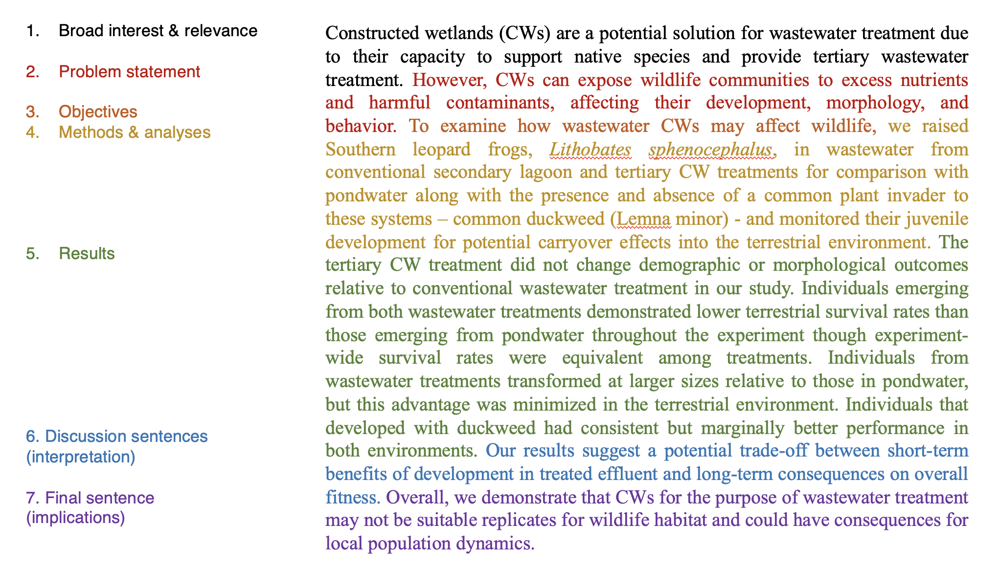


## Introduction {-}

An *Introduction* is an information-rich and persuasive *argument* for the importance of the contribution your paper will be making to the field of study.


#### Standards {-}

An *Introduction* has to do many things at once. Here are the necessary elements of a quality *Intro*:  

1. **Engage & Justify.** The entire Introduction is a carefully crafted, convincing argument for the importance of your topic and the urgent need for your research.  

2. **Establish context & convince readers to care.** Early into the Intro, place your topic in a broad context. Make it clear who should be interested in your topic.  

3. **Invite readers in.** A good Intro is an accessible one; it should not send the message that only experts will get something out of the paper.   

4. **Get everyone on the same page.** Mention and explain any concepts that will be crucial to understanding your methodology, interpreting your results, or intuiting the impact of your work.

5. **Demonstrate authoritative knowledge.** Demonstrate exhaustive knowledge of the topic, and sharp awareness of the ‘state of the science’.

6. **Demonstrate basis in previous research.** Aim for a 1:1 ratio of citations to sentences. Each sentence should end with a citation. Your Introduction is an *assemblage of previous findings* strategically arranged to identify a knowledge gap and set the stage for your own study. *(See Literature Review details below.)*

7. **Provide more than a history lesson or a list of facts.** Your Introduction is a tightly organized and persuasive argument, not a brain dump or an aimless encyclopedia entry. Your deep knowledge of the field ought to be sprinkled throughout, *interspersed within your narrowing arc*.

8. **Narrow in on a problem statement.** The entire Intro should narrow to a *problem statement* (a knowledge gap, an urgent need). Along the way, you are garnering reader buy-in (yes, this is important) which causes them to care about the gap you have identified.  

9. **Follow with a motivation/objectives statement.** Your study is a response to the problem statement. “To address this knowledge gap, I developed a study based upon the following objectives…”  


*Examples of problem statements & hypotheses / aims:*  
In the examples below, the problem statement is in boldface & the objectives/aims statement is italicized.

- "**Although there have been several modern investigations of cladogenesis and tree shape [2], [3], the manufactory hypothesis has not, to our knowledge, been tested since Darwin...** *This paper follows Darwin by examining autocorrelation among ancestral and descendent branches of the tree at the level of subspecies through genera and we also extend the comparison to the level of families.*" (from [Haskell & Adhikari 2009](https://journals.plos.org/plosone/article?id=10.1371/journal.pone.0005460){target="blank})  

- "**Few efforts explicitly quantify the consequences of including demand into conservation efforts to safeguard [Ecosystem Services] and biodiversity** (Wolff et al. 2015; Verhagen et al. 2016). *We aimed to quantify differences between supply and benefit within the context of conservation planning. We addressed 3 questions: How does incorporating demand shift the spatial distribution of benefits relative to supply? How much benefit is captured by conservation efforts that target supply? How do efforts targeting supply and benefit compare in terms of their biodiversity outcomes?*" (from [Watson et al. 2019](https://conbio.onlinelibrary.wiley.com/doi/full/10.1111/cobi.13276){target="blank"}) 


There are plenty of good and bad examples of *Introductions* in scientific publications. Here are a few recommendations for excellent introductions that follow the rules above. Note how each example demonstrates how to achieve the necessary conceptual arc while maintaining a large ratio of citations to sentences (nearly every sentence has at least one citation).

- See [Watson et al. 2019](https://conbio.onlinelibrary.wiley.com/doi/full/10.1111/cobi.13276){target="blank"} for a sharp and concise *Intro*.

- See [Pitman et al. 2019](https://onlinelibrary.wiley.com/doi/full/10.1111/mms.12661){target="blank"} for an extensive introduction with excellent writing.


#### Strategies {-} 

With so much to cover in an Introduction, it can be difficult to know where to begin. There are two main steps to preparing an *Introduction*: (1) revieweing literature, and (2) writing. Begin with the literature.  


##### 1. Conducting a literature review {-}

Carrying out a literature review can be daunting, especially if you are new to a field of study.  

But regardless of your level of experience, you can follow a **common basic workflow.**  The overall goal is to **dive into the literature,** follow rabbit holes, and take notes until you begin to feel familiar with the canon of knowledge on your topic. That feeling of familiarity will come once you stop finding new studies in the literature cited sections of the papers you are reading, and once you start to recognize the names of the most prolific and influential scientists in your topic of interest.  

**a. Find your first paper to review.** Begin your search on *GoogleScholar* [scholar.google.com](scholar.google.com). You may need to search other search engines eventually (e.g., JStor, PubMed, etc.), but this is a good place to start.  

The most productive starting point is looking for recent *review* articles on your topic. Reviews try to be definitive and exhaustive in their list of references. They also point to the studies that were foundationally important in the early days of your topic, as well as to the "cutting edge": the most recent and exciting developments in the literature.  

**b. Open up a scratchpad for taking notes** in *Word* or *GoogleDocs*. Type (or screenshot) the citation for your first article to the top of your scratchpad (e.g., Keen EM and Brew JR. 2021. Ping pong: the Sport of Kings? *Table Tennis Weekly* 56(1): 343-356.)

**c. Begin reading & taking notes.** Don't sit down to read it word for word. Read it *selectively* for the topics and details that are most relevant to your work. If your first paper is a research article (i.e., with sections on Methods and Results) instead of a review, focus on its Introduction and Discussion.  Your notes should be brief. If you are copying language from the paper word for word, place it in quotes so that you can remember what needs to be paraphrased at a later time. In each note that involves a reference to a separate article, include that reference in your note (e.g., 
Puckette et al. 2021) so you can track it later.  

**d. Copy down all references** that are included in your notes using the literature cited section. This can be tedious but it will pay off in the long run.  

**e. Clean up your notes for this first paper.** Make sure *every single* note has a parenthetical citation attached to it, so you don't lose track of where it came from. If the note is a direct contribution from the paper you have reviewed, add the reference for that paper to your note (e.g., Keen & Brew 2021).   

**f. Select one of these references as your *second* paper to review.**  

**g. Repeat.** Until you begin to feel familiar with the current literature and stop being suprised by new studies. 

*Once you reach a familiarity plateau (shoot for 80% expertise), pause your literature review!* For a peer-reviewed article submitted for publication, anything less than 30 reviewed papers is highly unlikely to provide a sufficient grasp of the state of your field of study (most studies cite many times this number).   


##### 2. Organizing and writing your Introduction {-}

You now know enough about the literature now to have a basic sense of what is currently known and not know about your topic. 

**a. Write your problem statement,** the *gap in knowledge* the justifies and motivates your study. 

**b. Articulate your hypotheses and/or objectives** Frame these as a way of *addressing* or *ameliorating* the problem statement.

**c. Determine your starting point.** Choose your audience, your hook, and the initial direction of your conceptual flow. This is arguably the most difficult part of the writing process. 

**d. Outline the narrative path from your starting point to your problem statement,** with the key step in your argumentative arc must be, and therefore what the purpose of each paragraph must be. 

**e. For each paragraph, articulate the main point or key idea.** This sentence can typically serve as the first sentence of the paragraph (or in some cases the last).

**f. Sort your notes into each paragraph.** Some notes may be useful in multiple paragraphs, in which case you can copy them rather than just moving them. This is why it is *critical* that you add a parenthetical citation for the source of each reference. Otherwise you will lose track of which content comes from which source!

**g. Sort your notes *within* each paragraph.** Each paragraph has its own narrative flow, taking the reader from concept A to concept B using a *sequence* or *chain* of evidence-based claims. How do your notes need to be organized in order to build that chain?

**h. Determine the *holes* in your literature review.** As you organize your notes into an argumentative sequence, you will find "holes" in your argument that require substantiation with an as-yet undiscovered reference. This will guide your *second stage* of literature review (see next steps).

**i. Now begins an iterative process** of writing, seeking new references, and reorganizing your writing. Iterate until satisfied. Once you are satisfied, ask a colleague to review your writing, not only for grammatical errors and typos, but also with an eye toward the overall arc. Where is your argument weakest? How can it be reorganized? Incorporate their feedback and repeat.  


## Methods {-}

Your *Methods* section provides all the detail necessary to (1) understand how you collected data, (2) understand how you analyzed the data, (3) how to interpret the results, and (4) reproduce your study (at least in principle).


#### Standards {-}

A strong *Methods* section will answer *"Hell yes!"* to all of the following questions:

**1. Do your methods make sense** based upon the research question and the objectives stated in your Introduction? For example, if your goal is to understand the risks of a new drug, it would not make sense if you were measuring seismic activity near a volcano. That's a dumb example, but you get the idea: what you *do* should actually answer your *research question*.

**2. Is your research and analysis fully reproducible**, based upon the level of detail and quality of explanation in your Methods section?

**3. Is your analytical approach appropriate** given your objectives and the limitations of your data? For example, if you are interested in the correlation between two variables, it would not make sense to use a *t-test*.

**4. Is your analytical approach properly thorough?** Are you doing everything you can with the data you have, within the confines of a your project's scope and objectives? Data are valuable and difficult to come by. Are you learning everything you can regarding your research question from the data you have collected?  (*Note that it is possible to go too far here, i.e., to include analyses that have nothing to do with your research question. The key is to be thorough but focused.*)

**5. Is your Methods section written clearly, concisely, and with precision?** See the [Module on Style](#style) for guidance. 

Use the papers you found during your literature review for examples of what is included in *Methods* sections within publications related to your topic, and the style in which that material is written.  


#### Strategies {-} 

- Your *Methods* section will likely be the thing you write second, immediately after you develop your research question, objectives, and hypotheses. Writing your Methods in full and with detail will help you uncover mistakes with your sampling design and/or analyses before it is too late. 

- Most *Methods* sections have a few distinct subsections: Study area, Data collection, Data analysis.  

- Most *Methods* sections are written in the past tense.  

- Do not hesitate to use tables or diagrams to present details of data collection.  


## Results {-}

The *Results* section is a concise narrative of your findings, *without* interpretation or commentary on the importance and consequences of your findings.  

#### Standards {-}

A strong *Results* section will answer *"Hell yes!"* to all of the following questions:

**1. Are your results complete** based on the analyses you described in your Methods section?  
**2. Is your Results section organized as a coherent narrative** that is directly related to your research question, and not just a list of seemingly random findings?  
**3. Are your findings and conclusion *appropriate*,** given the limitations of the data and the methods you employed?  
**4. Are tables and figures included where appropriate?**  
**5. Are tables and figures referenced correctly** within the text of your results? See the next [Module on Style](#style) for guidance.
**6. Does your Results section contain results *only*,** and not any methodological details that should have been in the *Methods*, nor interpretation commentary that would be more appropriate in the *Discussion*?  

**7. Is your Results section written clearly and with precision?** This is especially important with respect to the inclusion of statistical results. Again, for guidance see the next [Module on Style](#style). 

Again, use the papers you found during your literature review for examples of what is included in *Results* sections within publications related to your topic, and the style in which that material is written.  

#### Strategies {-} 

- It is usually best to produce your tables and figures *first*, then write your *Results* narrative around those assets. 

- You want your tables, figures, and narrative to be *strategically redundant*. Your tables and figures represent the detailed version of your *Results*; they are the raw numbers that answer your research question. Your *narrative* should refer constantly to the raw results presented in your tables and figures, but they should not repeat them.  Your narrative *summarizes* the tables and figures and frames your findings with respect to how they address your research question. Minimize the numbers you include in your results, but be sure to include the most important ones.

- Aim for a parallel structure in your *Methods* and *Results*. Present your results in the same order in which you explain your methodological process. This makes it easy for readers to go back and forth between the two sections as they make sense of what you found. 

- Most *Results* sections begin with a brief paragraph summarizing the data that were collected: dates of collection, sample size, and any other context that a reader might need to understand the analytical results that will come in the proceeding paragraphs. 

- Usually, the most difficult thing about writing a *Results* section, other than writing an intelligible story instead of a list of facts, is to *keep your Discussion out of your Results*.  The results section is a straightforward report of what you found, without commentary on the importance or implications of those findings.

- That said, you will still have to make some editorial decisions in your *Results* section. Which findings will you emphasize with narrative prose, and which will you simply refer to using a table or figure? Which findings are misleading if the reader fails to keep certain aspects of your methodology in mind, and how can you frame those findings to avoid misinterpretation?


## Discussion {-}

The *Discussion* is where you interpret your results, discuss the limitations of your study, place your findings within the context of the literature,  highlight the contributions and implications of your findings, and identify future directions of research.  

#### Standards {-}

The *Discussion* is probably the most variable and unstructured section of a report, and can therefore be the most difficult to write. For your first few attempts at writing a Discussion, we recommend adhering to the recipe we outline below. A strong *Discussion* section will have the following components or subsections:  

**The opening paragraph** is a brief summary of your most important results that highlights the findings that make your study important. Think of this paragraph as a ‘hook’ that convinces readers they should read the rest of your Discussion.

**Subsection on Study Limitations.** This subsection allows you to (1) place boundaries on how you are able to interpret your results given the limitations or unexpected issues that arose from your methods, and (2) identity areas in which your study could be improved if it were reproduced in the future.

**Subsection on Interpretation of Results.** Use this subsection as an area to highlight and explore your findings, what they mean, and what the important takeaways are.

**Subsection on Comparison to Previous Studies.** Use this subsection to place your findings within the context of other research. Are your results in line with previous findings? Are they surprising? If so, why might that be? If it is difficult to compare your study to others, explain why. This is a chance for you to control the conversation in the event that others try to compare your study to other literature. 

**Subsection on Study Implications.**  Use this subsection to articulate how your findings relate to your study objectives, address your research question, and are important in a broad sense. Why do your results matter? What implications do they have for the issues, places, and people you are focused on in this project? How might your findings influence future policies, technological innovations, or other changes?

**Subsection on Suggestions for Future Research** with a concluding statement that reinforces the importance and contribution of your project.  


Usually, strong *Discussions* refer regularly to the concepts introduced in the *Introduction*. This makes sense, since your *Discussion* is exploring the ways in which your new findings have contributed to the body of knowledge and gaps in knowledge articulated in your *Intro*. If your *Discussion* is not addressing the same issues raised in your *Intro*, you many need to restructure and reframe one or both of those sections.  

Most of the papers you collect for your literature review will have their own variation on this recipe. Some sections will be more relevant and extensive than others, depending on your topic and findings. Use your literature collection to get a sense of writing style for *Discussions*.  


## Other elements of a report {-}

#### Acknowledgments {-}

A brief statement of whom you thank for their contributions and support of your project. Be sure to include any sources of funding, equipment, analytical assistance, or other resources.  


#### Literature Cited {-}  

- Be sure that every reference mentioned in the body of your report has a full citation in this section.  

- Conversely, make sure that every full citation in this section has a corresponding reference within your report. Remove all un-referenced citations!  

- See the [Module on Style](#style) for details on how to format your references and citations.  


#### Tables {-}  

- Present and enumerate tables in the order they are referenced in your report. 

- Ensure that each table has its own caption placed *above the table*.   

- See the [Module on Style](#style) for details on how to create and format tables.  


#### Figures {-}  

- Present and enumerate figures in the order they are referenced in your report. 

- Ensure that each figure has its own caption placed *below the figure*.  

- See the [Module on Style](#style) for details on how to create and format tables. 


#### Other resources {-}

[**"How to Write a First-class Paper"**, by the editors at *Nature*](https://www.nature.com/articles/d41586-018-02404-4){target="blank"}

<!--chapter:end:12b-sections.Rmd-->

# Good research writing {#style}


#### Learning goals {-}

* Understand the principles of good research writing 
* Gain practical skills in formatting the elements of a research report

&nbsp;

There are thousands of resources available in print and online to support students who are trying to improve their scientific writing. The recommendations offered below are by no means exhaustive, and by no means are they the only way. Our aim here is to *get students started* on the right track. Our underlying premise is that good writing in research is the *same as good writing anywhere else.* The same basic standards apply.

The best single resource we know of is a 1990 article in the *American Scientist*, ["The Science of Science Writing"](https://www.americanscientist.org/blog/the-long-view/the-science-of-scientific-writing){target="blank}, by George Opan and Judith Swan. Most of the concepts and examples below are distillations from that article. 

## Core principles {-}

Opan and Swan (1990) offer many fundamental principles for strong scientific writing, but they all stem from the same core idea: **Write with the reader in mind.** It is not enough to have all the correct information on the page; that information must organized and presented in ways that helps the reader understand.  

To illustrate this point in a brief example, they show three different ways to present the same information:

**Option 1:**  

"Our results were t(time)=15', T(temperature)=32º, t=0', T=25º; t=6', T=29º; t=3', T=27º; t=12', T=32º; t=9'; T=31º"  


**Option 2:**  

{width=25%}  

**Option 3:**  

{width=25%}  

Which of these is easiest to interpret? Why?  

In short, **place information where readers expect to find it.** This applies broad organization, such as keep all methodological details within the *Methods* sections, or deciding which information to place in tables and which to write out in the narrative of your *Results* section, but it also applies to writing at the sentence-level. In every sentence readers take in, they have subconscious expectations about how coherent ideas will be structured. Shape your sentences to meet those expectations. 

&nbsp;

Opan and Swan (1990) provide a good example of really bad writing: 

> *"The smallest of the URF's (URFA6L), a 207-nucleotide (nt) reading frame overlapping out of phase the NH2-terminal portion of the adenosinetriphosphatase (ATPase) subunit 6 gene has been identified as the animal equivalent of the recently discovered yeast H+-ATPase subunit 8 gene. The functional significance of the other URF's has been, on the contrary, elusive. Recently, however, immunoprecipitation experiments with antibodies to purified, rotenone-sensitive NADH-ubiquinone oxido-reductase [hereafter referred to as respiratory chain NADH dehydrogenase or complex I] from bovine heart, as well as enzyme fractionation studies, have indicated that six human URF's (that is, URF1, URF2, URF3, URF4, URF4L, and URF5, hereafter referred to as ND1, ND2, ND3, ND4, ND4L, and ND5) encode subunits of complex I. This is a large complex that also contains many subunits synthesized in the cytoplasm."*  

&nbsp;  

If you are like most readers, this paragraph is difficult to make sense of. The authors' intended meaning is completely lost. 

To fix this paragraph and others like it, Opan and Swan recommend the following steps:  

&nbsp;

**Principle 1. Keep language as straightforward and clear as possible.** The more complex a sentence or paragraph becomes, the more likely that a reader will get confused or just give up. Note, however, that long sentences are not necessarily bad. If a sentence is shaped well and written clearly, there is no limit to its length.  

**Principle 2. Minimize jargon**, so that people other than the world expert can understand what you are saying.  

**Principle 3. Keep the subject and the verb as close together as possible.**

*Bad example:* The smallest of the URF's is URFA6L, a 207-nucleotide (nt) reading frame overlapping out of phase the NH2-terminal portion of the adenosinetriphosphatase (ATPase) subunit 6 gene; it has been identified as the animal equivalent of the recently discovered yeast H+-ATPase subunit 8 gene.  

*Good example:* The smallest of the URF's (URFA6L) has been identified as the animal equivalent of the recently discovered yeast H+-ATPase subunit 8 gene.  

**Principle 4. In each 'unit of discourse', make only a single point.** A unit of discourse is any part of your writing with a beginning and an end: a report section, a paragraph, a sentence, or a clause. Do not jam multiple main ideas into a single unit.  

Building on this principle, each paragraph should have a sentence that clearly encapsulates the paragraph’s main point. This usually comes at either the beginning or end of the paragraph. As an example of this, checkout this [white paper](https://uploads-ssl.webflow.com/601331581ba868154325e525/604287b91aab4e5c89de8e0e_Hyfe%20Smart%20Cough%20Monitoring.pdf){target="black"} from a company that studies respiratory illnesses by tracking coughs. In this paper, the main point of each paragraph is in **boldface** to help readers more easily understand the purpose of each paragraph.   

**Principle 5. Make use of the 'Stress Position'.**  Readers naturally emphasize the material at the sentence's end. Arrange the emphatic information in your sentence to arrive last. In other words, save the best for last.  

*Bad example:* The end of a sentence is usually where readers naturally place emphasis on material. Place the emphatic information near the end of your sentence in order to re-arrange. The last is the place for which the best should be saved.

*Good example:* See Principle 5. 

**Principle 6. The 'Topic Position' keeps things clear.** The 'topic position', i.e., the material at the beginning of a sentence, establishes context and expectations for the remainder of the sentence. The first pieces of information help the reader understand what the sentence will be about. As Oppan & Swan (1990) put it:  

> *"'Bees disperse pollen' and 'Pollen is dispersed by bees' are two different but equally respectable sentences about the same facts. The first tells us something about bees; the second tells us something about pollen."*  

If you are writing a paragraph about pollen, then the second is superior. Even though it utilizes passive voice, it correctly reinforces who the main character is.  

**Principle 7. Use Topic Positions and Stress Positions to link ideas in a paragraph.** In a clear-flowing paragraph, the Topic Position of each sentence is linked to the Stress Position of the previous. In other words, the topic position provides both context (looking ahead) and linkage (looking back). Try to get into the pattern of placing 'old information', i.e., material you have already introduced, in the Topic Position and 'new information' in the Stress Position. Maintaining this pattern consistently is an enormous aid to reader comprehension.  

This stress-topic linkage is particularly important in persuasive writing, such as a report's *Introduction*. Those sections are really evidence-based arguments that build on top of one another, connecting ideas in a chain. They are not lists of facts. 
In a strong argument, sentences are connected in a chain. 

*Bad example:* "A is something interesting. B is something interesting. C is ..."  

*Good:* "A is related to B. B is related to C. C is related D..."  

Oppan and Swan (1990) provide the following examples:  

Bad example:   

> *Large earthquakes along a given fault segment do not occur at random intervals because it takes time to accumulate the strain energy for the rupture. The rates at which tectonic plates move and accumulate strain at their boundaries are approximately uniform. Therefore, in first approximation, one may expect that large ruptures of the same fault segment will occur at approximately constant time intervals. If subsequent main shocks have different amounts of slip across the fault, then the recurrence time may vary, and the basic idea of periodic mainshocks must be modified. For great plate boundary ruptures the length and slip often vary by a factor of 2. Along the southern segment of the San Andreas fault the recurrence interval is 145 years with variations of several decades. The smaller the standard deviation of the average recurrence interval, the more specific could be the long term prediction of a future mainshock.*  

Good example:   

> *Large earthquakes along a given fault segment do not occur at random intervals because it takes time to accumulate the strain energy for the rupture. The rates at which tectonic plates move and accumulate strain at their boundaries are roughly uniform. Therefore, nearly constant time intervals (at first approximation) would be expected between large ruptures of the same fault segment. However, the recurrence time may vary; the basic idea of periodic mainshocks may need to be modified if subsequent mainshocks have different amounts of slip across the fault. Indeed, the length and slip of great plate boundary ruptures often vary by a factor of 2. For example, the recurrence intervals along the southern segment of the San Andreas fault is 145 years with variations of several decades. The smaller the standard deviation of the average recurrence interval, the more specific could be the long term prediction of a future mainshock.*

Oppan and Swan (1990) conclude this recommendation by stating that, *"In our experience, the misplacement of old and new information turns out to be the No. 1 problem in American professional writing today."*  

**Principle 8. Anticipate and avoid logical gaps.** When a new sentence contains no reference whatsoever to 'old information' in previous sentences, the readers will make their own logical leaps, and those leaps will almost always be wrong.  


&nbsp;

Opan & Swan (199) conclude that writers who do not take the trouble to adhere to these principles *"are attending more to their own need for unburdening themselves of their information than to the reader's need for receiving the material."* 

So, in short, be kind to your reader, and do your share of the work.   


## Further considerations {-}


### Sharp & precise writing {-}

In good writing, the goal is to present information as succinctly and clearly as possible. In other words, you want to say *precisely what you mean* with *as few words as possible*.  

Put another way: Cut your word count without losing any content.   

Sharp writing with fewer words is a good end in itself, but it also forces you to be thoughtful about your organization, since a well-organized paragraphs helps you say what you want with fewer words. 

Below are three strategies we've found useful for improving precision and concision:

**(1) The ‘Director’s Cut’:** It can help to first write a “director’s cut” of your writing that is *exactly* how you like it. Then make a copy of your writing. Now use that copy to reduce and re-write it to fit within the confines of the assignment. This two-stage process makes it easier to delete and re-work paragraphs that you are attached to; it allows for more objective and dispassionate decisions, and it allows you to focus on the reader’s experience rather than your own.  

**(2) Iterative line reduction:** In each paragraph, try to figure out a way to reduce it by one line of text without cutting any content. Ask yourself: *How can I convey the same point with fewer words?* After you achieve this, do it again: cut another line without losing content. Then, for relatively long paragraphs (more than 8 lines), cut it by *another* line.

**(3) Iterative reading aloud:** As a general rule, never write something that would be strange to say aloud. So read your essay out loud and see if it flows naturally. Then have a friend you trust listen to you do it, and see if they can identify any areas that seem repetitive or unrelated to your conceptual flow. Next, ask a different friend (whom you also trust) to read it aloud *for you*, and see where they trip up and accidentally apply an incorrect tone or emphasis. This will show you where you need to streamline and re-work your language to make your conceptual flow more obvious to someone who is not inside your own headspace.  


### Use of passive voice and first-person {-}

Most beginners are told that the use of first-person language within a research report is inappropriate, but that is simply not true. It certainly *is* true that it is possible to *misuse* first-person structure, but it is also true that first person structure can occasionally improve the flow of a paragraph and, counterintuitively, it can help keep the reader's focus on your objectives and methods.  

Examples of appropriate use of first-person:  

- *"We aimed to quantify differences between supply and benefit within the context of conservation planning. We addressed 3 questions..."* (from [Watson et al. 2019](https://conbio.onlinelibrary.wiley.com/doi/full/10.1111/cobi.13276){target="blank"})  

- *"Because wetland invasion by common duckweed often accompanies eutrophication, we also assessed whether the presence of Lemna minor could impact anuran development. We tracked population- and individual-level responses to development in the three water treatments with and without duckweed..."* (from [Zeitler et al. 2021](https://www.sciencedirect.com/science/article/pii/S0301479721006332?casa_token=BhsD4GiVQhIAAAAA:78wrLH-vN5gUPvNdX16fyaoHJq8QVQpQ-mqVA6UqxpxLMOFKweuX0YwJtBMLMnmVnfU4e1k){target="blank"})  


Examples of inappropriate use:  

- *"In this part of the Introduction, I will ..."*  
- *"No Discussion would be complete without ..."*  
- *"In this complicated analysis, I was able to ..."*
- *"I really did not enjoy that day of fieldwork."*  

In general, avoid self-aware commentary about what is happening in your report, and avoid self-centered commentary about how difficult or impressive something was. *Always* avoid "I was able to..." statements.  


## Logistics of scientific writing {-}  

### Writing about results {-}

In general, a results statement needs to address the following elements of content and design:  

1. Describe the pattern in your data  
2. Include units with all numbers / metrics you provide  
3. Round numbers to an appropriate number of significant digits (usually two decimal places is best)  
4. Refer to the figure number that portrays the data, typically using a parenthetical at the end of a sentence (e.g., “(Fig. 1).”)  
5. Name the statistical test you used    
6. Report all necessary statistical metrics in parentheses: sample size, p-value, and any other details (e.g., regressions also need to have their regression coefficients reported.)  
7. State whether or not the pattern you see supported by your significance test?
8. State whether or not the results support your hypothesis, if applicable.  


Results needs to be written as concisely as possible in order to be intelligible to a reader. Treat this like a puzzle: how can you report all the necessary information in as few words as possible while maximizing the logical flow of your sentences? 

**Bad example:**  

*“The sample size was 25 clams for both non-predated and predated clams. We did a t-test comparing the lengths of these two clams. With a p-value of 0.023, this t-test indicated that the results were statistically significant, since the p-value was below 0.05. This therefore proves our hypothesis that predated clams are different than non-predated clams. These findings are also presented in Figure 1.”*

**Good example:**  

*“The length of predated clams (mean= 27.1 cm; n=25) was significantly different from that of non-predated clams (mean= 36.3 cm; n=25) (t-test, p = 0.02), supporting our hypothesis that predation state determines clam length (Fig. 1).”*

Note that the *Bad example* above is bad due to more than just its writing. You should never say that a statistical test *proves* a hypothesis correct or incorrect. A test can only fail to reject the null hypothesis.  

### Captions for tables and figures {-}  

In general, a caption must provide all the information necessary to interpret the table or graph with which it is associated.  

The following details must be included:   

1. Brief statement of what is shown or what was measured. Summarize the content.
2. Explain any metrics that are provided. Do the bars on your graph represent Standard Error or 95% confidence intervals? 
3. Include sample sizes if not included in the asset, e.g., “(n=15)".
4. Units for all measurements, if not displayed.  
5. Sampling location, date, and time.  
6. Any other details required to interpret the data.  

**Bad examples:**  

- *"Figure 1: Clam length."* [missing tons of information!]  
- *"Figure 1. This figure is comparing two categories of data: predated clams and non-predated clams..."* [way too wordy!]
- *"Figure 1. Showing mean lengths of predated and non-predated clams..."* [too wordy! Never say “showing...” or “this figure...“]


**Good examples:**  

- *"Figure 1: Mean and standard error of the heights of white oak and chestnut oak (n=8 trees per species) measured at Green’s View, Sewanee, 23rd July 2006)."*

- *"Figure 2: Height (cm) and width (kg) of students (n=15, with linear trendline) in Biology 130 class. Data collected 27 August, 2017."*  


### Referencing tables & figures {-}

Tables and figures (collectively known as report *assets*) should be referenced throughout the *Results* and *Discussion* using parenthetical references, e.g., "(Table 1, Fig 4)". These asset references typically come at the end of a sentence, but can sometimes be used in the middle of a complex sentence.  

Try to avoid sentences that explain what tables or figures contain (e.g., *"Measurements can be found in Table 1."*). Instead, summarize a pattern then reference the asset (e.g., *"The mean measurement was 32 (standard deviation = 4.3; Table 1)"*).  

### Citing references {-}

Literature should be cited within the body of your report using parenthetical citaitons, e.g., "(Keen & Brew 2021)".  

Like in-line references to tables and figures, these parentheticals typically come at the end of a sentence, but can sometimes be used in the middle of a complex sentence to make it clear which concept is connected to the reference.  

The exact formatting of that parenthetical depends on the citation style you use. See the next section.  

### Formatting *Literature Cited* {-}  

All in-line references and full citations within your *Literature Cited* section need to have consistent formatting. The precise formatting of your references depends on the style system you are using. Many styles are in widespread use.  

If you have your choice of the kind of style you are allowed to use, we recommend the [*Scientific Style*](https://www.scientificstyleandformat.org/Tools/SSF-Citation-Quick-Guide.html){target="blank"} maintained by the Council of Science Editors. 

Common use cases are provided below:  

#### In-line citations {-}  


*For a single author:*  
"We don't know ANYTHING about what's down there! (Ezell 2021) "

*Two authors:* (Hofman and Rick 2018).  

*Three or more authors:* (Smart et al. 2003).  


#### Bibliographic entry {-}    

This is how full references are to be written in the Literature Cited section.

*Basic layout*: Author(s). Date. Article title. Journal title. Volume(issue):location.

*For a single author:*  
Laskowski DA. 2002. Physical and chemical properties of pyrethroids. Rev Environ Contam Toxicol. 174(1):49–170.

*Two authors:* 
Mazan MR, Hoffman AM. 2001. Effects of aerosolized albuterol on physiologic responses to exercise in standardbreds. Am J Vet Res. 62(11):1812–1817.

*Three or more authors:* 
Smart N, Fang ZY, Marwick TH. 2003. A practical guide to exercise training for heart failure patients. J Card Fail. 9(1):49–58.  

*Ten or more authors:*  
Pizzi C, Caraglia M, Cianciulli M, Fabbrocini A, Libroia A, Matano E, Contegiacomo A, Del Prete S, Abbruzzese A, Martignetti A, et al. 2002. Low-dose recombinant IL-2 induces psychological changes: monitoring by Minnesota Multiphasic Personality Inventory (MMPI). Anticancer Res. 22(2A):727–732. 


## Formatting tables {-}

Tables need to be tightly organized, with as few horizontal lines as possible, and with no vertical lines whatsoever. Make strategic use of lines of different thickness and boldface type to visually organize the table's content.  

Microsoft *Word* and Google *Docs* will automatically generate tables that are poorly formatted:  

{width=60%}

Adjust the table formatting to turn the default into something digestible:  

{width=60%}

For more tips on table styles, refer to the [Module on Summarizing Datasets](#tables)

## Formatting figures {-}  


### Plots {-}

Refer to the [Module on Visualizing Data](#dataviz) for the theory of effective data visualizations.  

In addition to the principles outlined there, make sure that each plot meets the following standards:

1. The figure has a good caption (see above), including a figure number.  
2. All text on the figure is clear and legible. 
3. Each axis has a label, and the label is helpful to the reader. 
4. The axis labels include units of measure, if applicable. 
5. Red and green colors are avoided, since some people are color-blind to them.  


### Maps {-}

Maps should also adhere to the fundamental principles of [good data visualization.](#datavis).   

In addition to those principles, be sure that your map meets the following standards:  

1. The map has a scale  
2. The map has some reference to a coordinate system.  
3. The map has a north arrow.  
4. The map has includes some form of context (e.g., an inset map showing where the main map is located in the world.)  
5. The map's caption includes information on the source of the spatial data used to build up the map.  


### Diagrams {-}  

Diagrams, such as schematics that demonstrate a sampling design, should also adhere to the fundamental principles of [good data visualization.](#datavis).  


<!--chapter:end:12c-style.Rmd-->

# Research talks

Just as good writing in science is no different from good writing anywhere else, good research talks should be a good talk by any standard. The only difference should be the *target audience.*  Far too often, data scientists are given a pass for poor presentations and boring delivery. We believe that should change.  

Research talks are typically given to colleagues who share some level of familiarity with your study topic; but those colleagues are still humans and they deserve to listen to an enjoyable talk that allows them to connect to the speaker.  

As a data scientist, you will have to be adept at preparing two types of presentations: (1) talks for colleagues and (2) talks for the public.  

Below we first provide standards that should apply to *any* talk for *any* audience. Second, we specify which additional standards to consider, depending on your audience. 

### Standards for all presentations {-}   

#### Content & substance {-}

##### First moments {-}  
- The first seconds of your talk are an excellent, engaging, and relevant attention getter,  
- the tone of which matches and sets the stage for the remainder of the talk.  

##### Early audience orientation {-}  
- Sound orientation to topic and clear thesis delivered early in talk.   
- Introductory moments includes preview of main points.   
- Credibility is firmly established, but only after the audience is invested in the topic.   

##### Research & evidence {-}  
- Reason & evidence are used as part of case being made. 
- Facts, numbers, and statistics are used effectively.  
- Includes only the absolutely essential details regarding research sources, methods, and analyses.  
- Evidence is not oversold as truth. The uncertainty and ignorance inherent to science is not ignored.  

##### Story & narrative {-}  
- The organization of the talk takes the form of a story, taking the audience on a shared journey.  
- Within this framework, anecdotes and stories are used as a medium for connecting the
audience to facts, evidence, and emotional components of your case.    

##### Relevance & Importance {-}  
- A compelling case for the importance of the topic to the audience’s lives and/or their shared interests.    
- The connection between the audience’s shared interests and the topic is pointed to clearly and consistently.  

##### Pre- & Misconceptions {-} 
- Content & delivery demonstrate anticipation of preconceptions regarding the topic and the presenter.   
- Content demonstrates understanding of common misconceptions regarding the topic.  
- These pre- and misconceptions are addressed and moved beyond deftly and thoroughly.  
- No elephants in the room go unmentioned.  

##### Final moments {-}
- Provides a clear and memorable summary of points and refers back to thesis/big picture.  
- Ends with strong call to action, or at least a vision for next steps, solidly grounded in data presented.

##### Organization overall {-}
- Organization of the content amounts to a strategic and persuasive case, in which rational, emotional,
and narrative components are woven together with deliberate care.  
- This organization is made clear to the audience: throughout the talk, the audience is given transitions
and signposts and reminders that allow them to readily reconstruct the case being made.  
- The communication of this order is obvious without being condescending or ineffectually repetitive.  
- The talk is delivered within the allocated time window, reflecting appropriate organization and respect for others' time.  


#### Delivery & style {-}

##### Preparation {-} 
- The speaker is clearly well-prepared, and this is evident in the timing of the talk, familiarity with
visual aids and what will be said next, and little to no reliance upon notes.  

##### Speech {-} 
- Vocal expression (projection and volume) is natural and authentic;  
- Excellent use of variation in vocal intensity, tone, and expression.  
- Pace of speech is always easy to follow.  
- Tone is conversational and sincere.  
- Each thought is brought to completion without trailing off or rambling.  
- Lack of vocal fillers (e.g., ummm, so…..).  
- Impactful use of pauses and silence.  

##### Language {-} 
- Speaker is able to articulate what she means clearly through eloquent word choice and
premeditated sentences.  
- Language level is considerate of audience’s current knowledge, particularly in science.  
- Jargon, abbreviations, and acronyms are avoided; any that must be used is explained.  
- Comparisons and analogies are used effectively without further complicating a concept.  

##### Explanation {-} 
- Any word that may not be universally understood is explained, either explicitly or within
abundant context.  
- Any concept that may not be universally understood is explained carefully.  
- These explanations occur at a level appropriate to audience.  

##### Non-verbal delivery: The “Second Conversation” {-}  
- Attire & composure reflects the utmost sincerity and professionalism, without sacrificing
authenticity.  
- The speaker is expressive and compelling through eye contact and facial expressions.  
- Body language (posture, gestures, and movements) exude poise and earnest engagement.  
- Body language effectively augments the spoken word, in both timing and affect.  
- Eyes, movements and gestures are not distracting and do not disclose anxiety or discomfort.  

##### Mistakes {-}  
- Any mistakes are handled in a graceful and self-forgiving manner, and recovery is quick.  
- The speaker demonstrates resilience and endurance; multiple mistakes do not lead to a decline
in composure or energy level.  

##### Attentive, responsive, & adaptive {-}
- The speaker actively maintains audience attention throughout, rather than just assuming
attention is there or not responding accordingly if it clearly isn’t.  
- The speaker establishes an active dialogue between themselves and the audience, either directly
(through responses or questions), or indirectly (through sharing moments of laughter, joy, pain,
anger, disgust, etc.).  
- Speaker reiterates, clarifies, and changes course adaptively in response to their read of the
audience.  
- Speaker knowledgeably and concisely answers appropriate questions, if any.  
- Evidence that the speaker researched and anticipated common questions, as appropriate.  


#### Rapport & Relating  {-}

##### Energetic & credible {-}
- Professional but enjoyable  
- Enthusiastic but genuine and believable  
- Excited but not overbearing  

##### Human & relatable {-}  
- Poise without intimidation  
- Confidence without arrogance  
- Comfort & ease without apathy or indifference  
- Vulnerability without fragility or volatility  

##### Inclusive & welcoming {-}
- When appropriate, uses inclusive language (“we” and “our” instead of “I” and “my”; non-gendered
pronouns, politically tolerant language, etc.)  
- Creates common ground by strongly emphasizing common goals, values and/or experiences.  

#### Visual aids {-}

##### Strategic use {-} 
- Visual aids complement the spoken word. Redundancy (if any) between what is spoken and what is
displayed is strategic, not used as a crutch for presenting.  
- Visual aids are not *over-used*, and do not obstruct the audience’s ability to listen to and follow the
narrative thread of the talk.  
- Visual aids are not *under-used* if spoken concepts are too complicated. For instance, if a list of
numbers absolutely must be shared, it is best to provide them visually in addition to saying them.  

##### Design & display {-} 
- Visual aids are of professional quality, not sloppy or thrown together.  
- Visual aids prioritize simplicity, clarity, and good principles of design.  
- Color palettes are sensitive to color-blind audiences.  

##### Visualizing information {-}
- Use of text is minimized.  
- Text is an appropriate size and font.  
- Complicated figures are avoided.  
- Any data visualization has been reduced to the simplest possible form.  


### Talking to the public {-}  

When speaking as a researcher to the public, some of these standards need to be prioritized above others. The public is a much more diverse audience than your colleagues are. They do not necessarily know you, nor do they necessarily trust you or agree with you.  To help them engage with you successfully and actually listen to what you have to say, we recommend the following adjustments: 

- A public-facing talk must have **a clear and simple message** -- a *single* idea worth spreading.  

- To convince the public of that idea, you must **dial down the research and replace it with stories, emotion, and empathy.**  Your case needs to rely heavily upon appeals to the heart and gut of the audience.  By end of talk, you want the audience to be emotionally invested in seeing the call to action come to fruition.   

- That said, make sure that those **emotional appeals are made with nuance and discretion**, without exploiting victims or the voiceless. Do not be condescending toward your audience or anyone unlikely to be in your audience. 

**- Minimize the number of facts, numbers, and statistics.** If you *must* use them, *never* use them in isolation from the emotional aspects of your talk. Do not simply hurl facts at your audience. Within an empathic storytelling framework, anecdotes and stories are used as the primary medium for connecting the audience to facts, evidence, and emotional components of your case. Don't shy away from your data, but use it very carefully. Ultimately, the talk is a persuasive case for elevating the importance of research in our lives.  

**- End with strong call to action**,  solidly grounded in the data and stories you have presented. Make sure that call to action is related to your talk in obvious and intuitive ways. Make sure it is a meaningful action by which audience members are actually able to make a difference. Finally, make sure that this call to action is expressed succinctly and memorably, as an effective and simple slogan. 

  
  
This is a [pretty good example](https://www.youtube.com/watch?v=mae2eugjUsU) of a scientifically oriented talk to the public:  


<!--chapter:end:12d-presentations.Rmd-->

# (PART) Deep `R` {-}

# Saving data & plots

#### Learning goals {-}
- How to save dataframes as `.csv`'s
- How to save `R` data objects as `.rds`'s
- How to save plots as `.pdf`'s and `.png`'s

&nbsp;

To practice saving data (a.k.a. **exporting** data), let's use the built-in dataset from package `babynames`.

```{r,echo=TRUE,eval=FALSE}
install.packages("babynames")
library(babynames)
data(babynames)
```

```{r,echo=FALSE}
library(babynames)
data(babynames)
```

## `write.csv()` {-}

To write a dataframe to a `.csv`, use the function `write.csv()`. 

```{r,echo=TRUE,eval=FALSE}
write.csv(babynames,file="my_babynames.csv",quote=FALSE,row.names=FALSE)
```

This dataset will be saved as the file, `my_babynames.csv` within your parent directory. You can set other destinations using the same rules for child paths, parent paths, and absolute paths from the module on **Importing Data**.  

The code above sets a couple parameters that preserves the neat formatting of your dataframe. We recommend using these inputs each time you use `write.csv()` to save a dataframe.

## `saveRDS()` {-}

The `saveRDS()` function saves `R` objects in the `.rds` format, which makes them easier and faster to read into `R` later on. 

```{r,echo=TRUE,eval=FALSE}
saveRDS(babynames,file="my_babynames.rds")
```


## `pdf()` and `png()`  {-}

Let's say you want to plot the prevalence of the name "Barack" in recent U.S history:

```{r,echo=TRUE,collapse=TRUE}
head(babynames)
baracks <- babynames[babynames$name=="Barack",]
plot(prop~year,data=baracks,
     type="b",pch=16,
     xlim=c(2000,2018),
     xlab="Year",ylab="Proportion of names",main="Barack")
```

To save this as a figure as a `pdf`, preface these lines of code with a `pdf()` command and add `dev.off()` below those lines. This opens up a `pdf` 'device' (i.e., an engine for creating a PDF file), prints the plot to that new file, then closes the device and saves the file. 

Saving a pdf:

```{r,echo=TRUE,eval=FALSE}
pdf("barack-years.pdf",width-6,height=4)
plot(prop~year,data=baracks,
     type="b",pch=16,
     xlim=c(2000,2018),
     xlab="Year",ylab="Proportion of names",main="Barack")
dev.off()
```

Make sure you add '.pdf' to the end of your filename, and try not to run the `dev.off()` command when you have not first run the `pdf` command. If you do, `R` will think you are turning off the plotting feature in `RStudio` and you will have to restart your `R` session in order to see any more plots.  


<!--chapter:end:14-exporting.Rmd-->

# Joining datasets {#joining_datasets}

#### Learning goals {-}

* How to join together two related datasets efficiently in `R`

&nbsp;

It's not unusual to have data for a project spread out across multiple datasets. The data are all related, but the fact that they are 'packaged' separately into different files can things difficult. To work with such *relational* data in `R`, you eventually need to merge -- or *join* -- them into a single dataframe. 

For example, say you are studying the economics of professional basketball. In one dataframe, `df1`, you have the *net worth* of famous players, in millions USD...

```{r,echo=TRUE,collapse=TRUE}
player <- c("LeBron","Mugsy","Shaq","Jordan","Hakeem","Kobe","Stockton")
worth <- c(500, 14, 400, 1600, 200, 600,40)
df1 <- data.frame(player,worth)
df1
```

...and in a second dataframe, `df2`, you have their height. 

```{r,echo=TRUE,collapse=TRUE}
player <- c("Jordan","Shaq","Magic","Hakeem","Stockton","Mugsy","LeBron")
height <- c(78,85,81,84,73,63,81)
df2 <- data.frame(player,height)
df2
```

*Is there a correlation between these players' net worth and their height?* To answer this question you need to join these two datasets together. But the two datasets don't contain the exact same roster of players, and the players are not in the same order. Hmm. Is there an efficient way to join these two datasets?  

*Yes!* Thanks to the family of `join()` functions from the package `dplyr`.  

```{r,echo=TRUE,eval=FALSE}
install.packages("dplyr")
```

## Joining with `dplyr` {-}

These `join()` functions relate two dataframes together according to a common column name. In order for these functions to work, each dataframe has to have a column of the same name. In the case of `df1` and `df2`, that shared column is `player`.   

There are four `join()` functions you should know how to use: 

**`left_join()`** joins the two datasets together, keeping all rows in the *first* dataframe you feed it. 

```{r,echo=FALSE,include=FALSE,eval=TRUE}
library(dplyr)
```

```{r,echo=TRUE,collapse=TRUE}
left_join(df1,df2,by="player")
```

Notice that none of the players unique to `df2` made it into this output; only players in `df1` (i.e., the *left* of the two dataframes listed) remain. Also notice that any player from `df1` who was not in `df2` has an `NA` under the column `worth`. That is how these `join()` functions work: it fills in the data where it can, and leaves `NA`s where it can't. 

**`right_join()`** keeps all rows in the *second* dataframe you feed it:

```{r,echo=TRUE,collapse=TRUE}
right_join(df1,df2,by="player")
```

**`full_join()`** keeping all rows in *both* dataframes:

```{r,echo=TRUE,collapse=TRUE}
full_join(df1,df2,by="player")
```

Finally, **`inner_join()`** keeps only the rows that are *common to both* dataframes:  

```{r,echo=TRUE,collapse=TRUE}
inner_join(df1,df2,by="player")
```

So, to answer our research question about the relationship between player height and net worth, we can now join these data sets and make a nice plot:

```{r,echo=TRUE,collapse=TRUE}
df3 <- full_join(df1,df2,by="player")
plot(df3$worth ~ df3$height,
     ylim=c(0,1700),xlim=c(60,90),
     pch=16,col="dark orange",
     xlab="Height (inches)",
     ylab="Net worth (millions USD)")
```

Hmm. Looks like we have an outlier!  


#### Review exercise {-}

This review exercise will involve *both* the joining skills you learned above as well as many of the skills learned in prior modules. But don't worry: as with every exercise in this book, every puzzle here can be solved using the skills you have learned in prior modules.  

**Scenario:** A sailing expedition conducted a survey of the whales in the fjords of British Columbia, Canada. That research produced two datasets: 

`r xfun::embed_file("./data/whales-environment.csv",text="whales-environment.csv")`  

`r xfun::embed_file("./data/whales-dives.csv",text="whales-dives.csv")`

```{r,echo=TRUE,collapse=TRUE}
env <- read.csv("./data/whales-environment.csv") ; head(env)

dive <-read.csv("./data/whales-dives.csv") ; head(dive)
```

Each row in these dataframes represent a close encounter with a whale (either a humpback whale, `HW`, or a fin whale, `FW`). 

The `env` dataset provides details about the habitat in which the whale was found, such as `seafloor` depth and the amount of `chlorophyll` in the water (a proxy for productivity). 

The `dive` dataset provides measurements of whale foraging behaviors, such as `dive.time` and the number of breaths at the surface (`blow.number`), as well as the quality of prey in the area (`prey.volume` and `prey.depth`).

Note that these two dataframes are linked by the `id` column, which is a unique code for each whale encounter. 

```{r,echo=TRUE,collapse=TRUE}
head(dive$id)
```

```{r,echo=TRUE,collapse=TRUE}
head(env$id)
```

Also note that *some* ids can be found in *both* dataframes. These are the encounters for which we have both foraging behavior data as well as environmental data. 

**Task 1. Summarize your dataset.**  

Write the necessary code and fill in the *<blank>* spaces in the data summary statement below:

A total of *BLANK* whale encounters were recorded on *BLANK* separate days in the years *BLANK* - *BLANK*.  *BLANK* encounters were with humpback whales (*BLANK* % of all encounters), and *BLANK* were with fin whales (*BLANK* %). Foraging behavior was recorded in *BLANK* % of encounters (*BLANK* % of humpback whale encounters, and *BLANK* % of fin whale encounters).

**Task 2. Research question: Do these two species prefer different seafloor depths?** 

First, create a nicely formatted histogram that portrays the data relevant to this question.

```{r,echo=TRUE}
par(mar=c(4.5,4.5,3,1))
hist(env$seafloor[env$species=="FW"],
     xlab="Seafloor depth",
     main=NULL,
     prob=TRUE,
     xlim=c(0,800),
     breaks=seq(0,800,length=30),
     border=NA,
     col=adjustcolor("firebrick",alpha.f=.4))
hist(env$seafloor[env$species=="HW"],
     xlim=c(0,800),
     breaks=seq(0,800,length=30), 
     border=NA,
     col=adjustcolor("darkblue",alpha.f=.4),
     prob=TRUE,
     add=TRUE)
```

Provide the code to test this research question statistically, then write a results statement below.

```{r,echo=TRUE,collapse=TRUE}
t.test(x=env$seafloor[env$species=="FW"],
       y=env$seafloor[env$species=="HW"])
```


**Task 3. Another research question: Is prey volume correlated to chlorophyll concentration?**

Whales eat tiny shrimp-like critters named krill, and krill eat tiny organisms called phytoplankton. Chlorophyll is a proxy measurement for the amount of phytoplankton in the area. Based on these datasets, how good are krill at congregating in areas of high chlorophyll concentration? 

First, prepare a plot to visualize what you will be comparing:

```{r,echo=TRUE,collapse=TRUE}
hwe <- env[env$species=="HW",] ; head(hwe)
hwd <- dive[dive$species=="HW",] ; head(hwd)

nrow(hwe)
hwe <- hwe[hwe$id %in% hwd$id,]
nrow(hwe) ; nrow(hwd)

hwe <- hwe[order(hwe$id),]
hwd <- hwd[order(hwd$id),]
hwd$chl <- hwe$chlorophyll

par(mar=c(4.5,4.5,3,1))
plot(hwd$prey.volume ~ hwd$chl,
     xlab="Chlorophyll concentration",
     ylab="Prey volume",
     pch=16,
     cex=.8)
hwlm <- lm(hwd$prey.volume ~ hwd$chl)
abline(hwlm,col="firebrick",lwd=2)

```

Now carry out your statistical test. 

```{r,echo=TRUE,collapse=TRUE}
summary(hwlm)
```


<!--chapter:end:15-joining-data.Rmd-->

# Working with text {#text}

#### Learning goal {-}

* Learn to apply the most common `R` tools for working with text.

&nbsp;  

If you do not learn how to edit and transform text-based fields within datasets, you will quickly get stuck in `R`. Think of dates, GPS coordinates, user IDs, group names, plot labels, *etc.* All of these forms of data can contain non-numeric text. Becoming comfortable working with text in `R` is an essential part of your `R` toolbag.


Here we will present the most common functions for working with text. Remember that `R` has a special object class for text, known to as **character** class, and that character objects are often referred to as **strings**.  

Most of these functions come pre-installed in `R`. However, several of the tools we will show here (as well as many other useful tools that we will not detail here) come from the **`stringr` package**. Go ahead an install `stringr` and load it using `library()`.   


```{r,echo=TRUE,eval=FALSE}
install.packages("stringr")
library(stringr)
```

## Most common tools {-}  

#### `paste()` & `paste0()` {-}

**`paste()`** and **`paste0()`** combines two ore more strings together into a single object:

```{r,echo=TRUE,collapse=TRUE}
i <- 10
n <- 96
file_name <- "this_file.csv"

paste(i,"of",n,": Processing",file_name,". . . ")
```

Notice that `paste()` assumes each object is separated by a blank space. " ". `paste0()` assumes no space between objects. Here's the same input but with `paste0()` instead.  

```{r,echo=TRUE,collapse=TRUE}
paste0(i,"of",n,": Processing",file_name,". . . ") 
```

To replicate the original output with `paste()`, you manually add blank spaces like this:  

```{r,echo=TRUE,collapse=TRUE}
paste0(i," of ",n,": Processing ",file_name," . . . ") 
```

You can also use `paste()` to `collapse` multiple objects into a single string.

```{r,echo=TRUE,collapse=TRUE}
x <- 1:10
paste(x,collapse="-")
```

#### `tolower()` & `toupper()` {-}

**`tolower()`** and **`toupper()`** forces all text in a string to lower case or upper case, respectively:

```{r,echo=TRUE,collapse=TRUE}
x <- "That Tree Is Far Away."
tolower(x)
toupper(x)
```

#### `nchar()` {-}

**`nchar()`** returns the number of characters within a string:

```{r,echo=TRUE,collapse=TRUE}
x <- "That Tree Is Far Away."
nchar(x)
```

#### `substr()` {-}

**`substr()`** trims a string according to a start and end character position:

```{r,echo=TRUE,collapse=TRUE}
dates <- c("2021-03-01",
           "2021-03-02",
           "2021-03-03")
substr(dates,1,4) # years
substr(dates,6,7) # months
substr(dates,9,10) # days
```

#### `grep()` {-}

**`grep()`** returns the elements in a character vector that contain a given pattern:

```{r,echo=TRUE,collapse=TRUE}
years <- 1900:1999

# Which elements correspond to the 1980s?
eighties <- grep("198",years)

years[eighties]
```

#### `gsub()` {-}

**`gsub()`** replaces a given pattern with another in a character vector.

```{r,echo=TRUE,collapse=TRUE}
dates <- c("2021-03-01","2021-03-02","2021-03-03")
gsub("-","/",dates)
```

#### `str_pad()` {-}

**`stringr::str_pad()`**: standardize the lengths of strings by "padding" it (e.g., with zeroes) :

```{r,echo=TRUE,collapse=TRUE}
days <- as.character(1:15)
days
stringr::str_pad(days,width=2,side="left",pad="0")
```

#### `str_split()` {-}

**`stringr::str_split()`**: split a string into several strings at the occurrence of a specified character.

```{r,echo=TRUE,collapse=TRUE}
dates <- c("2021-03-01","2021-03-02","2021-03-03")
splits <- stringr::str_split(dates,"-")
splits
```

This function returns a *list* for every element in the original vector. A common need is to retrieve one item from each of the elements in this list. For example, let's say you are trying to retrieve the months of each element in the `dates` vector. The list structure makes this tricky to retrieve. 

Here's the way to do it by drawing upon the `apply()` family of functions:

```{r,echo=TRUE,collapse=TRUE}
sapply(splits, "[[", 1) # years

sapply(splits, "[[", 2) # Months

sapply(splits, "[[", 3) # days
```

#### `as.character()` {-}

**`as.character()`**: converts a non-character object into a character string. 

```{r,echo=TRUE,collapse=TRUE}
x <- c(1,2,3)
as.character(x)
```

```{r,echo=TRUE,collapse=TRUE}
x <- as.factor(c("group1","group2","group3"))
as.character(x)
```

This can be particularly useful when trying to resolve problems caused by factors. One common issue occurs when `R` mistakes a set of numbers as a set of factors. Using `as.character()` can set things right:

```{r,echo=TRUE,collapse=TRUE}
x <- as.factor(c(18,19,20))
x
```

If you try to convert straight to numeric, it does not work:

```{r,echo=TRUE,collapse=TRUE}
as.numeric(x)
```

So convert to character firstL

```{r,echo=TRUE,collapse=TRUE}
as.numeric(as.character(x))
```

### Exercises {-} 

To practice these tools, we will play with the results of a recent survey. View the raw results [here]('https://docs.google.com/spreadsheets/d/1iVt9FX9J2iv3QFKBM7Gzb9dgva70XrW1lxMV4hpekeo/edit?resourcekey#gid=204634767').   

Read the survey into `R` as follows:  

```{r,echo=TRUE,collapse=TRUE, eval = TRUE, message=FALSE}
library(dplyr)
library(gsheet)
survey <- gsheet2tbl('https://docs.google.com/spreadsheets/d/1iVt9FX9J2iv3QFKBM7Gzb9dgva70XrW1lxMV4hpekeo/edit?resourcekey#gid=204634767')
```

To make this spreadsheet easier to work with, let's rename the columns. Currently, the columns are: 

```{r}
names(survey)
```

Rename them like so:  

```{r}
names(survey) <- c('time', 'sex', 'age','sib', 'dad_mus', 
                   'person_mus', 'joe_mus_is', 'eyesight', 
                   'height', 'shoe_size', 'bday', 'money_or_love', 
                   'rps_skill', 'num_pan', 'cats_dogs', 
                   'first_name', 'last_name')
```

**1.** Create a new column named `full_name` that combines the first and last name of each respondent.  

```{r,echo=FALSE,collapse=TRUE, eval = FALSE}
survey <- survey %>% 
  mutate(full_name = paste0(survey$first_name, '_', survey$last_name ))
```

**2.** Simplify the `sex` column so that `m` (lowercase) stands for males, `f` (lowercase) stands for females, and `p` (lowercase) stands for 'Prefer not to say'.

```{r,echo=FALSE,collapse=TRUE, eval = FALSE}
survey <- survey %>% mutate(sex = tolower(substr(sex,1,1)))
```

**3.** Modify the column `money_or_love` such that the first letter is always capitalized. 

**4.** How many characters is each response in the column `eyesight`?

**5.** How many responses in the column `eyesight` have 30 characters or more?

**6.** Modify the column `money_or_love` such that all responses are twenty characters or less.

**7.** Remove the 's' from the responses in the column `cats_dogs`.  

**8.** In the column `joe_mus_is`, replace 'Deeply captivating' with just 'captivating.'  

**9.** How many respondents have the last name 'Brew'?

**10.** How many respondents were born in May?

**11.** Filter the survey only to respondents born in 2000.  

**12.** Replace "both" in the `money_or_love` variable with "Money & Love".

**13.** Get only the first character `dad_mus` variable. 

**14.** How many total characters are in the column `eyesight`?

**15.** How many characters did Joe Brew write for the `eyesight` question?

**16.** How many people in the data were born on the 4th day of the month?

**17.** Create a new variable called `month_born` that has only the month of from the `bday` variable. 

**18.** Do the same thing for `year`. 

**19.** Filter the data set by those born in 2001 and prefer money over love.


<!--chapter:end:17-working_with_text.Rmd-->

# Working with dates & times {#dates}


#### Learning goals {-}

* Be able to read dates, and convert objects to dates
* Be able to convert dates, extract useful information, and modify them
* Use date times
* Gain familiarity with the lubridate package

&nbsp;

Hadley Wickham's [tutorial on dates](https://r4ds.had.co.nz/dates-and-times.html) starts with 3 simple questions:


> -   Does every year have 365 days?
> -   Does every day have 24 hours?
> -   Does every minute have 60 seconds?
> 
> "I'm sure you know that not every year has 365 days, but do you know the full rule for determining if a year is a leap year? (It has three parts.)  
> 
> You might have remembered that many parts of the world use daylight savings time (DST), so that some days have 23 hours, and others have 25. 
> 
> You might not have known that some minutes have 61 seconds because every now and then leap seconds are added because the Earth's rotation is gradually slowing down.
> 
> Dates and times are hard because they have to reconcile two physical phenomena (the rotation of the Earth and its orbit around the sun) with a whole raft of geopolitical phenomena including months, time zones, and DST.  
> 
> This chapter won't teach you every last detail about dates and times, but it will give you a solid grounding of practical skills that will help you with common data analysis challenges."


```{r,echo=FALSE, message=FALSE}
library(dplyr)
```

## The `lubridate()` package  {-}

First, install the `lubridate` package.

```{r,echo=TRUE,collapse=TRUE, eval = FALSE}
install.packages('lubridate')
```

```{r,echo=TRUE,collapse=TRUE, eval = TRUE,message=FALSE}
library(lubridate)
```

### Getting familiar with the `date` type  {-}

Get today's date:  

```{r,echo=TRUE,collapse=TRUE, eval = TRUE}
today <- today()
```

```{r,echo=TRUE,collapse=TRUE, eval = TRUE}
str(today)
```

This looks like a simple character string, but it is not. There are all sorts of date-time calculations in the background.  

To demonstrate this, let's bring in a simple string:  

```{r,echo=TRUE,collapse=TRUE, eval = TRUE}
my_birthday <- '1985-11-07'
str(my_birthday)
```

Note that class type impacts what you can do with text. The following causes an error...

```{r,echo=TRUE,collapse=TRUE, eval = FALSE}
today - my_birthday
```

... but this does not:

```{r,echo=TRUE,collapse=TRUE, eval = TRUE}
my_birthday <- as_date(my_birthday)
today - my_birthday
```


### The `datetime`  class  {-}

When you are working with a `datetime` object, you can add and subtract time to it.  

```{r,echo=TRUE,collapse=TRUE, eval = TRUE}
n <- now() 
n
```

Add or substract seconds:  

```{r,echo=TRUE,collapse=TRUE, eval = TRUE}
n + seconds(1)
```

Add or subtract hours:  

```{r,echo=TRUE,collapse=TRUE, eval = TRUE}
n - hours(5)
```


Simplify to just the date: 

```{r,echo=TRUE,collapse=TRUE, eval = TRUE}
as_date(n)
```

See how time flies:  

```{r,echo=TRUE,collapse=TRUE, eval = TRUE}
later <- now()
later
```

## Common tasks {-}

### Converting to dates from strings  {-}

The `lubridate` package was built to handle dates of various input formats. The following functions convert a character with a particular format into a standard `datetime` object:  

```{r,echo=TRUE,collapse=TRUE, eval = TRUE}
ymd("2017-01-31")
```

This also works if the single-digits dates are not padded with a `0`:  

```{r,echo=TRUE,collapse=TRUE, eval = TRUE}
ymd("2017-1-31")
```

Other formats can also be handled:  

```{r,echo=TRUE,collapse=TRUE, eval = TRUE}
ydm("2017-31-01")
```

```{r,echo=TRUE,collapse=TRUE, eval = TRUE}
mdy("January 31st, 2017")
```

```{r,echo=TRUE,collapse=TRUE, eval = TRUE}
dmy("31-Jan-2017")
```


### Extracting components from dates  {-}

Let's practice extracting information from the following `datetime` object:  

```{r,echo=TRUE,collapse=TRUE, eval = TRUE}
datetime <- ymd_hms("2016-07-08 12:34:56")
year(datetime)
```

Get the month:  

```{r,echo=TRUE,collapse=TRUE, eval = TRUE}
month(datetime)
```

Get the day of month:  

```{r,echo=TRUE,collapse=TRUE, eval = TRUE}
mday(datetime)
```

Get the day of year:  

```{r,echo=TRUE,collapse=TRUE, eval = TRUE}
yday(datetime)
```

Get the day of week:  

```{r,echo=TRUE,collapse=TRUE, eval = TRUE}
wday(datetime)
```

Get the name of the day of week:  

```{r,echo=TRUE,collapse=TRUE, eval = TRUE}
weekdays(datetime)
```

Get the hour of the day: 

```{r,echo=TRUE,collapse=TRUE, eval = TRUE}
hour(datetime)
```

Get the minute of the hour: 

```{r,echo=TRUE,collapse=TRUE, eval = TRUE}
minute(datetime)
```

Get the seconds of the minute: 

```{r,echo=TRUE,collapse=TRUE, eval = TRUE}
second(datetime)
```

### Dealing with time zones {-}

When working with dates and times in `R`, time zones can be a major pain, but the `lubridate` package tries to make this simpler.  

Adjust timezones for dates:  

```{r,echo=TRUE,collapse=TRUE, eval = TRUE}
# Today's date where I am
today()

# Today's date in New Zealand
today(tzone='NZ')
```

Adjust time zones for date-times:  

```{r,echo=TRUE,collapse=TRUE, eval = TRUE}
# Time where I am
now()

# Time in UTC / GMT (which are synonymous)
now('UTC')

now('GMT')
```

Don't know what time zone your computer is working in? Use this function:  

```{r}
Sys.timezone()
```

To get a list of time zones accepted in `R`, use the function `OlsonNames()` (there are about 500 options):

```{r}
OlsonNames() %>% head(50)
```

At some point you may have reason to force the timezone of a `datetime` object to change without actually changing the date or time.  To do so, use the function `force_tz()`:

```{r,echo=TRUE,collapse=TRUE, eval = TRUE}
# Get current time in UTC/GMT
n <- now('UTC')
n

# Change timezone to Central Standard Time without changing time: 
force_tz(n,tzone='America/Chicago')
```

### Using timestamps instead  {-}

One way to avoid timezone issues is to convert a `datetime` object to a numeric timestamp.  

Timesetamps record the number of seconds that have passed since midnight GMT on January 1, 1970. It doesn't matter which timezone you are standing in; the seconds that have passed since that moment will be the same:  


```{r,echo=TRUE,collapse=TRUE, eval = TRUE}
# Time where I am
now() %>% as.numeric()

now('UTC') %>% as.numeric()
```

Timestamps can simplify things when you are doing a lot of adding and substracting with time. Timestamps are just seconds; they are just numbers. So they are much less of a black box than `datetime` objects.  

You can always convert from a timestamp back into a `datetime` object:  

```{r,echo=TRUE,collapse=TRUE, eval = TRUE}
# Convert to timestamp
ts <- now() %>% as.numeric()
ts

# Convert back to datetime object
ts %>% as_datetime()
```


### Exercises{-}

**Creating `datetime` objects**   

Use the appropriate `lubridate` function to parse each of the following dates:

**1.** `January 1, 2010`

**2.** `2015-Mar-07`  

**3.** `06-Jun-2017`  

**4.** `c('August 19 (2015)', 'July 1 (2015)')`  

**5.** `12/30/14`  

&nbsp;  

**Extracting `datetime` components**  

Work with this vector of dates:

```{r}
dt <- c('2000-01-04 03:43:01',
        '2007-09-29 12:18:59',
        '2011-04-16 19:51:16',
        '2015-12-13 21:24:48',
        '2020-06-01 06:39:02')
```

**6.** Create a dataframe that has the following columns:  

- `raw` (containing the original string)  
- `year` 
- `month` 
- `dom` (day of month)
- `doy` (day of year)
- `hour`
- `minutes`
- `seconds`  

**7.**  Now add two more variables: 

- `timestamp`  
- `diff` (the difference, in days, between this time and midnight GMT on January 1, 1970)

&nbsp;  

**Record of a child's cough**  

First, download the data:  

```{r,echo=TRUE,collapse=TRUE, eval = FALSE}
coughs <- read_csv('https://raw.githubusercontent.com/databrew/intro-to-data-science/main/data/coughs.csv')
```

**8.** Create a `dow` (day of week) column.

**9.** Create a `date` (without time) column.

**10.** How many coughs happened each day?

**11.** Create a chart of coughs by day.

**11.** Look up `floor_date`. Use it to get the number of coughs by date-hour.

**12.** Create an `hour` variable.

**13.** Use the `hour` variable to create a `night_day` column indicating whether the cough was occurring at night or day.

**14.** Does this child cough more at night or day?


<!--chapter:end:19-working_with_dates.Rmd-->

# Writing functions

```{r,echo=FALSE,eval=FALSE}
is_teacher <- FALSE
```

#### Learning goals {-}

* Be able to write your own functions
* Be able to use functions to make your work more efficient, effective, and organized


## First steps  {-}

You've already used dozens of functions during your learning in `R` so far. As you start applying `R` to your own projects, you will inevitably encounter a puzzle that could be solved by a custom function you write yourself. This module shows you how.  

As explained in the **Calling Functions** module, most functions have three key components:  

(1) one or more inputs,   
(2) a process that is applied to those inputs, and  
(3) an output of the result.  

When you define your own custom function, these are the three pieces you must be sure to include. 

Here is a basic example:  

```{r,echo=TRUE,collapse=TRUE}
my_function <- function(x){
  y <- 1.3*x + 10
  return(y)
}
```

Now use your function:

```{r,echo=TRUE,collapse=TRUE}
my_function(x=2) # example 1
my_function(x=4) # example 2
```

Let's break this down. 

- `my_function` is the name you are giving your function. It is the command you will use to call your function. 
- The `function()` command is what you use to define a function.
- `x` is the variable you are using to represent your input.
- `y <- 1.3x + 10` is the process that you are applying to your input.
- `return(y)` is the command you use to define what the function's output will be.

Note that you are not *required* to write out `x=2` in full when you are calling your function. Just providing `2` can also work:

```{r,echo=TRUE,collapse=TRUE}
my_function(2)
```

### Exercise 1 {-}

Define your own basic function and run it to make sure it works.


## Next steps {-}

### Multiple inputs {-}

You can define a function with multiple inputs. Just separate each input with a comma.

To demonstrate this, let's modify the function above to allow you to define any linear regression you wish:

```{r, echo=TRUE,collapse=TRUE}
my_function <- function(x,a,b){
  y <- a*x + b
  return(y)
}
```

Now call your function:

```{r, echo=TRUE,collapse=TRUE}
my_function(x=2,a=1.3,b=10) # example 1
my_function(x=4,a=5,b=100) # example 2
```

Note that you do not need to write out the name of each input, as long as you provide inputs in the correct order. 

```{r, echo=TRUE,collapse=TRUE}
my_function(2, 1.3, 10) # example 1
my_function(4, 5, 100) # example 2
```

But note that it is usually best practice to name each input in your function call, to prevent the possibility of any confusion or mistakes. Also, when you name each input you can provide inputs in whatever order you wish:

```{r, echo=TRUE,collapse=TRUE}
my_function(x=2, a=1.3, b=10)
my_function(a=1.3, b=10, x=2) # different inout order, same output value
```


### Providing defaults for inputs {-}

Just as `R`'s base functions include default values for some inputs (think `na.rm=FALSE` for `mean()` and `sd()`), you can define defaults in your own functions.

This version of `my_function` includes default values for inputs `a` and `b`.

```{r, echo=TRUE,collapse=TRUE}
my_function <- function(x,a=1.3,b=10){
  y <- a*x + b
  return(y)
}
```

When you provide default values, you no longer need to specify those inputs in your function call:

```{r,echo=TRUE,collapse=TRUE}
my_function(x=2)
```

### Adding plots {-}

Plots can be included in the function commands just as in any other context:

```{r,echo=TRUE,collapse=TRUE}
my_function <- function(x,a=1.3,b=10){
  y <- a*x + b
  plot(y ~ x, type="b")
  return(y)
}
```

```{r,echo=TRUE,collapse=TRUE}
my_input <- 1:20
my_function(x=my_input)
```

Adding plots to functions can be super useful if you want to make multiple plots with the same formatting specifications. Rather than retyping the same long plot commands multiple times, just write a single function and call the function as many times as you wish. 

Let's add some fancy formatting to our plot. Note that we will modify the name of the function to make it more descriptive and helpful. The `lm` in `plot_my_lm` stands for *linear model*, which is what is being defined with the `y=ax+b` equation.  

```{r,echo=TRUE}
plot_my_lm <- function(x,a=1.3,b=10,plot_only=TRUE){
  
  # Process
  y <- a*x + b
  
  # Plot
  par(mar=c(4.2,4.2,3,.5)) # set plot margins
  plot(y ~ x, type="o",axes=FALSE,ann=FALSE,pch=16,col="firebrick",xlim=c(-20,20),ylim=c(-20,20)) # define basic plot
  title(main=paste("y =",a,"x +",b)) # print a dynamic main title
  title(xlab="x",ylab="y")  # print axis labels
  axis(1) # print the X axis
  axis(2,las=2) # print the Y axis and turn its labels right-side-up
  abline(h=0,v=0,col="grey70") # add grey lines indicating x=0 and y=0
  
  # Return
  if(plot_only==FALSE){
    return(y)
  }
}
```

Note that we added a parameter, `plot_only`. When it is set to `TRUE`, the function will not return any numbers.

Now let's call this fancy function a bunch of times:

```{r,echo=TRUE,fig.height=7,fig.width=7}
my_input <- -20:20 # define a common x input value

par(mfrow=c(3,2)) # stage a multi-paned plot
plot_my_lm(x=my_input,a=2,b=15)
plot_my_lm(x=my_input,a=1,b=10)
plot_my_lm(x=my_input,a=.5,b=5)
plot_my_lm(x=my_input,a=0,b=0)
plot_my_lm(x=my_input,a=-1,b=-5)
plot_my_lm(x=my_input,a=-2,b=15)
```

Think about how many lines of code would have been needed to write out all of these fancy plots if you did not use a custom function! Think about how cluttered and dizzying your code would look! And think about how many opportunities for errors and inconsistencies there would have been!  That is the advantage of writing your own functions: it makes your work more efficient, more organized, and less prone to errors.

Another major advantage of this approach comes into play when you decide you want to tweak the formatting of your plot. Rather than going through each `plot(...)` command and modifying the inputs in each one, when you write a custom plotting function you just have to make those changes once. Again, using a custom function saves you time and removes the possibility of inconsistencies or mistakes in the plots you are creating. 

### Exercises {-}

Modify the most recent version of `plot_my_lm` above such that you can specify the color for the plotted line as an input in the function. Then reproduce the multi-paned plot using a different color in each plot. (Here is a good reference for [color options in R](http://www.stat.columbia.edu/~tzheng/files/Rcolor.pdf)).


## Sourcing functions  {-}

As you advance in your coding, you will likely be writing multiple custom functions within a single `R` script. It is usually useful to group these functions into the same section of code near the top of your script. 

But for even *better* script organization and simplification, you should *source* your functions from a separate `R` script. This means placing your function code in a separate `R` script and calling that file from the script in which you are carrying out your analyses. In addition to simplifying your analysis script, keeping your functions in a separate file allows them to be shared or sourced from any number of other scripts, which further organizes and simplifies your project's code and increases the reproducibility of your work.

Here is how sourcing functions can work:  

1. Open a new `R` script. Save it as `functions.R` and save it in the same working directory as the script you are using to work through this module. 

2. Copy and paste the `plot_my_lm()` function into your `functions.R` script. Save that script to ensure your code is safe.

3. Now remove the code defining `plot_my_lm()` from your module `R` script. 

4. In its place, type this command:

```{r,echo=TRUE,eval=FALSE}
source("functions.R")
```

This command tells `R` to run the code in `functions.R` and store the objects and outputs from it in its active memory. You can now call `plot_my_lm()` from your module script.  


### Review exercises  {-}

Carry out the above instructions to ensure that you know how to source a function from a separate `R` script.


#### Exercises with baby names {-}

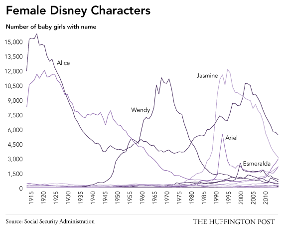

In this exercise, you will investigate annual trends in the prevalence of six names for babies born in the United States.  

**1.** Decide upon five names of interest to you, in addition to your own. Create a vector of these six names.  

**2.** Install and load the package `babynames`, which includes the names of each child born in the United States from 1880 to 2017, according to the Social Security Administration.    

**3.** Make an object named `bn` like this: `bn <- babynames::babynames`.

**4.** Write a function that takes any name and plots its proportional prevalence from 1880 to 2017. Format the plot beautifully. Provide the name as the title of the plot.  


**5.** Modify your function so that it takes multiple names (instead of just one) and generates a multi-pane plot, one for each of the names passed to the function. Then, test that function on the object you created in number one.  

**6.** Create a function called `first_letter`. This should take any vector as an argument and return the first letter only. You will need to use the `substr` function.

**7.** Use your `first_letter` function to make a new variable in the babynames dataset called `fl`. This should be the first letter of all names.

**8.** What was the most popular first letter of boys names in 1900?

**9.** What was the least popular first letter of girls names in 2017?

**10.** Make a function called `letter_plot`. This should take two arguments, `letter` and `m_or_f`, and then create a plot showing the popularity of that letter for the letter/sex combination inputted over time.

**11.** Make a function called `letter_compare`. This should take two  arguments: `y` (the year) and `gender` (sex). This should make a plot of the popularity of each letter being used as the first letter for a name, for the sex in question, for the year provided.


#### Exercises  with trees data {-}

**12.** Define an object named `trees` using the built-in `trees` dataset: `trees <- trees` (weird, right?)

**13.** How many rows are there?

**14.** How many columns are there?

**15.** "Girth" is the same thing as "circumference". Make a function named `girth_to_diameter`. It should do exactly what it says.

**16.** Create a new variable called `diameter`. Use your new function to populate it.

**17.** Create a scatterplot showing the association between `diameter` and `Volume`.

**18.** Create a histogram of `Height`.

**19.** Create a function named `diameter_to_area`. It should do what it says it does. Create a new variable named `area` using this function. This should be the area of a cross-sectional cut of the tree.

**20.** Create a dataset named `oranges` by reading in the built-in `Orange` dataset like this: `oranges <- Orange`.

**21.** Create a plot showing circumference as a function of age, faceted by tree number.

**22.** Create a function called `plot_tree`. This should take only one argument, `tree_number`, and generate a plot of that tree's growth over time.

**23.** Create a function called `circumference_to_radius`. It should do what it says. Use it to create a new variable in the `oranges` data named `radius`.

**24.** Create a function called `double_it`. It should double it. Use it to create a variable named `diameter`.

**25.** Assume that the measurements of the trees are in inches, and that the age of the trees is in days. Create (a) a function for converting inches to centimeters and (b) a function for converting days to weeks. Create new variables in the data, using these functions, named `circumference_cm` and `age_weeks`.

**26.** Plot the association between age in weeks and circumference in centimeters. Facet by tree number.

**27.** Do trees get bigger as they get older?


#### Exercises with `dplyr` and `ggplot` {-} 

```{r,echo=TRUE,collapse=TRUE, eval = FALSE}
library(gapminder)
library(dplyr)
library(ggplot2)
gm <- gapminder
```

Previously we analyzed and explored the dataset by using dplyr and ggplot. A lot of our analysis used the same code, just applied to different variables and aspects of the data. 

```{r,echo=TRUE,collapse=TRUE, eval = FALSE}
# plot the gdp per capita for china over time
china_gdp <- gm %>% filter(country == 'China')
ggplot(china_gdp, aes(year, gdpPercap)) + 
  geom_line() +
  labs(x = 'Year', y = 'GDP per capita', title = "China GDP per capita over time")

# now india 
india_gdp <- gm %>% filter(country == 'India') 
ggplot(india_gdp, aes(year, gdpPercap)) + 
  geom_line() +
  labs(x = 'Year', y = 'GDP per capita', title = "India GDP per capita over time")

```

If we want to do this for every country we will be reusing the same code over and over again. Lets write a function

```{r,echo=TRUE,collapse=TRUE, eval = FALSE}
plot_gdp <- function(country_name){
  plot_data <- gm %>% filter(country == country_name) 
  ggplot(plot_data, aes(year, gdpPercap)) + 
    geom_line() +
    labs(x = 'Year', y = 'GDP per capita', title = paste0(country_name, ' GDP per capita over time'))
}
plot_gdp(country_name = 'China')
plot_gdp(country_name = 'India')
plot_gdp(country_name = 'Angola')
```

Lets take it a step further and add a plotting variable 

```{r,echo=TRUE,collapse=TRUE, eval = FALSE}
plot_gdp <- function(country_name, plot_var){
  plot_data <- gm %>% filter(country == country_name) 
  ggplot(plot_data, aes_string('year', plot_var)) + 
    geom_line() +
    labs(x = 'Year', y = plot_var, title = paste0(country_name,' ', plot_var ,' over time'))
}
plot_gdp(country_name = 'China', plot_var = 'pop')
plot_gdp(country_name = 'India', plot_var = 'lifeExp')
plot_gdp(country_name = 'Angola',plot_var = 'gdpPercap')
```

**Now keep going:**  

**28.** Create a function that filters by a continent and year and creates a barplot of the population for all the countries in that continent 

**29.** Add a color argument to the function called color_bars that fills the bar chart with that color 

**30.** Add a title argument to the function that's called plot_title that combines the name and year into the title of the plot

**31.** Add another argument that specifies the numerical variable you are plotting on the y axis (up until now it was just population. hint(aes_string))

**32.** Add another argument called `plot_type` that has a default value "bar". Use conditionality (if and else statements) to create a bar chart if `plot_type`="bar", a point plot otherwise. 

**33.** Create your own function that filters the data in some way and makes a plot. The function should have at least 5 arguments.


<!--chapter:end:21-writing_functions.Rmd-->

# `for` loops

#### Learning goals {-}

* What `for` loops are, and how to use them yourself  
* How to use `for` loops to carry out repetitive analyses  
* How to use `for` loops to summarize subgroups in your data  
* How to use `for` loops to create and work with many data files at once  
* How to use `for` loops for plots that are tricky but cool  
* How to use nested `for` loops  


## Basics  {-}
A `for` loop is a super powerful coding tool. In a `for` loop, `R` loops through a chunk of code for a set number of repititions.

A super basic example:
```{r,echo=TRUE,collapse=TRUE}
x <- 1:5
for(i in x){
  print(i)
}
```

Here's an example of a pretty useless `for` loop:
```{r,echo=TRUE,collapse=TRUE}
for(i in 1:5){
  print("I'm just repeating myself.")
}
```

**This code is saying:**   
- For each iteration of this loop, step to the next value in `x` (first example) or `1:5` (second example).  
- Store that value in an object `i`,   
- and run the code inside the curly brackets.
- Repeat until the end of `x`.  

**Look at the basic structure:**  
- In the`for( )` parenthetical, you tell R what values to step through (`x`), and how to refer to the value in each iteration (`i`).  
- Within the curly brackets, you place the chunk of code you want to repeat.

Another basic example, demonstrating that you can update a variable repeatedly in a loop.
```{r,echo=TRUE,collapse=TRUE}
x <- 2
for(i in 1:5){
  x <- x*x
  print(x)
}
```

Silly example 1:
```{r,echo=TRUE,collapse=TRUE}
professors <- c("Keri","Deb","Ken") 
for(x in professors){
  print(paste0(x," is pretty cool!"))
}
```

Silly example 2: 
```{r,echo=TRUE,collapse=TRUE}
professors <- c("Keri","Deb","Ken") 
claims <- c()
for(x in professors){
  claim_x <- paste0(x," is pretty cool!")
  claims <- c(claims, claim_x)
}
claims
```

"Nested" for loops:

```{r,echo=TRUE,collapse=TRUE}
x <- 1:5
y <- 6:10
for(i in x){
  for(j in y){
  print(paste0(i,"-",j))
  }
}
```

### `for` loop workflow {-}

Loops can be simple or complex, but the procedure for building any `for` loop is the same. The general idea is to write the **body** of your loop *first*, **test** it to make sure it works, *then* **wrap** it in a `for` loop. Use the code below as a template for building `for` loops. 

```{r,collapse=TRUE,echo=TRUE,eval=FALSE}
# Step 1. Give 'i' an arbitrary value for the time being
i=1 

# Step 2. If needed, stage empty plots or objects here.


# Step 5. Open up your `for` loop here.


# Step 3. Write the body of your loop


# Step 4. Test the code you wrote for Step 2 (i.e., run the code for Steps 1 and 2).


# Step 6. Close your `for` loop with an end curly bracket.

```


## `for` loop exercises {-}

### Use case 1: Repetitive printing {-}

**1a.** Practice using the `for` loop template to make your own version of silly example 1. 

**1b.** Practice the `for` loop template to make your own version of silly example 2. 

**1c.** Pretend you are doing a big repetitive analysis with 1,000 iterations. Pretend each iteration takes a long time to process, so it would be nice to print a status update each time an iteration is complete. Write a `for` loop that prints a status update with each iteration (e.g., "Iteration 3 out of 1,000 is complete ..."). 


### Use case 2: Self-building calculations {-}

**2a.** Create a vector with these values: 45, 245, 202, 858, 192, 202, 121. Build a `for` loop that prints the cumulative sums for this vector. *(If your vector is 1,1,3, then the cumulative sums are 1,2,5.)*  

**2b.** Modify this `for` loop so that the cumulative sums are saved to a second vector object, instead of printed to the console.  

*(Note: there is a built-in function, `cumsum()`, that you can also use for this application)*  


### Use case 3: Summarizing subgroups in your data {-}

**Scenario:** You participate in a survey of flightless birds in the forests of New Zealand. You conduct thirty days of fieldwork on four species of bird: the kiwi, the weka, the kakapo (*the world's heaviest parrot*), and the kea (*the world's only alpine parrot*).  


Download the data, place it in your working directory, and read it into your `R` session.  

Your data (`r xfun::embed_file('./data/nz_birds.csv',text="nz_birds.csv")`) look like this: 

```{r,echo=FALSE,eval=FALSE,collapse=TRUE}
# Prep dataset
dos <- 1:30
spp <- c("Kiwi","Weka","Kakapo","Kea")
grp <- 1:4

df <- data.frame(day=sample(dos,size=406,replace=TRUE),
           species=sample(spp,size=406,replace=TRUE),
           group=sample(grp,size=406,replace=TRUE))

df <- df[order(df$day),] 
#write.csv(df,file="./data/nz_birds.csv",quote=FALSE,row.names=FALSE)
```

```{r,echo=TRUE,collapse=TRUE}
df <- read.csv("./data/nz_birds.csv")
nrow(df)
head(df)
tail(df)
```

Each row contains the data for a single bird group detection.

Your supervisor has asked you to write a report of your findings. In that report she wants to see a table with the number of each species seen on each day of the fieldwork. That table will look something like this: 

```{r,echo=FALSE,collapse=TRUE}
# 1: determine the unique days in the dataset:
udays <- unique(df$day)

# 2: stage empty results vectors
kiwi <- weka <- kakapo <- kea <- c()

# (create a variable named i to help you test your code as you build it)
i=1 

# 3: Start for loop. Loop through each unique day
for(i in 1:length(udays)){
  
  # 4. Subset to day of interest
  dayi <- udays[i] 
  dfi <- df[df$day == dayi,]
  
  # 5. Tally up birds, add to each vector
  kiwi[i] <- length(which(dfi$species=="Kiwi"))
  weka[i] <- length(which(dfi$species=="Weka"))
  kakapo[i] <- length(which(dfi$species=="Kakapo"))
  kea[i] <- length(which(dfi$species=="Kea"))
  
}

# 6. Run for loop

# 7. Combine results into a dataframe
results <- data.frame(day=udays, kiwi, weka, kakapo, kea)

# Check it out!
print(head(results))

```

Use a `for` loop to create this table. 

Note that this is a *very* common use case for `for` loops. Other examples of this use case include these scenarios:  

- You want to summarize sample counts for each day of fieldwork.   

- You want to summarize details for each user in your database.  

- You want to summarize weather information for each month of the year.  


### Use case 4: Repetitive file creation {-}

**Scenario, continued:** Your supervisor also wants to be able to share a public version of the New Zealand survey data with some of her collaborators. Rather than share the raw data, she would like to have a separate data file for each species of bird. Use a `for` loop to create a data file (`.csv` format) for each bird species.

**Hint:** First, set your working directory. Then, within your working directory, create a folder where you can deposit the files you create.   


### Use case 5: Reading in multiple files {-}

In the previous use case, you divided your original dataset into several files. Now see if you can write a `for` loop that *reverses* the process. In other words, build a `for` loop that combines several data files into a single dataframe. 

**Hint:** Recall that you can use the function `rbind()` to combine two or more dataframes.  


### Use case 6: Layering cyclical data on a plot {-}

First, read in some cool data (`r xfun::embed_file('./data/keeling-curve.csv',text="keeling-curve.csv")`).

```{r,echo=TRUE,collapse=TRUE}
kc <- read.csv("./data/keeling-curve.csv") ; head(kc)
```

This is the famous Keeling Curve dataset: long-term monitoring of atmospheric CO2 measured at a volcanic observatory in Hawaii.

Try plotting the Keeling Curve:

```{r,echo=TRUE,collapse=TRUE}
plot(kc$CO2 ~ kc$year_dec,type="l",xlab="Year",ylab="Atmospheric CO2")
```

There are some erroneous data points! We clearly can't have negative CO2 values. Let's remove those and try again:

```{r,echo=TRUE,collapse=TRUE}
kc <- kc[kc$CO2 >0,] 
plot(kc$CO2 ~ kc$year_dec,type="l",xlab="Year",ylab="Atmospheric CO2")
```

**What's the deal with those squiggles?** They seem to happen every year, cyclically. Let's investigate!

Let's look at the data a different way: *by layering years on top of one another.*  

To begin, let's plot data for only a *single* year:  

```{r,echo=TRUE,collapse=TRUE}

# Stage an empty plot for what you are trying to represent
plot(1, # plot a single point
     type="n",
     xlim=c(0,365),xlab="Day of year",
     ylim=c(-5,5),ylab="CO2 anomaly")
abline(h=0,col="grey") # add nifty horizontal line

# Reduce the dataset to a single year (any year)
kcy <- kc[kc$year=="1990",] ; head(kcy)

# Let's convert each CO2 reading to an 'anomaly' compared to the year's average.
CO2.mean <- mean(kcy$CO2,na.rm=TRUE) ; CO2.mean  # Take note of how useful that 'na.rm=TRUE' input can be!

y <- kcy$CO2 - CO2.mean ; y # Translate each data point to an anomaly

# Add points to your plot
points(y~kcy$day_of_year,pch=16,col=adjustcolor("darkblue",alpha.f=.3))

```

But this only shows one year of data! How can we include the seasonal squiggle from other years?

Figure out how to use a `for` loop to layer each year of data onto this plot. Your final plot will look like this: 

```{r,echo=FALSE,collapse=TRUE}
# First, stage your empty plot:
plot(1,type="n",
     xlim=c(0,365),xlab="Day of year",
     ylim=c(-5,5),ylab="CO2 anomaly")

abline(h=0,col="grey")

# Now we will loop through each year of data. First, get a vector of the years included in the dataset:
years <- unique(kc$year) 

# Now build your for loop. 
# Notice that the contents of the `for loop` are exactly the same 
# as the single plot above --  with one exception. 
# Notice the use of the symbol i

for(i in years){

  # Reduce the dataset to a single year
  kcy <- kc[kc$year==i,] ; head(kcy)
  
  # Let's convert each CO2 reading to an 'anomaly' compared to the year's average.
  CO2.mean <- mean(kcy$CO2,na.rm=TRUE) ; CO2.mean # Get average CO2 for year

  y <- kcy$CO2 - CO2.mean ; y # Translate each data point to an anomaly

  # Add points to your plot
  points(y~kcy$day_of_year,pch=16,col=adjustcolor("darkblue",alpha.f=.3))
  
}

```

So how do you interpret this graph? Why do you think those squiggles happen every year?


### Other use cases for plots {-}

#### Efficient multi-panel plots {-}

A `for` loop can be a very efficient way of making multi-panel plots.

Let's use a `for loop` to get a quick overview of the variables included in the `airquality` dataset built into R.

```{r,echo=TRUE,collapse=TRUE}
data(airquality)
head(airquality)
```

Looks like the first four columns would be interesting to plot.

```{r,echo=TRUE,collapse=TRUE}
par(mfrow=c(2,2)) # Setup a multi-panel plot # format = c(number of rows, number of columns)
par(mar=c(4.5,4.5,1,1)) # Set plot margins

# Loop through the first four columns ...
for(i in 1:4){
  y <- airquality[,i] # Select data in column i
  var.name <- names(airquality)[i] # Get name of that column
  plot(y,xlab="Day",ylab=var.name,pch=16) # Plot data
}

par(mfrow=c(1,1)) # restore the default single-panel plot
```

#### Using `for` loops to plot subgroups of data {-}

`for loops` are also useful for plotting data in tricky ways. Let's use a different built-in dataset, that shows the performance of various car make/models.

```{r,echo=TRUE,collapse=TRUE}
data(mtcars)
head(mtcars)
```

Let's say we want to see how gas mileage is affected by the number of cylinders a car has. It would be nice to create a plot that shows the raw data as well as the mean mileage for each cylinder number.

```{r,echo=TRUE,collapse=TRUE}
# Let's see how many different cylinder types there are in the data
ucyl <- unique(mtcars$cyl) ; ucyl

# Let's make an empty plot
plot(1,type="n", # tell R not to draw anything
     xlim=c(2,10),ylim=c(0,50),
     xlab="Number of cylinders",
     ylab="Gas mileage (mpg)")

# Write your for loop here to add the actual data

i=ucyl[1] # It's always good to use a known value of i as you build up your for loop

for(i in ucyl){ # Usually helpful to write this line LAST. 
                # i.e., write body of loop first, test it, then wrap it in a loop.
  
  # Subset the dataframe according to number of cylinders
  cari <- mtcars[mtcars$cyl==i,]
  
  # Plot the raw data
  points(x=cari$cyl,y=cari$mpg,col="grey")
  
  # Superimpose the mean on top
  points(x=i,y=mean(cari$mpg),col="black",pch="-",cex=5,)
}
```

Now try to do something similar on your own with the `airquality` dataset. Use `for loops` to create a plot with Month on the x axis and Temperature on the y axis. On this plot, depict all the temperatures recorded in each month in the color grey, then superimpose the mean temperature for each month.

We will provide the empty plot, you provide the `for loop`:

```{r,echo=TRUE,collapse=TRUE}
plot(1,type="n",
     xlim=c(3,10),ylim=c(40,100),
     xlab="Month",
     ylab="Temperature")

# Write your for loop here to add the actual data
for(i in airquality$Month){
  airi <- airquality[airquality$Month==i,]
  points(x=airi$Month,y=airi$Temp,pch=1,col="grey")
  points(x=i,y=mean(airi$Temp),pch="-",cex=5,col="black")
}
```


### Review assignments {-}

#### Review assignment 1 {-}  

Sometimes you need to summarize your data in such a specific way that you will need to use *nested* `for` loops, i.e., one `for` loop contained within another.

For example, your supervisor for the New Zealand Flightless Birds Survey has now taken an interest in associations among the four bird species you have been monitoring. For example, are kiwis more abundant on the days when you detect a lot of kakapos?

To answer this question, your supervisor wants to see a table with each species combination (Kiwi - Kakapo, Kiwi - Weka, ... Kakapo - Kea, etc.) and the number of dates in which both species were seen more than 5 times.

You can produce this table using a nested `for` loop. Here is how it's done:

```{r,echo=TRUE,collapse=TRUE}

uspp <- unique(df$species) # get set of unique species

A <- B <- c() # empty vector for names of each species in the pair
X <- c() # empty vector for number of dates in which both species were common

i=1 ; j=2

# For loop 1
for(i in 1:length(uspp)){
  spi <- uspp[i] # species i
  dfi <- df[df$species == spi,] # subset df to only this species
  counti <- table(dfi$day) # get number of sightings on each day
  dayi <- names(counti)[which(counti >= 5)] ; # get the dates on which this species was seen 5+ times
  
  # For loop 2
  for(j in 1:length(uspp)){
    spj <- uspp[j] # species j
    dfj <- df[df$species == spj,] # subset df to only this species
    countj <- table(dfj$day) # get number of sightings on each day
    dayj <- names(countj)[which(countj >= 5)] ; # get the dates on which this species was seen 5+ times
    
    dates_ij <- which(dayi  %in% dayj) # get the dates on which both species were seen 5+ times
    Xij <- length(dates_ij) # count the number of these dates
    
    # Add results to staged objects
    X <- c(X,Xij) 
    A <- c(A,spi)
    B <- c(B,spj)
  }

}

# Combine results into a dataframe
results <- data.frame(A, B, X)

# Check it out!
results

```

Note that the code for adding the results to the staged objects `X`, `A`, and `B` is contained within the second for loop. This is necessary for producing our results; if we put that code in the first for loop *after* the code for the nested loop, our results would not be complete.  

Note that each `for` loop *must* use a different variable to represent each iteration. In this example, the first loop uses `i` and the second uses `j`.  If we used `i` for both loops, `R` would get very confused indeed. 

Also note that we used `i` and `j` in the variables specific to each loop (e.g., `dayi` and `dayj`), as a simple way to help us keep track of what each variable is representing.  


#### Review  assignment 2 {-}  

Your supervisor is happy with your pairwise species association dataframe, and wants to use it in an analysis for a publication. However, the `R` package she wants to use requires that the data be in the format of a square *matrix* with four rows -- one for each species -- and four columns. Like this:

```{r,echo=TRUE,collapse=TRUE}
results_matrix <- matrix(data=NA, nrow=4, ncol=4, dimnames=list(uspp,uspp))
results_matrix
```

You have not yet worked with matrices in this curriculum (you will in a few modules), but for now think of them as simple dataframes with a single type of data (e.g., all numeric values, like this one). You can subset matrices just as you would a dataframe: `matrix[row,column]`.  

The values in this matrix should represent the number of dates in which each species pair was seen 5 times or more. For example, `result[1,2]` would be 3, since the Kiwi and Kea were seen 5+ times on only 3 dates.

She asks you to use the dataframe you just created to create this matrix. Use a nested for loop to do it.

```{r,echo=TRUE,collapse=TRUE}
# Stage empty results objects
results_matrix <- matrix(data=NA, nrow=4, ncol=4, dimnames=list(uspp,uspp))

# Get unique species
uspp <- unique(c(results$A,results$B))

# Loop 1: each species (row)
for(i in 1:length(uspp)){
  spi <- uspp[i]
  resultsi <- results[results$A==spi,] # subset data to rows where column A equals species i
  
  # Loop 2: each species (column)
  for(j in 1:length(uspp)){
    spj <- uspp[j]
    resultsj <- resultsi[resultsi$B==spj,] # subset data from i loop where column B equals species j
    
    Xij <- resultsj$X      # Find result

    results_matrix[i,j] <- Xij     # Add result to staged object
  }
}

results_matrix
```

Boom! 


#### Review  assignment 3 {-}  

First, read in and format some other cool data (`r xfun::embed_file('./data/renewable-energy.csv',text="renewable-energy.csv")`). The code for doing so is provided for you here:

```{r,echo=TRUE,collapse=TRUE}
df <- read.csv("./data/renewable-energy.csv")
```

This dataset, freely available from World Bank, shows the renewable electricity output for various countries, presented as a percentage of the nation's total electricity output. They provide this data as a time series.


##### Summarize columns with a `for loop` {-}

**Task 3A:** Use a `for loop` to find the change in renewable energy output for each nation in the dataset between 1990 and 2015. Print the difference for each nation in the console.

```{r,echo=TRUE,collapse=TRUE}
# Write your code here
i=2
for(i in 2:ncol(df)){
  dfi <- df[,i] ; dfi
  diffi <- dfi[length(dfi)] - dfi[1] ; diffi
  print(paste0(names(df)[i]," : ",round(diffi),"% change."))
}
```

**Task 3B:** Re-do this loop, but instead of printing the differences to the console, save them in a vector.

```{r,echo=TRUE,collapse=TRUE}
# Write your code here
diffs <- c()
i=2
for(i in 2:ncol(df)){
  dfi <- df[,i] ; dfi
  diffi <- dfi[length(dfi)] - dfi[1] ; diffi
  diffs <- c(diffs,diffi)
}
diffs
```


##### Multi-pane plots with `for loops` {-}

###### Practice with a single plot {-}

**Task 3C:** First, get your bearings by figuring out how to use the `df` dataset to plot the time series for the United States, for the years 1990 - 2015. Label the x axis "Year" and the y axis "% Renewable". Include the full name of the county as the `main` title for the plot.

```{r,echo=TRUE,collapse=TRUE}
# Write code here
dfi <- df[,c(1,13)] 
plot(x=dfi[,1],
     y=dfi[,2],
     type="l",lwd=2,
     xlim=c(1990,2015),ylim=c(0,100),
     xlab="Year",ylab="% renewable",
     main=names(dfi)[2])
```

#### Now loop it! {-}

**Task 3D:** Use that code as the foundation for building up a `for loop` that displays the same time series for every country in the dataset on a multi-pane graph that with 4 rows and 3 columns.

```{r,fig.height=10,fig.width=8,echo=TRUE}

par(mfrow=c(4,3))
i=3
for(i in 2:ncol(df)){
  dfi <- df[,c(1,i)] ; dfi
  plot(x=dfi[,1],
       y=dfi[,2],
       type="l",lwd=2,
       xlim=c(1990,2015),ylim=c(0,100),
       xlab="Year",ylab="% renewable",
       main=names(dfi)[2])
}

```

###### Now loop it *in layers!* {-}

**Task 3E:** Now try a different presentation. Instead of producing 12 different plots, superimpose the time series for each country on the *same single plot*. 

To add some flare, highlight the USA curve by coloring it red and making it thicker.

```{r,echo=TRUE}
par(mfrow=c(1,1))
plot(1,type="n",lwd=2,
     xlim=c(1990,2015),ylim=c(0,100),
     xlab="Year",ylab="% Renewable")

for(i in 2:ncol(df)){
  dfi <- df[,c(1,i)] ; dfi
  lines(dfi[,2]~dfi[,1],lwd=2,col=adjustcolor("black",alpha.f=.4))
}

lines(df$United_States~df$year,lwd=4,col="firebrick")

```

<!--chapter:end:24-for_loops.Rmd-->

# Conditional statements

```{r,echo=FALSE,eval=TRUE}
is_teacher <- FALSE
```

#### Learning goals {-}

* Understand what conditional statements are, and why they are so awesome.
* Be able to write your own conditional statements in `R`.

```{r, results = 'asis', eval = is_teacher}
teacher_content('Here is some teacher content.')
```

## First steps  {-}

An example of a conditional statement is, *"If ______ happens, do _____. Otherwise, do _____."*  

In `R` code, conditional statements work a similar way: they let a variable's value determine which process to carry out next. 

Here is a basic example:  

```{r, echo=TRUE,collapse=TRUE}
x <- 4

if(x==3){
  message("x is equal to 3!")
}else{
  message("x does NOT equal 3!")
}
```

Let's break this `if` statement down. 

- The `if` command opens up a conditional statement.
- The parenthetical `(x==3)` is where the logical test happens. If the result of this test is `TRUE`, then the `if` statement will be processed; if not, the `else` statement will be run instead.
- The curly brackets, `{ }` serve to contain the code that will be run, depending on the outcome of the logical test.
- The `else` command indicates the start of the code that will be run if the logical test's result is `FALSE`.

This code ran the logical test `x==3`, determined its outcome to be `FALSE`, and so it skipped the `if` code and ran the `else` code instead.  

Here is another example of the same idea:

```{r, echo=TRUE,collapse=TRUE}
x <- 4

if(x==3){
  y <- 100
}else{
  y <- 0
}

y # see what y is
```

Since `x==3` returned `FALSE`, `y` was defined as `0` instead of `100`.  

Note that you do not need to define an `else` statement. If you do not, `R` will simply do nothing if the logical test is `FALSE`.

```{r, echo=TRUE,collapse=TRUE}
x <- 4

if(x==3){
  message("x is equal to 3!")
}
```

*(Nothing happened)*  

You can also feed the `if` statement a logical object instead of a test. 

```{r, echo=TRUE,collapse=TRUE}
x <- 4
x_test <- x == 3
x_test # check out the value of x_stest

if(x_test){
  message("x is equal to 3!")
}
```

Not that, since `x_test` is a logical value (`TRUE` or `FALSE`), you do not need to write out a logical test within the `if` parenthetical. But you are free to do so if you wish:

```{r, echo=TRUE,collapse=TRUE}
x <- 4
x_test <- x == 3

if(x_test == FALSE){
  message("x is not equal to 3!")
}
```

This `if` statement is saying that, if it is `TRUE` that `x_test` is `FALSE`, print a message saying so.  


### Exercise 1 {-}

Write out your own basic `if...else` statement and ensure that it works.  


## Next steps {-}  

### Nested conditions {-} 

You can nest conditional statements within others as many times as you wish: 

```{r,echo=TRUE,collapse=TRUE}
x <- 6

if(x==3){
  message("x equals 3")
}else{
  if(x < 3){
    message("x is less than 3")
  }else{  
    message("x is greater than 3")
  }
}
```

Note that every open bracket, `{`, needs a corresponding closing bracket ,`}`. Most errors associated with `if` statements involve missing brackets.


### Handling `NA`s, `NaN`'s, `Inf`s, and `NULL`s {-}

`if` statements can be particularly helpful when your dataset contains missing or broken values. `R` includes base functions that help you carry out logical tests concerning missing values. These three test below can be very helpful within `if` statements. 


**`is.finite()`** tests whether a numeric object is a real, finite number.

```{r,echo=TRUE,collapse=TRUE}
x <- 0
is.finite(x)

y <- 10/x
y
is.finite(y)
```

Here is an `if` statement making use of `is.finite()`:

```{r,echo=TRUE,collapse=TRUE}
x <- 0
y <- 10/x
if(is.finite(y)){
  message("y is indeed a finite number!")
}else{
  message("y is not a finite number!")
}
```

**`is.na()`** tests whether a variable contains a missing or broken object.  

```{r,echo=TRUE,collapse=TRUE}
x <- "eric"
is.na(x)

y <- as.numeric(x) # try converting `x` to a numeric value
is.na(y)
is.finite(y)
```

`NA` stands for *"Not Available"*.  `NaN` is also a common sign of a broken value. It stands for *Not a Number*.

**`is.null()`** tests whether a variable is empty. That is, it has been initiated, but it contains no data.  

```{r,echo=TRUE,collapse=TRUE}
x <- c(4,7,3,1,5) # make a vector of numbers
is.null(x)

y <- c() # make an empty vector
is.null(y)
```


### Joint conditions {-} 

`if` statements can also accommodate joint logical tests. For example, the follow `if` statement only returns if a message if *two* tests are true:

```{r,echo=TRUE,collapse=TRUE}
x <- 6
if(is.finite(x) & x==6){
  message("x is real and equals 6")
}
```

The next `if` statement returns a message if either of the logical statements are true:

```{r,echo=TRUE,collapse=TRUE}
x <- 6
if(x==3 | x==6){
  message("x is equal to either 3 or 6")
}
```


#### `NULL` as a default {-}

Setting the default value for an input to `NULL` can be useful in certain use cases. For example, let's say that if `b` is not defined by the user, you want its value to be set to five times the value of `x`.

```{r,echo=TRUE,collapse=TRUE}
my_function <- function(x,a=1.3,b=NULL){
  
  # Handle input `b`
  if(is.null(b)){
    b <- x*5
    print(paste("b was NULL! Setting its value to ", b))
  }
  
  # Now perform process
  y <- a*x + b
  
  return(y)
}
```

In this function, a conditional statement is used -- `if(is.null(b)){ ... }` -- to handle the input `b` when the user does not specify a value for it. When `b` is `NULL`, the logical test `is.null(b)` will be `TRUE`, which will trigger the conditional statement and case `b` to be defined as `x*5`. Conditional statements will be convered in detail in the next modules.

Try running the function with and without providing a value for `b`. 

```{r,echo=TRUE,collapse=TRUE}
my_function(x=2,b=5)
my_function(x=2)
```

Conditional statements such as `if(is.null(x)){ ... }` or `if(is.na(x)){ ... }` will be helpful in dealing with all the possible values that a user can pass to your custom functions. 

### Complex inputs {-}

You can pass vectors, dataframes, and any other data structure as inputs in your own custom functions. For example:

```{r,echo=TRUE,collapse=TRUE}
my_input <- 1:20
my_function(x=my_input,a=1.2,b=10)
```


### Complex function outputs {-}

At some point you will want multiple objects to be returned by your function. For example, perhaps you want both `y` and `b` to be returned now that you can define `b` according to the value of `x`. 

Unfortunately, the `return()` command does not let you include multiple objects. `return(y,b)` will not work. To make it work, you have to place your output objects within a single object, such as a vector, dataframe, or list. 

Here is a modification of `my_function()` that allows multiple outputs:

```{r,echo=TRUE,collapse=TRUE}
my_function <- function(x,a=1.3,b=NULL){
  
  # Handle input `b`
  if(is.null(b)){
    b <- x*5
  }
  
  # Now perform process
  y <- a*x + b
  
  output <- c("y"=y,"b"=b) 
  return(output)
}
```

Now `my_function()` works like this: 

```{r,echo=TRUE,collapse=TRUE}
my_function(x=5)
```

To get the value of just `y` or just `b`, you can treat the output just like any other vector:

```{r,echo=TRUE,collapse=TRUE}
my_function(x=5)[1]
my_function(x=5)[2]
```


### Exercise 2 {-}

Write a nested `if` statement that produces a message reporting the hemisphere for any GPS position you provide it (a pair of latitude and longitude coordinates, in decimal degrees). The four hemisphere options are as follows: 

- *Northwest* (positive latitudes and negative longitudes, e.g., USA)  
- *Northeast* (positive latitudes and longitudes, e.g., Russia)
- *Southwest* (negative latitudes and longitudes, e.g., Brazil)  
- *Southeast* (negative latitudes and positive longitudes, e.g., New Zealand).  

Include the ability to handle missing values (i.e., if an `NA` is provided, return a message saying that values are missing and the hemisphere cannot be determined.)

Provide five examples that demonstrate the functionality for all the possible message options.


#### Review assignment {-}

**Note:** This exercise will combine all the skills you've learned for `for` loops, `if` statements, *and* writing functions into a real-world data science scenario. Buckle up!


You are working at the Center for Disease Control. Your supervisor has asked you to take a look at state-level data on infectious diseases within the United States in the last century.  Specifically, she wants you to address the following questions and requests:

1. In the last 90 years, which states have had the highest average prevalence of **measles**, **pertussis** (whooping cough), and **smallpox** in proportion to their population sizes? Which have had the lowest?

2. Provide beautiful plots showing trends in the prevalence of these diseases over the last century. Produce a single plot for each state, with three lines representing the time series for each disease of interest. Save each plot as a `pdf` into a folder named `state-level-summaries`. Name each `pdf` using the state's name. 

To do this work, your supervisor asks you to use the `us_contagious_diseases` dataset contained within the `R` package `dslabs`, which contains disease data from 1928-2011 for all states. To make sure the numbers reflect actual patterns, she asks you to only use prevalence numbers for years in which counts were made in more than 20 weeks out of the year.


<!--chapter:end:27-conditional_statements.Rmd-->

# Matrices & lists

#### Learning goals {-}

* What `R` lists are, how to work with them, and when they are useful  
* What `R` matrices are, how to work with them, and when they are useful  

&nbsp;


As a data scientist, you will almost always be working exclusively with [dataframes](#dataframes).  But there are occasions when you will need other complex data structures -- **lists** and **matrices** -- to get a job done.  

Here we show you what these data structures are like, how to work with them, and when to use them.  

## Lists {-} 

Think of lists as complicated vectors. Instead of being a set of single values, which is what a vector is, a list is a set of complex data structures. In fact, a better analogy may be that lists are like shopping carts. You can put a lot of different things in there. 

To see what we mean, stage an empty list: 

```{r,echo=TRUE,collapse=TRUE}
x <- list()
```

Now add a simple vector to it:
```{r,echo=TRUE,collapse=TRUE}
x$vector <- 1:10
```

Now add a dataframe to it. 
```{r,echo=TRUE,collapse=TRUE}
x$dataframe <- data.frame(name=c("Ben","Joe","Eric"),
                 height.inches=c(75,73,80))
```

Now add a new list to it. 
```{r,echo=TRUE,collapse=TRUE}
x$list <- list()
```

Now add a vector to that new list: 

```{r,echo=TRUE,collapse=TRUE}
x$list$vector <- 10:20
```

Okay! Nice shopping spree. Let's see what we have: 

```{r,collapse=TRUE}
x
```

This is a list: a lot of complicated data structures, all contained in a single variable.  

As you saw above, you can access the items in your list using the same dollar sign, `$`, that we use to access columns in a dataframe: 

```{r,echo=TRUE,collapse=TRUE}
x$vector
```

You can do the same with lists within your list:  

```{r,echo=TRUE,collapse=TRUE}
x$list$vector
```

Alternatively, you can subset lists using double brackets, `[[` `]]`.

```{r,echo=TRUE,collapse=TRUE}
x[[1]]
x[[3]]
```

Finally, you can create a list from scratch like so:  

```{r,echo=TRUE,collapse=TRUE}
y <- list("vector1"=1:10,
          "vector2"=11:20)
y
```


### Use cases for lists {-}

Common use cases for lists include:  

- Keeping track of a bunch of related dataframes (i.e., by storing each dataframe as an element in a list).

- Several `R` functions return lists as outputs. For example, when you [split up a vector of strings](#text) using `stringr::str_split()`, the output is a list that is the same length as your original vector. 

- Returning complex outputs from your own custom functions. Since functions can return only a single object, you can stuff a bunch of different objects into a list and return the list. 


## Matrices {-}

Matrices are like dataframes, except that they can only contain a single data type. Dataframes can have a column with text and another with numbers, but a matrix will only handle one type. 

Here's a simple dataframe containing two classes of data:
```{r,echo=TRUE,collapse=TRUE,collapse=TRUE}
df <- data.frame(name=c("Ben","Joe","Eric"),
                 height.inches=c(75,73,80))
df
```

When you coerce this dataframe into a matrix (using the function **`as.matrix()`**), the numeric data get coerced into text: 

```{r,echo=TRUE,collapse=TRUE}
mdf <- as.matrix(df)
mdf
```

Other than that, you can treat a variable of class `matrix` similarly to a dataframe.  

Subsetting is the same: `matrix[rows,columns]` 

```{r,echo=TRUE,collapse=TRUE}
mdf[2,]
mdf[,2]
mdf[2,2]
```

To build a matrix from scratch, use the `matrix()` function. 

```{r,echo=TRUE,collapse=TRUE}
mx <- matrix(data=1:12, 
             nrow=4,
             ncol=3)
mx
```

The `data` input takes a vector of data and sorts it into a matrix with rows and columns. It starts "laying down" your data in the first column, then wraps to the second column, etc. 

You can also define names for the rows and columns in a matrix: 

```{r,echo=TRUE,collapse=TRUE}
mx <- matrix(data=1:12, 
             nrow=4,
             ncol=3,
             dimnames=list(c("row1","row2","row3","row4"),
                           c("col1","col2","col3")))
mx
```

The `dimnames` input takes a list with two vectors: the first contains row names, the second contains column names.  

Note, however, that you cannot subset a matrix according to their column names. `mx$col1`, for example, will not work. 

One more tool worth knowing for matrices is the function `diag()`, which returns the values that fall along the matrix's diagonal ([1,1], [2,2], [3,3], etc.).

```{r,echo=TRUE,collapse=TRUE}
mx

diag(mx)
```

The `diag()` function comes in handy in most use cases for matrices in `R` (see next section). 


### Use cases for matrices {-}

Common use cases for matrices include:  

- Matrix algebra applications (*duh*), such as life history tables in biology.  

- Using certain packages whose inputs require matrix objects. Matrices are particularly common in analyses of social networks.   

- Producing images (after all, an image is just a matrix in which each value is a pixel color.)  

To practice the latter use case, let's build up a simple matrix using a random number generator:

```{r,echo=TRUE,collapse=TRUE}
mx <- matrix(data=round(rnorm(100,50,10)),
             nrow=10,
             ncol=10)
mx
heatmap(mx,Rowv=NA,Colv=NA)
```

To see a real-world example of a matrix in action, here is a dataset containing rates of social associations, scaled between 0 and 0.5, among humpback whales in the fjords of British Columbia, Canada: `r xfun::embed_file('./data/humpback-sociality.rds',text="humpback-sociality.rds")`.

```{r,echo=TRUE,collapse=TRUE}
sociality <- readRDS("./data/humpback-sociality.rds")
```

Let's look at the first 5 rows and columns of this dataset: 

```{r,echo=TRUE,collapse=TRUE}
sociality[1:5,1:5]
```

Notice that this matrix is *symmetrical*. That is, the number of rows equals the number of columns. It is an *N x N* matrix.  

Also note that the row names and column names are the same. Each element in the matrix is the rate of association between the row's whale ID and the column's whale ID. This means that all of the values along this matrix's diagonal will be 0.5, which is the max association rate in this example: 

```{r,echo=TRUE,collapse=TRUE}
diag(sociality)[1:10]
```

The fact that this matrix is symmetrical with identical rows and columns also means that all the data in the *bottom* half of the matrix (i.e., *below* the diagonal) are the *mirror image* o the data in the top half.  

Look again at the first few rows and columns: 

```{r,echo=TRUE,collapse=TRUE}
sociality[1:3,1:3]
```

If we don't like the fact that the diagonal has large values (after all, it doesn't make much sense to quantify how much an individual associates with itself), we can use the `diag()` function to replace those diagonal values with `NA`:

```{r,echo=TRUE,collapse=TRUE}
diag(sociality) <- NA
sociality[1:5,1:5]
```

Now that we've cancelled out the diagnoal, a heatmap of this dataset will show us which whales are involved in the strongest social associations:  

```{r,echo=TRUE,collapse=TRUE}
heatmap(sociality,Rowv=NA,Colv=NA)
```

#### Review exercise {-}

##### Task 1 {-}  

Write a function that uses `for` loop techniques to convert any matrix, such as the `sociality` matrix above, into a dataframe. This dataframe must have a row for each value in the matrix, with three columns: `row_name`, `col_name`, and `data`.

The output of your function must be a list with two elements, `raw_matrix` and `df` (which contains your new dataframe). 

Demonstrate that your function works using the `sociality` dataset above.  


##### Task 2 {-}  

Then, write a function that reverses your work: this new function will take the `dataframe` output of your first function and revert your dataframe back into a matrix. The output of this function will also be a list with two elements, `raw_df` and `matrix` (which contains your new dataframe). 

In this function, include an input option giving you the choice of setting the diagonal in your matrix to `NA`. 

Demonstrate that the matrix output of your second function is the same as the original `sociality` dataset, and demonstrate that the diagonal input works as well.  


<!--chapter:end:30-matrices_lists.Rmd-->

# Advanced base plots in `R`

```{r,echo=FALSE,eval=FALSE}
is_teacher <- FALSE
```

#### Learning goals {-}

* Advanced tips and tricks for basic plots in `R`

&nbsp;

This module assumes you have already worked through the module on base plotting.  

Make sure you have this dataset from that module ready to go:
```{r,echo=TRUE,collapse=TRUE}
country <- c("USA","Tanzania","Japan","Ctr. Africa Rep.","China","Norway","India")
lifespan <- c(79,65,84,53,77,82,69)
gdp <- c(55335,2875,38674,623,13102,84500,6807)
df <- data.frame(country,lifespan,gdp)
```

The possibilities for data visualization in `R` are pretty much limitless, and over time you will become fluent in making gorgeous plots. Here are a few common tools that can take your plots to the next level.

### Adding lines  {-}

In some cases it is useful to add reference lines to your plot. For example, what if we wanted to be able to quickly see which countries had life expectancies below 75 years?

You can add a line at `lifespan = 75` using the function `abline()`. 
```{r,echo=TRUE,collapse=TRUE}
plot(df$lifespan ~ df$gdp)
abline(h=75)
```

In this command, the `h` input means "place a horizontal line at this y value.".  

Similarly, you can use `v` to specify vertical lines at certain x values.  

```{r,echo=TRUE,collapse=TRUE}
plot(df$lifespan ~ df$gdp)
abline(v=c(25000,35000),lty=3)
```

Note here that another input, `lty`, was used to change the type of line printed. (Refer to `?abline()` for more details).


### Adding text {-}

Use the `text()` function to add labels to your plot:

```{r,echo=TRUE,collapse=TRUE}
plot(df$lifespan ~ df$gdp)
text(x=30000,y=75,labels="My text went here")
```


### Highlighting certain data points {-}

It can be helpful to highlight a certain data point (or group of data points) using a different dot size, format, or color.  

**To highlight a single data point**, here is one approach you can take: first, plot all points, *then* re-plot the point of interest using the `points()` function:

```{r,echo=TRUE,collapse=TRUE}
plot(df$lifespan ~ df$gdp)
points(x=df$gdp[5],y=df$lifespan[5],col="red",pch=16,cex=1.5)
```

In this example, we re-plotted the data for the fifth row in the dataframe (in this case, China).

**To highlight a group of data points**, try this approach: 

* First, create a vector that will contain the color for each data point.  

* Second, determine the color for each data point using a logical test. 

* Third, use your vector of colors within your `plot()` command.

For example, let's highlight all countries whose life expectancy is greater than 75.

```{r,echo=TRUE,collapse=TRUE}
# First
# create a vector of colors the length of vector `lifespan`
cols <- rep("grey",times=length(lifespan)) 
cols

# Second
change_these <- which(lifespan > 75) 
change_these # these are the elements that we want to highlight
cols[change_these] <- "red"  # change the color for these elements 

# Third
plot(lifespan ~ gdp,pch=16,col=cols,log="x")
```


### Building a plot from the ground up {-}

In many applications it can be helpful to have complete control over the way your plot is built. To do so, you can build your plot from the very bottom up in multiple steps. 

The steps for building up your own plot are as follows:  

1. **Stage a blank canvas**: A plot begins with a blank canvas that covers a certain range of values for `x` and `y`. To stage a blank canvas, add this parameters to your `plot()` function: `type="n", axes=FALSE, ann=FALSE, xlim=c(__, __), ylim=c(__, __)"`. These commands tell `R` to plot a blank space, not to print axes, not to print annotations like x- or y-axis labels, and to limit your canvas to a certain coordinate range. Be sure to add numbers to the `xlim()` and `ylim()`commands.

2. **Add your axes**, if you want, using the function `axis()`. The command `axis(1)` prints the x-axis, and `axis(2)` prints the y-axis. This function allows you to define where tick marks occur and other details (see `?axis`).

3. **Add axis titles** using the function `title()`.  

4. **Add reference lines**, if you want, using `abline()`. Do this before adding data, since it is usually nice for data points to be superimposed *on top of* your reference lines. 

5. **Add your data** using either `points()` or `lines()`.

6. **Add text labels**, if you want, using `text()`.

Here is an example of this process:

```{r,echo=TRUE,collapse=TRUE}
# 1. Stage a blank canvas
par(mar=c(4.5,4.5,1,1))
plot(1,type="n",axes=FALSE,ann=FALSE,xlim=c(0,100000),ylim=c(40,100))

# 2. Add axes
axis(1,at=c(0,20000,40000,60000,80000,100000),
     labels=c("$0", "$20","$40","$60","$80","$100"))
axis(2,at=seq(40,100,by=10),las=2)

# 3. Add axis titles
title(xlab="Gross Domestic Product (GDP, in thousands) per Capita ",cex.lab=.9)
title(ylab="Average Life Expectancy",cex.lab=.9)

# 4. Add reference lines
abline(h=70,v=50000,lty=3,col="grey")

# 5. Add data
points(x=gdp,y=lifespan,pch=16,col="firebrick")

# 6. Add text
text(x=gdp[6],y=lifespan[6],labels="Norway",pos=3)
```


#### Exercises {-}

**Public health & life expectancy**  

**1.** Produce a plot of life expectancy as a function of GDP per capita. Then add a line to your plot that indicates which countries have per-capita GDPs that fall below (or above) the average per-capita GDP for the whole dataset. Make your line dashed and color it red.

**2.** Produce a plot of life expectancy as a function of GDP per capita, then label each point by country. Make the labels small and place them *to the right* of their associated dot (Hint: use `?text` for help).

**3.** Produce a plot of life expectancy as a function of GDP per capita, in which all countries with GDPs below $10,000 have larger dots of a different color.

&nbsp;


#### Other Resources  {-}

- [R color palette](http://www.stat.columbia.edu/~tzheng/files/Rcolor.pdf)  
- [The R Graph Gallery](https://www.r-graph-gallery.com/)


<!--chapter:end:33-advanced-base_plots.Rmd-->

# Geographic Information Systems  

### Learning goals {-} 

* Understand the difference between vector and raster data, and when to use which.  
* Learn how to work with vector and raster data in base maps in `R`.  
* Learn how to work with vector and raster data in `leaflet` maps.  

&nbsp;  

For some good examples of bad maps -- the kind of thing we are trying to help you *avoid* -- check out [this Twitter feed](https://twitter.com/terriblemaps?lang=en). 

We don't often read scatter plots in life, but we read maps *all the time.* Learning how to work with spatial data and create beautiful maps are essential skills as a data scientist.  To get there, you need to become familiar with Geographical Information Systems, or **GIS**.   

In a GIS, spatial data are tied together in a database that makes it (1) easy to map the data and (2) easy to access all sorts of information underlying each spatial feature.  

GIS matters because most data, it turns out, have an important geographic component. There are nearly *always* important geographic questions you can ask about your data.  


## Geographic data structures {-}  

In your work with spatial data, you are going to encounter **two main types of data:**  

### Vectors {-}  

Vectors are discrete shapes built up by individual points.  

There are three common types of vectors:  

(1) A **point** is a single location (zero-dimensional).  

(2) A **line** is a set of points connected by straight lines (1-dimensional).  

(3) A **polygon** is a shape formed by a line whose beginning and end are the same location: it is a line that begins and ends at the same spot and thus encloses an area. Polygons have an inside and an outside.  

Vectors are best used to represent discrete objects or areas: the location of an observation, a river, a road, a building, a country's boundary, etc.  

Most vectors have two types of data: geographic information, such as coordinates, and tabular data with attributes for the vector. For this reason, vectors are usually saved in **shapefiles**, which typically require a folder of several different files to use.  That's why most **shapefiles** are downloaded as zipped folders.  


### Rasters {-}  

Rasters are grids. They have rows and columns, just like a dataframe, and each grid cell represents a single value. Rasters are best used for continuous phenomena -- in other words, things that occur *everywhere*: temperature, elevation, humidity, etc.  

We interact with rasters all the time: think of smartphone screens and digital photos. Such images are simply rasters of pixels. Each pixel has a value representing color and brightness.  

## Getting to work {-}  

To use `R` as a GIS, first download a bunch of libraries that are likely to be useful:  

```{r,echo=TRUE,collapse=TRUE, eval = FALSE}
pkg <- 'dplyr'     ; if(! pkg %in% installed.packages()){install.packages(pkg)}
pkg <- 'readr'     ; if(! pkg %in% installed.packages()){install.packages(pkg)}
pkg <- 'ggplot2'   ; if(! pkg %in% installed.packages()){install.packages(pkg)}
pkg <- 'leaflet'   ; if(! pkg %in% installed.packages()){install.packages(pkg)}
pkg <- 'rgdal'     ; if(! pkg %in% installed.packages()){install.packages(pkg)}
pkg <- 'raster'    ; if(! pkg %in% installed.packages()){install.packages(pkg)}
pkg <- 'sp'        ; if(! pkg %in% installed.packages()){install.packages(pkg)}
pkg <- 'rasterVis' ; if(! pkg %in% installed.packages()){install.packages(pkg)}
pkg <- 'htmltools' ; if(! pkg %in% installed.packages()){install.packages(pkg)}
pkg <- 'RColorBrewer' 
                     if(! pkg %in% installed.packages()){install.packages(pkg)}
```

```{r,echo=TRUE,collapse=TRUE, eval = TRUE, message=FALSE, warning=FALSE}
library(dplyr)
library(readr)
library(ggplot2)
library(leaflet)
library(rgdal)
library(raster)
library(sp)
library(rasterVis)
library(htmltools)
library(RColorBrewer)
```


### Working with rasters {-}  

To download some raster data, user the function `getData()` from the `raster` package:  

```{r,echo=TRUE,collapse=TRUE, eval = TRUE, message=FALSE, warning=FALSE}
usa <- getData('alt', country='USA', mask=TRUE)
```

This function is great for getting country-level data. Use `ccodes()` to get the codes for each country:  

```{r}
ccodes() %>% head()
```

Since the  United States consists of several distant territories (Hawaii, Alaska, Samoa, etc.), the object `usa` is actually a *list* containing an object for each territory:  

```{r,echo=TRUE,collapse=TRUE, eval = TRUE}
names(usa)
```

Let's plot the continental United States:  

```{r,echo=TRUE,collapse=TRUE, eval = TRUE}
plot(usa[[1]])
```

How do you interpret this map? What type of data does this raster object contain?  

Now plot a separate territory:  

```{r,echo=TRUE,collapse=TRUE, eval = TRUE}
plot(usa[[2]])
```


### Working with vectors {-}  

You can also use the `getData()` function to get vectors, such as the boundaries of U.S. states:  

```{r,echo=TRUE,collapse=TRUE, eval = TRUE}
states <- getData(name = 'GADM', level = 1, country = 'USA')
```

Check out this `states` object. It's a new type of data structure: a `SpatialPolygonsDataFrame`:  

```{r,echo=TRUE,collapse=TRUE, eval = TRUE}
head(states)
```

Subset this object to only the data for Tennessee:  

```{r,echo=TRUE,collapse=TRUE, eval = TRUE}
tn <- states[states$NAME_1 == 'Tennessee',]
```

Now plot it:  

```{r,echo=TRUE,collapse=TRUE, eval = TRUE}
plot(tn)
```


## Combining rasters & vectors {-}  

Now let's try to combine raster data, such as elevation (stored in the object `usa[[1]]`), with vector data, such as state boundaries (stored in the object `tn`).  

To do so, let's `crop` the elevation raster to only the data contained with the Tennessee boundary: 

```{r,echo=TRUE,collapse=TRUE, eval = TRUE}
# First crop to a simple bounding box
tn_elev <- crop(usa[[1]], tn)

# Now crop to the exact boundary of TN
tn_elev <- mask(tn_elev, tn)

# Plot it
plot(tn_elev)
```


### Dealing with projections {-}  

Let's load in some data specifically for the area of Sewanee, TN:  

```{r,echo=TRUE,collapse=TRUE, eval = TRUE}
# Setup a temporary directory for these data
destination_directory <- '/tmp'

# Download the zipped folder of data
destination_file <- file.path(destination_directory, 'sewanee.zip')
download.file('https://raw.githubusercontent.com/databrew/intro-to-data-science/main/data/sewanee.zip',
              destfile = destination_file)

# Unzip folder 
unzip(destination_file, exdir = destination_directory)
```

This zipped folder has data files for both rasters and vectors.  

Read in the raster data for elevation:  

```{r,echo=TRUE,collapse=TRUE, eval = TRUE}
elevation <- raster(file.path(destination_directory,
                              'DEM USGS 10m.tif'))
```

Now let's try to map Sewanee's raster data onto the `tn` vector of boundaries:  

```{r,echo=TRUE,collapse=TRUE, eval = TRUE}
plot(tn)
plot(elevation, add = T)
```

Oh no! That didn't work. Why not? Have a look at coordinates:  

```{r,echo=TRUE,collapse=TRUE, eval = TRUE}
coordinates(tn) %>% head()

coordinates(elevation) %>% head() 
```

It seems like these two objects are using different coordinate systems.  Let's check out what *projection* these objects are using:  

```{r,echo=TRUE,collapse=TRUE, eval = TRUE, message=FALSE, warning=FALSE}
proj4string(elevation)

proj4string(tn)
```

The `tn` coordinates are in classic lat/long, but the `elevation` coordinates appear to be in UTM (*Easting*/*Northing* coordinates). 

Let's convert `elevation`'s coordinate system to than of `tn`:  

```{r,echo=TRUE,collapse=TRUE, eval = TRUE, message=FALSE, warning=FALSE}
elevation_ll <- projectRaster(elevation, 
                              crs = proj4string(tn))
```

Great -- now let's try out plot again:  

```{r,echo=TRUE,collapse=TRUE, eval = TRUE}
plot(tn)
plot(elevation_ll, add = T)
```

Phew -- worked this time (even though it still ain't pretty).  

Now let's bring in some vectors pertaining to the Sewanee Domain: boundaries, roads, and structures:  

```{r,echo=TRUE,collapse=TRUE, eval = TRUE, message=FALSE, warning=FALSE}
boundary <- readOGR(destination_directory, 'Boundary2016')
structures <- readOGR(destination_directory, 'Domain_Structures')
roads <- readOGR(destination_directory, 'Roads')
```

This time let's make a zoomed-in plot of Sewanee's land, with elevation and the Domain boundary:  

```{r,echo=TRUE, collapse=TRUE, eval = TRUE}
plot(elevation_ll)
plot(boundary, add = T)
```

Uh oh. Same problem as before. We need to "reproject" boundary to latitude longitude.

This time, since we are now transforming a vector, we need to use the function `spTransform()` instead of `projectRaster()`.  

```{r,echo=TRUE,collapse=TRUE, eval = TRUE}
boundary_ll <- spTransform(boundary, proj4string(elevation_ll))
```

Okay, let's retry our plot:  

```{r,echo=TRUE,collapse=TRUE, eval = TRUE}
plot(elevation_ll)
plot(boundary_ll, add = T)
```

Let's use `crop` and `mask` to get just the elevation for the domain. 

```{r,echo=FALSE,collapse=TRUE, eval = TRUE}
domain_elev <- crop(elevation_ll, boundary_ll)
domain_elev <- mask(domain_elev, boundary_ll)
plot(domain_elev)
```

If we wanted more information about this `domain_elev` raster, we could use some special exploration functions for rasters:  

```{r,echo=TRUE,collapse=TRUE, eval = TRUE}
rasterVis::levelplot(domain_elev)
```

Now let's add roads to the plot. This time, we will preemptively re-project the `roads` data.  

```{r,echo=FALSE,collapse=TRUE, eval = TRUE}
roads_ll <- spTransform(roads, proj4string(domain_elev))
plot(domain_elev)
plot(roads_ll, add = T)
```

What is we only want to use the roads that cross the Domain boundary? To do so, we will user the `over()` function:  

```{r,echo=TRUE,collapse=TRUE, eval = TRUE}
o <- over(roads_ll, polygons(boundary_ll))
roads_ll_trim <- roads_ll[!is.na(o),]
```

Now let's re-do the plot:  

```{r,echo=TRUE,collapse=TRUE, eval = TRUE}
plot(domain_elev)
plot(roads_ll_trim, add = TRUE)
```


## Combining rasters, vectors, & `leaflet` {-}  

Let's place Sewanee's elevation raster onto a `leaflet` map.  

First, let's make a color palette (i.e., a **chloropleth**) to represent elevation:  

```{r,echo=TRUE,collapse=TRUE, eval = TRUE}
pal <- colorNumeric(c("#0C2C84", "#41B6C4", "#FFFFCC"), 
                    values(elevation_ll),
                    na.color = "transparent")
```

We add the raster to the `leaflet` map using the `addRasterImage()` function:  

```{r,echo=TRUE,collapse=TRUE, eval = TRUE,  message=FALSE, warning=FALSE}
leaflet() %>% 
  addTiles() %>%
  addRasterImage(elevation_ll, 
                 colors = pal, 
                 opacity = 0.8) %>%
  addLegend(pal = pal, 
            values = values(elevation_ll),
            title = "Elevation (m)")
```


### Excercises {-}  

**Adding to the Sewanee `leaflet` map**   

**1.** Add `structures` to your `leaflet` map of `elevation_ll` from above. *Hint:* you'll need to use `addPolygons` and you'll need to reproject structures as `structures_ll`...

**2.** Add popups to your structures.

**3.** Make your structures a different color and remove the border *Hint:8 you'll need to use the `stroke` argument.

**4.** Get the elevation of each structure by running:

```{r, echo=TRUE, collapse=TRUE, eval=FALSE}
structure_elevation <- 
  unlist(lapply(extract(elevation_ll, structures_ll),
         function(x){
           mean(x,na.rm = TRUE)
         }))
```

**4.** Use the `structure_elevation` object to add a new column to the `structures_ll` object.

**5.** Make a histogram of the elevation of Sewanee buildings.

**6.** How low is the lowest building on the domain? How low is it?

**7.** How high is the highest building on the domain? Which building is it?

&nbsp;  


**A global map of world health**  

Let's read in a new dataset of polygons, this time the national boundaries of the world's nations:  

```{r,echo=FALSE,collapse=TRUE, eval = TRUE, message=FALSE, warning=FALSE}
# Download data
destination_directory <- '/tmp'
destination_file <- file.path(destination_directory, 'world_shp.zip')
download.file('https://raw.githubusercontent.com/databrew/intro-to-data-science/main/data/world_shp.zip',
              destfile = destination_file)

# Unzip data
unzip(destination_file, exdir = destination_directory)

# Read in data
world_shp <- readOGR(file.path(destination_directory, 'world_small/'),
                     'TM_WORLD_BORDERS_SIMPL-0.3')

# Save data to session memory
save(world_shp, file = 'data/world_shp.RData')
```

```{r,echo=TRUE,collapse=TRUE, eval = TRUE}
# Stage some variables
file_source <- 'https://raw.githubusercontent.com/databrew/intro-to-data-science/main/data/world_shp.RData'
destination_directory <- '/tmp'
destination_file <- file.path(destination_directory, 'world_shp.RData')

# Download the data, if you don't already have it
if(!'data/world_shp.RData' %in% destination_directory){
  download.file(file_source,
                destfile = destination_file)
}
load(destination_file)

# Rename shapefile object
shp <- world_shp
```

Now let's read in some indicator data of global health:  

```{r,echo=TRUE,collapse=TRUE, eval = TRUE,  message=FALSE, warning=FALSE}
# Read in indicator data
df <- read_csv('https://raw.githubusercontent.com/databrew/intro-to-data-science/main/data/hefpi.csv')
```

**8.** Check out this data:  

```{r,echo=TRUE,collapse=TRUE, eval = TRUE}
head(df)

nrow(df)
```

**9.** Let's focus in on the rate of inpatient care use among adults:  

```{r,echo=TRUE,collapse=TRUE, eval = TRUE}
pd <- df %>% filter(indicator_name =='Inpatient care use, adults')
```

**10.** Now let's join this tabular data to the shapefile data according to country:  

```{r,echo=TRUE,collapse=TRUE, eval = TRUE, message=FALSE}
shp@data <- left_join(shp@data, pd)
```

**11.** OK, let's get a map started.  First, let's establish our base map:  

```{r,echo=TRUE,collapse=TRUE, eval = TRUE}
leaf <- leaflet(shp) %>% 
           addProviderTiles(provider = providers$Esri.WorldShadedRelief)
```

**12.** Next, let's create a color scale for the value of interest:  

```{r,echo=TRUE,collapse=TRUE, eval = TRUE}
map_palette <- colorNumeric(palette = brewer.pal(9, "Greens"), 
                            domain=shp@data$value, 
                            na.color="#CECECE")
```

**13.** And use this palette to color-code each country:  

```{r,echo=TRUE,collapse=TRUE, eval = TRUE}
leaf <- leaf %>% addPolygons(fillColor = ~map_palette(value),
                             fillOpacity = 0.9,
                             stroke=TRUE,
                             color='black',
                             weight=1,
                             label = ~round(value,2))
```

**14.** Now add a legend:  

```{r,echo=TRUE,collapse=TRUE, eval = TRUE}
leaf <- leaf %>% addLegend(pal=map_palette, 
                           values=~value, 
                           opacity=0.9, 
                           position = "bottomleft", 
                           na.label = "NA" )
```

**15.** Let's stage some fancy text:  

```{r,echo=TRUE,collapse=TRUE, eval = TRUE}
map_text <- paste(
  "Indicator: ",  shp@data$indicator_name,"<br>",
  "Economy: ", as.character(shp@data$country),"<br/>", 
  'Value: ', round(shp@data$value, digits = 2),  "<br/>",
  "Year: ", as.character(shp@data$year),"<br/>",sep="") %>%
  lapply(htmltools::HTML)

leaf <- leaf %>%
        addPolygons( 
          color = 'black',
          fillColor = ~map_palette(value), 
          stroke=TRUE, 
          fillOpacity = 0.9, 
          weight=1,
          label = map_text,
          highlightOptions = highlightOptions(
            weight = 1,
            fillColor = 'white',
            fillOpacity = 1,
            color = "white",
            opacity = 1.0,
            bringToFront = TRUE,
            sendToBack = TRUE
          ),
          labelOptions = labelOptions( 
            noHide = FALSE,
            style = list("font-weight" = "normal", padding = "3px 8px"), 
            textsize = "13px", 
            direction = "auto"
          )
        ) 

leaf
```

&nbsp;  

**16.** Now make a choropleth map of BMI for men, where the darker the shade of red, the higher the BMI for each country. 

**17.** Remove the borders from the map

**18.** Add a legend on the top right of the map

**19.** Make the NA color blue

**20.** Make the hover label a combination of the country and BMI value

**21.** Make the title of the legend "BMI" 

**22.** Create a function that takes an indicator name as an input and creates a map.


<!--chapter:end:40-gis.Rmd-->

# Randomization statistics


#### Learning goals {-}

* Understand what randomization analyses are, and why they are awesome.
* Use randomization to determine if an outcome is significantly unexpected.
* Use randomization to compare two distributions.
* Use randomization to ask whether two variables are correlated
* Use randomization to determine the chances that a correlation is declining or increasing.

## Basic idea {-}

Classic significance statistics (i.e., p-values) are based on the frequentist framework in which you *estimate* the probability of an *observed* outcome based upon what would be *expected* if a null hypothesis were true. In a t-test, for example, you are asking, "What are the chances of observing what I have if these two sample sets were not meaningfully different?" 

The key word in that first sentence is *estimate*. When frequentist theory was originally developed, statisticians did not have computers capable of generating vast amounts of random numbers. So they had to *estimate* p-values by developing strict rules and expectations about the way data are distributed. These rules had the result of (1) placing a lot of constraints on the way statistsics could be done, (2) forcing the development of increasingly specific tests for each novel sampling scenario, (3) confusing students trying to learn statistics, and (4) requiring the use of simplistic conventions, such as the 0.05 significance threshold, in order to make statistical results somewhat intelligible.  

But in the age of `R`, null distributions no longer need to be theoretical, nor do p-values need to be hypothetical. We can actually *calculate* p-values based on *real* null distributions, thanks to the random number generators built into coding languages such as `R`. The practice of generating real null distributions based on your own specific dataset is known as **randomization**.  
  
In a randomization routine, you shuffle the variables in your dataset to generate a distribution of outcomes that would be possible according to a null hypothesis. Most null hypotheses reduce to an expectation of *no meaningful difference* between two (or more) samples, which is to say that any differences between those samples are merely the product of random chance. Such randomly generated variability can be simulated easily in `R`.

Randomization may seem daunting at first, and it does indeed draw upon some of the higher-order skills in your `R` toolbag (such as custom functions, `for` loops, and sometimes even the `apply()` functions), but once you become oriented you will see how intuitive and simple these analyses can be.   

The real advantages of randomization, however, are not for the programmer but for the reader. Randomization results are *much* easier to interpret and more information-rich than frequentist p-values. The advantages are many:

1. Rather than trusting a black box statistical test with obscure requirements about data distributions, you are performing the test yourself and building the test using your own data. You have more control and accountability, and no more risk of choosing the wrong statistical test.  Because you are using your own data to produce the null distribution, you are able to retain the quirks of your own particular dataset; the limitations and inconsistencies in your sampling will be safely propagated into the statistic and properly reflected in the ucertainty of your results.

2. The interpretation of your p-value will be more intuitive. Rather than saying that some result is or is not significant based upon an arbitrary threshold such as 0.05, you can speak about the *chances* of meaningful results: "There is a 89% chance that these two sample sets are meaningfully different." "There is a 92% chance that this trend is increasing." These kinds of results are easier to interpret, and it avoids the need to make sense of p-values.

3. Finally, your statistical test returns much more than a p-value; it returns the null distribution too, which can be of enormous value in more complicated statistical analyses.


### Generalized randomization workflow {-}

1. Define your **research question.** 

2. Define the **null model** that you wish to compare your observations against. This involves determining which variable you will need to shuffle.  

3. **Create a function** that calculates the value of interest.  

4. Use that function to determine the **observed value** of interest.  

5. Use a `for` loop to **build a null distribution** by shuffling your observations with `R`'s random number generators.  

6. **Visualize** your results to sanity-check what you are finding.  

7. Calculate your **p-value**, by asking what proportion of the null distribution falls below the observed value.  


The examples below will show you how to appy this generalized workflow. Note that we are purposefully applying randomization to scenarios in which classic statistical tests, such as t-tests and linear models, could also be used. We do so because those scenarios are relatively simple, they demonstrate the comparability of randomization to approaches you may already be familiar with, and they hint at the advantages of randomization over those other approaches. But the true value of randomization lies in its ability to carry out statistics when all other conventional tests fail; we hint at that value in the final use case.  


## Common use cases {-}

### 1. Is outcome `X` significantly unexpected? {-}

To practice this use case, let's use the dataset `r xfun::embed_file('./data/humpback-whales.csv',text="humpback-whales.csv")`: 15 years of sightings of humpback whales within a fjord system in northern British Columbia, Canada ([www.bcwhales.org](www.bcwhales.org){target="blank"}). 

```{r,echo=TRUE}
# Use dataset
hw <- read.csv("./data/humpback-whales.csv")
```

Each individual whale in this dataset was identified using unique patterns on its tail, so each whale has an ID number.

```{r,echo=TRUE,collapse=TRUE}
nrow(hw)
head(hw)
```

Each row shows a whale (column `id`) identified during a single sighting (column `sit`). Some sightings were of a single solo individual, but others were of groups of two or more individuals.   

Our interest here is in these whales' social behavior: do they have "friendships", i.e., certain individuals that they prefer to associate with over others, or are they just randomly swimming around and bumping into one another? 

Let's tackle this one step at a time.  


**Step 1:** Our **research question** is, *Do any pairs of whales occur together an unexpectedly persistent social bonds?* Since in science we are always limited by how well we sample the population of interest, a more precise version of our research question would be this:  *Based on this dataset, can we conclude whether or not any pairs of whales occur together an unexpectedly large number of times?*  

**Step 2:** The **null model** for this question is simple random mixing: there is no pattern to which whales occur in which group. So the variable that we will need to shuffle is the `id` column. With this approach, we be able to preserve the number of times each individual is seen and the total number of observations. So the limitations and inconsistencies in our sampling of each individual will be safely propagated into our statistics and properly reflected in the uncertainty of our results.  

**Step 3:** So we need **a function** that returns the number of times two whales are associated. We will call this function `association_tally()`.  

```{r,echo=TRUE,collapse=TRUE}
association_tally <- function(hw,A,B){
  siti <- hw$sit[hw$id==A]
  sitj <- hw$sit[hw$id==B]

  common_sits <- which(siti %in% sitj)
  X <- length(common_sits)

  return(X)
}
```

**Step 4:** For our **observed** association tally, we will focus in on a single pair of humpback whales: IDs 59 and 11.

```{r,echo=TRUE,collapse=TRUE}
obs <- association_tally(hw,A="59",B="11")
obs
```

That's alot of associations! Let's see if that observation is statistically significant:


**Step 5:** The **`for` loop** for our null distribution will look like this:  

```{r,echo=TRUE,collapse=TRUE}
nulls <- c()
for(i in 1:1000){
  # save a safe copy of the data
  hw_null <- hw 
  
  # shuffle the null variable
  hw_null$id <- sample(hw_null$id,size=nrow(hw_null),replace=FALSE) 
  
  # determine null rate for this iteration
  nulli <- association_tally(hw_null,A="59",B="11")
  
  # save result
  nulls[i] <- nulli 
}
```
 
*Note!* Here we only iterate our `for` loop 1,000 times, but most published randomizations are run for 5,000 to 10,000 iterations, just to ensure that the null distribution is adequately unbiased. 


**Step 6:** To **visualize these results**, use a histogram:  

```{r,echo=TRUE,collapse=TRUE}
par(mar=c(4.2,4.2,1,1))
hist(nulls,breaks=seq(0,25,by=1),xlim=c(0,(obs+10)),
     main=NULL,xlab="Null distribution")
abline(v=obs,lwd=2,lty=3,col="blue")
```

**Step 7:** Finally, we **calculate our p-value**:  

```{r,echo=TRUE,collapse=TRUE}
p_value <- length(which(nulls >= obs)) / length(nulls)
p_value
```

Let's do this again with a different humpback pair, IDs 16 and 118, who were seen together only 13 times. Is their association rate statistically significant?

```{r,echo=TRUE,collapse=TRUE}
# Individual IDs
A <- "58"
B <- "133"

# Observed association rate
obs <- association_tally(hw,A=A,B=B)
obs

# Generate null model
nulls <- c()
for(i in 1:1000){
  hw_null <- hw
  hw_null$id <- sample(hw_null$id,size=nrow(hw_null),replace=FALSE)
  nulli <- association_tally(hw_null,A=A,B=B)
  nulls[i] <- nulli
}

# Visualize
hist(nulls,breaks=seq(0,20,by=1),xlim=c(0,(obs+7)),
     main=NULL,xlab="Null distribution")
abline(v=obs,lwd=2,lty=3,col="blue")

# Calculate p-value
p_value <- length(which(nulls >= obs)) / length(nulls)
p_value
```

In this case, the observed association rate is still statistically significant at the conventional 0.05 level, but there is still an off chance that this is merely the result of random mixing. 


### 2. Are two sample sets significantly different? {-}

*Building off of the whale scenario:* Some of these whales have learned how to practice bubble-net feeding, a remarkable feeding strategy that requires group cooperation and special techniques for catching schooling fish such as herring. Other individuals have never been seen bubble net feeding. Are there any differences how often these two populations -- the bubble netters and the "others" -- use the study area?

```{r,echo=FALSE,collapse=TRUE}
# Use same dataset as above
hw <- read.csv("./data/humpback-whales.csv")
```

First, let's see how many of these individuals are known to bubble net feed:

```{r,collapse=TRUE}
# Establish the two populations
bnf_indices <- grep("BNF",hw$bhvr) # which detections are of BNFers
bnf_sits <- hw[bnf_indices,] # BNF sightings
bnf_ids <- unique(bnf_sits$id) # BNF individuals
length(bnf_ids)
```

So, out of `r length(unique(hw$id))` individuals, `r length(bnf_ids)` are known to practice bubble netting. 

Let's go through the steps:

**1. Research question:** Is there any difference in the number of years in which bubble-netters are seen compared to other whales?

**2. Null model:** In this case, the null model will be a *distribution of average differences* in the number of years in which individuals from the two populations are seen. This null distribution will be centered around zero. The variable we will shuffle is which individuals are known bubble netters, keeping the size of the two populations constant in each iteration.

**3. Function:**

```{r,echo=TRUE,collapse=TRUE}
annual_difference <- function(hw,bnf_ids){
  
  bnf <- hw[hw$id %in% bnf_ids,] # Sightings of known BNFers
  other <- hw[! hw$id %in% bnf_ids,] # Sightings of other whales
  
  # Get distribution of years seen for individuals within each population
  # sightings of each whale (rows) in each year (columns)
  counts <- table(bnf$id,bnf$year) 
  # years seen for each individual
  n_bnf <- apply(counts,1,function(x){length(which(x>0))})
  
  # sightings of each whale (rows) in each year (columns)
  counts <- table(other$id,other$year) 
  
  # years seen for each individual
  n_other <- apply(counts,1,function(x){length(which(x>0))}) 
  
  # Now get average difference between two distributions
  mean_diff <- mean(n_bnf,na.rm=TRUE) - mean(n_other,na.rm=TRUE)
  
  return(mean_diff)
}
```

**4. Observed value:**  

```{r,echo=TRUE,collapse=TRUE}
obs <- annual_difference(hw,bnf_ids=bnf_ids)
obs 
```

**5. Build null distribution:**

```{r,echo=TRUE,collapse=TRUE}
nulls <- c()
for(i in 1:1000){
  bnf_null <- sample(unique(hw$id),size=length(bnf_ids),replace=FALSE)
  nulli <- annual_difference(hw, bnf_ids=bnf_null)
  nulls[i] <- nulli
}
```

**6. Visualize:** 

```{r,echo=TRUE,collapse=TRUE}
hist(nulls,breaks=seq(-5,5,by=.1),xlim=c(-5,5),
     main=NULL,xlab="Null distribution")
abline(v=obs,lwd=2,lty=3,col="blue")
```

**7. p-value:**

```{r,echo=TRUE,collapse=TRUE}
p_value <- length(which(nulls >= obs)) / length(nulls)
p_value
```

So there is indeed a significant difference in the annual site fidelity in the two populations! Bubble net feeders practice higher annual return rates than other whales (p = `r p_value`).


### 3. Are two variables correlated? {-}

To perform a correlation analysis with randomization, let's use a classic scenario from marine conversation: We have abundance estimates for a critically endangered porpoise from four years across two decades of research. This species only has a handful of individuals left in the wild. (`r xfun::embed_file('./data/porpoise-survey.csv',text="porpoise-survey.csv")`)


```{r,echo=FALSE,eval=FALSE,collapse=TRUE}
# Create dataset

library(truncnorm)
df <- data.frame()

# year 1`
year <- rep(2000,times=25)
er <- rtruncnorm(n=25,a=0,mean=10,sd=5)
df <- rbind(df,data.frame(year,er))

# year2
year <- rep(2006,times=18)
er <- rtruncnorm(n=18,a=0,mean=9,sd=6)
df <- rbind(df,data.frame(year,er))

# year3
year <- rep(2011,times=13)
er <- rtruncnorm(n=13,a=0,mean=7,sd=7)
df <- rbind(df,data.frame(year,er))

# year4
year <- rep(2017,times=28)
er <- rtruncnorm(n=28,a=0,mean=5,sd=6)
df <- rbind(df,data.frame(year,er))

names(df) <- c("year","N")
write.csv(df,file="./data/porpoise-survey.csv",quote=FALSE,row.names=FALSE)
```

```{r,echo=TRUE,collapse=TRUE}
df <- read.csv("./data/porpoise-survey.csv")
head(df)
```

Each row of this dataset is an abundance estimate from a survey that occurred within the vaquita's range during a certain year.  

```{r,echo=TRUE,collapse=TRUE}
plot(df$N ~ df$year,ylim=c(0,20),
     xlab="Year",
     ylab="Total Abundance",
     col=adjustcolor("black",alpha.f=.6))
```

Performing a simple linear regression with this dataset yields the following results:  

```{r,collapse=TRUE}
df_lm <- lm(df$N ~ df$year)

plot(df$N ~ df$year,ylim=c(0,20),
     xlab="Year",
     ylab="Total Abundance",
     col=adjustcolor("black",alpha.f=.6))
abline(df_lm,col="firebrick",lty=2)

```

The slope appears to be negative, but the regression has a non-significant p-value (p=0.22) and a very small correlation coefficient:

```{r,echo=TRUE,collapse=TRUE}
summary(df_lm)
```

These results may compel some conservation skeptics to stop worrying about the porpoise. "Yes, the population is small, but it appears stable, and there is no evidence that it is decreasing." This is a situation in which using a randomization regression analysis could give us more information and help us speak more precisely about the risks to which this population is exposed.

Let's go through the steps:

**1. Research question:** Is there a trend in porpoise abundance over time?

**2. Null model:** There is no trend; the abundance estimates might as well come from any given year and the trendline would look the same. 

**3. Function:** Get the slope estimate for the time series.

```{r,echo=TRUE,collapse=TRUE}
df_lm <- function(df){
  lmi <- lm(df$N ~ df$year) 
  slopi <- summary(lmi)$coefficients[2,1]
  rsqu <- summary(lmi)$r.squared
  
  return(c("slope"=slopi,"r"=rsqu))
}
```

**4. Observed value:**  

```{r,echo=TRUE,collapse=TRUE}
obs <- df_lm(df)
obs 
```

**5. Build null distribution:**

```{r,echo=TRUE,collapse=TRUE}
nulls <- data.frame()
for(i in 1:1000){
  df_null <- df
  df_null$year <- sample(df_null$year,size=nrow(df_null),replace=FALSE)
  nulli <- df_lm(df_null)
  nulli <- data.frame(slope=nulli[1],r=nulli[2])
  nulls <- rbind(nulls,nulli)
}

```

**6. Visualize:** 

```{r,echo=TRUE,fig.height=5,fig.width=7,collapse=TRUE}
par(mfrow=c(1,2))
hist(nulls$slope,breaks=seq(-1,1,by=.01),xlim=c(-.5,.5),
     main=NULL,xlab="Null distribution",border="grey70")
text(-.48,20,"Slope \nestimate",pos=4)
abline(v=obs[1],lwd=2,lty=3,col="blue")

hist(nulls$r,breaks=seq(0,1,by=.001),xlim=c(0,.1),
     main=NULL,xlab="Null distribution",border="grey70")
text(.06,20,"Correlation \ncoefficient",pos=4)
abline(v=obs[2],lwd=2,lty=3,col="blue")
```

**7. p-value:**

Significance of **slope**: 
```{r,echo=TRUE,collapse=TRUE}
p_value <- length(which(nulls$slope >= obs[1])) / nrow(nulls)
p_value
```

This indicates that the chance that the slope is lower than the null expectation is `r 100*p_value`%.

Significance of **correlation coefficient**:
```{r,echo=TRUE,collapse=TRUE}
p_value <- length(which(nulls$r >= obs[2])) / nrow(nulls)
p_value
```

This indicates that the observed regression is better than `r 100*(1-p_value)`% of scenarios that might be expected under the null expectation.


### 4. Is the slope of a regression line negative? {-}

Sometimes we have even less data about an endagered species. Let's say we go out in 2021 for another porpoise survey and come up with these estimates from the species' range: 

```{r,echo=TRUE,collapse=TRUE}
library(truncnorm) ; set.seed(1234)
n2021 <- rtruncnorm(n=25,a=0,mean=3.6,sd=3)
n2021
```

We want to know what the chances are that the population has declined between 2017 and 2021. 

```{r,echo=TRUE,collapse=TRUE}
n2017 <- df$N[df$year==2017]

plot(1,type="n",ylim=c(0,15),xlim=c(2015,2023),
     xlab="Year",
     ylab="Total Abundance",
     col=adjustcolor("black",alpha.f=.6))

points(n2017 ~ rep(2017,times=length(n2017)))
points(n2021 ~ rep(2021,times=length(n2021)))
```

If this is all we have, what can we say about the status of this endangered species? With such a low sample size and so much variability, it can be really hard to produce significant or even compelling results. **Well, what are the chances that this population is in decline?** That is a question that a simple linear model cannot tell us. 

In this case, our null model will be the distribution of differences of values drawn randomly from the two years' datasets. 

And in this randomization application, the workflow is a bit more simplified. We don't need a core function, and we don't even need a `for` loop.

```{r,echo=TRUE,collapse=TRUE}
# Randomly draw from the 2017 dataset 5,000 times
r2017 <- sample(n2017,size=10000,replace=TRUE)

# Do the same for the 2017 dataset
r2021 <- sample(n2021,size=10000,replace=TRUE)

# Get the difference of these two datasets
diffs <- r2021 - r2017

# Visualize
hist(diffs,breaks=seq(-20,20,by=1),xlim=c(-20,20),
     main=NULL,xlab="Null distribution",border="grey70")
abline(v=0,lwd=2,lty=3,col="blue")

# Get p_value
p_value <- length(which(diffs >= 0)) / length(diffs)

# Convert to chances of decline
chances_of_decline <- 100*(1 - p_value)
chances_of_decline
```

The chances that this population is in decline is `r chances_of_decline`%.


## Review assignment {-}

Let's return to the humpback whale scenario 

### (a) Do bubble net feeders have stronger social bonds? {-}

Above we asked whether bubble net feeders exhibit higher year-to-year site fidelity to the study area than other individuals. What about their social bonds? Do whales known to bubble net feed tend to have more stable social associations than the others?  

Make sure you are working with the correct data: 

```{r,echo=TRUE,collapse=TRUE}
hw <- read.csv("./data/humpback-whales.csv")

# Establish the two populations
bnf_indices <- grep("BNF",hw$bhvr) # which detections are of BNFers
bnf_sits <- hw[bnf_indices,] # BNF sightings
bnf_ids <- unique(bnf_sits$id) # BNF individuals
length(bnf_ids)
```

**Answer key:** 

```{r,echo=TRUE,eval=FALSE,collapse=TRUE}
# Internal function for determining times seen together 
# for a single row of a dyads dataframe
social_X <- function(dyad){
    A <- dyad[1]
    B <- dyad[2]
    sitA <- hw$sit[hw$id==A]
    sitB <- hw$sit[hw$id==B]
    X <- length(which(sitA %in% sitB))
    return(X)
}

# Core function
social_difference <- function(hw,bnf_ids){
  
  bnf <- hw[hw$id %in% bnf_ids,] # Sightings of known BNFers
  other <- hw[! hw$id %in% bnf_ids,] # Sightings of other whales
  other_ids <- unique(other$id)
  
  # Make a dataframe of all possible dyad combinations
  bnfs <- expand.grid(bnf_ids,bnf_ids) 
  # Get number of times seen
  bnfs$X <- apply(bnfs,1,social_X) 
  
  # Do same for others
  others <- expand.grid(other_ids, other_ids)
  others$X <- apply(others,1,social_X) 
  
  # Now get average difference between two distributions
  mean_diff <- mean(bnfs$X,na.rm=TRUE) - mean(others$X,na.rm=TRUE)
  
  return(mean_diff)
}

# Observed
obs <- social_difference(hw,bnf_ids)
obs

# Null distribution (only do 100 iterations for sake of time)
nulls <- c()
for(i in 1:100){
  bnf_null <- sample(unique(hw$id),size=length(bnf_ids),replace=FALSE)
  nulli <- social_difference(hw, bnf_ids=bnf_null)
  nulls[i] <- nulli
}

# Visualize
par(mar=c(4.2,4.2,1,1))
hist(nulls,breaks=seq(-6,6,by=.1),xlim=c(-3,1),
     main=NULL,xlab="Null distribution")
abline(v=obs,lwd=2,lty=3,col="blue")

# p-value
p_value <- length(which(nulls >= obs)) / length(nulls)
p_value

# BNFers have much more persistent bonds than other whales (p=0.00000)

```


### (b) Are bubble net feeders more closely related to each other? {-}

In 2019, researchers took DNA samples from 36 individuals in this dataset. They collected the samples by flying drones through the whale's spouts and harvesting DNA from their *snot*! *GROSS!!!* But also *super RAD!*

Using these genetic samples, the researchers determined the relatedness of each pair of individuals they sampled. Those results are provided in the dataset `r xfun::embed_file('./data/humpback-kinship.rds',text="humpback-kinship.rds")`

```{r,echo=TRUE,collapse=TRUE}
kinship <- readRDS("./data/humpback-kinship.rds")
```

And `r xfun::embed_file('./data/bnf-status.rds',text="here is a key")` providing the IDs of these 36 whales and their status as a known bubble net feeder.

```{r,echo=TRUE,collapse=TRUE}
bnf_status <- readRDS("./data/bnf-status.rds")
```

Use these datasets within a randomization routine to determine whether known bubble netters are more closely related to each other than they are to other whales.

**Answer key:** 

```{r,echo=TRUE,eval=FALSE,collapse=TRUE}
# How many BNFers are in this dataset?
n_bnf <- nrow(bnf_status[bnf_status$bnf,])
n_bnf

# Core function
kinship_difference <- function(kinship,bnf_status){
  
  bnf_ids <- bnf_status$id[bnf_status$bnf]
  other_ids <- bnf_status$id[! bnf_status$bnf]
  
  bnf_rows <- which(row.names(kinship) %in% bnf_ids)
  kin_bnf <- kinship[bnf_rows,bnf_rows]
  kin_other <- kinship[-bnf_rows, -bnf_rows]
  
  mean_diff <- mean(as.matrix(kin_bnf)) - mean(as.matrix(kin_other))
  
  return(mean_diff)
}

# Observed
obs <- kinship_difference(kinship,bnf_status)
obs

# Null distribution 
nulls <- c()
for(i in 1:1000){
  bnf_null <- bnf_status
  bnf_null$bnf <- sample(bnf_null$bnf,size=nrow(bnf_null),replace=FALSE)
  nulli <- kinship_difference(kinship,bnf_null)
  nulls[i] <- nulli
}

# Visualize
par(mar=c(4.2,4.2,1,1))
hist(nulls,breaks=seq(-6,6,by=.002),xlim=c(-.1,.05),
     main=NULL,xlab="Null distribution",border="grey70")
abline(v=obs,lwd=2,lty=3,col="blue")

# p-value
p_value <- length(which(nulls >= obs)) / length(nulls)
p_value

# Weak evidence for relatedness being a factor in BNF network, but >60% chance! 
# A bit better than coin flip. Interesting!
```


## (c) Do social bonds relate to kinship? {-}

Finally, let's ask whether the strength of social bonds is generally correlated to kinship. In other words, is this population assorting according to relatedness?  

For your convenience, the social association rate for these 36 individuals has also been summarized in the dataset `r xfun::embed_file('./data/humpback-sociality.rds',text="humpback-sociality.rds")`.

```{r,echo=TRUE,collapse=TRUE}
sociality <- readRDS("./data/humpback-sociality.rds")
```

**Answer key:** 

```{r,echo=TRUE,eval=FALSE,collapse=TRUE}
# Core function
kin_soc <- function(kinship,sociality){
  ids <- row.names(kinship) ; ids
  
  mr <- data.frame()
  i=1 ; j=10
  for(i in 1:length(ids)){
    idi <- ids[i] ; idi
    kin_row <- which(row.names(kinship)==idi) ; kin_row
    soc_row <- which(row.names(sociality)==idi) ; soc_row
        
    for(j in 1:length(ids)){
      idj <- ids[j]; idj
      
      kin_col <- which(colnames(kinship)==idj) ; kin_col
      soc_col <- which(colnames(sociality)==idj) ; soc_col
      
      mri <- data.frame(A=idi,B=idj,
                        kinship=kinship[kin_row,kin_col],
                        sociality=sociality[soc_row,soc_col])
      mri
      mr <- rbind(mr,mri)
    }
  }
  mr
  
  # remove navelgazers
  navels <- which(mr$A==mr$B) ; navels
  mr <- mr[-navels,]
  
  #plot(sociality~kinship,data=mr)
  lmi <- lm(mr$sociality ~ mr$kinship) 
  #abline(lmi)
  slopi <- summary(lmi)$coefficients[2,1]
  rsqu <- summary(lmi)$r.squared
  
  return(c("slope"=slopi,"r"=rsqu))
}

# Observed
obs <- kin_soc(kinship,sociality)
obs

# Null distribution
nulls <- data.frame()
for(i in 1:500){
  kin_null <- kinship
  kin_null <- kin_null[sample(1:nrow(kin_null),size=nrow(kin_null),replace=FALSE),]
  row.names(kin_null) <- row.names(kinship)
  nulli <- kin_soc(kin_null,sociality)
  nulli <- data.frame(slope=nulli[1],r=nulli[2])
  nulls <- rbind(nulls,nulli)
}

# Visualize
par(mfrow=c(1,2))
hist(nulls$slope,breaks=seq(-1,1,by=.0005),xlim=c(-.02,.02),
     main=NULL,xlab="Null distribution",border="grey70")
text(-.48,20,"Slope \nestimate",pos=4)
abline(v=obs[1],lwd=2,lty=3,col="blue")

hist(nulls$r,breaks=seq(0,1,by=.0001),xlim=c(0,.01)
     ,main=NULL,xlab="Null distribution",border="grey70")
text(.06,20,"Correlation \ncoefficient",pos=4)
abline(v=obs[2],lwd=2,lty=3,col="blue")

# P-value of slope
p_value <- length(which(nulls$slope >= obs[1])) / nrow(nulls)
p_value

# P-value of correlation coefficient
p_value <- length(which(nulls$r >= obs[2])) / nrow(nulls)
p_value

# How to interpret this correlation coefficient? 
# Could it be said that the correlation is unexpectedly POOR? 

# As in, the correlation coefficient is worse than 
# > 95% of outcomes expected under the null distribution? 

# In other words, whales of closer relatedness AVOID each other? 
# At least a hypothesis...
```


<!--chapter:end:50-iterative.Rmd-->

