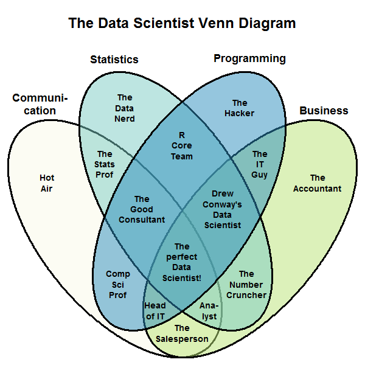
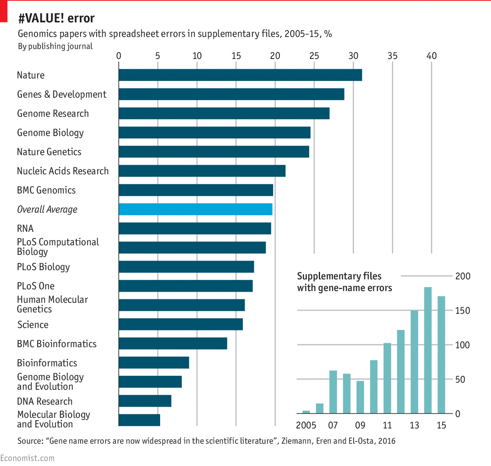
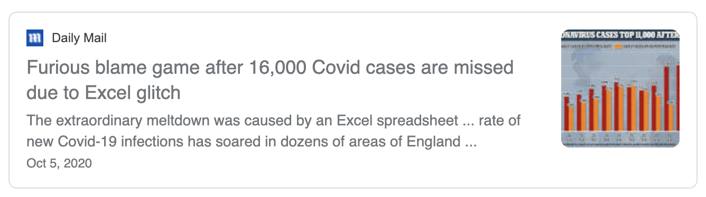
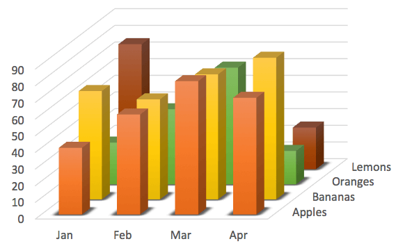
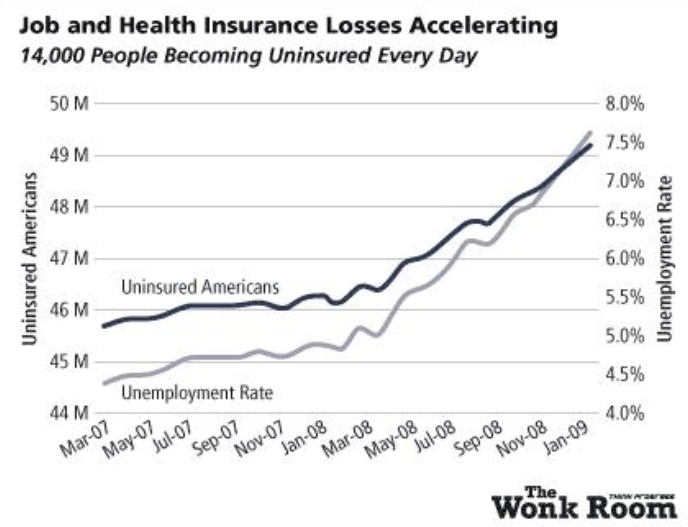
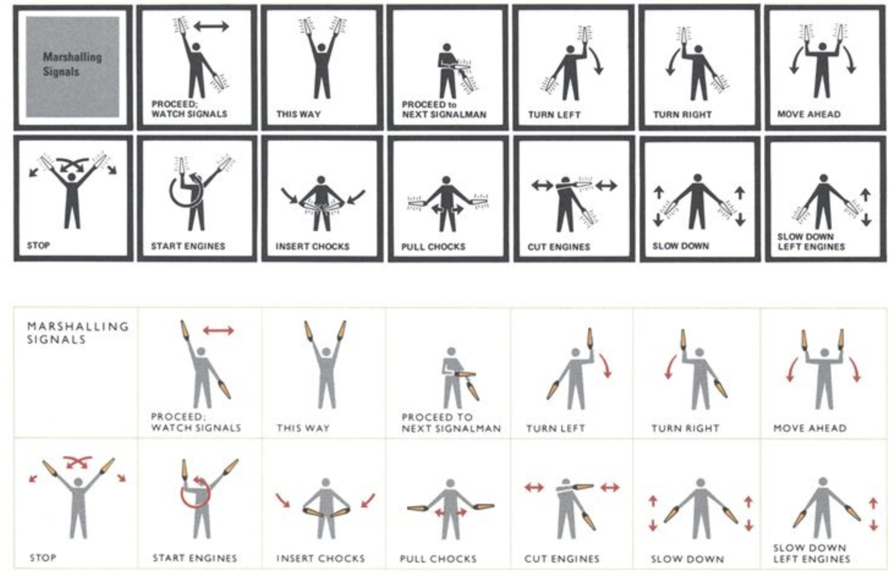
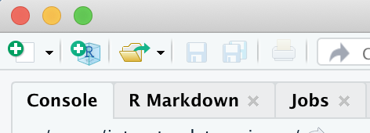

--- 
title: www.datascience.pizza
site: bookdown::bookdown_site
output: bookdown::gitbook
documentclass: book
bibliography: [book.bib, packages.bib]
link-citations: yes
github-repo: databrew/intro-to-data-science
description: "A resource & workbook for the Sewanee DataLab"
favicon: img/favicon.ico
always_allow_html: true
params:
  is_teacher: TRUE
---


```{r setup, include=FALSE, echo = FALSE}
# Basic knitr options
library(knitr)
opts_chunk$set(comment = NA, 
               echo=FALSE,
               warning = FALSE, 
               message = FALSE, 
               error = TRUE, 
               cache = FALSE,
               fig.width = 9.64,
               fig.height = 5.9,
               fig.path = 'figures/')
options(scipen=999)
is_teacher <- params$is_teacher

```

```{r,echo=FALSE,eval=FALSE}
codejs <- readr::read_lines("./js/codefolding.js")
collapsejs <- readr::read_lines("./js/collapse.js")
transitionjs <- readr::read_lines("./js/transition.js")
dropdownjs <- readr::read_lines("./js/dropdown.js")

htmlhead <- c(
  paste('
<script>',
paste(transitionjs, collapse = "\n"),
'</script>
<script>',
paste(collapsejs, collapse = "\n"),
'</script>
<script>',
paste(codejs, collapse = "\n"),
'</script>
<script>',
paste(dropdownjs, collapse = "\n"),
'</script>
<style type="text/css">
.code-folding-btn { margin-bottom: 4px; }
.row { display: flex; }
.collapse { display: none; }
.in { display:block }
.pull-right > .dropdown-menu {
    right: 0;
    left: auto;
}
.open > .dropdown-menu {
    display: block;
}
.dropdown-menu {
    position: absolute;
    top: 100%;
    left: 0;
    z-index: 1000;
    display: none;
    float: left;
    min-width: 160px;
    padding: 5px 0;
    margin: 2px 0 0;
    font-size: 14px;
    text-align: left;
    list-style: none;
    background-color: #fff;
    -webkit-background-clip: padding-box;
    background-clip: padding-box;
    border: 1px solid #ccc;
    border: 1px solid rgba(0,0,0,.15);
    border-radius: 4px;
    -webkit-box-shadow: 0 6px 12px rgba(0,0,0,.175);
    box-shadow: 0 6px 12px rgba(0,0,0,.175);
}
</style>
<script>
$(document).ready(function () {
  window.initializeCodeFolding("show" === "show");
});
</script>
', sep = "\n"),
  paste0('
<script>
document.write(\'<div class="btn-group pull-right" style="position: absolute; top: 20%; right: 2%; z-index: 200"><button type="button" class="btn btn-default btn-xs dropdown-toggle" data-toggle="dropdown" aria-haspopup="true" aria-expanded="true" data-_extension-text-contrast=""><span>Code</span> <span class="caret"></span></button><ul class="dropdown-menu" style="min-width: 50px;"><li><a id="rmd-show-all-code" href="#">Show All Code</a></li><li><a id="rmd-hide-all-code" href="#">Hide All Code</a></li></ul></div>\')
</script>
')
)

readr::write_lines(htmlhead, path = "header.html")
```

```{r,eval=TRUE,echo=FALSE}
# Define function for showing teacher content
teacher_content <- function(content = ''){
  cat(paste0('<p style="color:#3f0000; background-color:#f5f5dc"> <b>Instructor tip!</b><br>', content, '</p>'))
}
```

# Welcome!


## What this is, and what it isn't {-}

This is not a textbook or an encyclopedia. This is not a reference manual. It is not exhaustive or comprehensive. We barely mention statistical tests at all. There is almost no theory. In fact, this curriculum is biased, non-representative, and incomplete -- *by design.* 

**So what is this?** This guide is an *accelerator,* an *incubator* designed to guide you along the most direct path from your first line of code to becoming a capable data scientist. Our goal is to help you through the most dangerous period in your data science education: your very first steps. The first three weeks. That is when 99% percent of people give up on learning to code.  

But it doesn't need to be this way. We made this book to reach more than just the 1%.  

We have based our approach on three core premises:

**Premise 1: We learn best by doing.** Our goal is to get you *doing* data science. We will keep theory and detail to a minimum. We will give you the absolute basics, then offer you exercises and puzzles that motivate you to learn the rest. Then, once you've been *doing* data science for a bit, you soon begin *thinking* like a data scientist. By that, we mean tackling ambiguous problems with persistence, independence, and creative problem solving.   

**Premise 2: We learn best with purpose.** Once you gain comfort with the basic skills, you will be able to start working on real data, for real projects, with real impact. You will start to *care about what you are coding*. And that is when the learning curve *skyrockets* -- because you are motivated, and because you are learning *reactively*, instead of preemptively. Our goal is to get you to the point of take-off as quickly as possible.  

**Premise 3: A simple toolbox is all you need to build a house.** Once you become comfortable with a few basic coding tools, you can build pretty much anything. The toolbox doesn't need to be that big; if you know how to use your tools well, and if you have enough building supplies (i.e., data), the possibilities are limitless.  


**One more thing that this is not:** This is not a fancy interactive tutorial with bells or whistles. We purposefully designed this to be simple and "analog". You will not be typing your code into this website and getting feedback from a robot, or setting up an account to track your progress, or getting pretty merit badges or points when you complete each module.  

Instead, you will be doing your work on your *own machine*, working with *real folders and files*, downloading data and moving it around, etc. -- all the things you will be doing as a real data scientist in the real world.


## Who this is for {-}

This curriculum covers everything from the absolute basics of writing code in `R` to machine learning. As such, it is designed to be useful to everyone in some way. But the target audience for these tutorials is the *rookie*: the student who *wants* to work with data but has *zero* formal training in programming, computer science, or statistics.  

This curriculum was originally developed for the [**DataLab**](https://new.sewanee.edu/sewanee-datalab/) at Sewanee: The University of the South, TN, USA.


## What you will learn {-}

- The **Core theory** unit establishes the conceptual foundations and motivations for this work: what data science is, why it matters, and ethical issues surrounding it: the good, the bad, and the ugly. Don't slog through this all at once. Sprinkle it in here and there. The most important thing, at first, is to start writing code.


The next several units comprise a *core* curriculum for tackling data science problems:  

- The **Getting started** unit teaches you how to use `R` (in `RStudio`). Here you will add the first and most important tools to your toolbox: working with variables, vectors, dataframes, scripts, and file directories.  

- The **Basic `R` workflow** unit teaches you how to bring in your own data and work with it in `R`. You will learn how to produce beautiful plots and how to reorganize, filter, and summarize your datasets. You will also learn how to conduct basic statistics, from exploratory data analyses (e.g., producing and comparing distributions) to significance testing. 

For these first two units, we encourage you to take on these modules one at a time, in the exact order they are presented: we put a lot of thought into what we included in these modules (and what we did not).

- The **Review exercises** unit provides various puzzles that allow you to apply the basic `R` skills from the previous unit to fun questions and scenarios. In each of these exercises, questions are arranged in increasing order of difficulty, so that beginners will not feel stuck right out of the gate, nor will experienced coders become bored. This is where you really begin to cut your teeth on real-world data puzzles: figuring out how to use the `R` tools in your toolbag to tackle an ambiguous problem and deliver an excellent data product.  

- The **Reproducible research** unit equips you with basic tools needed for truly reproducible data science: documenting your research and code with `Markdown`; weaving together your code and your reporting with `RMarkdown`; 
allowing users to explore the data themselves with an interactive `Shiny` dashboard or web app; and sharing your code and tracking versions of your code using `Git`.  

- The **Presenting research** unit teaches you how to produce well-organized and well-written research reports, and how to deliver compelling presentations about your work.  

- The final unit, **Deep `R`**, introduces you to a variety of more involved `R` tools and advanced data science techniques, from writing custom functions and `for` loops to producing interactive maps, iterative simulations, and machine learning algorithms. These modules are designed to be used *as needed*, in whatever order is most helpful for you in your own work. 


## Contributors {-}

**Eric Keen** is a data scientist, marine ecologist, and educator. He is the Science Co-director at [BCwhales](www.bcwhales.org), a research biologist at [Marecotel](www.marecotel.org), a data scientist at [Hyfe](www.hyfe.ai), and a professor of Environmental Studies at Sewanee: the University of the South. He earned his BA at Sewanee (2008) and his PhD at Scripps Institution of Oceanography (2017). His [research](https://scholar.google.com/citations?hl=en&user=SrLDYrEAAAAJ&view_op=list_works&sortby=pubdate) focuses on the ecology and conservation of whales in developing coastal habitats. He is passionate about whales, conservation, teaching, small-scale farming, running, and bicycles. And pizza.  

**Joe Brew** is a data scientist, epidemiologist, and economist. He has worked with the Florida Department of Health (USA), the Chicago Department of Public Health (USA), the Barcelona Public Health Agency (Spain), the Tigray Regional Health Bureau (Ethiopia) and the Manhica Health Research Center (Mozambique). He is a co-founder of [Hyfe](www.hyfe.ai) and [DataBrew](www.databrew.cc). His research focuses on the economics of malaria and its elimination. He earned his BA at Sewanee: The University of the South (2008), an MA at the Institut Catholique de Paris (2009) and an MPH at the Kobenhavns Universitet (2013). He is passionate about international development, infectious disease surveillance, teaching, running, and pizza.  

**Ben Brew** is a data scientist, economist, and health sciences researcher. In addition to co-founding [DataBrew](www.databrew.cc), he has spent most of the last few years working with SickKids Hospital in Ontario on machine learning applications for cancer genomics. He earned his BA at Sewanee: The University of the South (2012), and a Master's in Mathematical Models for Economics from the Paris School of Economics (Paris I) (2015). He is passionate about econometrics, applied machine learning, and cycling.

**Matthew Rudd** is a mathematician fascinated by statistical modeling, data analysis, and the tensions between theory, practice, and interpretability in data science. He has been using `R` and `RStudio` for years in his teaching and research as a professor at Sewanee, has experience with software development and web applications, and enjoys learning new tools and technologies. He welcomes opportunities to apply his skills and experience to practical problems.


&nbsp;  

```{r, results = 'asis', eval = ifelse(exists('is_teacher'),is_teacher,TRUE),echo=FALSE}
source('teacher_tip.R')

tip <- 'Here are a few general strategies that should work with nearly every module in this curriculum:  <br><br>  **(1)** Use the module as your **lecture notes**. Read them on your own screen, or from the printed version of this book, as you manually type each command into a blank `Rstudio` window on the screen you are sharing with the students. The R script you make as you teach becomes a record of your lecture notes. <br><br> **(2)** Ask that the **students follow along** with you, writing the code into `Rstudio` themselves on their own computers. <br><br> **(3)** Once you introduce the concept of `R` scripts in a few modules, begin each class by **opening up a new script** and saving it with a simple name that reflects the module. Alternatively, ask students to do this before class begins, so that you can rock and roll immediately. <br><br> **(4)** We recommend setting up a **Slack** channel for your class. Have Slack open during instruction, so that students can copy and paste errors into a public channel. This will make it easy to address questions, and it will open up the possibility that students will help those who are stuck on their own. <br><br> **(5)** Plan for *(i)* **very little time** spent on *teaching* a module, and *(ii)* a **large amount of time** reserved for working through the exercises at the end of each module. When you transition from teaching to introducing the exercises, share the link to the module so that students can reference the module as they work.  <br><br> **(6)** If there is time, once students have the chance to tackle the exercises on their own, **work through the puzzles together** as a group. '

teacher_tip(tip)
```


```{r,include=TRUE,eval=FALSE}
library(dplyr)
library(Hmisc)
library(knitr)
files <- dir()
files <- files[grepl('.Rmd', files)]
files <- files[files != 'index.Rmd']
files <- gsub('.Rmd', '', files)
files <- Hmisc::capitalize(files)
files <- gsub('_', ' ', files)
files_split <- strsplit(files, split = '-')
chapter_numbers <- unlist(lapply(files_split, function(x){x[1]}))
chapter_names <- unlist(lapply(files_split, function(x){x[2]}))
toc <-
  dplyr::tibble(
    Number = chapter_numbers,
    Name = chapter_names
  )
toc <- toc[which(toc$Number != "Intro"),]
knitr::kable(toc)
```

```{r include=FALSE}
# automatically create a bib database for R packages
knitr::write_bib(c(
  .packages(), 'bookdown', 'knitr', 'rmarkdown'
), 'packages.bib')
```

<!--chapter:end:index.Rmd-->

# (PART) Core theory {-}

#  What is data science?  

TEST. The definition of data science is a moving target. Thirty years ago (1990), 'data science' was an uncommon term that essentially just meant statistics. Twenty years ago (2000), the phrase mainly referred to querying SQL databases. Fifteen years ago (2005), it was "dashboards" and "predictive analytics". Ten years ago (2010), it was 'big data' and 'data mining'. Nowadays folks think of A.I. and machine learning. 

In 10 years? Who knows. 

**So what is it?** There are many definitions out there. Search the internet for the answer and you will find complex diagrams, such as this one, suggesting that a data scientist is someone who has the right blend of programming skills, statistical knowledge, communication ability, and business acumen:

<center>

</center>

&nbsp;  

... or here is a more popular, simpler version of the same diagram:  

&nbsp;  

<center>

</center>

Some argue that data science is simply [an extension of statistics](https://www.statisticsviews.com/article/nate-silver-what-i-need-from-statisticians/). You will also find attempts to distinguish between categories of data science, or to draw lines around what data science is and what it is not. A classic example is the bizarre delineation corporations draw between a data *scientist* and a data *analyst*:

<center>

</center>

&nbsp;
... or ...
&nbsp;

<center>

</center>

&nbsp;

**Our take?** Those definitions are useful, interesting, and to some degree accurate. _But_ data science is too new, and too fluid, to be fixed into some static definition. So, to keep our definition accurate, we'll keep it broad:  

**Data science is simply "doing science with data".**  And for our purposes, the only difference between our definition and the definition of science itself is not in the word "data" -- since nowadays all scientists are, to some degree, "data scientists" -- but rather in the word "doing". Data science is about _doing_ stuff with data -- about *making a difference with data.* And that's what this course is going to be about. _DOING_.  

But we'll go one step outward. Data science is not just the combination of academic disciplines like stats and business strategy. Good data science also needs to involve (1) **domain knowledge** (i.e., familiarity with the problem being solved), (2) **a bias to real-world effects** rather than theoretical frameworks, and (3) **a desire to work in the real world**. To do so, data scientists generally need to be effective communicators and have an iterative mentality: they try something, evaluate its effects, try something else, and repeat. 

Our definition is very broad, we know. We consider the "analyst" working in business intelligence to be a data scientist; and so too do we think that a data scientist could be an engineer who is processing large amounts of data to extract basic trends. Again, data scientists are those who _do science with data_. That's a lot of people.  

In our experience, the best data scientists aren't simply the best programmers or best statisticians; the best ones are the people who consider themselves to be *something else first.* They are the journalists, artists, epidemiologists, psychologists, historians, environmentalists, sports analysts, and political commentators who *also* know how to work with data. In other words, the best data scientists are the ones already out there, on the ground, already embedded in the system they want to improve, positioned perfectly to get the right data, to ask the right questions, and to actually *do* something with insights from the data. Again, data science is about *DOING*.  

To summarize, data science is about applying data to problems. It is impact-driven, transdisciplinary, and suited to well-rounded, multi-dimensional professionals.   


## What is the data life cycle?   {-}

There is a misperception about data science work that it is largely or even exclusively interpretative: that is, a data scientist looks at a big set of data and builds a fancy statistical model, then a light bulb goes off in her head, she has some insight, and then acts on that insight. 

The reality is data science is much more than that. And most of data science is a combination of *(a)* getting data ready for analysis, *(b)* hypothesis testing, and *(c)* figuring out what to do with the results of *a* and *b*. That is, data science in practice is generally not some artesenal genius staring at a table of numbers until "insight" magically occurs. Rather, it is a lot of work, a lot of structured theories which can be confirmed or falsified, and a lot of *imagination* applied to the task of implementation. 

In other words, data goes through a whole _lifecycle_ of which analysis is just a small part.  

What is the data lifecycle? Here's how we conceptualize it:

**0. Observation**  
**1. Problem identification & definition**  
**2. Question formation**  
**3. Hypothesis generation**  
**4. Data collection**  
**5. Data processing**  

This step is usually the most intensive. Half the battle is wrangling raw data and making it ready for a visualization or a hypothesis test. Note that this step has *nothing to do with statistical tests* -- data science is not the same as statistics!  

**6. Model building / hypothesis testing**  

Note that this step is usually where the scientific method stops. In science, once you analyze your test, you interpret your results and loop back to the beginning of the data cycle. But in *applied data science*, there are a few more steps:  

**7. Operationalization:**  This means determining how best to incorporate the data insights into operations.  

**8. Communication / dissemination**  

**9. Action:**  This means actually implementing the change.  

**10. Observation:**  back to the beginning of the cycle.

Again, the above should look a lot like the scientific method. The main differences are (a) "data processing", which in reality takes up most of any data scientist's time, (b) the bias towards action, and (c) the iterative / looped nature of the lifecycle.  


## Data science 'in the wild'   {-}

Enough theory. What do data scientists actually do? Again, you can search for an answer online and find complex diagrams like this one:  

&nbsp;

<center>

</center>

&nbsp;

But to capture every problem that data scientists are working on, this diagram would have to be even more convoluted and complex. 
Data scientists are working on a *ton* of problems. 

The most stereotypical data science problems tend to involve advertising, social media, and corporate profiteering:  

- Targeted advertising  
- Social media feed optimization (getting you to scroll just a little further)
- Facial recognition  (automated tagging at Facebook)
- Voice recognition ('Hey, Siri!', 'Alexa!')
- Making video games more fun / addictive  
- Dynamic airline pricing  
- Search autocomplete  
- Autocorrect  
- Virtual assistants  

These are the kinds of problems that the best-paid data scientists in the world are working to solve. Right now there are thousands of programmers in Mountain View, Cupertino, and elsewhere in the Bay Area (and New York, and London, and Beijing) trying to solve the problem of you not spending enough time on social media.  

Maybe you care about these problems, maybe you don't. Maybe they make you indignant or angry. Maybe you find it *problematic* that these things are even considered problems at all. As far as we're concerned, it is deeply unfortunate that our highest-paid data scientists are focusing on problems like these. 

But take heart -- there are plenty of other data scientists out there working on *actual* problems that are actually *important*:

- Identifying disease through imagery    
- Automating identification of credit card fraud    
- Filtering spam with malware or viruses.  
- Preventive maintenance at nuclear facilities   
- Improving chemotherapy dosage   
- Increasing voter turnout  
- Improve matchmaking systems (liver transplants, love, etc.)    
- Measuring deforestation with satellite imagery.  
- Efficient and equitable vaccine distribution  
- Identifying tax evaders    
- Predictive policing    
- Storm surge forecasting  
- Identifying and removing child pornography from the internet  
- Surveilling emergency rooms to predict disease outbreaks   
- Detecting fake news    
- Increasing accountability and legitimacy of carbon markets  
- Quantifying the likelihood of recidivism to prevent over-incarceration  

The list goes on. The number of worthwhile problems waiting for data scientists is limitless, there are data scientists working on problems like these right now, and the demand for civic-minded data scientists is immense.  

All of this matters for a lot of reasons. The first is that data science is not always a good thing; it can be weaponized by corporations and governments in spite of the public interest, and for that we need to be very careful about how we use it and how we teach it. 

But the second reason this matters is that data science can be an *equally powerful force for social good*. We can use data science to make progress on the most urgent and injurious social and environmental problems of our time.  

However -- and this is the third reason all this matters -- data science can only achieve social good *if* we recruit students to its ranks who are values-driven, civic-minded, and committed to using data science for good. 

Fourth, and finally, this matters because the Facebook data scientists are using the exact same principles and basic tools as the non-profit data scientists. At their core, the foundational skillsets are the same. 

And that's what this book is all about.


<!--chapter:end:02a-principles.Rmd-->

# The reproducibility crisis  

## The crisis  {-}  

There is a crisis in the sciences: the reproducibility crisis. It is also known as the replication crisis. This refers to the fact that many scientific studies have been impossible to reproduce, calling into question the validity of those studies' findings. 

This crisis began in the mid-2000's, when psychologists realized they could not reproduce most of their colleagues' results. They tried to repeat the experiments, following the methods step-by-step, but failed to get the same results. This was enormously unsettling for psychologists, and it cast major doubts upon the validity of psychological theory.  

The realization that much of published research is not actually reproducible soon spread to medical research... 

&nbsp;  


&nbsp;  

...then it sprung up in marketing...

&nbsp;  


&nbsp;  

...and economics...  

&nbsp;  


&nbsp;  

...and the sports sciences...

&nbsp;  


&nbsp;  

...and the life sciences too:  

<iframe width="560" height="315" src="https://www.youtube.com/embed/FpCrY7x5nEE" title="YouTube video player" frameborder="0" allow="accelerometer; autoplay; clipboard-write; encrypted-media; gyroscope; picture-in-picture" allowfullscreen></iframe>

&nbsp;  

For a complete history of the crisis, check out this article from [Wikipedia](https://en.wikipedia.org/wiki/Replication_crisis). 

**Why is this happening?** There are many reasons. Many studies, particularly those in psychology and the social sciences, involve small cohorts of participants. When sample sizes are low, results may not be representative of underlying truths. 

On rare occasions it is intentional and fraudulent: scientists face pressure to publish interesting results, so much so that they might fabricate or filter their data to make their results significant. 

But the most common causes of reproducibility failure are, by far, (1) **poorly documented steps in data processing** -- if you don't know how exactly the authors of a paper formatted their raw data to prepare them for analysis, you simply can't reproduce the analysis -- and (2) simple, **honest mistakes**, such as typos in spreadsheets.  

Consider this summary of the reproducibility crisis from *The Economist*. A scary percentage of genomics studies have simple spreadhseet errors:  

&nbsp;  


&nbsp;  

**This is a big deal:** if a significant part of science is _wrong_, then what do we know? How can we be sure what we know is right? How can we build off of previous research? How can we distinguish valid science from the rest? If science can't be trusted, what value does it have for society? What kind of *damage* is it doing to society?  

**This crisis is ongoing**, and it is impacting our handling of the COVID-19 pandemic. On October 5, 2020, the world learned that 16,000 COVID-19 cases disappeared from the UK's public health database due to a simple glitch in *Microsoft Excel*.  

&nbsp;  



&nbsp;  


That event demonstrated that the reproducibility crisis is not just an academic concern. It can have serious and potentially deadly consequences for the public.  

But there are **silly examples** of the replication crisis, too. Perhaps our favorite is this: in August 2021, when we Google'd "reproducibility crisis", one of the top search results is this video from *Science*, the world's most prestigious scientific journal:  

<center>

</center>

&nbsp;  

But when we click on this link, here's what we see:  

&nbsp;  

<center>

</center>

## The 'reproducibility' movement  {-} 

Because of this crisis, there has emerged a much needed move to make all science "reproducible". This means making sure that someone else can copy what you did, and get the same results. This is important for identifying scientific fraud, of course, but also for helping us to overcome human bias, mistakes, wishful thinking, etc. Reproducibility is not just a "nice-to-have"; in modern science (and data science), it's a "must".

**Good data science must be reproducible.** The idea is that work done by scientist A is "reproducible" by scientist B. In other words, if the findings of the research are of any generalizable value, then the results of two scientists working on the same problem should be identical (or very high in agreement).  In practice, this means using data and code in a structured, well-documented, accessible, clear way, and ensuring that others can do the same.  

Reproducible research also means using tools that others can easily use, and methods that others can easily copy. Programming languages like `R` and `Python` are ideal for this. 

Reproducible research matters for lots of reasons:

1. Because making your work reproducible means that _you_ will have less problems returning to that work at a later time.  
2. Because making your work reproducible means that _others_ can collaborate with you, help you, error-check you, and build on your work.  
3. Because making your work reproducible means you are fighting the plague of irreproducible results which have characterized the replication crisis.  

Making your work reproducible is going to be a bit more work, but it's not optional. And there are tools and best practices in place to make it as painless as possible. Basically, reproducible research involves the following:

- Using code to format and manage your data instead of spreadsheet software such as *Excel* or *GoogleSheets*, since those products will not keep a step-by-step record of each thing that you do. When you code, each command line is both an action you take to process your data *and* a record of what that action is.  

- Coding with free, open-source tools, such as `R`.  

- For any specific niche task in your analysis, such as processing a batch of images, using other open source tools (e.g., `ImageJ`) that can be used free-of-charge by anyone with an internet connection anywhere.   

- Documenting *everything* you do with the data, by commenting your code thoroughly and by creating "Wiki" pages for your projects.  

- Making your code open source and freely available online.   

- Making your data open source (while protecting privacy and confidentiality of participants).   

- Providing tools, such as `Shiny` in `R`, that allow others to explore your data themselves, rather than trusting your own narratives about the data.

- Using tools for generating reports, such as `Rmarkdown`, that remove the 'middle-man' and avoid potential typo's and fabrications.  

- Collaborating openly with others.    

You will be learning how to do all of these things in this course. We are going to focus on _reproducible research_, _literate programming_, _documentation_, and other components of data science (and research in general) which ensure that (a) our methods and findings can be easily sanity-tested by others, and (b) we set ourselves and our projects' up for future collaborations, hand-offs, and expansion.


## Why `R`? {-}

This course is largely about learning to _do_, and will largely use `R`. `R` is not the only tool in the data scientists' toolbox (there are many), but it's a good one, is extremely popular, there is almost nothing you cannot do with it, it can be applied to many fields, and -- most importantly -- it is a free, open-source tool with an active open-source coding community. The millions of `R` users worldwide emulate the spirit of reproducible research we are trying to advocate for here.    


### A final thought {-}

A research article about *results* is advertising, not scholarship.  

Scholarship is an article with transparent, reproducible methods.   


<!--chapter:end:02b-reproducibiility.Rmd-->

# Data ethics


## A few principles {-} 

This orientation to the principles of data ethics is not going to be adequate or sufficient. We just need to provide enough context for you (1) to appreciate the limitless complexity and uncertainty of many ethical issues in data science, and (2) to start exploring the complex ethical scenarios below on your own or in dialogue with others.  

In most frameworks for data ethics, three foundational principles are used to help us think about whether certain research actions are ethical. Those three principles are:  

**1. Respect** for persons and their autonomy: participation must be based upon informed consent, and privacy must be honored at all times.  Immature or incapacitated persons must be protected as they mature or heal. 

**2. Beneficence:** in our work with data, potential risks are minimized while potential benefits are maximized.  

**3. Justice:** Benefits and risks are distributed equally across groups of people. A classic way of asking whether something is 'just' is asking using John Rawls' concept of the **'veil of ignorance'**: pretend you have no information at all about your circumstances or your place in the social order: You don't know your place of birth, year of birth, sex, skin color, language, religion, immigration status, health conditions, or anything else. In other words, you have no information whatsoever that might introduce bias into the way you think about the world. Free of circumstantial bias, what arrangements would you choose to put in place to maximize fairness and fortune for all, and to minimize the chances that you would get screwed by the system?  


These principles can guide us as we navigate ethically ambiguous scenarios. When we ask whether something is ethical, we are asking whether all of these principles are upheld. We could also be asking whether the violation of one of these principles might be justified by upholding another in an impactful way. 

The question, 'Is something ethical?' is usually not easy to answer, particularly when it comes to the use of data in tackling social problems. It is important to note that reasonable people regularly disagree on these ideas; that is why we have committees and drawn-out processes for obtaining permission to use data in research and commerce.  

**So why do these principles matter?** Because without them, we would not be able to have conversations about the ethics of difficult situations. We need articulated principles that we can point to and debate together. Principles like these allow you to have an account for why you feel the way you do about a certain issue. Without that account, we can't learn from each other's perspectives.    

Note also that these principles were designed with **individual human subjects** in mind. It is an open question of active debate how exactly these principles can be applied to **communities of individuals** all at once -- what exactly does it mean for a group to consent to something? Does every single individual need to consent? The majority? -- or how they translate to our treatment of **non-human communities**: animals, plants, and places. 


Let's stop there and explore some concrete scenarios. For a better orientation to ethical precepts underlying issues of data ethics, [this chapter by Shannon Vallor](https://www.scu.edu/media/ethics-center/technology-ethics/IntroToDataEthics.pdf) is the best open-source resource that we have been able to find.  Many of the case studies and scenarios presented below are adapted from that chapter.  

## Warm up scenarios {-}  

Practice applying the above principles to these scenario questions. For each scenario, describe your **opinion vector** (the *direction* of your opinion -- yes or no -- and the *strength* of your opinion).  

**Location tracking**  
Is it ethical for Google to track and store your location information in order to monitor traffic and operating hours of local businesses? Such traffic information is known to help direct emergency service vehicles along the safest and fastest route.

**Targeted advertising**  
Is it ethical for internet search engines to tailor advertisements according to your search history?  

**Dynamic pricing**  
Is it ethical for airfare search engines to adjust ticket prices according to your recent search history?  

**Social media scrolling**  
Is it ethical for Instagram to count how many milliseconds you spend on each post, then use that info to develop a strategy for getting you to spend more time on its app?

**Controversial content**  
You are a data scientist at Facebook. Based on your analyses of user data, you have discovered that when you show readers sensational or hyperbolic content, such as someone ranting that a new vaccine is an attempt at government-subsidized mind control, the readers stay on Facebook longer and scroll through more contet. Since that translates to profits, is it OK for your team to increase the amount of sensational content in users' feeds?


## Case studies {-}

Use these case studies to reflect upon and discuss the ambiguity, complexity, and dangers of data ethics issues.  

### The Facebook 'Social Contagion' Study {-}

In 2014, data scientists from Facebook published an [article](https://www.pnas.org/content/111/24/8788) in a prestigious academic journal. In this article, they demonstrated that the emotions and moods of users could be manipulated by toggling the amount of positive or negative content in their feeds. They found that these emotional effects would then be passed to other users in the social network; in other words, emotions and moods could be seeded and were 'contagious'. To carry out this research, they manipulated the Facebook feeds of 689,000 users. 

&nbsp;  
<center>
{width=70%}
</center>
&nbsp;  

Facebook did not receive specific consent for this study from its users. Instead, the company argued that the purpose of the study was consistent with the user agreement already in place: to give Facebook knowledge it needs to provide users with a positive experience on the platform.  

**Discuss:**  

1. In what ways, specifically, did Facebook violate basic principles of data ethics with this study? Enumerate each violation individually.  

2. Can a convincing argument be made that justifies this study?  What are the strongest arguments in its favor?  


3. What are some things that Facebook could have done differently to handle this situation more ethically?  


4. Who exactly should be held morally accountable for any harms caused by this study? The data scientists employed to analyze and publish the data? Mark Zuckerberg? All Facebook employees? Facebook stock holders? Are Facebook users accountable at all?   


### Machine bias: Beauty contests & recidivism {-}

Machine learning (ML) algorithms are developed by 'training' models on known datasets. The models are then used to predict values in other datasets. For example, if you label cars in a batch of photos then use them to train a ML model on that labeled dataset, you can then use that model to identify cars in thousands of other photos.  

Sounds neat, but this means that ML models are only as good as the data they are trained upon, and often those training datasets are created by human labelers who carry unkown or unspoken biases. A classic example is the [Beauty.AI](https://www.theguardian.com/technology/2016/sep/08/artificial-intelligence-beauty-contest-doesnt-like-black-people) beauty contest that occurred in 2016. A ML algorithm was trained on a large set of human-labeled photos of women, then women around the world were invited to submit selfies in a global beauty contest. A key advertising hook for the contest was that the 'robot jury' -- the ML algorithm -- would be fully impartial and fair. But the results revealed that the ML model was racist: 75% of the 6,000 contestants were white, but 98% of the 44 winners were white. How did this happen? The people who labeled the training set of photos carried implicit bias.    

&nbsp;  
<center>
{width=70%}
</center>
&nbsp;  

Debacles like this can have much more serious consequences. [Court systems use ML models](https://www.propublica.org/article/machine-bias-risk-assessments-in-criminal-sentencing) to estimate the risks that a convicted criminal will commit more crimes once they are released from prison. But retrospective studies have shown that these models consistently and incorrectly label black prisoners as more dangerous and more likely to return to prison at a later date. Most of the risk assessments being used today have not received adequate validation, even though they are spitting out predictions that can destroy lives, families, and communities.   

&nbsp;  
<center>
{width=70%}
</center>
&nbsp;  


**Discuss:**  

1. How might bias have entered the training datasets for these ML models, if the people labeling the data did not deliberately intend to exhibit prejudice against African Americans? 


2. The ML models used to predict recidivism are imperfect and inherently prejudiced, but it is not clear whether it would be better to leave decisions of sentencing, bail amounts, and prisoner support services to individual humans in the court and penal systems. Would it be better to stop all use of ML evaluations, or should they be kept in place until better models are developed?  

3. Returning to the beauty contest debacle. The attraction of a 'robot jury' compelled people to seek out a single, simplistic definition of beauty, and to place all contestants on the same spectrum of beauty scores. Other than the racial bias baked into their model, what other problems is there with this endeavor? Articulate and enumerate as many as you can.  What do those problems tell you about other ethical and humanistic dangers inherent to data science?  


### Web-scraping OKCupid {-}

In 2016, Danish researchers used new web scraping and text mining software to inventory the user profiles of 60,000 users on the online dating site [OkCupid](https://fortune.com/2016/05/18/okcupid-data-research/). Their goal was to use this dataset to test for correlations between 'cognitive ability' and sexual orientation, religious affinity, and other personality traits. They chose these user profiles because they were publicly available online to anyone who wanted to sign up for a free account with OKCupid.  

When they published their paper, they included a spreadsheet of the 60,000 user profiles in the supplementary material for their article. They had removed the first and last names of the users, but kept everything else, including username, location, sexual orientation, religious orientation, sexual habits, relationship fidelity, drug use history, political views, and more. 

The backlash was immediate. When asked why they did not attempt to deidentify or anonymize the data any further, the researchers responded that the data were already public. In the paper itself, the authors wrote: "Some may object to the ethics of gathering and releasing this data ... However, all the data found in the dataset are or were already publicly available, so releasing this dataset merely represents it in a more useful form."  


&nbsp;  
<center>
{width=80%}
</center>
&nbsp; 

**Discuss:**  

1. What do you make of the authors' argument, that the data were already public, posted freely by the users themselves, so how can this be an issue of privacy or consent? 

2. If you disagree with the authors' argument, explain how the users might reasonably object to the authors' actions. 

3. What kind of risks did the authors impose upon the users of OKCupid? Are any of those risks new, or were they all present when the users decided to make a profile that could have been accessed by any other user?  

4. Does it make an ethical difference that the authors accessed publicly available data in a novel way (web-scraping software) and to a much greater extent (harvesting 60,000 profiles at once) than individual users are typically able to do?  

5. Does the software developer of the web-scraping tool bear any responsibility for this scandal? Does he have any ethical obligations regarding how his tool is used, and by whom?  


## More scenarios {-} 


**Airport screening**  
A data scientist has come up with a model that prioritizes security screening at airports according to various passenger characteristics. If using 'place of origin' as a predictor in this model improves the model's predictive performance at identifying passengers who are security threats, is it ethical to include that variable in the model and screen certain passengers disproportionately?


**Supporting struggling college students**  
Your college has developed a model that predicts dropouts. It identifies students at high-risk of dropping out and alerts offices that can direct additional support and resources to these students. Your college has found that this model performs better when it includes the student's place of origin, sex, and race as predictors. Is it ethical to implement this model and divert resources accordingly?  


**Robot cashiers**  
Self-checkout stations in grocery stores are convenient, but they take jobs away from workers who may not have many other employable skill-sets. When you are checking out, is it more ethical to use the checkout aisles with human cashiers, even if the line is longer and going more slowly?  


**Electric cars**  
Cars running on fossil fuels are bad for the environment, but at least they can be serviced by car mechanics who don't necessarily need a college degree.   

Electric cars reduce carbon emissions, but they are replacing car mechanics with computer scientists and softwar engineers, all of which require extensive undergradate and post-graduate education.  Are electric cars a net social good?  


**Smartphone app for monitoring cough**  
A tech start-up has developed an app that can track the prevalence of cough in a network of smartphones. Cough is an important indicator of disease, and cough also helps to spread certain diseases more quickly, such as TB and COVID-19. This app has great potential to help public health officers in the fight against some of the deadliest respiratory diseases. The app works thanks to sophisticated machine learning algorithm for detecting coughs within continuous recordings. That algorithm is currently private and propriety. Do you agree that this cough monitoring app is a good idea, and that public health officials should promote its use?  


**Automated suicide prevention system**  
A large internet search engine has developed a model that can predict whether someone is likely to inflict self-harm or attempt suicide based upon their recent search history. This model is 75% accurate. This company would like to set up an automatic emergency alert system, in which local social service providers are notified about at-risk users in their area. They want to automatically enroll users in this service. Is this an ethical feature to add to their product?  


**Malaria medicine distribution**  
Your company is trying to distribute a new malaria medicine in a remote region of Africa without primary care clinics, where tens of thousands people die from malaria each year. This medicine is highly effective, but it is also known to cause birth complications. You need to ensure that it is not administered to pregnant women. Your team's plan is to go door to door and distribute the medicine to women who say they aren't pregnant. 

But in this region, cultural attitudes to pregnancy, and the notion of sharing your pregnancy status with a stranger, are very sensitive. Daughters and wives may not feel safe to answer such questions truthfully. 

Your team has to choose between (1) taking women's responses at their word, (2) avoiding the pregnancy issue by only distributing it to men, (3) not distributing the medicine at all, (4) some as-yet-unknown solution. What do you do?


**User accountability**  
Let's say that you have disagreed with one or more of the claims about social media in the 'Warm-Up Scenarios' section above. Is it ethical for you to continue to use Google, Instagram, or Facebook? 


<!--chapter:end:02c-data-ethics.Rmd-->

# Visualizing data {#dataviz}

This course will focus heavily upon visualizing data in plots, maps, and dashboards. If there is anything you take from this course, it will be this: you will be able to take data and make some pretty pictures. *And that's not trivial*.   

Why? Because **humans are wired to process information through *pictures*.** We can translate images into meaning with amazing speed.  

## The value of *data viz* {-}  

This screenshot, from David McCandless's [TED talk](https://www.youtube.com/watch?v=5Zg-C8AAIGg) about the beauty of data visualization, depicts how quickly each of our senses can process information.  

&nbsp;  
<center>
{width=70%}
</center>
&nbsp;  

**This plot's punchline:** When we process data with our eyes -- with *pictures* -- we can take in a lot of information all at once.  

**Let's try this out with an example.** Below this paragraph is another paragraph describing a painting. Try this: scroll down quickly, look at this paragraph for just *one second*, then keep scrolling until it is out of view.  

Go!  

**One-second paragraph:**  

*Fog rises from the evergreen forest of a distance mountain range. A whitewater creek cascades down a streambed with large, rounded boulders, arriving at a broad flatwater pool where ducks are milling. There is one group of four and another group of two. On the shore near the ducks, a wooden dinghy is tied up to a small dock with eight pilings. The dock lead to a path through more round peddles and tall grass, past a chair and a fire ring, and continues uphill to a small cabin. The evening sun and sparse fairweather clouds are reflected in the cabin's large, multi-paned windows under the small front porch. A cobblestone chimney on the side of the cabin has a whisp of smoke rising from it. The steep roof implies that this cabin is designed to withstand heavy snow. Tall evergreens tower over the diminutive cabin; the cabin seems to be placed up against a forested hillside. There are only a few deciduous trees in view, and their leaf colors -- combined with the lack of snow in the distant mountains -- imply that the time of year is early fall.*  

**End of paragraph**.  

OK. Now try to answer these simple questions:   

- What was this a painting of, in general? Can you describe the scene?     

- What details do you recall?  

OK. Try this next: the actual painting is at the very end of this chapter. Scroll down to it quickly, look at this painting for just *one second*, then scroll back up to this spot in the module.  

Ready? Go!  

&nbsp;  

*< Return to this line! >*  


Now try to answer those same questions above. What was this a painting of? Did you catch any more details? Was there anything in the water? Was there smoke coming out of the chimney? What time of day was it?  

Which type of visual information was easier for you to process quickly? Text, or a picture?  

Think about the profound *differences* in these two forms of visual communication:  

When we read text, we are working outward, from individual details to the big picture: we process each individual word, understand their individual meanings, understand their meanings in the context of each individual sentence, then use all of the information to step back and imagine the scene based on the details. 

In contrast, when we look at a picture, we are working inward, from the big picture down to the details. We understand the scene first, then we start exploring the finer points. And, since each finer point is interpreted from within the context of the bigger picture, we can make sense of the details much more efficiently. 

Pictures communicate data. **This is why data *science* and data *visualization* nearly always go hand in hand.**  

Data scientists use visualizations both to communicate their insights externally, e.g., to the public in a *Twitter* post, but also internally: when they are working with the data themselves. A data scientist's workflow is peppered with data visualization, because -- again -- visualizing your data is the most effective way of making sense of it: Download the data, then visualize it. Do something to the data, then visualize what you've done. Repeat, then visualize, then repeat again.  
  
The point here is that great data visualizations are not simply pretty. Much more importantly, they are *effective* too. They are the best means you have of conveying insights from your data to someone else.  

**A final thought:** Keep in mind that plots can be effective and misleading at the same time.  There is a politics to plots and maps; they can have agendas, and they can manipulate viewers into interpreting the data in certain ways. So, it is incomplete for us to say simply that a good plot is an effective plot. Here's a better definition: *a good plot is one that is both effective and fair.* 

So, when you are viewing other people's plots and making plots of your own, keep these five rules in mind:  

1. A bad plot is an ineffective one, even if it is beautiful.  

2. A good plot is an effective plot.  

3. A great plot is one that is both effective *and* beautiful.  

4. If you ever have to make a trade-off between effectiveness and beauty, sacrifice beauty.   

5. Any plot that misleads or manipulates the viewer is bad, no matter how effective or beautiful it is.  


Before you begin evaluating the plots in the gallery below, enjoy this excellent talk by the Egyptian data scientist, **David McCandless**, about the **beauty of data visualization** (link [here](https://www.youtube.com/watch?v=5Zg-C8AAIGg)).  
  
```{r, include=FALSE,eval=FALSE}
options(htmltools.dir.version = FALSE)
```

&nbsp;  

<iframe width="560" height="315" src="https://www.youtube.com/embed/5Zg-C8AAIGg" title="YouTube video player" frameborder="0" allow="accelerometer; autoplay; clipboard-write; encrypted-media; gyroscope; picture-in-picture" allowfullscreen></iframe>

## Plot gallery {-}  

What follows is a gallery of plots: some good, some bad, and some ugly too.  Let's use these to explore what works and what doesn't. For each plot, ask yourself three questions:

- What makes this plot good (as in, effective and not misleading)?   

- What makes this plot bad (ineffective and/or misleading)? How could the plot be improved?  

- What might make this plot prettier? 

The point of this is not to make fun of others for their plots. The point is to learn from their choices. Because plot technique matters. Data science is about communication, action, and impact. You will spend so much time working on an analysis, and you are gonna go through all the work of making a plot. What a shame if the end product undermines all of that hard work!  

&nbsp;  

```{r, results = 'asis', eval = ifelse(exists('is_teacher'),is_teacher,TRUE),echo=FALSE}
source('teacher_tip.R')

tip <- 'Let the students offer feedback on each plot before you fill in the gaps with your own opinions and the ideas offered below each plot.'

teacher_tip(tip)
```

&nbsp;  

<center>

</center>
&nbsp;  

- **Good:** Frankly, there is not much good about this plot. Yes, it has a lot of information, but this crosses the line into information overload. It is so convoluted and difficult to interpret that we quickly lose interest in spending time exploring its details.    
- **Bad:** The 3D perspective (1) makes it almost impossible to compare bar heights, (2) causes alot of the bars in the back to be hidden, and (3) adds needless complexity.  
- **Bad:** The 3D perspective makes it almost impossible to compare bar heights. 
- **Bad:** The colors representing each year do not follow a logical sequential flow; years are sequential, and colors can be too (think the ROYGBIV rainbow sequence).  
- **Ugly:** The bananas! Sure, this plot has to do with banana exports, but those banana pictures don't represent anything at all about the data and they make everything else convoluted. Plus, it's cheesy.  

&nbsp;  
<center>
{width=70%}
</center>
&nbsp;  

We don't think this plot is good or pretty. 

- **Bad:** This is an unfamiliar plot format; is it a pie chart? A blood platelet? A pickle? 
- **Bad / Ugly:** Why is it lopsided or rotated? That has nothing to do with the data. 
- **Bad:** What is this plot even about? There are no context clues whatsoever. Titles and labels, in moderation, can be really helpful. 
- **Bad / Ugly:** What are the colors representing? They seem to have no relation at all to the pie slices. Very confusing. 
- **Bad:** The slices do not seem to represent the percentages accurately. The 8% slice does not look four times larger than the 2% slice.  


&nbsp;  
<center>
{width=70%}
</center>
&nbsp;  

Here is another pie chart that isn't very effective.  

- **Bad:** Lots of significant digits in these number. Instead of forcing viewers to read numbers like 453,753,086, why not display 454 M?  
- **Bad:** The percentages next to the other numbers make it even harder to read. 
- **Bad:** Superimposing text on top of the pie sclices makes it impossible to use the slices for their intended purpose: visually comparing the size of subgroups in the data. 
- **Bad:** There are so many color-coded slices that it takes far too long to understand the details. 
- **Bad:** One reason it takes so long is that the text is redundant: don't put a lot of text on the pie *and* put a lot of text in your legend. Figure out a way to point to each pie slice with a line, then have all the info for that slice in the same spot.  
- **Bad / Ugly:** The dark text on top of dark colors is hard to read. 

Pie charts are *super* common in media, but they are actually an infamously bad form of data visualization. That's because the human eye is much worse at comparing *areas*, such as the size of a pie slice, than they are at comparing *heights*. To make matters worse, we are worse at comparing areas for non-rectangular shapes, like a pie slice, than for squares or rectangles.  So: avoid pie charts. 

&nbsp;  
<center>
{width=80%}
</center>
&nbsp;  

- **Bad:** Pie chart.
- **Bad:** There is no reason for this to be 3D. The third dimension has nothing to do with the data. 
- **Bad:** There is no reason for this to be semi-transparent. It just makes everything even more convoluted.
- **Bad:** The text is way too small to read.
- **Bad:** On a related note, there is way too much text.  
- **Bad / Ugly:** The yellow text boxes and dark lines around them add uninformative junk to this plot. If all lines unrelated to data or labels were removed, this chart would be more intelligible.  


&nbsp;  
<center>

</center>
&nbsp;  

- **Bad:** Information overload.
- **Bad:** It is not clear whether the repeat use of colors in each row conveys any meaning, or if it is just a random recycling of colors. 
- **Bad:** The text is too small to read.   
- **Bad:** Abbreviations are not explained. 

&nbsp;  
<center>
{width=60%}
</center>
&nbsp;  

- **Bad:** The text is very small.
- **Bad / Ugly:** The third dimension, with a weird perspective effect added, has nothing to do with the data and makes this plot difficult to understand. Should you pay attention to the edge in the distance or the line in the foreground? Are they the same?  
- **Bad:** The y axis is crazy!  (1) The scale break is confusing. (2) The attempt to plot these two subgroups as separate trends belies the fact that one is just the remainder of the other: the two curves sum to 100%. (3) By attempting to place the two trends on the same proportional scale, this plot gives the visual impression that the changes over time are really extreme. 
- **Bad:** The trend lines are unnecessarily curved. The plot's authors probably only have data for each semester, but smoothed lines give the impression that they have more data.  


&nbsp;  
<center>
{width=70%}
</center>
&nbsp;  

- **Bad:** These percentages sum to more than 100%. That needs to be explained, or avoided.  
- **Bad:** The use of a pizza pie, though creative, implies that the size of the pie slices will have something to do with the data. They don't. 
- **Bad:** Check out the fine print on the bottom. Several toppings were left off this chart, and some of them were quite popular; for example, onions had 62% popularity and chicken was 56% popular. Why are they not on this chart but spinach (26%) is? The arbitrary exclusion of categories should immediately make viewers suspicious: how are these decisions being made?  


&nbsp;  
<center>

</center>
&nbsp;  

This is another case of information overload, and another case of a creative visualization that doesn't really help us make sense of what's going on. If we wanted to understand the take-a-way message or punchline from this plot, we're not sure we'd be able to. We could stare at this for minutes and still not understand what we are looking at, and it is so complicated that we would rather ignore this plot than go through that effort. 

&nbsp;  
<center>

</center>
&nbsp;  

- **Bad:** The y axis range makes the difference in home prices sound a lot larger than it actually is. Based on the height of these two bars, you would expect the 1999 price to be 3x the the 1998 price when, in actuality, it is larger by 2.5%. 

- **Bad:** The use of qualifiers such as "Massive" is generally discouraged. It's a little too controlling. Let the viewers make up their own minds about which differences are substantial and which are trivial. 

These two notes are classic indicators of misleading or agenda-driven data visualization.  

&nbsp;  
<center>

</center>
&nbsp;  

This is another example of manipulating perception with a sneaky y-axis range. 

Also, like the examples above, this plot doesn't have to be 3D. The height has a meaning, but what does the depth mean? It is junk, in the sense that it does not add meaning. 


&nbsp;  
<center>
{width=75%}
</center>
&nbsp;  

- **Bad:** These percentages sum to more than 100%. That needs to be explained, or avoided.  

- **Bad:** The rationale for ordering of the categories is not clear. They are not ranked by percentage. Are they supposed to correspond to the body part being pointed to in the figure? Should crotch equal 'tech-savvy'?  

- **Bad:** The geometric shape itself (the person figure) does not help at all in visualizing the percentages. Can you compare the area of the feet and the area of the head?  The fact that they provide the actual numbers in large bold font suggests that they knew the figure would not be useful as a picture. 


&nbsp;  
<center>

</center>
&nbsp;  

- **Bad:** Some data are completely obscured. What is happening to lemons in February and March?  
- **Bad:** Like the infamous banana plot above, the 3D perspective here makes it almost impossible to compare bar heights and adds needless complexity.  


&nbsp;  
<center>
{width=80%}
</center>
&nbsp;  

- **Bad / Ugly:** The contortion of this pie chart into a spiraling 3D object is confusing and gratuitous. 
- **Bad / Ugly:** Some colors are very similar to each other.  
- **Bad:** Pie chart!  

&nbsp;  
<center>
{width=75%}
</center>
&nbsp; 

- **Bad:** The small y axis range exagerrates changes in the unemployment rate.
- **Bad:** The final data point on this plot is wrong! 8.6% should not be at the same height as 9.0%. 
- **Bad:** The title of this plot implies that the data will show unemployment trends throughout the Obama administration, which began in 2009, but this data is for 2011 only.  


&nbsp;  
<center>
{width=70%}
</center>
&nbsp; 

- **Good:** All in all, this is a very well made plot. Unnecessary lines and text are kept to a minimum; the title and subtitle are clear. The text size is appropriate. The source of the data is provided.  

- **Bad:** This plot is misleading, because it is plotting data with different units on the same y axis. The blue line is the average *four-year* cost of a college degree. The red line is average *annual* salary for someone with a Bachelor's degree.  

How should these data be plotted differently in order to correctly explore whether a four-year degree is still worthwhile in terms of its benefits to a 30-year career?  

&nbsp;  
<center>
{width=70%}
</center>
&nbsp; 

This is a classic example of a *spurious correlation*: two trends that are correlated but have absolutely nothing to do with each other.  

&nbsp;  
<center>
{width=70%}
</center>
&nbsp; 

This is another example of a beautiful plot, but it is also an example of how a plot's message can be coaxed by manipulating y axis scales. If the curve for Uninsured Americans were plotted on the same percentage scale as the Unemployment Rate, it would not seem to be accelerating so rapidly.  

&nbsp;  
<center>
{width=90%}
</center>
&nbsp;  

- **Good:** This is a clean and simple plot, more or less, without too much text. 
- **Good:** The color scale relates to only 4 categories: that is simple enough to make sense of quickly.  
- **Good:** The color palette follows an intuitively sequential trend: Blue = low/no bad; Red = high/severe. 
- **Bad:** The abbreviation system for states is inconsistent. Some use initials, some use abbreviations; some use a period, some don't.  
- **Bad:** The lowest color category is not used in this plot, and could be removed to increase simplicity.  
- **Bad:** Showing a map of the U.S. states with this particular color scale can be confusing: if you had to guess what this chart is about, you would probably assume it is an electoral map. 

&nbsp;  
<center>
{width=75%}
</center>
&nbsp;  

- **Good:** This is a nice plot. It is simple and junk-free. No unnecessary text or axes. 
- **Good:** Large font, strong color contrast.   
- **Good:** The axis starts at zero, and the bars widths are proportional to the data, e.g., the 30m bar is half the width of the 60m bar.  
- **Good:** Since this plot is so simple, the actual numbers for each bar can be included without cluttering the plot.  


&nbsp;  
**Effectiveness of COVID-19 vaccine BNT162b2:**
<center>
{width=80%}
</center>
&nbsp;  

- **Good:** This is a simple plot that tells a good story: a week or so after receiving a dose, vaccinated participants contracted COVID-19 at a much lower rate than those who received the placebo.  

- **Bad:** The labels are not clear to viewers who are not clinical virologists.  To every extent possible, data visualizations should be inclusive and inviting. Don't make someone feel stupid by forcing them to look at their plot.  

- **Bad:** The overlay that zooms in on the first three weeks makes this plot a bit cluttered. We might suggest plotting those first three weeks in a separate plot, adjacent to this one but not embedded within it.  

- **Ugly:** This is an effective plot, but it is not beautiful. What would you do to make this plot more beautiful without compromising its message?  

&nbsp;  
<center>

</center>
&nbsp;  

- **Good:** These are clear and simple plots with an obvious take away: daily COVID-19 case counts correspond to deaths and hospitalizations.  

- **Good:** No extraneous labels or lines. These plots are chart-junk free.  

What do you think about the choice to use three different scales for the y axis? That tends to lead to confusion, but do you think that, in this case, it was justified?  

&nbsp;  
<center>

</center>
&nbsp;  

Now this is a [data visualization!](https://podio.com/site/creative-routines). It is a tad complicated, but it is elegant and fun to explore.  

&nbsp;  
<center>

</center>
&nbsp;  

This plot is straightforward and simple. 

- What it is showing is fairly self-explanatory, though some viewers might benefit from a more informative y-axis label. 
- To help explain the y axis, it may be helpful to include a helper line at 0.0 degrees.  
- Are the points really necessary? Since it is fairly clear that this is an annual dataset, those points are just repeating the information contained in the line, aren't they?  

&nbsp;  
<center>
{width=50%}
</center>
&nbsp;  

Another straightforward and simple plot, whose meaning is pretty obvious even without a title.  

- Some more effort could have gone into the x axis label. Are the units kilograms, or pounds? 
- This plot conveys a lot of information really intuitively. You can intuit that the dotted lines are probably mean weights; that the distributions show the range of data.  
- The semi-transparent colors make it possible to see how the two distributions overlap. Very helpful! 
- It is interesting that the male/female color associations are opposite the convention. Do you think that was intentional?  
- Note the little tick marks along the x axis. That is a suble way of indicating sample size; it shows how much data are used to populate each distribution. 


&nbsp;  
<center>
**Some baby names throughout the last 140 years**
{width=70%}
</center>
&nbsp;  

- In this plot, chart junk is kept to a minimum, which is nice, but the names are a little too small to read. It is strange that the names are a smaller font size than the axes labels. 

- What do you think about the use of color? The colors are pretty, but it is a purely aesthetic choice; the colors don't correspond to anything about the data at all. 

- It was an interesting decision to only include x axis labels on the bottom row of plots. In a way this is nice because it (1) reinforces the fact that each plot is using the same x axis range, and (2) removes redundant content from the plot. However, it makes it a bit more laborious to explore the plots in the top row. 

- It was also an interesting decision to make the y axis ranges different for each plot. There are trade-offs to this decision. What would be lost if all of these facets were forced to use the same y axis range?  

## Chart junk {-}  

A few times already, we have referred to the concept of chart junk. This refers to the idea that the best plots are the ones that minimize the ink-to-data ratio. In other words, there should be no extraneous or unnecessary ink on your plot.  

The chart junk principle applies to both graphical and tabular representations of data. Which of these tables is easier to read?  

&nbsp;  
<center>

</center>
&nbsp; 

Which of these diagrams is easier to read?  

&nbsp;  
<center>

</center>
&nbsp;

And what about these basic scatterplots? Which is more effective and elegant?  

&nbsp;  
<center>

</center>


## Final thoughts  {-}  

To get a sense of what can be done with data visualization -- and just how enthusiastic data scientists can get about data viz -- enjoy this video by the Swedish epidemiologist **Hans Rosling,** the pioneer of **interactive data visualization**  (link [here](https://www.youtube.com/watch?v=jbkSRLYSojo&t=2s)).  

&nbsp;  

<iframe width="560" height="315" src="https://www.youtube.com/embed/jbkSRLYSojo" title="YouTube video player" frameborder="0" allow="accelerometer; autoplay; clipboard-write; encrypted-media; gyroscope; picture-in-picture" allowfullscreen></iframe>

&nbsp;  

As you go down the rabbit hole of data visualization, it will be important to become familiar with the work of **Edward Tufte**, the grandfather of thinking about data viz as an art form. This video showcases Tufte and other data scientists who have been inspired by his work (link [here](https://www.youtube.com/watch?v=AdSZJzb-aX8)).  

&nbsp;  

<iframe width="560" height="315" src="https://www.youtube.com/embed/AdSZJzb-aX8" title="YouTube video player" frameborder="0" allow="accelerometer; autoplay; clipboard-write; encrypted-media; gyroscope; picture-in-picture" allowfullscreen></iframe>

&nbsp;  


Finally, this video offers a nice and concise summary of Edward Tufte's principles of data visualization (link [here](https://www.youtube.com/watch?v=r7YdcZkS_1k)).

&nbsp;  

<iframe width="560" height="315" src="https://www.youtube.com/embed/r7YdcZkS_1k" title="YouTube video player" frameborder="0" allow="accelerometer; autoplay; clipboard-write; encrypted-media; gyroscope; picture-in-picture" allowfullscreen></iframe>

&nbsp;   
&nbsp;   

<center>

</center>


<!--chapter:end:02f-visualizing_data.Rmd-->

# (PART) Getting sta`r`ted {-}

# Setting up `RStudio`

First, let's get the right programs installed on your computer. Then we will explain what they are and why you need them.   


**First, download and install `R`: **   

Go to the following website, click the *Download* button, and follow the website's instructions from there.
[https://mirrors.nics.utk.edu/cran/](https://mirrors.nics.utk.edu/cran/){target="blank"}

&nbsp;

**Second, download and install `RStudio`:**    

Go to the following website and choose the free Desktop version:
[https://rstudio.com/products/rstudio/download/](https://rstudio.com/products/rstudio/download/){target="blank"}

&nbsp;

**Third, make sure `RStudio` opens successfully:**    

Open the `RStudio` app. A window should appear that looks like this:


&nbsp;

**Fourth, make sure `R` is running correctly in the background:**    

In `RStudio`, in the pane on the left (the "Console), type 2+2 and hit Enter.  
If `R` is working properly, the number 4 will be printed in the next line down.

&nbsp;

**Finally, some minor adjustments to make `RStudio` run smoother (and look cooler):**

Go to `Tools > Global Options` and make sure your `General` settings match these exactly:


Specifically, **uncheck** the option under *Workspace* to 'Restore .RData into workspace at startup.'  

Now go to the `Appearance` settings and choose a cool theme!


**Boom!**  


&nbsp;  

```{r, results = 'asis', eval = ifelse(exists('is_teacher'),is_teacher,TRUE),echo=FALSE}
source('teacher_tip.R')

tip <- 'These installations can be clunky with a large class, and it is never fun to start out with a bunch of technical hang-ups. We recommend assigning this work **prior** to the start of the first class. Hold office hours the hour before class in order to troubleshoot one-on-one with students if they need help.'

teacher_tip(tip)
```

&nbsp;  


**Appendix, install supplementary software:**    

In order to install certain packages, you'll need to take one more step:

- On Windows, download http://cran.r-project.org/bin/windows/Rtools/ and run the installer
- On Mac, you need Xcode Command Line Tools. You might already have this. Check by running `devtools::has_devel()`. If You don't have it, open shell/terminal and run

```
xcode-select --install
```
- Alternatively, on Mac, you can download Xcode from the Mac App Store directly: https://apps.apple.com/ca/app/xcode/id497799835?mt=12


<!--chapter:end:03a-getting_started.Rmd-->

# Running R code

#### Learning goals {-}

* Learn how to run code in R
* Learn how to use R as a calculator
* Learn how to use mathematical and logical operators in R

&nbsp;  

When you open `RStudio`, you see several different panes within the program's window. You will get a tour of `RStudio` in the next module. For now, look at the left half of the screen. You should see a large pane entitled the *Console*.   


`RStudio`'s *Console* is your window into `R`, the engine under the hood. The *Console* is where you type commands for `R` to run, and where `R` prints back the results of what you have told it to do. Think of the *Console* as a chatroom, where you and `R` talk back and forth.


## Running code in the *Console*  {-}

Type your first command into the *Console*, then press `Enter`:

```{r,echo=TRUE, collapse=TRUE}
1 + 1
```

When you press `Enter`, you send your line of code to `R`; you post it for `R` to see. Then `R` takes it, does some processing, and posts a result (`2`) just below your command.

Note that spaces don't matter. Both of the following two commands are legible to `R` and return the same thing:

```{r,echo=TRUE,collapse=TRUE}
4+4
```

```{r,echo=TRUE,collapse=TRUE}
4        +        4
```

However, it is better to make your code as easy to read as possible, which usually means using a single space between numbers:

```{r,echo=TRUE,collapse=TRUE}
4 + 4
```

Try typing in other basic calculations:

## Use R like a calculator {-}

As you can tell from those commands you just ran, `R` is, at heart, a fancy calculator.

Some calculations are straightforward, like addition and subtraction:

```{r,echo=TRUE,collapse=TRUE}
490 + 1000
```

```{r,echo=TRUE,collapse=TRUE}
490 - 1000
```

Division is pretty straightfoward too:

```{r,echo=TRUE,collapse=TRUE}
24 / 2
```

For multiplication, use an asterisk (`*`):

```{r,echo=TRUE,collapse=TRUE}
24 * 2
```

You denote exponents like this: 

```{r,echo=TRUE,collapse=TRUE}
2 ^2
```

```{r,echo=TRUE,collapse=TRUE}
2 ^3
```

```{r,echo=TRUE,collapse=TRUE}
2 ^4
```

Finally, note that `R` is fine with negative numbers:

```{r,echo=TRUE,collapse=TRUE}
9 + -100
```

```{r, results = 'asis', eval = ifelse(exists('is_teacher'),is_teacher,TRUE),echo=FALSE}
source('teacher_tip.R')

tip <- 'For a change of pace, call out complicated calculations and ask students to race to call out the correct result first.'

teacher_tip(tip)
```

## Getting along with `R` {-}

### Re-running code in the *Console* {-}

If you want to re-run the code you just ran, or if you want to recall the code so that you can adjust it slightly, click anywhere in the *Console* then press your keyboard's `Up` arrow.

If you keep pressing your `Up` arrow, `R` will present you with sequentially older commands. `R` keeps a history of everything you have said to it since you opened this window.

If you accidentally recalled an old command without meaning to, you can reset the *Console*'s command line by pressing `Escape`.


### Incomplete commands {-}

`R` gets confused when you enter an incomplete command, and will wait for you to write the remainder of your command on the next line in the *Console* before doing anything.

For example, try running this code in your *Console*:

```{r,eval=FALSE,echo=TRUE,collapse=TRUE}
45 +
```

You will find that `R` gives you a little `+` sign on the line under your command, which means it is waiting for you to complete your command.  

If you want to complete your command, add a number (e.g., `3)` and hit `Enter`. You should now be given an answer (e.g., `48`).  

Or, if instead you want `R` to stop waiting and stop running, just press the `Escape` key.


### Semicolons {-}

Semicolons can be used to put two separate commands on the same line of code. For example, these two lines of commands ...

```{r,echo=TRUE,eval=TRUE,collapse=TRUE}
4 + 5
6 + 10
```

.. will return the same results as this single line of commands:

```{r,echo=TRUE,eval=TRUE,collapse=TRUE}
4 + 5 ; 6 + 10
```

This will become a useful trick in a few modules downstream. 

### Getting errors {-}

`R` only understands your commands if they follow the rules of the `R` language (often referred to as its *syntax*). If `R` does not understand your code, it will throw an error and give up on trying to execute that line of code. 

For example, try running this code in your *Console*:

```{r,echo=TRUE,eval=FALSE,collapse=TRUE}
4 + y
```

You probably received a message in red font stating: `Error: object 'y' not found`. That is because `R` did know how to interpret the symbol `y` in this case, so it just gave up.

**Get used to errors!** They happen all the time, even (especially?) to professionals, and it is essential that you get used to reading your own code to find and fix its errors. 

Here's another piece of code that will produce an error:

```{r,echo=TRUE,eval=FALSE,collapse=TRUE}
dfjkltr9fitwt985ut9e3
```

### Using parentheses {-}

`R` is usually great about following classic rules for Order of Operations, and you can use parentheses to exert control over that order. For example, these two commands produce different results:  

```{r,echo=TRUE,collapse=TRUE}
2*7 - 2*5 / 2
```

```{r,echo=TRUE,collapse=TRUE}
(2*7 - 2*5) / 2
```

Note that parentheses need to come in pairs: whenever you type an open parenthesis, `(`, eventually you need to provide a corresponding closed parenthesis, `)`. 

The following line of code will return a plus sign, `+`, since `R` is waiting for you to close the parenthetical before it processes your command:

```{r,echo=TRUE,eval=FALSE,collapse=TRUE}
4 + (5
```

Remember: **parentheses come in pairs!** The same goes for other types of brackets: `{...}` and `[...]`.


### Using operators in R {-}

You can ask `R` basic questions using *operators*. 

For example, you can ask whether two values are equal to each other.

```{r,echo=TRUE,collapse=TRUE}
96 == 95
```

```{r,echo=TRUE,collapse=TRUE}
95 + 2 == 95 + 2
```

`R` is telling you that the first statement is `FALSE` (`96` is not, in fact, equal to `95`) and that the second statement is `TRUE` (`95 + 2` is, in fact, equal to itself).

**Note the use of *double* equal signs here.** You must use two of them in order for `R` to understand that you are asking for this logical test. 

You can also ask if two values are *NOT* equal to each other:

```{r,echo=TRUE,collapse=TRUE}
96 != 95
```

```{r,echo=TRUE,collapse=TRUE}
95 + 2 != 95 + 2
```

This test is a bit more difficult to understand: In the first statement, `R` is telling you that it is `TRUE` that `96` is different from `95`. In the second statement, `R` is saying that it is `FALSE` that `95 + 2` is not the same as itself.

Note that `R` lets you write these tests another, even more confusing way:

```{r,echo=TRUE,collapse=TRUE}
! 96 == 95
```

```{r,echo=TRUE,collapse=TRUE}
! 95 + 2 == 95 + 2
```

The first line of code is asking `R` whether it is not true that `96` and `95` are equal to each other, which is `TRUE`. The second line of code is asking `R` whether it is not true that `95 + 2` is the same as itself, which is of course `FALSE`.

Other commonly used operators in `R` include greater than / less than symbols (`>` and `<`, also known as the *left-facing alligator* and *right-facing alligator*), and greater/less than or equal to (`>=` and `<=`).

```{r,echo=TRUE,collapse=TRUE}
100 > 100
```

```{r,echo=TRUE,collapse=TRUE}
100 >= 100
```

```{r,echo=TRUE,collapse=TRUE}
(100 != 100) == FALSE
```


### Use built-in `R` functions {-}

`R` has some built-in "functions" for common calculations, such as finding square roots and logarithms. Functions are packages of code that take a given value, transform it according to some internal code instructions, and provide an output. You will learn more about functions in a few modules. 

To find the square-root of a number, use the 'squirt' command, `sqrt()`: 

```{r,echo=TRUE,collapse=TRUE}
sqrt(16)
```

Note the use of parentheses here. When you are calling a function, when you see parentheses, think of the word 'of'. You are taking the `sqrt` **of** the number inside the parenthetical.  

To get the log of a value:

```{r,echo=TRUE,collapse=TRUE}
log(4)
```

Note that the function `log()` is the *natural log* function (i.e., the value that *e* must be raised to in order to equal 4). To calculate a base-10 logarithm, use `log10( )`.

```{r,echo=TRUE,collapse=TRUE}
log(10)
```

```{r,echo=TRUE,collapse=TRUE}
log10(10)
```

Another handy function is `round()`, for rounding numbers to a specific number of decimal places.

```{r,echo=TRUE,collapse=TRUE}
100/3
```

```{r,echo=TRUE,collapse=TRUE}
round(100/3)
```

```{r,echo=TRUE,collapse=TRUE}
round(100/3,digits=1)
```

```{r,echo=TRUE,collapse=TRUE}
round(100/3,digits=2)
```

```{r,echo=TRUE,collapse=TRUE}
round(100/3,digits=3)
```

Finally, `R` also comes with some built-in *values*, such as `pi`:

```{r,echo=TRUE,collapse=TRUE}
pi
```


#### Exercises {-}

**Use `R` like a calculator**  

**1.** Type a command in the *Console* to determine the sum of 596 and 198.  

**2.** Re-run the sum of 596 and 198 without re-typing it.  

**3.** Recall the command again, but this time adjust the code to find the sum of 596 and 298.  

**4.** Practice escaping an accidentally called command: recall your most recent command, then press the right key to clear the *Console*'s command line.  

&nbsp;  
**Recalling commands**  

**5.** Find the sum of the ages of everyone in your immediate family.  

**6.** Now recall that command and adjust it to determine the *average* age of the members of your family.  

**7.** Find the square root of *pi* and round the answer to the 2 decimal places.

&nbsp;    

**Finding errors**  

**8.** This line of code won't run; instead, `R` will wait for more with a `+` symbol. Find the problem and re-write the code so that it works.  

```{r,echo=TRUE,eval=FALSE,collapse=TRUE}
5 * 6 +
```

**9.** The same goes for this line of code. Fix it, too.  

```{r,echo=TRUE,eval=FALSE,collapse=TRUE}
sqrt(16
```

**10.** This line of code will trigger an error. Find the problem and re-write the code so that it works.

```{r,echo=TRUE,eval=FALSE,collapse=TRUE}
round(100/3,digits+3)
```

**11.** Type a command of your own into R that throws an error, then recall the command and revise so that `R` can understand it.

&nbsp;  


**Show that the following statements are TRUE:**

**12.** `pi` is greater than the square root of 9  

**13.** It is FALSE that the square root of 9 is greater than `pi`  

**14.** `pi` rounded to the nearest whole number equals the square root of 9  

&nbsp;  

**Asking `TRUE` / `FALSE` questions**

**15.** Write and run a line of code that asks whether these two calculations return the same result:

```{r,eval=FALSE,echo=TRUE,collapse=TRUE}
2*7 - 2*5 / 2
```

```{r,echo=TRUE,collapse=TRUE}
(2*7 - 2*5) / 2
```

**16.** Now write and run a line of code that asks whether the first calculation is larger than the second:


&nbsp;

#### Other Resources {-}

Hobbes Primer, Table 1 (Math Operators, pg. 18) and Table 2 (Logical operators, pg. 22)

<!--chapter:end:03b-running_code.Rmd-->

# Using `RStudio` & `R` scripts

#### Learning goals {-}

* Understand the difference between `R` and `RStudio`
* Understand the `RStudio` working environment and window panes  
* Understand what `R` scripts are, and how to create and save them
* Understand how to add comments to your code, and why doing so is important
* Understand what a *working directory* is, and how to use it
* Learn basic project work flow


## `R` and `RStudio`: what's the difference? {-}

These two entities are similar, but it is important to understand how they are different.  

In short, `R` is a open-source (i.e., free) coding language: a powerful programming engine that can be used to do really cool things with data.  

`R Studio`, in contrast, is a free *user interface* that helps you interact with `R`. If you think of `R` as an engine, then it helps to think of `RStudio` as the car that contains it. Like a car,`RStudio` makes it easier and more comfortable to use the engine to get where you want to go.   

`R Studio` needs `R` in order to function, but `R` can technically be used on its own outside of `RStudio` if you want. However, just as a good car mechanic can get an engine to run without being installed within a car, using `R` on its own is a bit clunky and requires some expertise. For beginners (and everyone else, really), `R` is just so much more pleasant to use when you are operating it from within `RStudio`.  

```{r, results = 'asis', eval = ifelse(exists('is_teacher'),is_teacher,TRUE),echo=FALSE}
source('teacher_tip.R')

tip <- 'At this point it may be useful to show the students what opening `R` looks like on its own (not through `RStudio`). This helps them see why `RStudio` is valuable, and it will also help them understand what they did wrong when they accidentally open an `.R` file in `R` instead of `RStudio` -- which will happen a lot at first.'

teacher_tip(tip)
```

`RStudio` also has increasingly powerful *extensions* that make `R` even more useful and versatile in data science. These extensions allow you to use `R` to make interactive data dashboards, beautiful and reproducible data reports, presentations, websites, and even books. And new features like these are regularly being added to `RStudio` by its all-star team of data scientists.

That is why this book *always* uses `RStudio` when working with `R`.   


## Two-minute tour of `RStudio` {-}

When you open `RStudio` for the first time, you will see a window that looks like the screenshot below. 


### Console  {-}
You are already acquainted with `RStudio`'s *Console*, the window pane on the left that you use to "talk" to `R`. (See the previous module.)

### Environment  {-}
In the top right pane, the *Environment*, `RStudio` will maintain a list of all the datasets, variables, and functions that you are using as you work. The next modules will explain what variables and functions are.

### Files, Plots, Packages, & Help  {-}
You will use the bottom right pane very often. 

* The **Files** tab lets you see all the files within your **working directory**, which will be explained in the section below.  
* The **Plots** tab lets you see the plots you are producing with your code.  
* The **Packages** tab lets you see the *packages* you currently have installed on your computer. Packages are bundles of `R` functions downloaded from the internet; they will be explained in detail a few modules down the road.  
* The **Help** tab is very important! It lets you see *documentation* (i.e., user's guides) for the functions you use in your code. Functions will also be explained in detail a few modules down the road.

These three panes are useful, but the most useful window pane of all is actually *missing* when you first open `RStudio`. This important pane is where you work with **scripts**.

```{r, results = 'asis', eval = ifelse(exists('is_teacher'),is_teacher,TRUE),echo=FALSE}
source('teacher_tip.R')

tip <- 'We recommend speeding through this section; students will get to know these features as they become necessary. For now, you should move along to creating scripts as soon as you can.'

teacher_tip(tip)
```

## Scripts  {-}

Before explaining what scripts are and why they are awesome, let's start a new script.

**To start a new script,** go to the top left icon in the `RStudio` window, and click on the green plus sign with a blank page behind it:



A dropdown window will appear. Select "R Script".

A new window pane will then appear in the top left quadrant of your `RStudio` window:


You now have a blank script to work in!

Now type some simple commands into your script:

```{r,echo=TRUE,eval=FALSE,collapse=TRUE}
2  + 10
16 * 32
```

Notice that when you press `Enter` after each line of code, nothing happens in the *Console*. In order to send this code to the Console, press `Enter + Command` at the same time (or `Enter + Control`, if you are on Windows) for each line of code. 

To send both lines of code to the *Console* at once, select both lines of code and hit `Enter + Command`. 

(To select multiple lines of code, you can (1) click and drag with your mouse or (2) hold down your `Shift` key while clicking your down arrow key. To select *all* lines of code, press `Command + A`.)

```{r, results = 'asis', eval = ifelse(exists('is_teacher'),is_teacher,TRUE),echo=FALSE}
source('teacher_tip.R')

tip <- 'Get all students to practice running code at this point. The act of typing the commands themselves helps them learn and overcome their hesitation about messing up.'

teacher_tip(tip)
```

So let's build up this script. Add a few more lines to your script, such that your script now looks like this.

```{r,echo=TRUE,eval=FALSE,collapse=TRUE}
2  + 10
16 * 32
1080 / 360
500 - 600
```

Run all of these lines of code at once.  

Now add `10` to the first number in each row, and re-run all of the code.  

Think about how much more efficient part (B) was thanks to your script! If you had typed all of that directly into your *Console*, you would have to recall or retype each line individually. That difference builds up when your number of commands grows into the hundreds. 


### What is an `R` script, and why are scripts so awesome? {-}

An `R` script is a file where you can keep a record of your code. Just as a script tells actors exactly what to say and when to say it, an `R` script tells `R` exactly what code to run, and in what order to run it.

When working with R, you will almost always type your code into a script first, *then* send it to the *Console*. You can run your code immediately using `Enter + Command`, but you also have a script of what you have done so that you can run the exact same code at a later time 

To understand why `R` scripts are so awesome, consider a typical workflow in *Excel* of *GoogleSheets*. You open a big complicated spreadsheet, spend hours making changes, and save your changes frequently throughout your work session. 

The main disadvantages of this workflow are that:  

1. There is no detailed record of the changes you have made. You cannot prove that you have made changes correctly. You cannot pass the original dataset to someone else and ask them to revise it in the same way you have. (Nor would you want to, since making all those changes was so time-consuming!) Nor could you take a different dataset and guarantee that you are able to apply the exact same changes that you applied to the first. In other words, your work is not reproducible. 

2. Making those changes is labor-intensive! Rather than spend time manually making changes to a single spreadsheet, it would be better to devote that energy to writing `R` code that makes those changes for you. That code could be run in this one case, but it could also be run at any later time, or easily modified to make similar changes to other spreadsheets.  

3. Unless you are an advanced *Excel* programmer, you are probably modifying your original dataset, which is always dangerous and a big No-No in data science. Each time you save your work in *Excel* or *GoogleSheets* (which automatically saves each change you make), the original spreadsheet file gets replaced by the updated version. But if you brought your dataset into `R` instead, and modified it using an `R` script, then you leave the raw data alone and keep it safe. (Sure, you can always save different versions of your Excel file, but then you run the risk of mixing up versions and getting confused.)

```{r, results = 'asis', eval = ifelse(exists('is_teacher'),is_teacher,TRUE),echo=FALSE}
source('teacher_tip.R')

tip <- 'Consider telling a story from your own work life before you discovered R scripts. For example: receiving versions of Excel files named DATA-final-final-final.xlsx, because tiny changes are inevitably discovered after you try to finalize a data file. Then you work all weekend on an analysis using that data, only to discover you were using the WRONG version of the data!'

teacher_tip(tip)
```

Working with `R` scripts allows you to avoid all of these pitfalls. When you write an `R` script, you are making your work ....

* **Efficient.** Once you get comfortable writing `R` code, you will be able to write scripts in a few minutes. Those scripts can modify datasets within seconds (or less) in ways that would take hours (or years) to carry out manually in *Excel* or *GoogleSheets*.

* **Reproducible.** Once you have written an`R` script, you can reproduce your own work whenever you want to. You can send your script to a colleague so that they can reproduct your work as well. Reproducible work is defensible work.

* **Low-risk.** Since your R script does not make any changes to the original data, you are keeping your data safe. It is *essential* to preserve the sanctity of raw data!


Note that there is nothing fancy or special about an `R` script. An `R` script is a simple text file; that is, it only accepts basic text; you can't add images or change font style or font size in an `R` script; just letters, numbers, and your other keyboard keys. The file's extension, `.R` tells your computer to interpret that text as `R` code.

### Commenting your code {-}

Another advantage of scripts is that you can include *comments* throughout your code to explain what you are doing and why. A *comment* is just a part of your script that is useful to you but that is ignored by `R`. 

To add comments to your code, use the hashtag symbol (`#`). Any text following a `#` will be ignored by `R`.

Here is the script above, now with comments added: 

```{r,echo=TRUE,eval=FALSE,collapse=TRUE}
# Define variable x
x <- 2 
x

# Make a new variable, y, based on x
y <- x*56

z <- y / 23 # Make a third variable, z, based on y
 
x + y + z # Now get the sum of all three variables
```

Adding comments can be more work, but in the end it saves you time and makes your code more effective. Comments might not seem necessary in the moment, but it is amazing how helpful they are when you come back to your code the next day. Frequent and helpful comments make the difference between good and great code. Comment early, comment often!

You can also use lines of hashtags to visually organize your code. For example:

```{r,echo=TRUE,eval=FALSE,collapse=TRUE}
##############################################
# Setup
##############################################

# Define variable x
x <- 2 
x

# Make a new variable, y, based on x
y <- x*56

z <- y / 23 # Make a third variable, z, based on y
 

##############################################
# Get result
##############################################

x + y + z # Now get the sum of all three variables
```

This might not seem necessary with a 5-line script, but adding visual breaks to your code becomes immensely helpful when your code grows to be hundreds of lines long.

### Saving your work {-}

**`R` scripts are only useful if you save them!** Unlike working with *GoogleDocs* or *GoogleSheets*, `R` will not automatically save your changes; you have to do that yourself. (This is inconvenient, but it is also safer; most of coding is trial and error, and sometimes you want to be careful about what is saved.)

```{r, results = 'asis', eval = ifelse(exists('is_teacher'),is_teacher,TRUE),echo=FALSE}
source('teacher_tip.R')

tip <- 'Having grown up in the age of GoogleDocs, many students may not be familiar with what computer files are, and may not even know that their computer operates using directories of folders. It would be useful to open up File Explorer on your demo screen and show them how these directories work.'

teacher_tip(tip)
```

**Step 1: Decide where to save your work.** The folder in which you save your `R` script will be referred to as your *working directory* (see the next section). For the sake of these tutorials, it will be most convenient to save all of your scripts in a single folder that is in an easily accessed location. 

**Step 2: In that location, make a new folder named `datalab`**: We suggest making a new folder on your Desktop and naming it `datalab`, but you can name it whatever you want and place it wherever you want.

**Step 3: Save your script in that folder** To save the script you have opened and typed a few lines of code into, press `Command + S` (or `Control + S`). Alternatively, go to File > Save. Navigate to the folder you just created and type in a file name that is simple but descriptive. We suggest making a new `R` script for each module, and naming those scripts according to each module's name. In this case, we recommend naming your script `intro_to_scripts`. 

(It is good practice to avoid spaces in your file names; it will be essential later on, so good to begin the correct habit now. Start using an underscore, `_`, instead of a space.)


## Your working directory  {- #wd}

When you work with data in `R`, `R` will need to know where in your computer to look for that data. The folder it looks in is known as your **working directory**. 

To find out which folder `R` is currently using as your working directory, use the function `getwd()`:

```{r,echo=TRUE,collapse=TRUE}
getwd()
```

Almost always, you want to set your working directory to the folder your `R` script is in. 

### How to set your working directory {-}

Whenever you begin a new `R` script, setting your working directory will be one of the first things you do.   

There are three ways to set your working directory:

1. **Manually without code.** On the top banner in `RStudio`, go to *Session > Set Working Directory > To Source File Location*:


This action sets your working directory to the same folder that your `R` script is in. When you do this, you will see that a command has been entered into your *Console*:

```{r,echo=TRUE,eval=FALSE,collapse=TRUE}
setwd("~/Desktop/datalab")
```

(Note that the filepath may be different on your machine.) This code is using the function `setwd()`, which is also used in the next option. Go ahead and copy this `setwd(...)` code and paste it into your script, so it will be easy to use next time.

2. **Manually with code, using `setwd()`**: You can manually provide the filepath you want to set as your working directory. This option allows you to set your `wd` to whatever folder you want. The character string within the `setwd()` command is the path to a folder. The formatting of this string must be exact, otherwise `R` will throw an error. Use option 1 at first to get a sense of how your computer formats its folder paths. Copy, paste, and modify the output from option 1 in order to type your path correctly.

3. **Automatically with code**: There is a command you can run that automatically sets your working directory to the folder that your `R` script is in. This is the most efficient and useful method, in our experience. 

To use this command, you must first install a new package. Run this code:

```{r,echo=TRUE,eval=FALSE,collapse=TRUE}
install.packages("rstudioapi")
library(rstudioapi)
```

For now, you do not need to understand what this code is doing. We will explain packages and the `library()` function in a later module. 

You can now copy, paste, and run this code to set your working directory automatically:

```{r,echo=TRUE,eval=FALSE,collapse=TRUE}
setwd(dirname(rstudioapi::getActiveDocumentContext()$path))
```

This is a complicated line of code that you need not understand. As long as it works, it works! Confirm that `R` is using the correct working directory with the command `getwd()`.


## Typical workflows    {-}

Now that you know how to create a script and set your working directory, you are prepared to work on data projects in `RStudio`. 

The workflow for beginning a new data project typically goes like this:  

*In your file explorer...*  

1. **Create a folder for your project** somewhere on your computer. This will become your working directory.  

2. **Create subfolders** within your working directory, if you want. We recommend creating a `data` subfolder, for keeping data, and a `z` subfolder, for keeping miscellaneous documents. The goal is to keep your working directory visually simple and organized; ideally, the only files not within subfolders are your `R` scripts.

3. **Add data** to your working directory, if you have any.

*In `RStudio` ...*

4. **Create a new `R` script.**

5. **Save it** inside your intended working directory. 

6. At the top of your script, use comments to **add a title, author info, and brief description.**

7. Add the code to **set your working directory.**

8. **Begin coding!**


### Template `R` script {-}

Here is a template you can use to copy and paste into each new script you create:

```{r, echo=TRUE,eval=FALSE,collapse=TRUE}
################################################################################
# < Add title here >
################################################################################
#
# < Add brief description here >
#
# < Author >
# Created on <add date here >
#
################################################################################
# Set working directory
setwd(dirname(rstudioapi::getActiveDocumentContext()$path))

################################################################################
################################################################################
# Code goes here


################################################################################
# (end of file)
```


#### Exercises {-}

**1** *(if not already complete)*. Create a working directory for this course. Call it whatever you like, but `datalab` could work great. Place it somewhere convenient on your computer, such as your Desktop.  

**2.** Within this working directory, create three new folders: (1) a `data` folder, which is where you will store the data files we will be using in subsequent modules; (2) a `modules` folder, which is where you will keep the code you use to work on the material in these modules, and (3) a `project` folder, which is where you will keep all your work associated with your summer project.  

**3.** Now follow the *Typical Workflow* instructions above to create a script. Save it within your `modules` folder. Name it `template.R`. Copy and paste the template `R` code provided above into this file, and save it. This is now a template that you can use to easily create new scripts for this course.

**4.** Now make a copy of `template.R` to stage a script that you can use in the next module. To do so, in `RStudio` go to the top banner and click `File > Save As`. Save this new script as `variables.R` (because the next module is called *Variables in `R`*). 

**5.** Modify the code in `variables.R` so that you are prepared to begin the next module. Change the title, and look ahead to the next module to fill in a brief description. Don't forget to add your name as the author and specify today's date.

Boom!


#### Other Resources  {-}

[A Gentle Introduction to `R` from the `RStudio` team](https://www.rstudio.com/resources/webinars/a-gentle-introduction-to-tidy-statistics-in-r/){target="blank"}


<!--chapter:end:03c-rstudio_tour.Rmd-->

# Variables

#### Learning goals {-}

* How to define variables and work with them in `R`  
* Learn the various possible classes of data in `R`  

## Introducing variables {-}

So far we have strictly been using `R` as a calculator, with commands such as: 

```{r,echo=TRUE,collapse=TRUE}
3 + 5
```

Of course, `R` can do much, much more than these basic computations. Your first step in uncovering the potential of `R` is learning how to use **variables**.

In `R`, a variable is a convenient way of referring to an underlying value. That value can be as simple as a single number (e.g., `6`), or as complex as a spreadsheet that is many Gigabytes in size. It may be useful to think of a variable as a cup; just as cups make it easy to hold your coffee and carry it from the kitchen to the couch, variables make it easy to contain and work with data.

### Declaring variables {-}

To assign numbers or other types of data to a variable, you use the `<` and `-` characters to make the arrow symbol `<-`.

```{r,echo=TRUE,collapse=TRUE}
x <- 3+5
```

As the direction of the `<-` arrow suggests, this command stores the result of `3 + 5` into the variable `x`.

Unlike before, you did not see `8` printed to the *Console*. That is because the result was stored into `x`.


### Calling variables {-}

If you wanted R to tell you what `x` is, just type the variable name into the *Console* and run that command:

```{r,echo=TRUE,collapse=TRUE}
x
```

Want to create a variable but also see its value at the same time? Here's a handy trick: put your command in parentheses:

```{r,echo=TRUE,collapse=TRUE}
(x <- 3*12)
```

When you do that, `x` gets assigned a value, then that value is printed to the console.

You can also update variables.

```{r,echo=TRUE,collapse=TRUE}
(x <- x * 3)
```

```{r,echo=TRUE,collapse=TRUE}
(x <- x * 3)
```

You can also add variables together.

```{r,echo=TRUE,collapse=TRUE}
x <- 8
y <- 4.5
x + y
```

### Naming variables  {-}

Here are a few rules:  

**1.** A variable name has to have at least one letter in it. These examples work:

**2.** A variable name has to be connected. No spaces! It is usually best to represent a space using a period (`.`) or an underscore (`_`). Note that periods and underscores can be used in variable names:

```{r,echo=TRUE,collapse=TRUE}
my.variable <- 5 # periods can be used
my_variable <- 5 # underscores can be used
```

However, hyphens *cannot* be used, since that symbol is used for subtraction.

**3.** Variables are case-sensitive. If you misspell a variable name, you will confuse `R` and get an error.  For example, ask `R` to tell you the value of capital `X`. The error message will be `Error: object 'X' not found`, which means `R` looked in its memory for an object (i.e., a variable) named `X` and could not find one.

**4.** Variable names can be as complicated or as simple as you want. 

**5.** Some names need to be avoided, since `R` uses them for special purposes. For example, `data` should be avoided, as should `mean`, since both are functions built-in to `R` and `R` is liable to interpret them as such instead of as a variable containing your data.

```{r,echo=TRUE,collapse=TRUE}
supercalifragilistic.expialidocious <- 5
supercalifragilistic.expialidocious  # still works
```

So those are the basic rules, but naming variables well is a bit of an art. The trick is using names that are clear but are not so complicated that typing them is tedious or prone to errors.

Note that `R` uses a feature called 'Tab complete' to help you type variable names. Begin typing a variable name, such as `supercalifragilistic.expialidocious` from the example above, but after the first few letters press the `Tab` key. `R` will then give you options for auto-completing your word. Press `Tab` again, or `Enter`, to accept the auto-complete. This is a handy way to avoid typos.


## Types of data in `R` {-}

So far we have been working exclusively with numeric data. But  there are many different data types in R. We call these types of data **classes**:

* Decimal values like 4.5 are called **numeric** data.
* Natural numbers like 4 are called **integers**. Integers are also numerics.
* Boolean values (TRUE or FALSE) are called **logical** data.
* Text (or string) values are called **character** data.

In order to be combined, data have to be the same class. 

R is able to compute the following commands ...

```{r,echo=TRUE,collapse=TRUE}
x <- 6
y <- 4
x + y
```

... but not these:

```{r eval=FALSE,echo=TRUE,collapse=TRUE}
x <- 6
y <- "4"
x + y
```

That's because the quotation marks used in naming `y` causes `R` to interpret `y` as a `character` class.

To see how `R` is interpreting variables, you can use the `class()` function:

```{r,echo=TRUE,collapse=TRUE}
x <- 100
class(x)
```

```{r,echo=TRUE,collapse=TRUE}
x <- "100"
class(x)
```

```{r,echo=TRUE,collapse=TRUE}
x <- 100 == 101
class(x)
```

Another data type to be aware of is **factors**, but we will deal with them later.

#### Exercises {-}

**Finding the errors**  

**1.** This code will produce an error. Can you find the problem and fix it so that this code will work?

```{r,echo=TRUE,eval=FALSE,collapse=TRUE}
# Assign 5 to a variable
my_var < 5
```

**2.** Same for this one:

```{r,echo=TRUE,eval=FALSE,collapse=TRUE}
# Assign 5 to a variable
my_var == 5
```

**3.** Same for this one:
```{r,echo=TRUE,eval=FALSE,collapse=TRUE}
x <- 5
y <- 1
X + y
```

&nbsp;  

**Your Bananas-to-ICS ratio**

**4.** Estimate how many bananas you've eaten in your lifetime and store that value in a variable (choose whatever name you wish). (By the way, what is a good method for estimating this as accurately as you can?)

**5.** Now estimate how many ice cream sandwiches you've eaten in your lifetime and store that in a different variable.  

**6.** Now use these variables to calculate your Banana-to-ICS ratio. Store your result in a third variable, then call that variable in the Console to see your ratio.  

**7.** Who in the class has the highest ratio? Who has the lowest?  

&nbsp;  


**Creating boolean variables**

**8.** Assign a `FALSE` statement of your choosing to a variable of whatever name you wish.  

**9.** Confirm that the class of this variable is logical.  

**10.** Confirm that the variable equals `FALSE`.  

&nbsp;  


**Converting Fahrenheit to Celsius:**  

**11.** Assign a variable `fahrenheit` the numerical value of 32.  

**12.** Assign a variable `celsius` to equal the conversion from Fahrenheit to Celsius. Unless you're a meteorology nerd, you may need to Google the equation for this conversion. 

**13.** Print the value of `celsius` to the *Console*.  

**14.** Now use this code to determine the *Celsius* equivalent of 212 degrees *Fahrenheit*.

&nbsp;  

**Wrapping up**

**15.** Now ensure that your entire script is properly commented, and make sure your script is saved in your `datalab` working directory before closing.

<!--chapter:end:03d-objects.Rmd-->

